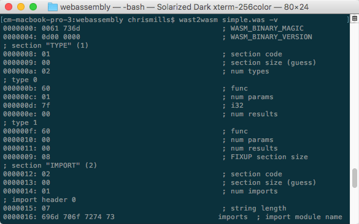

# 将WebAssembly文本格式转换为wasm

WebAssembly 有一个基于S-表达式的文本表示形式，设计为在文本编辑器，浏览器开发人员工具等中暴露的一个中间形式。本文解释了它是如何工作的一些内容以及如何使用可用的工具把文本格式文件转换为.wasm汇编格式文件。

> 注：文本格式文件通常被保存为 `.wat` 扩展名；有时 `.wast` 也被使用，它是说文件包含了额外的测试命令（断言等）并且它们不需要转换到.wasm中。

## 1. 初识文本格式

让我们看一个简单的例子——下面的程序从一个叫做imports的模块中导入了一个叫做imported_func的函数并且导出了一个叫做exported_func的函数：

```js
(module
  (func $i (import "imports" "imported_func") (param i32))
  (func (export "exported_func")
    i32.const 42
    call $i
  )
)
```

WebAssembly函数exported_func是被导出供我们的环境（比如，使用了WebAssembly模块的网络应用）使用。当被调用的时，它进而调用了一个被导入的叫做imported_func的函数并且向该函数传递了一个值（42）作为参数。

## 2. 把.wat文本文件转换为.wasm二进制文件

让我们尝试一下把前面提到的wat文本表示的例子转换为wasm汇编格式。

1. 首先，把前面的清单内容复制到一个文本文件中；命名为simple.wat。
2. 在使用它之前，我们需要把这个文本表示汇编为浏览器能够识别的汇编语言。为了达到这个目的，我们可以使用wabt工具，该工具包括了在WebAssembly文本表示和wasm之间进行相互转化的编译器以及其他一些功能。访问 <https://github.com/webassembly/wabt>——按照该页面的指令来安装好工具。
3. 当你安装好工具之后，将/wabt/out目录添加到你的系统路径。
4. 下一步，执行wast2wasm程序，把输入文件的路径传递给它，紧跟一个-o参数，然后是输出文件的路径：

```bash
wast2wasm simple.wat -o simple.wasm
```

该命令会把wasm输出到一个叫做simple.wasm的文件，该文件包含了.wasm汇编代码。

> 注：你可以使用wasm2wast工具把汇编代码转换为文本表示；例如，`wasm2wast simple.wasm -o text.wat`。

## 3. 查看汇编输出

因为输出文件是基于汇编的，所以，它不能在常规的文本编辑器中查看。尽管如此，你可以使用wast2wasm工具的-v选项来查看。试试这个：

```bash
wast2wasm simple.wat -v
```

这会在终端产生一个如下所示的输出：

