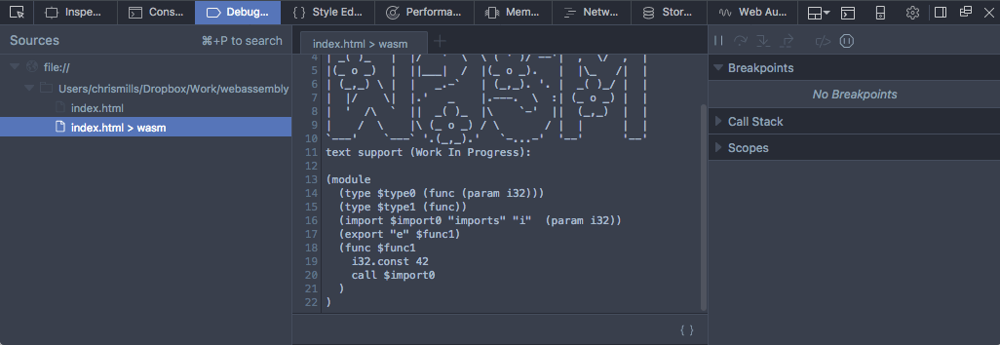

# 使用WebAssembly JavaScript API

如果您已经使用Emscripten等工具编译了另一种语言的模块，或者自己加载并运行代码，那么下一步是了解如何使用WebAssembly JavaScript API的其他功能。这篇文章告诉你你需要知道什么。

## 1. 一个简单的例子

让我们通过一步一步的例子来了解如何在WebAssembly 中使用 Javascript API，和如何在网页中加载一个 wasm 模块。

> 注：你可以发现同样的代码在 [webassembly-examples GitHub 仓库](https://github.com/mdn/webassembly-examples).

## 1.1 准备工作

首先需要一个 wasm 模块！下载 [simple.wasm](https://github.com/mdn/webassembly-examples/tree/master/js-api-examples/simple.wasm) 文件到本机的一个新的目录下.

然后, 创建一个简单的HTML 文件命名为 [index.html](https://github.com/mdn/webassembly-examples/blob/master/template/template.html) 和并且你的本机的 wasm 文件处于同一目录下.

如果没有模板可以使用如下代码：

```html
<!DOCTYPE html>
<html>
  <head>
    <meta charset="utf-8">
    <title>Simple template</title>
  </head>
  <body>
  </body>
</html>
```

现在, 为了帮助我们理解发生了什么, 让我们来看看这个 wasm 模块的文本表示(也可以在[将WebAssembly文本格式转换为wasm](text-to-wasm.md)):

```wasm
(module
  (func $i (import "imports" "imported_func") (param i32))
  (func (export "exported_func")
    i32.const 42
    call $i))
```

在第二行, 你将看到导入有一个两级命名空间 —— 内部函数 `$i` 是从 imports.imported_func 导入的. 编写要导入到wasm模块的对象时，我们需要在JavaScript中反映这个两级命名空间. 创建一个 `<script></script>` 节点在你的HTML 文件中, 并且添加下面的代码:

```js
var importObject = {
  imports: {
      imported_func: function(arg) {
        console.log(arg);
      }
    }
  };
```

如上所述，  我们在 imports.imported_func 中有我们导入的函数.

> 注：使用 `ES6箭头函数` 将会更加简洁:

```js
var importObject = {
  imports: {
    imported_func: arg => console.log(arg)
  }
};
```

具体哪种风格由你决定.

### 1.2 加载并使用 wasm 模块

当我们导入了对象后, 我们将获取 wasm 文件, 使其在 array buffer 可用, 然后就可以使用其导出的函数.

在第一个块下面添加以下代码到你的脚本中:

```js
fetch('simple.wasm').then(response =>
  response.arrayBuffer()
).then(bytes =>
  WebAssembly.instantiate(bytes, importObject)
).then(results => {
  results.instance.exports.exported_func();
});
```

> 注：我们已经非常详细地解释了这种语法如何工作通过加载和运行WebAssembly代码。如果不确定，请回到那里进行复习。

这样做的结果是执行我们导出的 WebAssembly 函数 exported_func，这样又调用了另一个我们导入的 JavaScript 函数 imported_func, 它将WebAssembly实例（42）中提供的值记录到控制台. 如果你保存实例代码并且在支持 WebAssembly 的浏览器中运行，你将看到此操作。


这是一个冗长的，令人费解的例子并且实现了很少的功能, 但它确实有助于说明这是可能的 —— 在 Web 应用中与 JavaScript 一起使用 WebAssembly 代码. 正如我们一直说的,  WebAssembly 并不旨在替代 JavaScript; 两者可以一起工作，借鉴对方的优势。

### 1.3 在开发者工具查看wasm

在 Firefox 54+,  Developer Tool Debugger Panel 有用于公开网页中包含的任何 wasm 代码的文本表示的功能. 为了查看它们, 要查看它，您可以转到 Debugger Panel 然后单击 “xxx > wasm” .



从 Firfox 开始，除了将WebAssembly视为文本，开发者可以使用文本格式调试 (打断点, 检查调用堆栈, 单步调试等等.) WebAssembly 代码. 通过这个视频使用Firefox开发者工具调试WebAssembly预览。

## 2. 内存

在WebAssembly的底层内存模型中，内存被表示为称为 `线性内存` 的无类型字节的连续范围，通过模块中的加载和存储指令读取和写入。

在这个内存模型中， 任何加载或存储都可以访问整个线性存储器中的任何字节，这是忠实地表示C / C ++概念（如指针）所必需的。

然后，和原生 C/C++ 程序不同的是可用内存范围跨越整个进程，特定WebAssembly实例可访问的内存被限制在由WebAssembly Memory对象包含的一个特定的 —— 可能非常小的范围内。

在 JavaScript 中，内存实例可以被认为是可调整大小的ArrayBuffer，就像ArrayBuffers一样，一个Web应用程序可以创建许多独立的内存对象。 您可以使用 WebAssembly.Memory() 构造函数创建一个，它将参数作为初始大小和（可选）最大大小）。

我们通过一个快速的例子来开始探索。

1. 创建另一个简单的 HTML 页面 (复制我们的 [simple template](https://github.com/mdn/webassembly-examples/blob/master/template/template.html)) 并且命名为 memory.html。添加一个 `<script></script>` 节点到页面中。

2. 在脚本的顶部添加下面的一行代码来创建一个内存实例:

```js
var memory = new WebAssembly.Memory({initial:10, maximum:100});
```

初始和最大的单位是 WebAssembly pages ——这些页面的大小固定为64KB。这意味着上述内存实例的初始大小为640KB，最大大小为6.4MB。

WebAssembly内存通过简单地提供一个返回ArrayBuffer的缓冲区getter / setter来显示它的字节。例如，要直接将42写入线性内存的第一个单词，你可以这样做：

```js
new Uint32Array(memory.buffer)[0] = 42;
```

你也可以得到刚才的值通过:

```js
new Uint32Array(memory.buffer)[0]
```

3. 现在尝试这个演示 —— 保存目前为止添加的内容，将其加载到浏览器中，然后尝试在JavaScript控制台中输入上述两行。

### 2.1 增加内存

一个内存实例的大小可以通过 `Memory.prototype.grow()` 来增加，再次以 WebAssembly pages 为单位指定参数:

```js
memory.grow(1);
```

如果在创建内存实例时提供了最大值，则尝试超过此最大值将抛出 `WebAssembly.RangeError` 异常。 引擎利用这个提供的上限来提前预留内存，这样可以使调整大小更有效率。

Note: 由于 ArrayBuffer 的byteLength是不可变的，所以在成功 Memory.prototype.grow() 操作之后，缓冲区getter将返回一个新的ArrayBuffer对象 新的byteLength）和任何先前的ArrayBuffer对象变成“分离”，或者与先前指向的底层内存断开连接。

和函数一样，线性内存可以在模块内部进行定义或者导入。类似地，模块还可以可选地导出其内存。这这意味着JavaScript可以通过创建 `new WebAssembly.Memory` 并将其作为导入或通过接收内存导出传递给WebAssembly实例的内存来访问(通过 `Instance.prototype.exports` ).

### 2.2 更复杂的内存示例

让我们通过看一个更复杂的内存示例——一个对整数数组进行求和的WebAssembly模块——来明确上面的概念。你可以在这里memory.wasm找到示例。

1. 像前面那样在相同的目录下复制一份memory.wasm。

> 注：你可以在这里memory.wat找到模块的文本表示形式。

2. 回到你的示例文件memory.html，像前面那样获取、编译和实例化你的wasm模块——在你的脚本代码底部加入下面的代码：

```js
fetch('memory.wasm').then(response =>
  response.arrayBuffer()
).then(bytes =>
  WebAssembly.instantiate(bytes)
).then(results => {
  // 在这里加入你的代码
});
```

3. 因为该模块导出了它的内存，给定该模块的一个实例，我们可以使用一个导出函数accumulate()在该模块实例的线性内存（mem）中创建和填入一个输入数组。在前面指明的地方加入如下代码：

```js
var i32 = new Uint32Array(results.instance.exports.mem.buffer);
for (var i = 0; i < 10; i++) {
  i32[i] = i;
}

var sum = results.instance.exports.accumulate(0, 10);
console.log(sum);
```

注意我们是如何在内存对象的缓存上创建了 Uint32Array视图，而不是在内存对象本身这么做。

内存导入与函数导入很像，只是内存对象取代了JavaScript函数作为了传入值。内存导入在下面两方面很有用：

* 它们允许JavaScript在模块编译之前或者同时获取和创建内存的初始内容。
* 它们允许一个单一的内存对象被多个模块实例导入，对于实现WebAssembly动态链接来说，这是一个关键的构建模块。

> 注：你可以在这里[memory.html](https://github.com/mdn/webassembly-examples/blob/master/js-api-examples/memory.html) (或实时运行) 找到我们的完整例子——这个版本使用了`fetchAndInstantiate()`函数。

## 3. 表格

WebAssembly表格是一个可变大小的带类型的引用数组，其中的引用可以被JavaScript和WebAssembly代码存取。然而，内存提供的是一个可变大小的带类型的原始字节数组。所以，把引用存储在内存中是不安全。由于安全、可移植性和稳定性等原因，作为引擎信任的引用值是千万不能被直接读写的。

表格有一个元素类型，其限制了可以存储在表格的引用类型。在当前的WebAssembly版本中，只有一种WebAssembly代码所需要的引用类型——函数——也就是唯一合法的元素类型。在将来的版本中，更多的元素类型会被加入。

函数引用对于编译诸如C/C++这类拥有函数指针的语言来说是必要的。在C/C++的原生实现中，函数指针是通过函数代码在进程的虚地址空间的原始地址表示的，并且由于前面提到的安全原因，它是不能被直接存储在线性内存中的。取而代之的是，函数引用被存储在表格之中。它们的整数索引可以存储在线性内存中并进行传递。

当调用一个函数指针的时候，WebAssembly调用函数提供索引。在进行索引和调用索引到的函数引用之前，可以对该索引进行表格的边界检查。因而，目前的表格是一个相当底层的用来安全地和可移植地编译底层编程语言特性的基本类型。

表格可以通过`Table.prototype.set()`和 `Table.prototype.grow()`进行更改，它们会更新表格中的一个值和增加可以存储在表格的大小。这允许间接可调用函数集合可以随着时间而改变，其对于动态链接技术来说是必要的。这些更改对于JavaScript和wasm模块来说是立即生效的。同时，在JavaScript可以通过`Table.prototype.get()`得到最新值。

### 3.1 表格示例

让我们看一个简单的表格示例——一个WebAssembly模块，该模块创建并导出了一个带有两个元素的表格：元素0返回13，元素1返回42。你可以在[table.wasm](https://github.com/mdn/webassembly-examples/blob/master/js-api-examples/table.wasm)中找到该示例。

1. 在一个新的目录中复制一份table.wasm。

> 注：你可以在[table.wat](https://github.com/mdn/webassembly-examples/blob/master/js-api-examples/table.wat)中查看模块的文本表示。

2. 创建一份HTML 模板的新副本并将其命名为table.html.

3. 如前所示，获取、编译并且实例化你的wasm模块——将下面的代码放入到HTML body底部的`<script>`节点里面：

```js
fetch('table.wasm').then(response =>
  response.arrayBuffer()
).then(bytes =>
  WebAssembly.instantiate(bytes)
).then(results => {
  // 在这里添加你的代码
});
```

4. 现在，让我们获取表格中的数据——将下面的代码放入到指定的位置：

```js
var tbl = results.instance.exports.tbl;
console.log(tbl.get(0)());  // 13
console.log(tbl.get(1)());  // 42
```

这段代码获取获取了存储在表格中的每一个函数引用，然后实例化它们从而将它们拥有的值打印到控制台——注意每一各函数引用是如何使用Table.prototype.get()函数获取的以及在其后面增加一对小括号从而真正的调用该函数。

> 注：你可以在[table.html](https://github.com/mdn/webassembly-examples/blob/master/js-api-examples/table.html) (或实时查看运行)找到我们完整的示例——这个版本使用了`fetchAndInstantiate()`函数。

## 4. 多样性

现在，我们已经展示了WebAssembly的主要组成模块的使用，这里是提到多样性概念的好地方。这位WebAssembly提供了大量的关于架构效率的优势：

* 一个模块可以有N个实例，这与一个函数可以产生N个闭包值一样。
* 一个模块实例可以使用0-1个内存实例，它为这个实例提供了“地址空间”。将来的WebAssembly版本可能允许每个模块实例拥有0-N个内存实例（参考多表格与内存）。
* 一个模块实例可以使用0-1个表格实例——这是该实例的“函数地址空间”，可以用来实现C函数指针。将来的WebAssembly版本可能允许每个模块实例拥有0-N个表格实例。
* 一个内存或表格实例能够被0-N个模块实例使用——这些实例全部共享相同的地址空间，这使得动态链接成为可能。

你可以在我们的理解文本格式一本中看到多样性的应用——参考修改表格和动态链接部分（TBD）。

## 5. 总结

本文带你了解了使用WebAssembly的JavaScript API的基本知识，包括在JavaScript上下文中导入一个WebAssembly模块、使用该模块的函数以及在JavaScript中使用WebAssembly的内存和表格。同时，我们也介绍了多样性的概念。