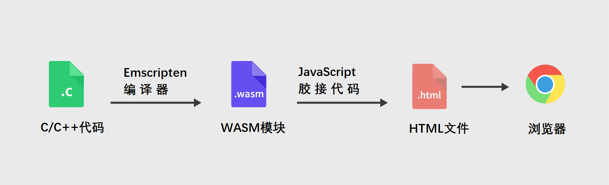
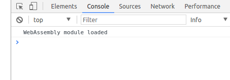
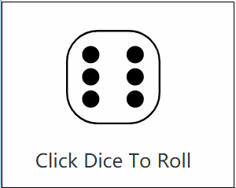

# 让C代码在浏览器中运行——WebAssembly入门介绍

WebAssembly作为一种新兴的Web技术，相关的资料和社区还不够丰富，但其为web开发提供了一种崭新的思路和工作方式，未来是很有可能大放光彩的。

使用WebAssembly，我们可以在浏览器中运行一些高性能、低级别的编程语言，可用它将大型的C和C++代码库比如游戏、物理引擎甚至是桌面应用程序导入Web平台。

截至目前为止，我们已经可以在chrome、Firefox中使用WebAssembly，Edge和Safari对它的支持也基本完成。这意味着很快，就能在所有流行的浏览器中运行wasm了。

在这篇文章中，我们将会演示如何将简单的C代码编译为wasm，并将其包含在网页中。在此之前，我们先来直观的了解下WebAssembly是如何工作的。

## 1. WebAssembly是如何工作的？

这里不涉及过多技术性的问题。我们知道，在今天的浏览器中，JavaScript是在虚拟机（VM）中执行的，该虚拟机能够最大化地优化代码并压榨每一丝的性能，这也使得JavaScript称为速度最快的动态语言之一。但尽管如此，它还是无法与原生的C/C++代码相媲美。所以，WebAssembly就出现了。

Wasm同样在JavaScript虚拟机中运行，但是它表现得更好。两者可以自由交互、互不排斥，这样你就同时拥有了两者最大的优势——JavaScript巨大的生态系统和有好的语法，WebAssembly接近原生的表现性能。

大多数程序员会选择使用C语言来编写WebAssembly模块，并将其编译成.wasm文件。这些.wasm文件并不能直接被浏览器识别，所以它们需要一种称为JavaScript胶接代码（glue code，用于连接相互不兼容的软件组件，详见：<http://whatis.techtarget.com/definition/glue-code> 的东西来加载。



随着未来WebAssembly框架和本地wasm模块支持的发展，这一过程可能会有所缩短。

## 2. 开发前准备

编写WebAssembly需要不少的工具，但作为一个程序员，下面的工具你应该大部分都已经有了。

1、支持WebAssembly的浏览器，新版的Chrome或者Firefox均可。

2、C到WebAssembly的编译器，推荐使用Emscripten。

其官方网站为：<https://kripken.github.io/emscripten-site/docs/getting_started/downloads.html>
安装这个工具费时费力费空间，但没办法，这是目前为止最好的选择，请仔细阅读安装说明，需占用约1GB的硬盘空间。

3、一个C编译器/开发环境，比如Linux下的GCC，OS X下的Xcode，Windows下的Visual Studio。

4、一个简单的本地web服务器，Linux/OS X下使用python -m SimpleHTTPServer 9000命令即可。

### 2.1 编写C代码

下面我们编写一个非常简单的C语言例子，它将会返回1-6的随机数。
在你所使用的工作目录下，创建一个dice-roll.c文件。

```c++
#include <stdio.h>
#include <stdlib.h>
#include <time.h>
#include <emscripten/emscripten.h>

// 一旦WASM模块被加载，main()中的代码就会执行
int main(int argc, char ** argv) {
    printf("WebAssembly module loaded\n");
}

// 返回1-6之间的一随机数
int EMSCRIPTEN_KEEPALIVE roll_dice() {
    srand ( time(NULL) );
    return rand() % 6 + 1;
}
```

当我们将其编译为wasm并且在浏览器中加载时，main函数会自动执行，其中的printf将会被翻译成console.log。

我们想要roll_dice函数能够在JavaScript中随时调用，为此，我们需要在函数名前添加EMSCRIPTEN_KEEPALIVE标记以告诉Emscripten我们的意图。

### 2.2 将C编译为WebAssembly

现在我们已经有了C代码，接下来需要将它编译成wasm，不仅如此，我们还需要生成相应的JavaScript胶接代码以便能够真正运行起来。

这里我们必须使用Emscripten编译器，你会发现有大量的命令行参数和编译方法可选，经过实践，我们找到了下面这个最友好最实用的组合：

`emcc dice-roll.c -s WASM=1 -O3 -o index.js`

各个参数含义如下：

* emcc —— 代表Emscripten编译器；
* dice-roll.c —— 包含C代码的文件；
* -s WASM=1 —— 指定使用WebAssembly；
* -O3 —— 代码优化级别，3已经是很高的级别了；
* -o index.js —— 指定生成包含wasm模块所需的全部胶接代码的JS文件；

### 2.3 在浏览器中加载WebAssembly代码

现在我们将回到熟悉的web开发领域，在当前文件夹创建index.html文件，引入相关的js文件与CSS文件。

```html
<!DOCTYPE html>
  <head>
    <meta charset="utf-8">
    <meta http-equiv="X-UA-Compatible" content="IE=edge">
    <title>WebAssembly 示例</title>
    <meta name="viewport" content="width=device-width, initial-scale=1">
    <link rel="stylesheet" href="CSS/styles.css">
    <link rel="stylesheet" href="CSS/dice-1.0.min.css">
  </head>
  <body>
    <div class="dice dice-6"></div>
    <span>点击以摇动筛子</span>
    <!-- 引入JavaScript胶节文件 -->
    <!-- 这将会加载WebAssembly模块并运行其main函数 -->
    <script src="index.js"></script>
  </body>
</html>
```

至此，项目结构已经完整，如下：


style.css简单设置一下页面样式：

```css
body {
  padding: 40px;
  font: normal 16px sans-serif;
  display: flex;
  flex-direction: column;
}

.dice {
  display: block !important;
  font-size: 80px;
  margin: 0 auto 20px;
  cursor: pointer;
}

span {
  display: block;
  margin: 0 auto;
  color: #333;
}
```

dice-1.0.min.js是来自Github <https://github.com/diafygi/dice-css> 的一个微型CSS骰子样式库，包括了1-6的SVG矢量图，可作为内联图标使用，用法与font-awesome和glyphicons相同。其代码如下：

```css
/*
 * Dice.css v1.0
 * Code - MIT License - https://github.com/diafygi/dice-css
 * Images - Public Domain - https://openclipart.org/detail/105931/sixsided-dice-faces-lio-01
 */
.dice{display:inline-block;min-height:1em;padding-left:1em;background-size:1em;background-repeat:no-repeat;}
.dice-1{background-image: url("data:image/svg+xml,%3Csvg xmlns='http%3A%2F%2Fwww.w3.org%2F2000%2Fsvg' version='1.1' viewBox='0 0 76.5 76.5' height='21.6' width='21.6'%3E%3Cg transform='translate(113.25%2C-494.1)'%3E%3Cg transform='matrix(0.5%2C0%2C0%2C0.5%2C-406.5%2C374.7)'%3E%3Crect x='588' y='240.4' width='150' height='150' ry='50' rx='50' style='fill%3A%23fff%3Bstroke-width%3A3%3Bstroke%3A%23000'%2F%3E%3Ccircle transform='translate(337.5%2C87.5)' cx='325' cy='227.4' r='12.5' style='fill%3A%23000%3Bstroke-width%3A3%3Bstroke%3A%23000'%2F%3E%3C%2Fg%3E%3C%2Fg%3E%3C%2Fsvg%3E ");}
.dice-2{background-image: url("data:image/svg+xml,%3Csvg xmlns='http%3A%2F%2Fwww.w3.org%2F2000%2Fsvg' version='1.1' viewBox='0 0 76.5 76.5' height='21.6' width='21.6'%3E%3Cstyle%3E.s0%7Bfill%3A%23000%3Bstroke-width%3A3%3Bstroke%3A%23000%3B%7D%3C%2Fstyle%3E%3Cg transform='translate(109.9%2C-505.1)'%3E%3Cg transform='matrix(0.5%2C0%2C0%2C0.5%2C-415.6%2C485.6)'%3E%3Crect x='613' y='40.4' width='150' height='150' ry='50' rx='50' style='fill%3A%23fff%3Bstroke-width%3A3%3Bstroke%3A%23000'%2F%3E%3Ccircle transform='translate(326.5%2C-148.5)' cx='325' cy='227.4' r='12.5' class='s0'%2F%3E%3Ccircle transform='translate(398.5%2C-76.5)' cx='325' cy='227.4' r='12.5' class='s0'%2F%3E%3C%2Fg%3E%3C%2Fg%3E%3C%2Fsvg%3E ");}
.dice-3{background-image: url("data:image/svg+xml,%3Csvg xmlns='http%3A%2F%2Fwww.w3.org%2F2000%2Fsvg' version='1.1' viewBox='0 0 76.5 76.5' height='21.6' width='21.6'%3E%3Cstyle%3E.s0%7Bfill%3A%23000%3Bstroke-width%3A3%3Bstroke%3A%23000%3B%7D%3C%2Fstyle%3E%3Cg transform='translate(84.9%2C-515.5)'%3E%3Cg transform='matrix(0.5%2C0%2C0%2C0.5%2C-290.6%2C514.9)'%3E%3Crect x='413' y='2.9' width='150' height='150' ry='50' rx='50' style='fill%3A%23fff%3Bstroke-width%3A3%3Bstroke%3A%23000'%2F%3E%3Ccircle transform='translate(126.5%2C-186)' cx='325' cy='227.4' r='12.5' class='s0'%2F%3E%3Ccircle transform='translate(198.5%2C-114)' cx='325' cy='227.4' r='12.5' class='s0'%2F%3E%3Ccircle transform='translate(162.5%2C-150)' cx='325' cy='227.4' r='12.5' class='s0'%2F%3E%3C%2Fg%3E%3C%2Fg%3E%3C%2Fsvg%3E ");}
.dice-4{background-image: url("data:image/svg+xml,%3Csvg xmlns='http%3A%2F%2Fwww.w3.org%2F2000%2Fsvg' version='1.1' viewBox='0 0 76.5 76.5' height='21.6' width='21.6'%3E%3Cstyle%3E.s0%7Bfill%3A%23000%3Bstroke-width%3A3%3Bstroke%3A%23000%3B%7D%3C%2Fstyle%3E%3Cg transform='translate(90.7%2C-499.7)'%3E%3Cg transform='matrix(0.5%2C0%2C0%2C0.5%2C-302.7%2C367.8)'%3E%3Crect x='425.5' y='265.4' width='150' height='150' ry='50' rx='50' style='fill%3A%23fff%3Bstroke-width%3A3%3Bstroke%3A%23000'%2F%3E%3Ccircle transform='translate(139%2C76.5)' cx='325' cy='227.4' r='12.5' class='s0'%2F%3E%3Ccircle transform='translate(139%2C148.5)' cx='325' cy='227.4' r='12.5' class='s0'%2F%3E%3Ccircle transform='translate(211%2C76.5)' cx='325' cy='227.4' r='12.5' class='s0'%2F%3E%3Ccircle transform='translate(211%2C148.5)' cx='325' cy='227.4' r='12.5' class='s0'%2F%3E%3C%2Fg%3E%3C%2Fg%3E%3C%2Fsvg%3E ");}
.dice-5{background-image: url("data:image/svg+xml,%3Csvg xmlns='http%3A%2F%2Fwww.w3.org%2F2000%2Fsvg' version='1.1' viewBox='0 0 76.5 76.5' height='21.6' width='21.6'%3E%3Cstyle%3E.s0%7Bfill%3A%23000%3Bstroke-width%3A3%3Bstroke%3A%23000%3B%7D%3C%2Fstyle%3E%3Cg transform='translate(89.2%2C-510.5)'%3E%3Cg transform='matrix(0.5%2C0%2C0%2C0.5%2C-194.9%2C372.3)'%3E%3Crect x='213' y='277.9' width='150' height='150' ry='50' rx='50' style='fill%3A%23fff%3Bstroke-width%3A3%3Bstroke%3A%23000'%2F%3E%3Ccircle transform='translate(-73.5%2C89)' cx='325' cy='227.4' r='12.5' class='s0'%2F%3E%3Ccircle transform='translate(-73.5%2C161)' cx='325' cy='227.4' r='12.5' class='s0'%2F%3E%3Ccircle transform='translate(-1.5%2C89)' cx='325' cy='227.4' r='12.5' class='s0'%2F%3E%3Ccircle transform='translate(-1.5%2C161)' cx='325' cy='227.4' r='12.5' class='s0'%2F%3E%3Ccircle transform='translate(-37.5%2C125)' cx='325' cy='227.4' r='12.5' class='s0'%2F%3E%3C%2Fg%3E%3C%2Fg%3E%3C%2Fsvg%3E ");}
.dice-6{background-image: url("data:image/svg+xml,%3Csvg xmlns='http%3A%2F%2Fwww.w3.org%2F2000%2Fsvg' version='1.1' viewBox='0 0 76.5 76.5' height='21.6' width='21.6'%3E%3Cstyle%3E.s0%7Bfill%3A%23000%3Bstroke-width%3A3%3Bstroke%3A%23000%3B%7D%3C%2Fstyle%3E%3Cg transform='translate(86.2%2C-500.6)'%3E%3Cg transform='matrix(0.5%2C0%2C0%2C0.5%2C-98.2%2C356.2)'%3E%3Crect x='25.5' y='290.4' width='150' height='150' ry='50' rx='50' style='fill%3A%23fff%3Bstroke-width%3A3%3Bstroke%3A%23000'%2F%3E%3Ccircle transform='translate(-261%2C101.5)' cx='325' cy='227.4' r='12.5' class='s0'%2F%3E%3Ccircle transform='translate(-261%2C173.5)' cx='325' cy='227.4' r='12.5' class='s0'%2F%3E%3Ccircle transform='translate(-261%2C137.5)' cx='325' cy='227.4' r='12.5' class='s0'%2F%3E%3Ccircle transform='translate(-189%2C101.5)' cx='325' cy='227.4' r='12.5' class='s0'%2F%3E%3Ccircle transform='translate(-189%2C173.5)' cx='325' cy='227.4' r='12.5' class='s0'%2F%3E%3Ccircle transform='translate(-189%2C137.5)' cx='325' cy='227.4' r='12.5' class='s0'%2F%3E%3C%2Fg%3E%3C%2Fg%3E%3C%2Fsvg%3E");}
```

由于跨源问题的存在，我们需要一个本地服务器才能运行这个项目。在Linux/OS X系统中，可以在项目目录下运行如下命令：

`python -m SimpleHTTPServer 9000`

然后到浏览器中，打开localhost:9000以查看这个小应用。

按F12打开控制台，即可看到我们在C代码中使用printf输出的问候语：



### 2.4 调用WebAssembly函数

最后一步是连接JavaScript与WebAssembly，由于胶接代码的存在（index.js），这项任务变得非常简单，它已经为我们处理好了所有的接线任务。

在浏览器中处理WebAssembly有一个非常强大的API可以使用，在此我们不会进行深入探讨因为这已经超出了入门的范畴，我们只需要Module接口及其ccall方法这部分即可。该方法允许我们通过函数名从C代码中调用一个函数，然后就向一般的JS函数一样使用就行了。

```js
var result = Module.ccall(
    'funcName',     // 函数名
    'number',       // 返回类型
    ['number'],     // 参数类型
    [42]);          // 参数
```

调用此方法之后，result就将拥有对应C函数的所有功能，除函数名以外的所有参数都是可选的。

我们也可以使用缩写版：

```js
// 通过在函数名前添加下划线来调用C函数
var result = _funcName();
```

roll_dice函数无需任何参数，在JavaScript代码中调用十分简单：

```html
<script>
   // 当HTML dice元素被点击时，其值将会被改变
   var dice = document.querySelector('.dice');

   dice.addEventListener('click', function(){
     // 调用C代码中的roll_dice函数
     var result = _roll_dice();
     dice.className = "dice dice-" + result;
    });
</script>
```

将上面这段代码添加到index.html末尾，即\<\/body\>之前即可。

此时运行项目，即可看到结果：



## 3. 总结

虽然现在WebAssembly还在发展的初期，但从公布的新标准来看，潜力巨大。在浏览器中运行低级语言的能力，将会带来全新的应用程序与web体验，而这，是仅仅通过JavaScript无法使用的。

诚然，使用WebAssembly在当前阶段还十分繁琐，文档需要分为多个部分，相应的工具也不容易使用，并且还需要JavaScript胶接代码才能使用wasm模块。但随着越来越多的人进入这个平台，所有这些问题都将会被解决。
