# WebAssembly 系列

# 1. 生动形象地介绍WebAssembly

你可能已经听说过，WebAssembly 执行的更快。但是 WebAssembly 为什么执行的更快呢？

在这个系列文章中，我会为你解释这一点（本系列其他文章请见文末“相关阅读”）。

## 1.1 等等，什么是 WebAssembly？

WebAssembly 是除了 JavaScript 以外，另一种可以在浏览器中执行的编程语言。所以当人们说 WebAssembly 更快的时候，一般来讲是与 JavaScript 相比而言的。

这里并不是暗示大家说开发时只能选择 WebAssembly或 JavaScript。实际上，我们更希望在同一个工程中，两个你同时使用。

对二者的比较倒是非常有必要的，这样你就可以了解到 WebAssembly 所拥有的独特特性。

## 1.2 一些关于性能的历史

JavaScript 于 1995 年问世，它的设计初衷并不是为了执行起来快，在前 10 个年头，它的执行速度也确实不快。

紧接着，浏览器市场竞争开始激烈起来。

被人们广为传播的“性能大战”在 2008 年打响。许多浏览器引入了 Just-in-time 编译器，也叫 JIT。基于 JIT 的模式，JavaScript 代码的运行渐渐变快。

正是由于这些 JIT 的引入，使得 JavaScript 的性能达到了一个转折点，JS 代码执行速度快了 10 倍。

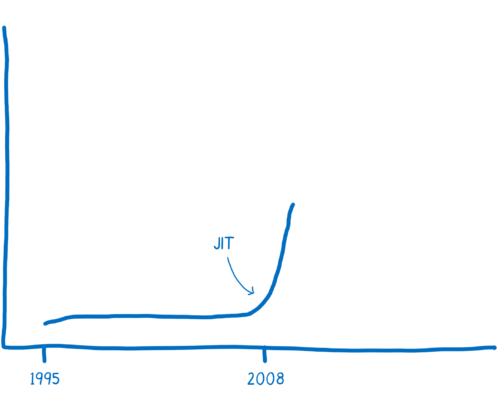
 
随着性能的提升，JavaScript 可以应用到以前根本没有想到过的领域，比如用于后端开发的 Node.js。性能的提升使得 JavaScript 的应用范围得到很大的扩展。

现在通过 WebAssembly，我们很有可能正处于第二个拐点。


所以，接下来，我们深入了解一下为什么 WebAssembly 更快、执行效率更高。


# 2. JavaScript Just-in-time (JIT) 工作原理

JavaScript 的启动比较缓慢，但是通过 JIT 可以使其变快，那么 JIT 是如何起作用的呢？

## 2.1 JavaScript 在浏览器中是如何运行的？

如果是你一个开发者，当你决定在你的页面中使用 JavaScript 的时候，有两个要考虑的事情：目标和问题。

目标：告诉计算机你想做什么。

问题：你和计算机说不同的语言，无法沟通。

你说的是人类的语言，而计算机用的是机器语言。机器语言也是一种语言，只是 JavaScript 或者其他高级编程语言机器能看得懂，而人类不用他们来交流罢了。它们是基于人类认知而设计出来的。

所以呢，JavaScript 引擎的工作就是把人类的语言转换成机器能看懂的语言。

这就像电影《降临》中，人类和外星人的互相交流一样。


 
在电影里面，人类和外星人不仅仅是语言不同，两个群体看待世界的方式都是不一样的。其实人类和机器也是类似（后面我会详细介绍）。

### 2.1.1 那么翻译是如何进行的呢？

在代码的世界中，通常有两种方式来翻译机器语言：解释器和编译器。

如果是通过解释器，翻译是一行行地边解释边执行。


编译器是把源代码整个编译成目标代码，执行时不再需要编译器，直接在支持目标代码的平台上运行。


 
这两种翻译的方式都各有利弊。

### 2.1.2 解释器的利弊

解释器启动和执行的更快。你不需要等待整个编译过程完成就可以运行你的代码。从第一行开始翻译，就可以依次继续执行了。

正是因为这个原因，解释器看起来更加适合 JavaScript。对于一个 Web 开发人员来讲，能够快速执行代码并看到结果是非常重要的。

这就是为什么最开始的浏览器都是用 JavaScript 解释器的原因。

可是当你运行同样的代码一次以上的时候，解释器的弊处就显现出来了。比如你执行一个循环，那解释器就不得不一次又一次的进行翻译，这是一种效率低下的表现。

### 2.1.3 编译器的利弊

编译器的问题则恰好相反。

它需要花一些时间对整个源代码进行编译，然后生成目标文件才能在机器上执行。对于有循环的代码执行的很快，因为它不需要重复的去翻译每一次循环。

另外一个不同是，编译器可以用更多的时间对代码进行优化，以使代码执行的更快。而解释器是在 runtime 时进行这一步骤的，这就决定了它不可能在翻译的时候用很多时间进行优化。

## 2.2 Just-in-time 编译器：综合了两者的优点

为了解决解释器的低效问题，后来的浏览器把编译器也引入进来，形成混合模式。

不同的浏览器实现这一功能的方式不同，不过其基本思想是一致的。在 JavaScript 引擎中增加一个监视器（也叫分析器）。监视器监控着代码的运行情况，记录代码一共运行了多少次，如何运行的等信息。

起初，监视器监视着所有通过解释器的代码。

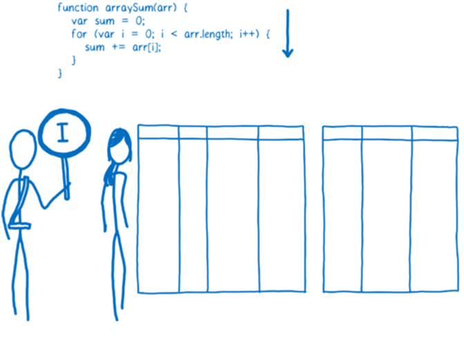
 
如果同一行代码运行了几次，这个代码段就被标记成了“warm”，如果运行了很多次，则被标记成 “hot”。

### 2.2.1 基线编译器

如果一段代码变成了 “warm”，那么 JIT 就把它送到编译器去编译，并且把编译结果存储起来。

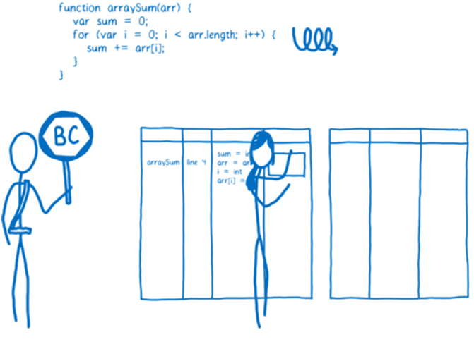
 
代码段的每一行都会被编译成一个“桩”（stub），同时给这个桩分配一个以“行号 + 变量类型”的索引。如果监视器监视到了执行同样的代码和同样的变量类型，那么就直接把这个已编译的版本 push 出来给浏览器。

通过这样的做法可以加快执行速度，但是正如前面我所说的，编译器还可以找到更有效地执行代码的方法，也就是做优化。

基线编译器可以做一部分这样的优化（下面我会给出例子），不过基线编译器优化的时间不能太久，因为会使得程序的执行在这里 hold 住。

不过如果代码确实非常 “hot”（也就是说几乎所有的执行时间都耗费在这里），那么花点时间做优化也是值得的。

### 2.2.2 优化编译器

如果一个代码段变得 “very hot”，监视器会把它发送到优化编译器中。生成一个更快速和高效的代码版本出来，并且存储之。

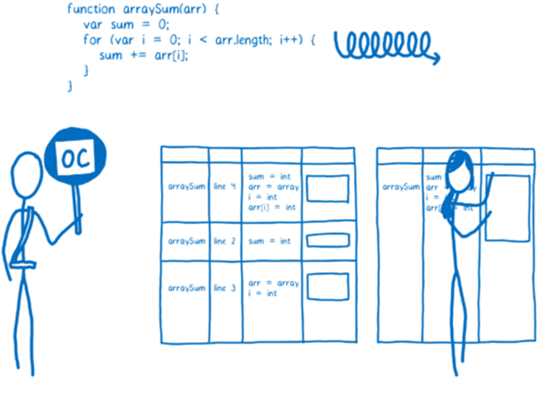
 
为了生成一个更快速的代码版本，优化编译器必须做一些假设。例如，它会假设由同一个构造函数生成的实例都有相同的形状——就是说所有的实例都有相同的属性名，并且都以同样的顺序初始化，那么就可以针对这一模式进行优化。

整个优化器起作用的链条是这样的，监视器从它所监视代码的执行情况做出自己的判断，接下来把它所整理的信息传递给优化器进行优化。如果某个循环中先前每次迭代的对象都有相同的形状，那么就可以认为它以后迭代的对象的形状都是相同的。可是对于 JavaScript 从来就没有保证这么一说，前 99 个对象保持着形状，可能第 100 个就少了某个属性。

正是由于这样的情况，所以编译代码需要在运行之前检查其假设是不是合理的。如果合理，那么优化的编译代码会运行，如果不合理，那么 JIT 会认为做了一个错误的假设，并且把优化代码丢掉。

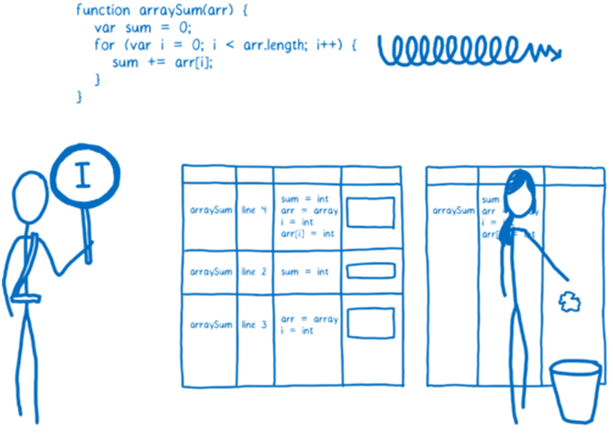
 
这时（发生优化代码丢弃的情况）执行过程将会回到解释器或者基线编译器，这一过程叫做去优化。

通常优化编译器会使得代码变得更快，但是一些情况也会引起一些意想不到的性能问题。如果你的代码一直陷入优化<->去优化的怪圈，那么程序执行将会变慢，还不如基线编译器快。

大多数的浏览器都做了限制，当优化/去优化循环发生的时候会尝试跳出这种循环。比如，如果 JIT 做了 10 次以上的优化并且又丢弃的操作，那么就不继续尝试去优化这段代码了。

### 2.2.3 一个优化的例子：类型特化（Type specialization）

有很多不同类型的优化方法，这里我介绍一种，让大家能够明白是如何优化的。优化编译器最成功一个特点叫做类型特化，下面详细解释。

JavaScript 所使用的动态类型体系在运行时需要进行额外的解释工作，例如下面代码：

```
function arraySum(arr) {
  var sum = 0;
  for (var i = 0; i < arr.length; i++) {
    sum += arr[i];
  }
}
```

+= 循环中这一步看起来很简单，只需要进行一步计算，但是恰恰因为是用动态类型，他所需要的步骤要比你所想象的更复杂一些。

我们假设 arr 是一个有 100 个整数的数组。当代码被标记为 “warm” 时，基线编译器就为函数中的每一个操作生成一个桩。sum += arr[i] 会有一个相应的桩，并且把里面的 += 操作当成整数加法。

但是，sum 和 arr[i] 两个数并不保证都是整数。因为在 JavaScript 中类型都是动态类型，在接下来的循环当中，arr[i] 很有可能变成了 string 类型。整数加法和字符串连接是完全不同的两个操作，会被编译成不同的机器码。

JIT 处理这个问题的方法是编译多基线桩。如果一个代码段是单一形态的（即总是以同一类型被调用），则只生成一个桩。如果是多形态的（即调用的过程中，类型不断变化），则会为操作所调用的每一个类型组合生成一个桩。

这就是说 JIT 在选择一个桩之前，会进行多分枝选择，类似于决策树，问自己很多问题才会确定最终选择哪个，见下图：

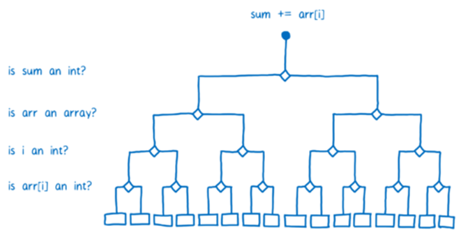
 
正是因为在基线编译器中每行代码都有自己的桩，所以 JIT 在每行代码被执行的时候都会检查数据类型。在循环的每次迭代，JIT 也都会重复一次分枝选择。


 
如果代码在执行的过程中，JIT 不是每次都重复检查的话，那么执行的还会更快一些，而这就是优化编译器所需要做的工作之一了。

优化编译器中，整个函数被统一编译，这样的话就可以在循环开始执行之前进行类型检查。


 
一些浏览器的 JIT 优化更加复杂。比如在 Firefox 中，给一些数组设定了特定的类型，比如里面只包含整型。如果 arr 是这种数组类型，那么 JIT 就不需要检查 arr[i] 是不是整型了，这也意味着 JIT 可以在进入循环之前进行所有的类型检查。

## 2.4 总结

简而言之 JIT 是什么呢？它是使 JavaScript 运行更快的一种手段，通过监视代码的运行状态，把 hot 代码（重复执行多次的代码）进行优化。通过这种方式，可以使 JavaScript 应用的性能提升很多倍。

为了使执行速度变快，JIT 会增加很多多余的开销，这些开销包括：

* 优化和去优化开销；
* 监视器记录信息对内存的开销；
* 发生去优化情况时恢复信息的记录对内存的开销；
* 对基线版本和优化后版本记录的内存开销。

这里还有很大的提升空间：即消除开销。通过消除开销使得性能上有进一步地提升，这也是 WebAssembly 所要做的事之一。

# 3. 编译器如何生成汇编

理解什么是汇编，以及编译器如何生成它，对于理解 WebAssembly 是很有帮助的。

在上一篇关于 JIT 的文章中，我介绍了和计算机打交道，就像同外星人打交道一样。

 

现在来思考一下“外星人”的大脑是如何工作的——机器的“大脑”是如何对我们输入给它的内容进行分析和理解的。

“大脑”中，有一部分负责思考——处理加法、减法或者逻辑运算。还有其他的部分分别负责短暂记忆和长期记忆的。

这些不同的部分都有自己的名字：

* 负责思考的部分叫做算数逻辑单元（ALU）；
* 寄存器提供短暂记忆功能；
* 随机存取存储器（RAM）提供长期记忆功能。

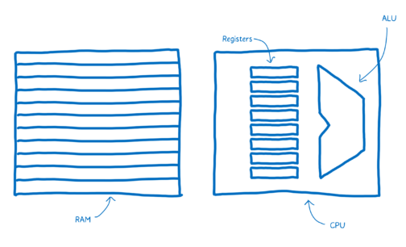 

机器代码中的语句称作指令。

那么在指令进入“大脑”以后都发生了什么呢？它们会被切分为不同的部分传送到不同的单元进行处理。

“大脑”切分指令通过不同连接线路进行。举个例子，“大脑”会将指令最开始的 6 比特通过管道送到 ALU 中。而 ALU 会通过 0 和 1 的位置来决定对两个数做加法。

这串 01 串就叫做“操作码”，它告诉了 ALU 要执行什么样的操作。

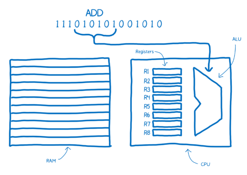 

然后“大脑”会取后面两个连续的 3 比特 01 串来确定把哪两个数加到一起，而这 3 比特指的是寄存器的地址。

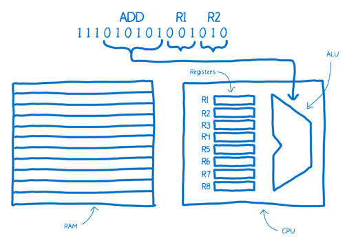 
 
注意看上面机器码的注释：“ADD R1 R2”，这对于人类来讲很容易理解其含义。这就是汇编，也叫符号机器码，它使人类也能看懂机器代码的含义。

可以看到汇编和这台机器的机器码之间有直接的映射关系。正是因为如此，拥有不同机器结构的计算机会有不同的汇编系统。如果你有一个机器，它有自己的内部结构，那么它就需要它所独有的汇编语言。

从上面的分析可以知道我们进行机器码的翻译并不是只有一种，不同的机器有不同的机器码，就像我们人类也说各种各样的语言一样，机器也“说”不同的语言。

人类和外星人之间的语言翻译，可能会从英语、德语或中文翻译到外星语 A 或者外星语 B。而在程序的世界里，则是从 C、C++ 或者 JAVA 翻译到 x86 或者 ARM。

你想要从任意一个高级语言翻译到众多汇编语言中的一种（依赖机器内部结构），其中一种方式是创建不同的翻译器来完成各种高级语言到汇编的映射。

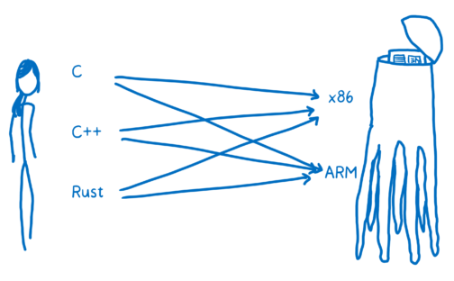 
 
这种翻译的效率实在太低了。为了解决这个问题，大多数编译器都会在中间多加一层。它会把高级语言翻译到一个低层，而这个低层又没有低到机器码这个层级。这就是中间代码（intermediate representation，IR）。

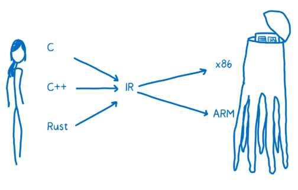 
 
这就是说编译器会把高级语言翻译到 IR 语言，而编译器另外的部分再把 IR 语言编译成特定目标结构的可执行代码。

重新总结一下：编译器的前端把高级语言翻译到 IR，编译器的后端把 IR 翻译成目标机器的汇编代码。

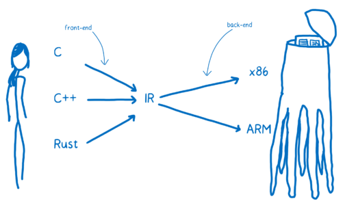 
 
## 3.1 总结

本文介绍了什么是汇编以及编译器是如何把高级语言翻译成汇编语言的，在下一篇文章中，我们来介绍 WebAssembly 的工作原理。

# 4. WebAssembly 工作原理
WebAssembly 是除了 JavaScript 以外，另一种可以在网页中运行的编程语言。过去如果你想在浏览器中运行代码来对网页中各种元素进行控制，只有 JavaScript 这一种选择。

所以当人们谈论 WebAssembly 的时候，往往会拿 JavaScript 来进行比较。但是它们其实并不是“二选一”的关系——并不是只能用 WebAssembly 或者 JavaScript。

实际上，我们鼓励开发者将这两种语言一起使用，即使你不亲自实现 WebAssembly 模块，你也可以学习它现有的模块，并它的优势来实现你的功能。

WebAssembly 模块定义的一些功能可以通过 JavaScript 来调用。所以就像你通过 npm 下载 lodash 模块并通过 API 使用它一样，未来你也可以下载 WebAssembly 模块并且使用其提供的功能。

那么就让我们来看一下如何开发 WebAssembly 模块，以及如何通过 JavaScript 使用他们。

## 4.1 WebAssembly 处于哪个环节？

在上一篇关于汇编的文章中，我介绍了编译器是如何从高级语言翻译到机器码的。

 

那么在上图中，WebAssembly 在什么位置呢？实际上，你可以把它看成另一种“目标汇编语言”。

每一种目标汇编语言（x86、ARM）都依赖于特定的机器结构。当你想要把你的代码放到用户的机器上执行的时候，你并不知道目标机器结构是什么样的。

而 WebAssembly 与其他的汇编语言不一样，它不依赖于具体的物理机器。可以抽象地理解成它是概念机器的机器语言，而不是实际的物理机器的机器语言。

正因为如此，WebAssembly 指令有时也被称为虚拟指令。它比 JavaScript 代码更直接地映射到机器码，它也代表了“如何能在通用的硬件上更有效地执行代码”的一种理念。所以它并不直接映射成特定硬件的机器码。

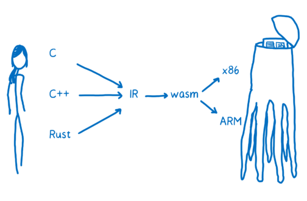 
 
浏览器把 WebAssembly 下载下来后，可以迅速地将其转换成机器汇编代码。

## 4.2 编译到 .wasm 文件

目前对于 WebAssembly 支持情况最好的编译器工具链是 LLVM。有很多不同的前端和后端插件可以用在 LLVM 上。

提示：很多 WebAssembly 开发者用 C 语言或者 Rust 开发，再编译成 WebAssembly。其实还有其他的方式来开发 WebAssembly 模块。例如利用 TypeScript 开发 WebAssembly 模块，或者直接用文本格式的 WebAssembly 也可以。

假设想从 C 语言到 WebAssembly，我们就需要 clang 前端来把 C 代码变成 LLVM 中间代码。当变换成了 LLVM IR 时，说明 LLVM 已经理解了代码，它会对代码自动地做一些优化。

为了从 LLVM IR 生成 WebAssembly，还需要后端编译器。在 LLVM 的工程中有正在开发中的后端，而且应该很快就开发完成了，现在这个时间节点，暂时还看不到它是如何起作用的。

还有一个易用的工具，叫做 Emscripten。它通过自己的后端先把代码转换成自己的中间代码（叫做 asm.js），然后再转化成 WebAssembly。实际上它背后也是使用的 LLVM。

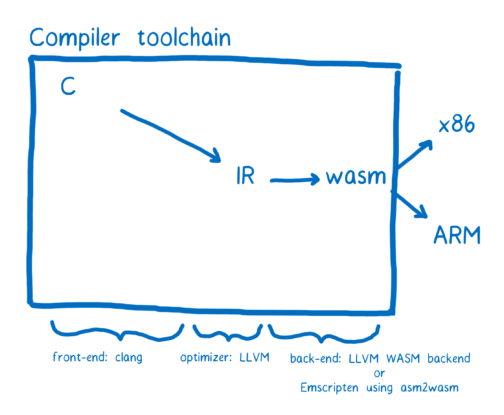 
 
Emscripten 还包含了许多额外的工具和库来包容整个 C/C++ 代码库，所以它更像是一个软件开发者工具包（SDK）而不是编译器。例如系统开发者需要文件系统以对文件进行读写，Emscripten 就有一个 IndexedDB 来模拟文件系统。

不考虑太多的这些工具链，只要知道最终生成了 .wasm 文件就可以了。后面我会介绍 .wasm 文件的结构，在这之前先一起了解一下在 JS 中如何使用它。

## 4.3 加载一个 .wasm 模块到 JavaScript

.wasm 文件是 WebAssembly 模块，它可以加载到 JavaScript 中使用，现阶段加载的过程稍微有点复杂。

```
function fetchAndInstantiate(url, importObject) {
  return fetch(url).then(response =>
    response.arrayBuffer()
  ).then(bytes =>
    WebAssembly.instantiate(bytes, importObject)
  ).then(results =>
    results.instance
  );
}
```

如果想深入了解，可以在 MDN 文档中了解更多。

我们一直在致力于把这一过程变得简单，对工具链进行优化。希望能够把它整合到现有的模块打包工具中，比如 webpack 中，或者整合到加载器中，比如 SystemJS 中。我们相信加载 WebAssembly 模块也可以像加载 JavaScript 一样简单。

这里介绍 WebAssembly 模块和 JavaScript 模块的主要区别。当前的 WebAssembly 只能使用数字（整型或者浮点型）作为参数或者返回值。

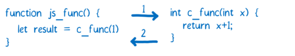 
 
对于任何其他的复杂类型，比如 string，就必须得用 WebAssembly 模块的内存操作了。如果是经常使用 JavaScript，对直接操作内存不是很熟悉的话，可以回想一下 C、C++ 和 Rust 这些语言，它们都是手动操作内存。WebAssembly 的内存操作和这些语言的内存操作很像。

为了实现这个功能，它使用了 JavaScript 中称为 ArrayBuffer 的数据结构。ArrayBuffer 是一个字节数组，所以它的索引（index）就相当于内存地址了。

如果你想在 JavaScript 和 WebAssembly 之间传递字符串，可以利用 ArrayBuffer 将其写入内存中，这时候 ArrayBuffer 的索引就是整型了，可以把它传递给 WebAssembly 函数。此时，第一个字符的索引就可以当做指针来使用。

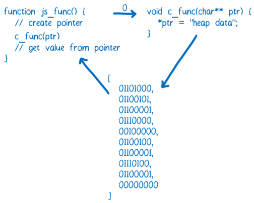 
 
这就好像一个 web 开发者在开发 WebAssembly 模块时，把这个模块包装了一层外衣。这样其他使用者在使用这个模块的时候，就不用关心内存管理的细节。

如果你想了解更多的内存管理，看一下我们写的 WebAssembly 的内存操作。

## 4.4 .wasm 文件结构

如果你是写高级语言的开发者，并且通过编译器编译成 WebAssembly，那你不用关心 WebAssembly 模块的结构。但是了解它的结构有助于你理解一些基本问题。

如果你对编译器还不了解，建议先读一下WebAssembly 系列（三）编译器如何生成汇编这篇文章。

这段代码是即将生成 WebAssembly 的 C 代码：

```
int add42(int num) {
    return num + 42;
}
```

你可以使用 WASM Explorer 来编译这个函数。

打开 .wasm 文件（假设你的编辑器支持的话），可以看到下面代码：

```
00 61 73 6D 0D 00 00 00 01 86 80 80 80 00 01 60
01 7F 01 7F 03 82 80 80 80 00 01 00 04 84 80 80
80 00 01 70 00 00 05 83 80 80 80 00 01 00 01 06
81 80 80 80 00 00 07 96 80 80 80 00 02 06 6D 65
6D 6F 72 79 02 00 09 5F 5A 35 61 64 64 34 32 69
00 00 0A 8D 80 80 80 00 01 87 80 80 80 00 00 20
00 41 2A 6A 0B
```

这是模块的“二进制”表示。之所以用引号把“二进制”引起来，是因为上面其实是用十六进制表示的，不过把它变成二进制或者人们能看懂的十进制表示也很容易。

例如，下面是 num + 42 的各种表示方法。

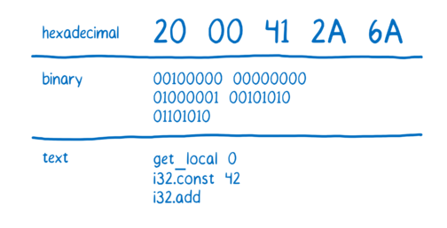 
 
## 4.5 代码是如何工作的：基于栈的虚拟机

如果你对具体的操作过程很好奇，那么这幅图可以告诉你指令都做了什么。

 
 
从图中我们可以注意到 加 操作并没有指定哪两个数字进行加。这是因为 WebAssembly 是采用“基于栈的虚拟机”的机制。即一个操作符所需要的所有值，在操作进行之前都已经存放在堆栈中。

所有的操作符，比如加法，都知道自己需要多少个值。加需要两个值，所以它从堆栈顶部取两个值就可以了。那么加指令就可以变的更短（单字节），因为指令不需要指定源寄存器和目的寄存器。这也使得 .wasm 文件变得更小，进而使得加载 .wasm 文件更快。

尽管 WebAssembly 使用基于栈的虚拟机，但是并不是说在实际的物理机器上它就是这么生效的。当浏览器翻译 WebAssembly 到机器码时，浏览器会使用寄存器，而 WebAssembly 代码并不指定用哪些寄存器，这样做的好处是给浏览器最大的自由度，让其自己来进行寄存器的最佳分配。

## 4.6 WebAssembly 模块的组成部分

除了上面介绍的，.wasm 文件还有其他部分。一些组成部分对于模块来讲是必须的，一些是可选的。

### 4.6.1 必须部分

* Type     在模块中定义的函数的函数声明和所有引入函数的函数声明。
* Function  给出模块中每个函数一个索引。
* Code     模块中每个函数的实际函数体。

### 4.6.2 可选部分
* Export   使函数、内存、表（tables）、全局变量等对其他 WebAssembly 或 JavaScript 可见，允许动态链接一些分开编译的组件，即 .dll 的WebAssembly 版本。
* Import   允许从其他 WebAssembly 或者 JavaScript 中导入指定的函数、内存、表或者全局变量。
* Start    当 WebAssembly 模块加载进来的时候，可以自动运行的函数（类似于 main 函数）。
* Global   声明模块的全局变量。
* Memory 定义模块用到的内存。
* Table   使得可以映射到 WebAssembly 模块以外的值，如映射到 JavaScript 的对象。这在间接函数调用时很有用。
* Data    初始化导入的或者局部内存。
* Element 初始化导入的或者局部的表。
如果你想了解关于这些组成部分的更深入的内容，可以阅读这些组成部分的工作原理。

# 5. 为什么 WebAssembly 更快？
上一篇文章中，我介绍了如何编写 WebAssembly 程序，也表达了我希望看到更多的开发者在自己的工程中同时使用 WebAssembly 和 JavaScript 的期许。

开发者们不必纠结于到底选择 WebAssembly 还是 JavaScript，已经有了 JavaScript 工程的开发者们，希望能把部分 JavaScript 替换成 WebAssembly 来尝试使用。

例如，正在开发 React 程序的团队可以把协调性代码（即虚拟 DOM）替换成 WebAssembly 的版本。而对于你的 web 应用的用户来说，他们就跟以前一样使用，不会发生任何变化，同时他们还能享受到 WebAssembly 所带来的好处——快。

而开发者们选择替换为 WebAssembly 的原因正是因为 WebAssembly 比较快。

## 5.1 当前的 JavaScript 性能如何？

在我们了解 JavaScript 和 WebAssembly 的性能区别之前，需要先理解 JS 引擎的工作原理。

下面这张图片介绍了性能使用的大概分布情况。

JS 引擎在图中各个部分所花的时间取决于页面所用的 JavaScript 代码。图表中的比例并不代表真实情况下的确切比例情况。

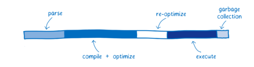 
 
图中的每一个颜色条都代表了不同的任务：

* Parsing——表示把源代码变成解释器可以运行的代码所花的时间；
* Compiling + optimizing——表示基线编译器和优化编译器花的时间。一些优化编译器的工作并不在主线程运行，不包含在这里。
* Re-optimizing——当 JIT 发现优化假设错误，丢弃优化代码所花的时间。包括重优化的时间、抛弃并返回到基线编译器的时间。
* Execution——执行代码的时间。
* Garbage collection——垃圾回收，清理内存的时间。

这里注意：这些任务并不是离散执行的，或者按固定顺序依次执行的。而是交叉执行，比如正在进行解析过程时，其他一些代码正在运行，而另一些正在编译。

这样的交叉执行给早期 JavaScript 带来了很大的效率提升，早期的 JavaScript 执行类似于下图，各个过程顺序进行：

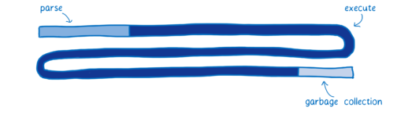 
 
早期时，JavaScript 只有解释器，执行起来非常慢。当引入了 JIT 后，大大提升了执行效率，缩短了执行时间。

JIT 所付出的开销是对代码的监视和编译时间。JavaScript 开发者可以像以前那样开发 JavaScript 程序，而同样的程序，解析和编译的时间也大大缩短。这就使得开发者们更加倾向于开发更复杂的 JavaScript 应用。

同时，这也说明了执行效率上还有很大的提升空间。

## 5.2 WebAssembly 对比

下面是 WebAssembly 和典型的 web 应用的近似对比图：

 
 
各种浏览器处理上图中不同的过程，有着细微的差别，拿 SpiderMonkey 作为例子。

## 5.3 文件获取

这一步并没有显示在图表中，但是这看似简单地从服务器获取文件这个步骤，却会花费很长时间。

WebAssembly 比 JavaScript 的压缩率更高，所以文件获取也更快。即便通过压缩算法可以显著地减小 JavaScript 的包大小，但是压缩后的 WebAssembly 的二进制代码依然更小。

这就是说在服务器和客户端之间传输文件更快，尤其在网络不好的情况下。

## 5.4 解析

当到达浏览器时，JavaScript 源代码就被解析成了抽象语法树。

浏览器采用懒加载的方式进行，只解析真正需要的部分，而对于浏览器暂时不需要的函数只保留它的桩（stub，译者注：关于桩的解释可以在之前的文章中有提及）。

解析过后 AST （抽象语法树）就变成了中间代码（叫做字节码），提供给 JS 引擎编译。

而 WebAssembly 则不需要这种转换，因为它本身就是中间代码。它要做的只是解码并且检查确认代码没有错误就可以了。

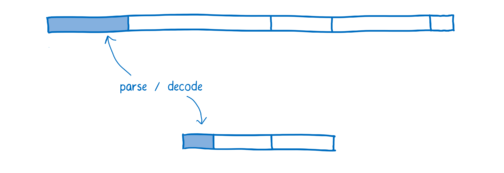 
 
## 5.5 编译和优化

在关于 JIT 的文章中，我有介绍过，JavaScript 是在代码的执行阶段编译的。因为它是弱类型语言，当变量类型发生变化时，同样的代码会被编译成不同版本。

不同浏览器处理 WebAssembly 的编译过程也不同，有些浏览器只对 WebAssembly 做基线编译，而另一些浏览器用 JIT 来编译。

不论哪种方式，WebAssembly 都更贴近机器码，所以它更快，使它更快的原因有几个：

* 在编译优化代码之前，它不需要提前运行代码已知道变量都是什么类型。
* 编译器不需要对同样的代码做不同版本的编译。
* 很多优化在 LLVM 阶段就已经做完了，所以在编译和优化的时候没有太多的优化需要做。

 
 
## 5.6 重优化

有些情况下，JIT 会反复地进行“抛弃优化代码<->重优化”过程。

当 JIT 在优化假设阶段做的假设，执行阶段发现是不正确的时候，就会发生这种情况。比如当循环中发现本次循环所使用的变量类型和上次循环的类型不一样，或者原型链中插入了新的函数，都会使 JIT 抛弃已优化的代码。

反优化过程有两部分开销。

* 需要花时间丢掉已优化的代码并且回到基线版本。
* 如果函数依旧频繁被调用，JIT 可能会再次把它发送到优化编译器，又做一次优化编译，这是在做无用功。

在 WebAssembly 中，类型都是确定了的，所以 JIT 不需要根据变量的类型做优化假设。也就是说 WebAssembly 没有重优化阶段。

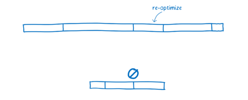 
 
## 5.7 执行

自己也可以写出执行效率很高的 JavaScript 代码。你需要了解 JIT 的优化机制，例如你要知道什么样的代码编译器会对其进行特殊处理（JIT 文章里面有提到过）。

然而大多数的开发者是不知道 JIT 内部的实现机制的。即使开发者知道 JIT 的内部机制，也很难写出符合 JIT 标准的代码，因为人们通常为了代码可读性更好而使用的编码模式，恰恰不合适编译器对代码的优化。

加之 JIT 会针对不同的浏览器做不同的优化，所以对于一个浏览器优化的比较好，很可能在另外一个浏览器上执行效率就比较差。

正是因为这样，执行 WebAssembly 通常会比较快，很多 JIT 为 JavaScript 所做的优化在 WebAssembly 并不需要。另外，WebAssembly 就是为了编译器而设计的，开发人员不直接对其进行编程，这样就使得 WebAssembly 专注于提供更加理想的指令（执行效率更高的指令）给机器就好了。

执行效率方面，不同的代码功能有不同的效果，一般来讲执行效率会提高 10% - 800%。

 
 
## 5.8 垃圾回收

JavaScript 中，开发者不需要手动清理内存中不用的变量。JS 引擎会自动地做这件事情，这个过程叫做垃圾回收。

可是，当你想要实现性能可控，垃圾回收可能就是个问题了。垃圾回收器会自动开始，这是不受你控制的，所以很有可能它会在一个不合适的时机启动。目前的大多数浏览器已经能给垃圾回收安排一个合理的启动时间，不过这还是会增加代码执行的开销。

目前为止，WebAssembly 不支持垃圾回收。内存操作都是手动控制的（像 C、C++一样）。这对于开发者来讲确实增加了些开发成本，不过这也使代码的执行效率更高。

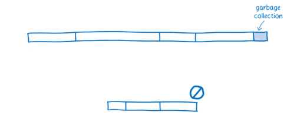 
 
## 5.9 总结

WebAssembly 比 JavaScript 执行更快是因为：

* 文件抓取阶段，WebAssembly 比 JavaScript 抓取文件更快。即使 JavaScript 进行了压缩，WebAssembly 文件的体积也比 JavaScript 更小；
* 解析阶段，WebAssembly 的解码时间比 JavaScript 的解析时间更短；
* 编译和优化阶段，WebAssembly 更具优势，因为 WebAssembly 的代码更接近机器码，而 JavaScript 要先通过服务器端进行代码优化。
* 重优化阶段，WebAssembly 不会发生重优化现象。而 JS 引擎的优化假设则可能会发生“抛弃优化代码<->重优化”现象。
* 执行阶段，WebAssembly 更快是因为开发人员不需要懂太多的编译器技巧，而这在 JavaScript 中是需要的。WebAssembly 代码也更适合生成机器执行效率更高的指令。
* 垃圾回收阶段，WebAssembly 垃圾回收都是手动控制的，效率比自动回收更高。
这就是为什么在大多数情况下，同一个任务 WebAssembly 比 JavaScript 表现更好的原因。

但是，还有一些情况 WebAssembly 表现的会不如预期；同时 WebAssembly 的未来也会朝着使 WebAssembly 执行效率更高的方向发展。这些我会在下一篇文章中介绍。

# 6. WebAssembly 的现在与未来
2017 年 2 月 28 日，四个主要的浏览器一致同意宣布 WebAssembly 的MVP 版本已经完成，它是一个浏览器可以搭载的稳定版本。

 
 
它提供了浏览器可以搭载的稳定核，这个核并没有包含 WebAssembly 组织所计划的所有特征，而是提供了可以使 WebAssembly 稳定运行的基本版本。

这样一来开发者就可以使用 WebAssembly 代码了。对于旧版本的浏览器，开发者可以通过 asm.js 来向下兼容代码，asm.js 是 JavaScript 的一个子集，所有 JS 引擎都可以使用它。另外，通过 Emscripten 工具，你可以把你的应用编译成 WebAssembly 或者 asm.js。

尽管是第一个版本，WebAssembly 已经能发挥出它的优势了，未来通过不断地改善和融入新特征，WebAssembly 会变的更快。

## 6.1 提升浏览器中 WebAssembly 的性能

随着各种浏览器都使自己的引擎支持 WebAssembly，速度提升就变成自然而然的了，目前各大浏览器厂商都在积极推动这件事情。

## 6.2 JavaScript 和 WebAssembly 之间调用的中间函数

目前，在 JS 中调用 WebAssembly 的速度比本应达到的速度要慢。这是因为中间需要做一次“蹦床运动”。JIT 没有办法直接处理 WebAssembly，所以 JIT 要先把 WebAssembly 函数发送到懂它的地方。这一过程是引擎中比较慢的地方。

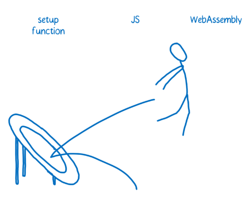 
 
按理来讲，如果 JIT 知道如何直接处理 WebAssembly 函数，那么速度会有百倍的提升。

如果你传递的是单一任务给 WebAssembly 模块，那么不用担心这个开销，因为只有一次转换，也会比较快。但是如果是频繁地从 WebAssembly 和 JavaScript 之间切换，那么这个开销就必须要考虑了。

## 6.3 快速加载

JIT 必须要在快速加载和快速执行之间做权衡。如果在编译和优化阶段花了大量的时间，那么执行的必然会很快，但是启动会比较慢。目前有大量的工作正在研究，如何使预编译时间和程序真正执行时间两者平衡。

WebAssembly 不需要对变量类型做优化假设，所以引擎也不关心在运行时的变量类型。这就给效率的提升提供了更多的可能性，比如可以使编译和执行这两个过程并行。

加之最新增加的 JavaScript API 允许 WebAssembly 的流编译，这就使得在字节流还在下载的时候就启动编译。

FireFox 目前正在开发两个编译器系统。一个编译器先启动，对代码进行部分优化。在代码已经开始运行时，第二个编译器会在后台对代码进行全优化，当全优化过程完毕，就会将代码替换成全优化版本继续执行。

## 6.4 添加后续特性到 WebAssembly 标准的过程

WebAssembly 的发展是采用小步迭代的方式，边测试边开发，而不是预先设计好一切。

这就意味着有很多功能还在襁褓之中，没有经过彻底思考以及实际验证。它们想要写进标准，还要通过所有的浏览器厂商的积极参与。

这些特性叫做：未来特性。这里列出几个。

### 6.4.1 直接操作 DOM

目前 WebAssembly 没有任何方法可以与 DOM 直接交互。就是说你还不能通过比如element.innerHTML 的方法来更新节点。

想要操作 DOM，必须要通过 JS。那么你就要在 WebAssembly 中调用 JavaScript 函数（WebAssembly 模块中，既可以引入 WebAssembly 函数，也可以引入 JavaScript 函数）。

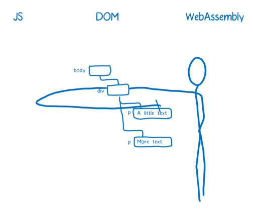 
 
不管怎么样，都要通过 JS 来实现，这比直接访问 DOM 要慢得多，所以这是未来一定要解决的一个问题。

### 6.4.2 共享内存的并发性

提升代码执行速度的一个方法是使代码并行运行，不过有时也会适得其反，因为不同的线程在同步的时候可能会花费更多的时间。

这时如果能够使不同的线程共享内存，那就能降低这种开销。实现这一功能 WebAssembly 将会使用 JavaScript 中的 SharedArrayBuffer，而这一功能的实现将会提高程序执行的效率。

### 6.4.3 SIMD（单指令，多数据）

如果你之前了解过 WebAssembly 相关的内容，你可能会听说过 SIMD，全称是：Single Instruction, Multiple Data（单指令，多数据），这是并行化的另一种方法。

SIMD 在处理存放大量数据的数据结构有其独特的优势。比如存放了很多不同数据的 vector（容器），就可以用同一个指令同时对容器的不同部分做处理。这种方法会大幅提高复杂计算的效率，比如游戏或者 VR。

这对于普通 web 应用开发者不是很重要，但是对于多媒体、游戏开发者非常关键。

### 6.4.4 异常处理

许多语言都仿照 C++ 式的异常处理，但是 WebAssembly 并没有包含异常处理。

如果你用 Emscripten 编译代码，就知道它会模拟异常处理，但是这一过程非常之慢，慢到你都想用“DISABLEEXCEPTIONCATCHING” 标记把异常处理关掉。

如果异常处理加入到了 WebAssembly，那就不用采用模拟的方式了。而异常处理对于开发者来讲又特别重要，所以这也是未来的一大功能点。

### 6.4.5 其他改进——使开发者开发起来更简单

一些未来特性不是针对性能的，而是使开发者开发 WebAssembly 更方便。

* 一流的开发者工具。目前在浏览器中调试 WebAssembly 就像调试汇编一样，很少的开发者可以手动地把自己的源代码和汇编代码对应起来。我们在致力于开发出更加适合开发者调试源代码的工具。
* 垃圾回收。如果你能提前确定变量类型，那就可以把你的代码变成 WebAssembly，例如 TypeScript 代码就可以编译成 WebAssembly。但是现在的问题是 WebAssembly 没办法处理垃圾回收的问题，WebAssembly 中的内存操作都是手动的。所以 WebAssembly 会考虑提供方便的 GC 功能，以方便开发者使用。
* ES6 模块集成。目前浏览器在逐渐支持用 script 标记来加载 JavaScript 模块。一旦这一功能被完美执行，那么像

### 6.5 总结

WebAssembly 执行起来更快，随着浏览器逐步支持了 WebAssembly 的各种特性，WebAssembly 将会变得更快。
