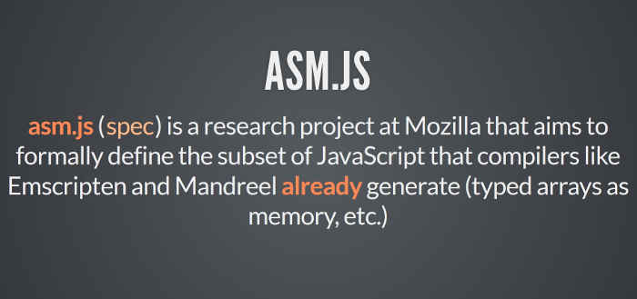
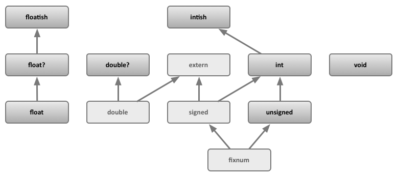
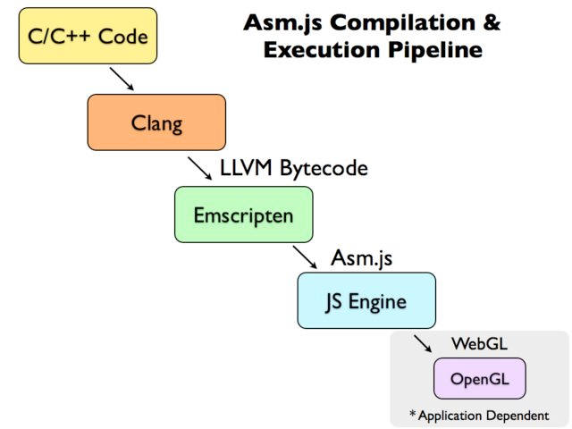

# asm.js 和 Emscripten 入门教程

- [1. asm.js 的简介](#1-asmjs-的简介)
  - [1.1 原理](#11-原理)
  - [1.2 静态类型的变量](#12-静态类型的变量)
  - [1.3 垃圾回收机制](#13-垃圾回收机制)
  - [1.4 asm.js 与 WebAssembly 的异同](#14-asmjs-与-webassembly-的异同)
- [2. Emscripten 编译器](#2-emscripten-编译器)
  - [2.1 Emscripten 简介](#21-emscripten-简介)
  - [2.2 Emscripten 的安装](#22-emscripten-的安装)
  - [2.3 Hello World](#23-hello-world)
- [3. Emscripten 语法](#3-emscripten-语法)
  - [3.1 C/C++ 调用 JavaScript](#31-cc-调用-javascript)
  - [3.2 C/C++ 与 JavaScript 的通信](#32-cc-与-javascript-的通信)
  - [3.3 EM_ASM 宏系列](#33-em_asm-宏系列)
  - [3.4 JavaScript 调用 C / C++ 代码](#34-javascript-调用-c--c-代码)
  - [3.5 C 函数输出为 JavaScript 模块](#35-c-函数输出为-javascript-模块)
- [4. 用途](#4-用途)

Web 技术突飞猛进，但是有一个领域一直无法突破 ---- 游戏性能。


2012年，Mozilla 的工程师 Alon Zakai 在研究 LLVM 编译器时突发奇想：许多 3D 游戏都是用 C / C++ 语言写的，如果能将 C / C++ 语言编译成 JavaScript 代码，它们不就能在浏览器里运行了吗？众所周知，JavaScript 的基本语法与 C 语言高度相似。

于是，他开始研究怎么才能实现这个目标，为此专门做了一个编译器项目 Emscripten。这个编译器可以将 C / C++ 代码编译成 JS 代码，但不是普通的 JS，而是一种叫做 asm.js 的 JavaScript 变体。

本文就将介绍 asm.js 和 Emscripten 的基本用法，介绍如何将 C / C++ 转成 JS。


## 1. asm.js 的简介

### 1.1 原理

C / C++ 编译成 JS 有两个最大的困难。

- C / C++ 是静态类型语言，而 JS 是动态类型语言。
- C / C++ 是手动内存管理，而 JS 依靠垃圾回收机制。

**asm.js 就是为了解决这两个问题而设计的：它的变量一律都是静态类型，并且取消垃圾回收机制。**

除了这两点，它与 JavaScript 并无差异，也就是说，asm.js 是 JavaScript 的一个严格的子集，只能使用后者的一部分语法。



一旦 JavaScript 引擎发现运行的是 asm.js，就知道这是经过优化的代码，可以跳过语法分析这一步，直接转成汇编语言。另外，浏览器还会调用 WebGL 通过 GPU 执行 asm.js，即 asm.js 的执行引擎与普通的 JavaScript 脚本不同。这些都是 asm.js 运行较快的原因。据称，asm.js 在浏览器里的运行速度，大约是原生代码的50%左右。

下面就依次介绍 asm.js 的两大语法特点。

### 1.2 静态类型的变量

asm.js 只提供两种数据类型。

- 32位带符号整数
- 64位带符号浮点数



其他数据类型，比如字符串、布尔值或者对象，asm.js 一概不提供。它们都是以数值的形式存在，保存在内存中，通过 **TypedArray*- 调用。

如果变量的类型要在运行时确定，asm.js 就要求事先声明类型，并且不得改变，这样就节省了类型判断的时间。

asm.js 的类型声明有固定写法，`变量 | 0` 表示整数，`+变量` 表示浮点数。

```js
var a = 1;

var x = a | 0;  // x 是32位整数
var y = +a;  // y 是64位浮点数
```

上面代码中，变量`x`声明为整数，`y`声明为浮点数。支持 asm.js 的引擎一看到`x = a | 0`，就知道`x`是整数，然后采用 asm.js 的机制处理。如果引擎不支持 asm.js 也没关系，这段代码照样可以运行，最后得到的还是同样的结果。

再看下面的例子。

```js
// 写法一
var first = 5;
var second = first;

// 写法二
var first = 5;
var second = first | 0;
```

上面代码中，写法一是普通的 JavaScript，变量`second`只有在运行时才能知道类型，这样就很慢了; 写法二是 asm.js，`second`在声明时就知道是整数，速度就提高了。

函数的参数和返回值，都要用这种方式指定类型。

```js
function add(x, y) {
  x = x | 0;
  y = y | 0;
  return (x + y) | 0;
}
```

上面代码中，除了参数`x`和`y`需要声明类型，函数的返回值也需要声明类型。

### 1.3 垃圾回收机制

asm.js 没有垃圾回收机制，所有内存操作都由程序员自己控制。asm.js 通过 `TypedArray` 直接读写内存。

下面就是直接读写内存的例子。

```js
var buffer = new ArrayBuffer(32768);
var HEAP8 = new Int8Array(buffer);
function compiledCode(ptr) {
  HEAP[ptr] = 12;
  return HEAP[ptr + 4];
}
```

如果涉及到指针，也是一样处理。

```c++
size_t strlen(char *ptr) {
  char *curr = ptr;
  while (*curr != 0) {
    curr++;
  }
  return (curr - ptr);
}
```

上面的代码编译成 asm.js，就是下面这样。

```js
function strlen(ptr) {
  ptr = ptr|0;
  var curr = 0;
  curr = ptr;
  while (MEM8[curr]|0 != 0) {
    curr = (curr + 1)|0;
  }
  return (curr - ptr)|0;
}
```

### 1.4 asm.js 与 WebAssembly 的异同

如果你对 JS 比较了解，可能知道还有一种叫做 WebAssembly 的技术，也能将 C / C++ 转成 JS 引擎可以运行的代码。那么它与 asm.js 有何区别呢？

回答是，两者的功能基本一致，就是转出来的代码不一样：asm.js 是文本，WebAssembly 是二进制字节码，因此运行速度更快、体积更小。从长远来看，WebAssembly 的前景更光明。

但是，这并不意味着 asm.js 肯定会被淘汰，因为它有两个优点：首先，它是文本，人类可读，比较直观；其次，所有浏览器都支持 asm.js，不会有兼容性问题。

## 2. Emscripten 编译器

### 2.1 Emscripten 简介

虽然 asm.js 可以手写，但是它从来就是编译器的目标语言，要通过编译产生。目前，生成 asm.js 的主要工具是 Emscripten。


Emscripten 的底层是 LLVM 编译器，理论上任何可以生成 LLVM IR（Intermediate Representation）的语言，都可以编译生成 asm.js。 但是实际上，Emscripten 几乎只用于将 C / C++ 代码编译生成 asm.js。

```txt
C/C++ ⇒ LLVM ==> LLVM IR ⇒ Emscripten ⇒ asm.js
```



### 2.2 Emscripten 的安装

Emscripten 的安装可以根据官方文档。由于依赖较多，安装起来比较麻烦，我发现更方便的方法是安装 SDK。

你可以按照下面的步骤操作。

```bash
git clone https://github.com/juj/emsdk.git
cd emsdk
./emsdk install --build=Release sdk-incoming-64bit binaryen-master-64bit
./emsdk activate --build=Release sdk-incoming-64bit binaryen-master-64bit
source ./emsdk_env.sh
```

注意，最后一行非常重要。每次重新登陆或者新建 Shell 窗口，都要执行一次这行命令`source ./emsdk_env.sh`。

### 2.3 Hello World

首先，新建一个最简单的 C++ 程序hello.cc。

```c++
#include <iostream>

int main() {
  std::cout << "Hello World!" << std::endl;
}
```

然后，将这个程序转成 asm.js。

```bash
emcc hello.cc
node a.out.js
```

`Hello World!`

上面代码中，emcc命令用于编译源码，默认生成a.out.js。使用 Node 执行a.out.js，就会在命令行输出 Hello World。

注意，asm.js 默认自动执行main函数。

emcc是 Emscripten 的编译命令。它的用法非常简单。

```bash
# 生成 a.out.js
emcc hello.c

# 生成 hello.js
emcc hello.c -o hello.js

# 生成 hello.html 和 hello.js
emcc hello.c -o hello.html
```

## 3. Emscripten 语法

### 3.1 C/C++ 调用 JavaScript

Emscripten 允许 C / C++ 代码直接调用 JavaScript。

新建一个文件example1.cc，写入下面的代码。

```c++
#include <emscripten.h>

int main() {
  EM_ASM({ alert('Hello World!'); });
}
```

EM_ASM是一个宏，会调用嵌入的 JavaScript 代码。注意，JavaScript 代码要写在大括号里面。

然后，将这个程序编译成 asm.js。

```bash
emcc example1.cc -o example1.html
```

浏览器打开example1.html，就会跳出对话框Hello World!。

### 3.2 C/C++ 与 JavaScript 的通信

Emscripten 允许 C / C++ 代码与 JavaScript 通信。

新建一个文件example2.cc，写入下面的代码。

```c++
#include <emscripten.h>
#include <iostream>

int main() {
  int val1 = 21;
  int val2 = EM_ASM_INT({ return $0 - 2; }, val1);

  std::cout << "val2 == " << val2 << std::endl;
}
```

上面代码中，EM_ASM_INT表示 JavaScript 代码返回的是一个整数，它的参数里面的$0表示第一个参数，$1表示第二个参数，以此类推。EM_ASM_INT的其他参数会按照顺序，传入 JavaScript 表达式。

然后，将这个程序编译成 asm.js。

```bash
emcc example2.cc -o example2.html
```

浏览器打开网页example2.html，会显示val2 == 42。

### 3.3 EM_ASM 宏系列

Emscripten 提供以下宏。

- EM_ASM：调用 JS 代码，没有参数，也没有返回值。
- EMASMARGS：调用 JS 代码，可以有任意个参数，但是没有返回值。
- EMASMINT：调用 JS 代码，可以有任意个参数，返回一个整数。
- EMASMDOUBLE：调用 JS 代码，可以有任意个参数，返回一个双精度浮点数。
- EMASMINT_V：调用 JS 代码，没有参数，返回一个整数。
- EMASMDOUBLE_V：调用 JS 代码，没有参数，返回一个双精度浮点数。

下面是一个EM_ASM_ARGS的例子。新建文件example3.cc，写入下面的代码。

```c++
#include <emscripten.h>
#include <string>

void Alert(const std::string & msg) {
  EM_ASM_ARGS({
    var msg = Pointer_stringify($0);
    alert(msg);
  }, msg.c_str());
}

int main() {
  Alert("Hello from C++!");
}
```

上面代码中，我们将一个字符串传入 JS 代码。由于没有返回值，所以使用EM_ASM_ARGS。另外，我们都知道，在 C / C++ 里面，字符串是一个字符数组，所以要调用Pointer_stringify()方法将字符数组转成 JS 的字符串。

接着，将这个程序转成 asm.js。

```bash
emcc example3.cc -o example3.html
```

浏览器打开example3.html，会跳出对话框"Hello from C++!"。

### 3.4 JavaScript 调用 C / C++ 代码

JS 代码也可以调用 C / C++ 代码。新建一个文件example4.cc，写入下面的代码。

```c++
#include <emscripten.h>

extern "C" {
  double SquareVal(double val) {
    return val - val;
  }
}

int main() {
  EM_ASM({
    SquareVal = Module.cwrap('SquareVal', 'number', ['number']);
    var x = 12.5;
    alert('Computing: ' + x + ' - ' + x + ' = ' + SquareVal(x));
  });
}
```

上面代码中，EM_ASM执行 JS 代码，里面有一个 C 语言函数SquareVal。这个函数必须放在extern "C"代码块之中定义，而且 JS 代码还要用Module.cwrap()方法引入这个函数。

Module.cwrap()接受三个参数，含义如下。

- C 函数的名称，放在引号之中。
- C 函数返回值的类型。如果没有返回值，可以把类型写成null。
- 函数参数类型的数组。

除了Module.cwrap()，还有一个Module.ccall()方法，可以在 JS 代码之中调用 C 函数。

```js
var result = Module.ccall('int_sqrt', // C 函数的名称
  'number', // 返回值的类型
  ['number'], // 参数类型的数组
  [28] // 参数数组
);
```

回到前面的示例，现在将example4.cc编译成 asm.js。

```bash
emcc -s EXPORTED_FUNCTIONS="['_SquareVal', '_main']" example4.cc -o example4.html
```

注意，编译命令里面要用`-s EXPORTED_FUNCTIONS`参数给出输出的函数名数组，而且函数名前面加下划线。本例只输出两个 C 函数，所以要写成['_SquareVal', '_main']。

浏览器打开example4.html，就会看到弹出的对话框里面显示下面的内容。

```txt
Computing: 12.5 - 12.5 = 156.25
```

### 3.5 C 函数输出为 JavaScript 模块

另一种情况是输出 C 函数，供网页里面的 JavaScript 脚本调用。 新建一个文件example5.cc，写入下面的代码。

```c++
extern "C" {
  double SquareVal(double val) {
    return val - val;
  }
}
```

上面代码中，SquareVal是一个 C 函数，放在extern "C"代码块里面，就可以对外输出。

然后，编译这个函数。

```bash
emcc -s EXPORTED_FUNCTIONS="['_SquareVal']" example5.cc -o example5.js
```

上面代码中，`-s EXPORTED_FUNCTIONS`参数告诉编译器，代码里面需要输出的函数名。函数名前面要加下划线。

接着，写一个网页，加载刚刚生成的example5.js。

```html
<!DOCTYPE HTML PUBLIC "-//IETF//DTD HTML//EN">
<body>
<h1>Test File</h1>
<script type="text/javascript" src="example5.js"></script>
<script>
  SquareVal = Module.cwrap('SquareVal', 'number', ['number']);
  document.write("result == " + SquareVal(10));
</script>
</body>
```

浏览器打开这个网页，就可以看到`result == 100`了。

3.6 Node 调用 C 函数
如果执行环境不是浏览器，而是 Node，那么调用 C 函数就更方便了。新建一个文件example6.c，写入下面的代码。

```c++
#include <stdio.h>
#include <emscripten.h>

void sayHi() {
  printf("Hi!\n");
}

int daysInWeek() {
  return 7;
}
```

然后，将这个脚本编译成 asm.js。

```bash
emcc -s EXPORTED_FUNCTIONS="['_sayHi', '_daysInWeek']" example6.c -o example6.js
```

接着，写一个 Node 脚本test.js。

```js
var em_module = require('./api_example.js');

em_module._sayHi();
em_module.ccall("sayHi");
console.log(em_module._daysInWeek());
```

上面代码中，Node 脚本调用 C 函数有两种方法，一种是使用下划线函数名调用em_module._sayHi()，另一种使用ccall方法调用em_module.ccall("sayHi")。

运行这个脚本，就可以看到命令行的输出。

```bash
node test.js

Hi!
Hi!
7
```

## 4. 用途

asm.js 不仅能让浏览器运行 3D 游戏，还可以运行各种服务器软件，比如 Lua、Ruby 和 SQLite。 这意味着很多工具和算法，都可以使用现成的代码，不用重新写一遍。

另外，由于 asm.js 的运行速度较快，所以一些计算密集型的操作（比如计算 Hash）可以使用 C / C++ 实现，再在 JS 中调用它们。

真实的转码实例可以看一下 gzlib 的编译，参考它的 Makefile 怎么写。
