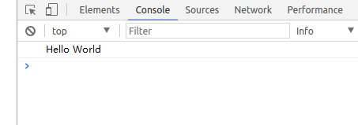

# 生成 HTML

## 1. 写代码 hello.c

```c++
#include <stdio.h>

int main(int argc, char *- argv) {
  printf("Hello World\n");
}
```

## 2. 编译

```bash
emcc hello.c -s WASM=1 -o hello.html
```

- `-s WASM=1` — 指定我们想要的wasm输出形式。如果我们不指定这个选项，Emscripten默认将只会生成asm.js。
- `-o hello.html` — 指定这个选项将会生成HTML页面来运行我们的代码，并且会生成wasm模块以及编译和实例化wasm模块所需要的“胶水”js代码，这样我们就可以直接在web环境中使用了。
- printf将会被翻译成console.log。

生成如下文件：

```text
├── hello.c         # 源码
├── hello.js        # 加载wasm用的javascript代码，即“胶水”js代码
├── hello.wasm      # 中间二进制的wasm模块代码
└── hello.html      # web文件
```

## 3. 运行

在当前目录下启动http服务器

```bash
python -m SimpleHTTPServer 9000     # python的http服务器,其他服务也行
```

在浏览器中打开localhost:9000，按F12打开控制台，查看结果：



## 4. 直接编译为js代码

可以得到只有JavaScript的输出文件，而不再是完整的HTML文件。

```bash
emcc hello.c -s WASM=1 -o hello.js
```

目录结构如下，

```text
.
├── hello.c
├── hello.js
└── hello.wasm
```

**<font color="red">不推荐这样做</font>**。因为Emscripten需要大量的JavaScript“胶水”代码从而能够处理内存分配、内存泄漏以及大量的其他问题。这些问题都已经在提供的模板中得到了处理，使用模板要比自己编写模板要容易得多。

## 5. 带模板编译

```bash
mkdir html_template
cp ~/emsdk/emscripten/1.38.15/src/shell_minimal.html html_template
emcc -o hello.html hello.c -O3 -s WASM=1 --shell-file html_template/shell_minimal.html
```

内容和我们使用的模板非常相像，只不过多加了一些 js 胶水和加载wasm文件的代码。

在浏览器中打开它，你会看到与上一个例子相同的输出。
