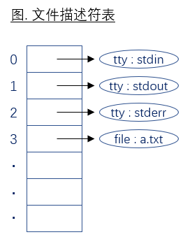

# 文件IO

### 3.1 一切接文件

普通文件,有名无名管道文件,设备文件,符号链接,套接口等

### 3.2 头文件

文件io的头文件是unistd.h,遵循posix标准

标准c io的头文件是stdio.h,遵循iso c标准

标准c的底层调用的是系统调用的文件io来实现的

### 3.3 什么是系统调用

### 3.4 文件io一般是不带缓冲io

### 3.5 文件描述符

FILE fd : /usr/include/libio.h :line 273

```cpp
typedef    struct _IO_FILE FILE ;
struct _IO_FILE {
    ... ...
    int _fileno;    // FILE结构体中包含文件描述符.
    ... ...
}
```

int fileno(FILE *stream);  
获取打开的文件流对应的文件描述符

```cpp
#define STDIN_FILENO 0      标准输入    stdin
#define STDOUT_FILENO 1     标准输出    stdout
#define STDERR_FILENO 2     标准错误    stderr
```

0～OPEN_MAX        // 1024



### 3.6. 打开文件

int open(const char *pathname, int flags);  
**int open(const char *pathname, int flags, mode_t mode);

    `flags`    O_RDONLY,O_WRONLY,O_RDWR此三者必指定其一,不可同时出现. 

    flags | desc
    :--- | :----
    O_RDONLY | 只读打开
    O_WRONLY | 只写打开
    O_RDWR | 可读可写打开
    O_APPEND | 表示追加.始终在文件结尾添加内容,而不覆盖原来的内容.
    O_CREAT | 创建文件.要求mode参数同时存在,表示该文件的访问权限.
    O_EXCL | 用来判断文件是否存在. 如果同时指定了O_CREAT,并且文件已存在,则出错返回.
    O_TRUNC | 将文件长度截断(Truncate)为0字节.
    O_NONBLOCK | 针对阻塞设备文件或管道,以非阻塞I/O方式打开.

    `mode` [请参照4.5 umask](#4.5-umask)

        umask : 0666&~022=0644    创建文件后的权限

    `返回值`    文件描述符, 即程序中文件的标识

### 3.7. 创建

int creat(const char *pathname, mode_t mode);
    =open(path, O_WRONLY|O_CREAT|O_TRUNC, mode) ;    // 没有O_EXCL选项
    =fopen( path, "w" ) ;
    注    creat函数并不判断文件是否存在,直接创建.

### 3.8. 关闭文件

int close(int fd);

示例+训练    maxopen.c

### 3.9. 读写

ssize_t read(int fd, void *buf, size_t count);        成功返回读取的字节数.返回0表示文件尾.
ssize_t write(int fd, const void *buf, size_t count);    成功返回写入的字节数.

示例+训练    mycat.c 要求每1秒显示10个字节

### 3.10. 定位

off_t lseek(int fd, off_t offset, int whence);
    文件位置指针定位, 阻塞设备文件或管道一般不可用.
off_t    curpos = lseek( fd, 0, SEEK_CUR ) ;
        返回值    返回文件指针当前位置.（注:fseek不返回文件位置.）

```cpp lseek
int    main( void )
{
if ( lseek( STDIN_FILENO, 0, SEEK_CUR) == -1 )    // 要检测返回值是否是-1,而不是判断小于0
    cout << "cannot seek ." << endl ;
else    cout << "seek ok ." << endl ;
return    0 ;
}
/*
./a.out < /etc/motd
seek ok .
cat < /etc/motd | a.out
cannot seek .
./a.out < /val/spool/cron/FIFO
cannot seek .
*/
```

### 3.11. 原子操作和文件共享

a) 非原子操作问题一
lseek( fd, 0, SEEK_END ) ;
sleep(10) ;
write( fd, "xxxx\n", 5 ) ;
// 可以看到在sleep(10)的过程中,若其他程序追加写此文件,sleep后内容会被覆盖.

解决方案1：使用O_APPEND选项

    O_APPEND确保无论何时何种情况,哪怕同时有多个程序在对此文件进行写操作.文件位置指针始终被定位到文件尾,
int    fd = open( "test.txt", O_RDWR | O_APPEND ) ;    // 读也是必须的
sleep(5) ;
write( fd, "xxxx\n", 5 ) ;

    注    O_APPEND只对写操作起作用,使lseek失效,文件位置指针始终被定位在文件尾.
        O_APPEND对读操作不起作用,文件位置指针可以任意lseek.

```cpp O_APPEND对写操作和读操作的影响
int    main(int ac, char \- av[])
{
int    fd = open(av[1], O_RDWR | O_APPEND ) ;

// 针对写操作
lseek( fd, 0, SEEK_SET ) ;    // 定位到文件头
write( fd, "12345678", 8 ) ;    // 但是写后发现仍然被写到文件末尾
cout << "current position = " << lseek(fd, 0, SEEK_CUR) << endl ;    // 可以看到依旧到达文件尾

// 针对读操作
lseek( fd, 0, SEEK_SET ) ;    // 定位到文件尾
char    buf[1024] = { 0x00 } ;
read(fd, buf, 10 ) ;        // 从开始处读入数据
cout << "read buf = " << buf << endl ;

close(fd);
return    0 ;
}
```

解决方案2：pread和pwrite

    ssize_t pread(int fd, void *buf, size_t count, off_t offset);
        ~= lseek+read , 不同点：原子操作,不可被中断,不更新文件指针

    ssize_t pwrite(int fd, const void *buf, size_t count, off_t offset);
        ~= lseek+write, 不同点：原子操作,不可被中断,不更新文件指针

    示例学生自测.

b) 非原子操作问题
if( (fd = open( pathname, O_WRONLY) ) < 0 )
if ( (fd = creat( pathname, mode ) ) < 0 )
// 因为creat函数不对文件是否存在进行判断就立即创建文件.如果在open和creat之间,有另外一个进程创建了该文件,就会引起问题.

解决方案 : 丢弃creat,采用open,参数选项加上 O_CREAT | O_EXCL
    fd = open( pathname, O_WRONLY | O_CREAT | O_EXCL, mode ) ;

### 3.12. 复制文件描述符

将当前的文件描述符进行赋值,产生出新的文件描述符,新旧描述符同时指代同一个文件.

>    重定向        eg. :     1>/dev/null    标准输出重定向/dev/null无底洞
>>    重定向且追加    eg. :     2>>/dev/null    标准错误重定向追加到/dev/null无底洞

int dup( int oldfd ) ;         == fcntl( oldfd, F_DUPFD, 0 ) ;
    返回值    返回复制后的新的文件描述符.

newfd = dup( oldfd ) ;        复制oldfd到newfd,newfd为新创建的.
int      fd = dup(1) ;        // 复制标准输出到一个新的文件描述符
write( 1, "stdin\n", 6 ) ;    // 终端正常输出
write( fd, "newfd\n", 6 ) ;    // 内容输出到标准终端上

int dup2( int oldfd, int newfd ) ;    复制oldfd到newfd,newfd为已关闭的文件描述符.原子操作.
    == close( newfd ) ; fcntl( oldfd, F_DUPFD, newfd ) ;    不原子,不建议使用.

dup( 1, 3 ) ;        // 复制描述符3为1的一个拷贝,3和1都指向1所指代的终端
write( 1, "stdin\n", 6 ) ;    // 终端正常输出
write( 3, "newfd\n", 6 ) ;    // 结果输出到标准终端上
int    fd = open(FNAME,O_WRONLY|O_CREAT|O_TRUNC,0666);
dup2( 1,fd );        // = close(fd), fcntl( 1, F_DUPFD, fd ) ;
write( fd, "aaaaaaa", 8 ) ;    // 结果输出到标准输出上

### 3.13. sync    遗留问题：发现前两个函数对文件属性都会影响

int fsync(int fd);    对文件进行sync,等待数据真实写入磁盘再返回,影响文件属性.
int fdatasync(int fd);    对文件进行sync,只影响文件数据部分,不影响文件属性.
void sync(void) ;    操作一次sync,不等待;守护进程update周期性sync操作.

### 3.14. fcntl

int fcntl(int fd, int cmd);
int fcntl(int fd, int cmd, long arg);
int fcntl(int fd, int cmd, struct flock *lock);

5种功能

a) 复制文件描述符( cmd = F_DUPFD )        不原子,不建议使用
    fcntl( oldfd, F_DUPFD, newfd ) ;    newfd使用时需要先关闭
dup2( STDOUT_FILENO, fd ) ;
= close(newfd) ;   fcntl( STDOUT_FILENO, F_DUPFD, newfd ) ;

```cpp fcntl dup
int    main( void )
{
int    fd = open( "tmp", O_WRONLY|O_CREAT|O_TRUNC ) ;

//dup2( STDOUT_FILENO, fd ) ;

close(fd) ;
fcntl( STDOUT_FILENO, F_DUPFD, fd ) ;

write( fd, "aaaaaaa", 8 ) ;    // 用以上两种方式,最后aaaaaa被输出到标准输出上,而不是文件中
close( fd ) ;

return    0 ;
}
```

b) 获取/设置文件描述符( cmd = F_GETFD, F_SETFD )

c) 获取/设置文件状态( cmd = F_GETFL, F_SETFL )

    1) 获取打开的文件的操作状态特性

    O_RDONLY, O_WRONLY, O_RDWR 三个特性,要用O_ACCMODE才能获取出来.
val = fcntl( fd, F_GETFL) ;
switch( val & O_ACCMODE )
{
case    O_RDONLY:    {    cout << "read only" << endl ;    break;    }
case    O_WRONLY:    {    cout << "write only" << endl ;    break;    }
case    O_RDWR:        {    cout << "read write" << endl ;    break;    }
default:    {    cout << "error" << endl ;    return    1 ;    }
}
if (val & O_APPEND)    cout << ", append" << endl ;
if (val & O_NONBLOCK)    cout << ", nonblocking" << endl ;
---------------------------------------------------------------------------------------
./a.out 0 < /dev/tty
read only
./a.out 1 > temp.foo
cat temp.foo
write only
./a.out 2 2>>temp.foo
write only, append
./a.out 5 5<>temp.foo
read write

    2) 更改文件的操作行为特性
int flags = fcntl(fd, F_GETFL);        // 获取文件操作行为状态
fcntl( fd, F_SETFL, flags | O_APPEND) ;    // 添加追加方式
fcntl( fd, F_SETFL, flags & ~O_APPEND);    // 去掉追加方式

    示例+训练：用fcntl实现解决非原子化问题1 .

d) 获取/设置异步IO所有权( cmd = F_GETOWN, F_SETOWN )
e) 获取/设置记录锁( cmd = F_GETLK, F_SETLK, F_SETLKW )

### 3.15. ioctl

int ioctl(int d, int request, ...);    杂物箱,多用于设备控制,比如串口读写的波特率,校验位读取或设置等

```cpp ioctl
int    main( void )
{
struct winsize size;
isatty(STDOUT_FILENO) ;
ioctl(STDOUT_FILENO, TIOCGWINSZ, &size) ;
printf("%d rows, %d columns\n", size.ws_row, size.ws_col);
return 0;
}
```

### 3.16. mmap

将文件映射入内存
void *mmap(void *addr, size_t length, int prot, int flags, int fd, off_t offset);
    将磁盘文件fd, 自文件位置偏移量offset开始的, length大小的部分映射到内存地址addr上.如果addr为NULL,则映射的地址通过返回值返回.如此以来,读写此内存,则相当于直接读写文件(而不再需要read/write函数).
    addr    要映射到内存的地址,它如果为NULL,会自动分配一个地址通过返回值返回.
    length    将多大长度映射入内存,取值范围(0~文件总大小).
    off    要映射的部分在文件中的偏移.(页大小的整数倍,32位系统页大小通常为4k, 0是符合要求的.)
    fd    文件描述符.
    prot    映射属性.
        PROT_EXEC    映射的内容可执行,如共享库.
        PROT_READ    可读.
        PROT_WRITE    可写.
        PROT_NONE    不可访问.
    flags    共享属性.
        MAP_SHARED    多进程可共享此映射,进程间通信的一种,可修改文件.
        MAP_PRIVATE    不共享,不可修改文件.
    返回值    如果mmap成功则返回映射首地址,如果出错则返回常数MAP_FAILED.

    注    要映射的文件必须以O_RDWR方式打开.
        length+offset 取值范围( 0 ~ 文件总大小 )
        因文件内存映射跳过了内核缓冲,因此它的运行效率极高.

int munmap(void *addr, size_t length);        解除映射

当进程终止时,该进程的映射内存会自动解除,也可以调用munmap解除映射.

```cpp mmap
#define MMAP_SIZE         10

int    main( void )
{
int fd = open( "test.txt", O_RDWR) ;  // O_RDWR 才能被读写,文件大小必须超过MMAP_SIZE,否则segment default

char-    addr = mmap( NULL, MMAP_SIZE, PROT_READ | PROT_WRITE, MAP_SHARED, fd, 0);
if ( addr == NULL )    return  -1 ;

memcpy( addr, "mmap test\n", MMAP_SIZE );
write( STDOUT_FILENO, addr, MMAP_SIZE );    // 终端上输出了mmap test

munmap( addr, MMAP_SIZE );
close(fd);

exit(0);
}
```
