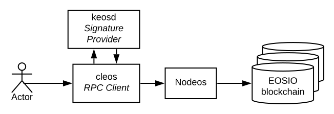

# eos 相关网站

- 官方 —— <https://developers.eos.io/>
- github —— <https://github.com/EOSIO/eos>
- eos中文社区 —— <https://eosfans.io/>
- 某个区块浏览器 —— <https://eospark.com/>

## eos架构图

## 操作

- [安装和运行单节点](eosio.start.md)
- [钱包命令](eosio.wallet.md)
- [创建账户](eosio.account.md)
- [合约开发工具包 —— eosio.cdt](eosio.cdt.md)
- [系统智能合约部署及转账](eosio.contract.md)
- [hello智能合约](eosio.hello.md)

### 扩展操作

- [eos 9大系统账户名称及作用](eosio.sysaccount.md)
- [eos 同步数据及支持mongodb存储节点搭建](eosio.sync.md)
- [eos多节点环境配置](eosio.multinode.md)
