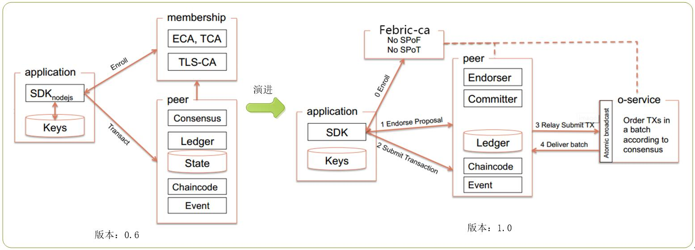
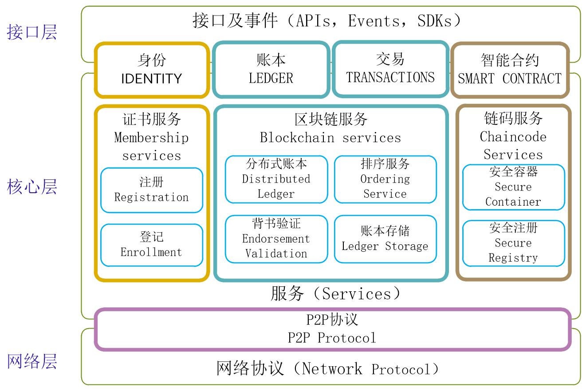

# 架构

## 1. 架构演进

Fabric架构经历了0.6版本到1.0版本的演进，架构上进行了重大改进，从0.6版本的结构简单演进到可扩展、多通道的设计，在架构上有了质的飞跃；从1.0版本以后，架构未做重大调整，到目前为止，最新发布为1.2版本。

Fabric 0.6版本架构主要是应用、成员管理和Peer的三角形关系，业务逻辑全部集中在Peer节点上，结构过于简单，只能用于一些商业场景的验证。

Fabric 1.0版本在0.6版本的基础上做了重大改进和重构，把承载过多业务的Peer节点进行拆分，将区块链的数据维护和共识服务器进行分离，共识服务从Peer节点中完全分离出来，独立为Orderer节点专门提供共识服务；membership从架构中分离出来形成Fabric-ca单独组件；在架构中加入了多通道（channel）结构，实现更为灵活的业务适应性，支持更强的配置功能和策略管理功能，进一步增强系统的灵活性和适应性。

图：架构演进

## 2. 总体架构

总体架构核心部分由成员管理（Membership services）、共识服务（Consensus services）和智能合约（Chain-code Services）三部分, 加上安全和加密服务（Security and Crypto Services）贯穿于其他各个组件，应用端通过接口（APIs、Events、SDKs）调用身份（IDENTITY）、账本（LEDGER）、交易（TRANSACTIONS）、智能合约等信息,架构图如下：

图：整体架构

* 成员管理（Membership services）

提供成员服务功能，包括注册、登记、申请证书等功能；考虑到商业应用对安全、隐私、监管、审计和性能的要求，节点、成员只有获得证书才能加入到区块链网络中，在1.0版本以后单独由可插拔的Fabric CA组件来处理。

* 共识服务（Consensus services）

负责分布式账本的计算和存储（Distrbuted Ledger）、节点间的共识服务（Ordering Service）、背书验证管理（Endorsement Validation）以及节点间的网络传输协议（Network Protocol）功能的实现，是区块链的核心组成部分，为区块链的主体功能提供了底层支撑。

* 智能合约（Chain-code Services）

智能合约（SMART CONTRACT）称为链码（chaincode）, 是基于标准的一段代码，实现具体业务逻辑。链码和底层账本是解偶的，链码的更新不影响到原有的数据。链码目前可以使用GO、Java、Node.js语言来编写，通过Docker容器来运行chaincode，安装和实例化后通过gRPC与同一通道内的Peer节点进行连接。

* 安全和加密服务（Security and Crypto Services）

节点或成员必须被许可才能进入网络，通过证书、加密和签名等手段保证安全，通过多通道隔离功能，保证只有参与交易的节点能访问到数据，其他的节点看不到，真正实现了逻辑与数据的分离。

* 接口（APIs, Events, SDKs）

提供API方式给第三方应用调用，方便二次开发，目前已提供Node.js和Java SDK两种语言接口；可以通过SDK或CLI方式进行安装、测试链码，还可以查询交易状态和数据等功能，同时通过Events监听区块链网络中发现的事件，方便第三应用系统调用和处理。