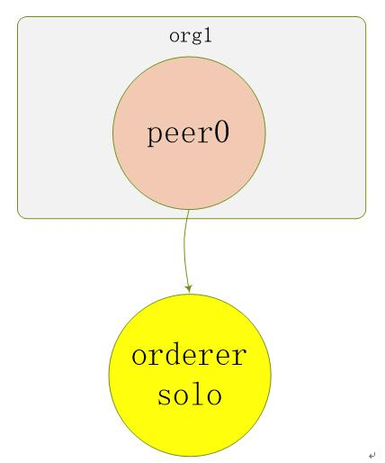
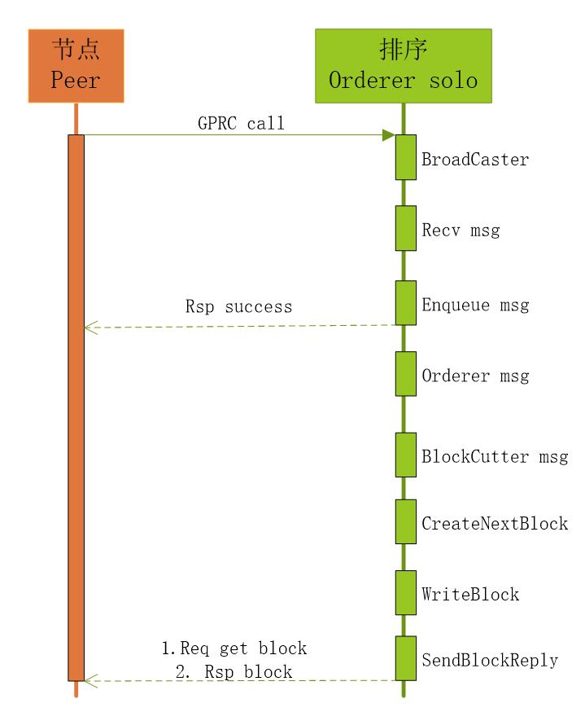

# 单机单节点模式

单机单节点通信模式即 Solo模式。即在单台服务器上运行所有服务。

本例部署由 `1orderer + 1org1 (1peer)` 组成。

结构图如下：



> Solo模式不适合用于生产环境，可以用于开发和测试环境。

Solo模式调用过程：



1. 节点（Peer）通过GPRC连接排序（Orderer solo）服务，连接成功后，发送交易信息；
2. 排序（Orderer solo）服务通过Recv接口，监听节点（Peer）发送过来的信息，收到信息后进行数据区块处理；
3. 排序（Orderer solo）服务根据收到的消息生成数据区块，并将数据区块写入账本（Ledger）中,返回处理信息；
4. 节点（Peer）通过deliver接口，获取排序（Orderer solo）服务生成的区块数据；

## 1. 准备文件

### 1.1 **请先 [搭建基础环境](../../../build.md)**

### 1.2 组织基础文件

文件或目录 | 含义
:--- | :---
[~/singlepeer/configtx.yaml](configtx.yaml) | 链的公私钥和证书信息配置文件
[~/singlepeer/crypto-config.yaml](crypto-config.yaml) | 链的创世区块和通道配置文件
[~/singlepeer/channel-artifacts](channel-artifacts) | 存放公私钥、证书、创世区块的目录
[~/singlepeer/cli.yaml](cli.yaml) | orderer+peer的容器配置文件
[~/singlepeer/chaincode/go/test.go](chaincode/go/test.go) | 测试代码

#### ! 服务器以root用户登录，将此目录拷贝到服务器的家目录中。

### 1.3 生成公私钥、证书、创世区块、通道配置区块

* **生成公私钥和证书**

```bash
cd ~/singlepeer/
cryptogen generate --config=./crypto-config.yaml
```

* **生成创世区块**

```bash
configtxgen -profile OneOrgsOrdererGenesis -outputBlock ./channel-artifacts/genesis.block
```

* **生成通道配置区块**

```bash
configtxgen -profile OneOrgsChannel -outputCreateChannelTx ./channel-artifacts/mychannel.tx -channelID mychannel
```

## 2. 启动服务

```bash
docker-compose -f cli.yaml up -d
```

## 3. 创建通道 `mychannel.block`

* **进入容器**

```bash
docker exec -it cli bash
```

* **创建channel**

```bash
peer channel create -o orderer.example.com:7050 -c mychannel -f channel-artifacts/mychannel.tx
```

## 4. Peer加入Channel

```bash
peer channel join -b mychannel.block
```

## 5. 测试智能合约

### 5.1 安装智能合约

```bash
peer chaincode install -n mycc -p github.com/hyperledger/fabric/singlepeer/chaincode/go/ -v 1.0
```

### 5.2 调用智能合约

* 初始化数据为a为100，b为200。

```bash
peer chaincode instantiate -o orderer.example.com:7050 -C mychannel -n mycc -v 1.0 -c '{"Args":["init","a","100","b","200"]}' -P "AND ('Org1MSP.peer')"
```

* 查询a，显示100

```bash
peer chaincode query -C mychannel -n mycc -c '{"Args":["query","a"]}'
```

* 进行a向b转10交易

```bash
peer chaincode invoke -C mychannel -n mycc -c '{"Args":["invoke","a","b","10"]}'
```

* 查询b，显示210

```bash
peer chaincode query -C mychannel -n mycc -c '{"Args":["query","b"]}'
```

> 如果是阿里云，部署过程中遇到的坑，请查看**[部署时阿里云存在巨大的坑](../../../aliyun.keng.md)**