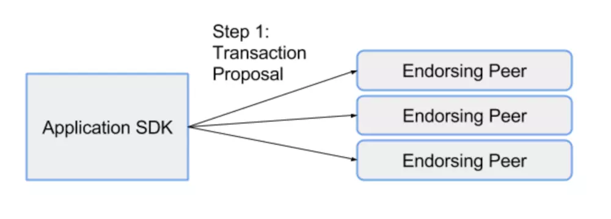
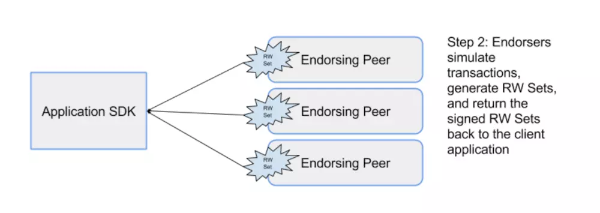
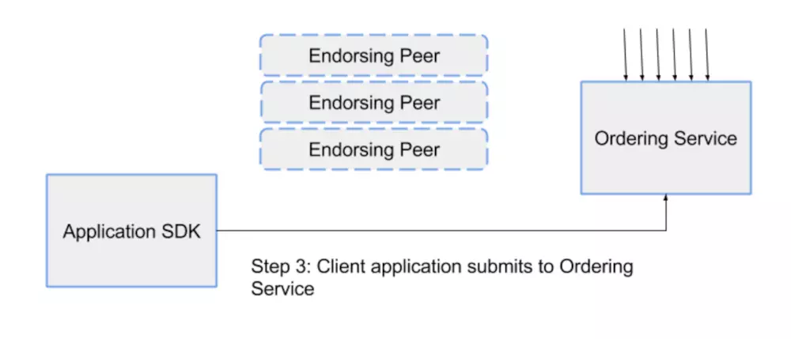
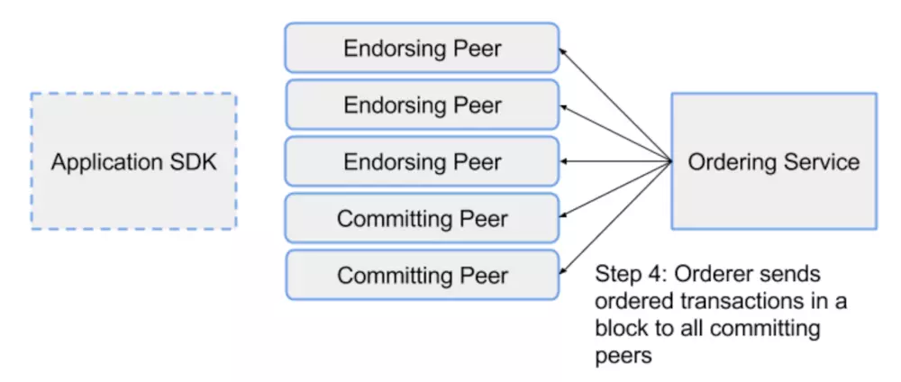
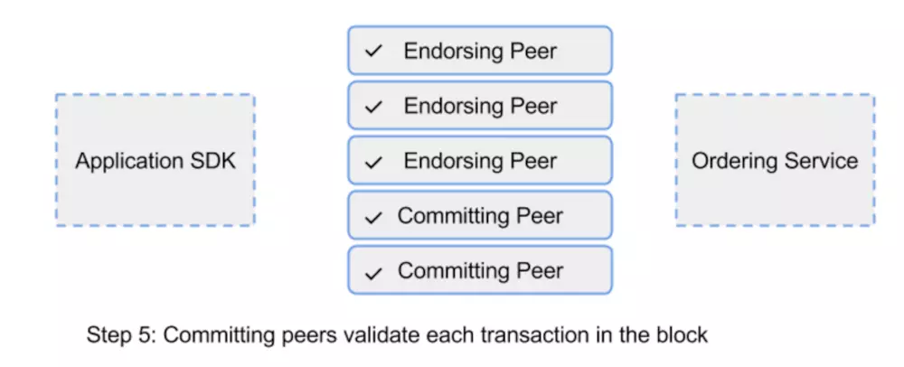
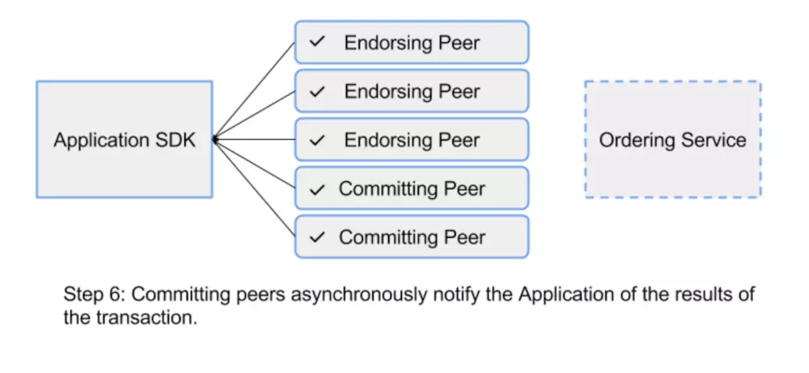

# fabric技术原理

目前超级账本下面有5个并行的项目，Fabric属于其中较为成熟的一个。

## 框架逻辑

Fabric的构架：
在Fabric的区块链网络中，有四类节点：

* MSP

  MSP(Membership Service Provider), 这类节点主管区块链网络中其他的节点的授权，准入，踢除。通过给不同节点颁发证书的方式，授予不同类型的节点相应的权限。

* Ordering Node

  中文可以称作排序节点。通常在一个网络中至少有一个或多个排序节点，这类节点负责 按照指定的算法，将交易进行排序，并返回给Committing Peer。其并不关心具体的交易细节。

* Endorsing Peer

  这类节点的主要负责接收交易请求，验证这笔交易之后，并做一些预处理之后，并将签名后的数据传回给客户端。

* Commtting Peer

  这类节点做是区块链网络中的全节点，它们需要记录完整的区块信息，并且验证每笔交易的正确性，是最终将交易打包进区块链的节点。

结合下面这种图，看看一笔交易的上链过程：

1，首先从客户端发起一笔交易提交到Endorsing Peer，进行预处理。

2，预处理通过之后，将签名数据，传回给客户端。

3，客户端发起请求，将收到的签名数据传给Ordering Node。

4，Ordering Node对交易进行排序，然后传给Committing Peer。

5，Committing Peer这里将排序好的交易进行验证，并打包，通过指定的共识算法达成一致，形成新的区块。

6，最后将交易结果返回给客户端。

6，中间过程的每一步，都伴随着权限的验证。会根据MSP颁发的证书，进行判断。
