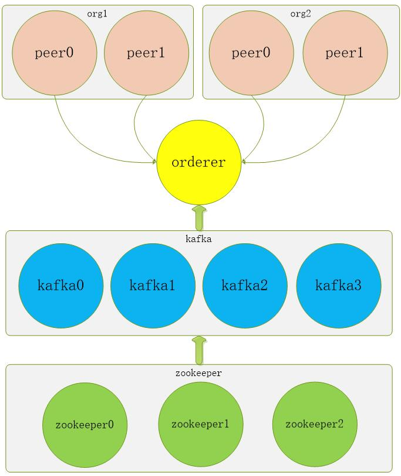
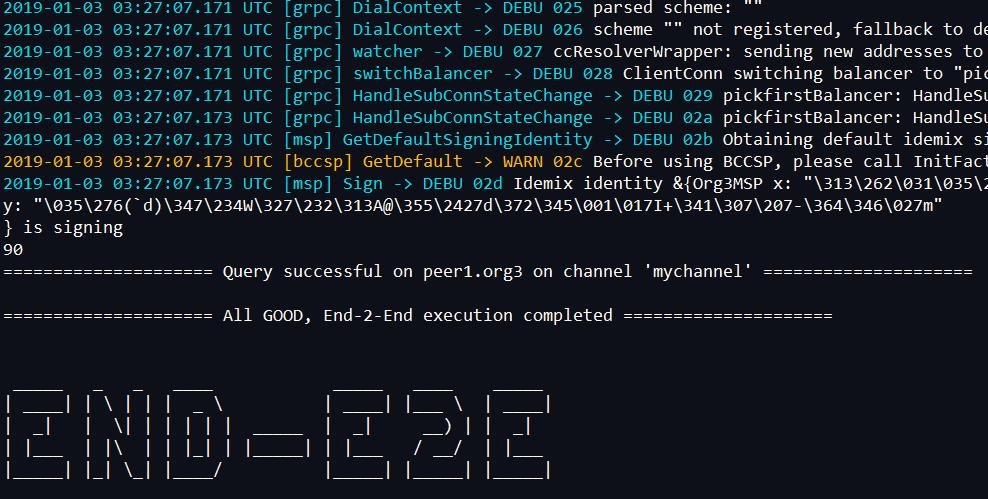
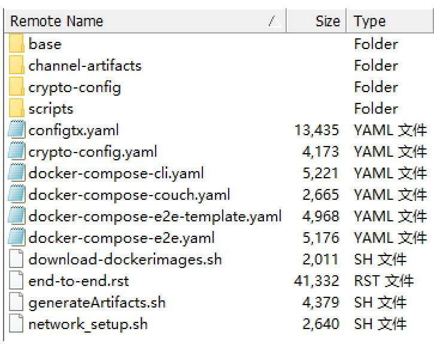
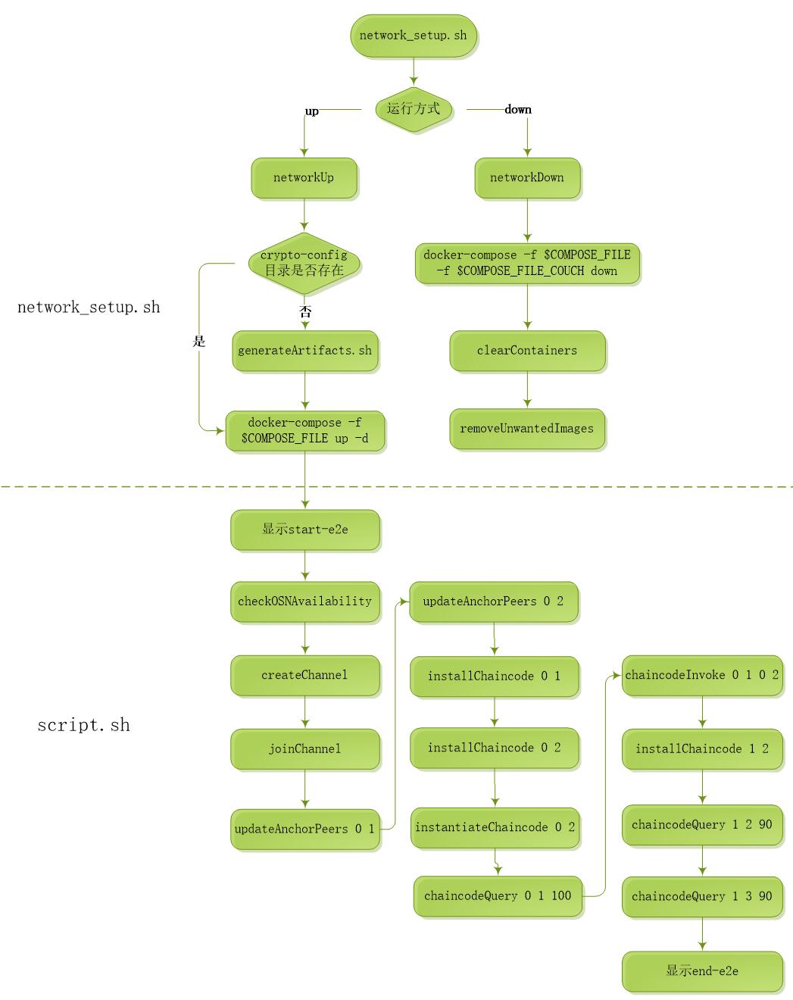

# 官方End-2-End运行

Fabric官方提供了实现点对点的Fabric网络示例。

该网络部署只需要一台服务器，但由 `1orderer + 4kafka + 3zookeeper + org1(peer0,peer1) + org2(peer0,peer1)` 组成。

结构图如下：



## 1. 部署

### 1.1 **请先 [搭建基础环境](../build.md)**

### 1.2 部署

```bash
cd $GOPATH/src/github.com/hyperledger/fabric/examples/e2e_cli/
rm channel-artifacts crypto-config -rf
mkdir channel-artifacts

./network_setup.sh up
```

如下代表成功：



## 2. e2e案例分析

### 2.1 案例架构

docker所有的配置都在cli.yaml文件里，配置顺序分别为zookeeper、kafka、orderer、peer和cli，`先运行zookeeper集群、再运行kafka集群，最后运行orderer和peer`。

实现的功能都集中写在script.sh文件里，自动运行全部功能，直到显示成功，具体功能如下：

* 验证排序（orderer）服务是否可用，函数：checkOSNAvailability
* 创建通道，函数：createChannel
* 加入通道，函数：checkOSNAvailability
* 更新组织1的锚节点，函数：updateAnchorPeers
* 更新组织2的锚节点，函数：updateAnchorPeers
* 在组织1的节点0上安装智能合约，函数：installChaincode
* 在组织2的节点0上安装智能合约，函数：installChaincode
* 在组织2的节点0上实例化智能合约，函数：instantiateChaincode
* 在组织1的节点0上查询智能合约，函数：chaincodeQuery
* 从组织1的节点0向组织2的节点0转移数据10的交易，函数：chaincodeInvoke
* 在组织2的节点1上安装智能合约，函数：installChaincode
* 在组织2的节点1上查询智能合约，函数：chaincodeQuery

### 2.2 文件结构

End-2-End案例的全部文件在fabric/examples/e2e_cli目录下，文件结构如下所示：



#### 文件说明

文件(或目录) | 说明
:--- | :---
configtx.yaml | 通道配置文件
crypto-config.yaml | 生成的公私钥和证书的配置文件
cli.yaml | Fabric网络Docker运行配置文件
base | 存放配置提炼的公有部分，有两个文件，分别为base.yaml和peer-base.yaml
channel-artifacts | 存放生成的通道和创世纪块等文件，包括有channel.tx、genesis.block、Org1MSPanchors.tx和Org2MSPanchors.tx
crypto-config | 存放生成的公私钥和证书等文件
scripts | 只有一个script.sh文件，该文件是案例的运行功能的集合，运行后会自动执行全部功能，直到完成
download-dockerimages.sh | 下载Fabric镜像执行文件
generateArtifacts.sh | 生成公私钥和证书的执行文件
network_setup.sh | 案例运行的入口文件

### 2.3 执行流程

Fabric基础环境搭建完成后，End-2-End案例的运行先从network_setup.sh文件执行，执行过程中调用generateArtifacts.sh生成公私钥和证书等文件，再根据cli.yaml的配置内容通过docker运行zookeeper、kafka、orderer、peer和cli,最后在cli中运行script.sh文件，批量执行创建通道、加入通道、安装智能合约、实例化智能合约、执行交易和执行查询等功能，以上过程在没有错误的情况下，自动执行逐行执行，直到提示END-E2E表示成功。

执行详细流程如下：



#### 流程说明

* 在 e2e_cli 目录执行 `network_setup.sh up` 表示开始执行，`network_setup.sh down`表示结束执行；
* 执行 `network_setup.sh up` 后先判断是否存在crypto-config目录，如果不存在，则调用 `generateArtifacts.sh` 文件生成公私钥和证书；否则通过命令 `docker-compose -f $COMPOSE_FILE up -d` 开始启动Fabric网络；
* Fabric网络启动成功后，自动执行 `script.sh` 文件，按照代码顺序，分别执行如下代码：
  * 显示start-e2e：显示将开始执行案例；
  * checkOSNAvailability  验证排序（orderer）服务是否可用
    ```bash
    peer channel fetch 0 0_block.pb -o orderer.example.com:7050 -c "$ORDERER_SYSCHAN_ID" --tls --cafile $ORDERER_CA >&log.txt
    ```
  * createChannel  命令创建通道
    ```bash
    peer channel create -o orderer.example.com:7050 -c $CHANNEL_NAME -f ./channel-artifacts/channel.tx --tls --cafile $ORDERER_CA >&log.txt
    ```
  * joinChannel  四个peer节点加入到通道中
    ```bash  
    peer channel join -b $CHANNEL_NAME.block >&log.txt
    ```
  * updateAnchorPeers 0 1：更新组织1的锚节点0
    ```bash
    peer channel update -o orderer.example.com:7050 -c $CHANNEL_NAME -f ./channel-artifacts/${CORE_PEER_LOCALMSPID}anchors.tx --tls --cafile $ORDERER_CA >&log.txt
    ```
  * updateAnchorPeers 0 2：更新组织2的锚节点0
    ```bash  
    peer channel update -o orderer.example.com:7050 -c $CHANNEL_NAME -f ./channel-artifacts/${CORE_PEER_LOCALMSPID}anchors.tx --tls --cafile $ORDERER_CA >&log.txt
    ```
  * installChaincode 0 1：在组织1的节点0上安装智能合约
    ```bash  
    peer chaincode install -n mycc -v 1.0 -p github.com/hyperledger/fabric/examples/chaincode/go/example02/cmd >&log.txt
    ```
  * installChaincode 0 2：在组织2的节点0上安装智能合约
    ```bash  
    peer chaincode install -n mycc -v 1.0 -p github.com/hyperledger/fabric/examples/chaincode/go/example02/cmd >&log.txt
    ```
  * instantiateChaincode 0 2：在组织2的节点0上实例化智能合约，初始化a值为100和b值为200
    ```bash  
    peer chaincode instantiate -o orderer.example.com:7050 --tls --cafile $ORDERER_CA -C $CHANNEL_NAME -n mycc -v 1.0 -c '{"Args":["init","a","100","b","200"]}' -P "AND ('Org1MSP.peer','Org2MSP.peer')" >&log.txt
    ```
  * chaincodeQuery 0 1 100：在组织1的节点0上查询a值，并判断是否为100
    ```bash  
    peer chaincode query -C $CHANNEL_NAME -n mycc -c '{"Args":["query","a"]}' >&log.txt
    ```
  * chaincodeInvoke 0 1 0 2：从a值中转称10到a值中
    ```bash
    peer chaincode invoke -o orderer.example.com:7050 --tls --cafile $ORDERER_CA -C $CHANNEL_NAME -n mycc $PEER_CONN_PARMS -c '{"Args":["invoke","a","b","10"]}' >&log.txt
    ```
  * installChaincode 1 2：在组织2的节点1上安装智能合约
    ```bash
    peer chaincode install -n mycc -v 1.0 -p github.com/hyperledger/fabric/examples/chaincode/go/example02/cmd >&log.txt
    ```
  * chaincodeQuery 1 2 90：在组织2的节点1上查询a值，并判断是否为90
    ```bash  
    peer chaincode query -C $CHANNEL_NAME -n mycc -c '{"Args":["query","a"]}' >&log.txt
    ```
  * chaincodeQuery 1 3 90：在组织3的节点1上查询a值，并判断是否为90
    ```bash  
    peer chaincode query -C $CHANNEL_NAME -n mycc -c '{"Args":["query","a"]}' >&log.txt
    ```
  * 显示end-e2e：以上代码执行没有出现错误，则显示end-e2e表示成功执行；

> 如果是阿里云，部署过程中遇到的坑，请查看**[部署时阿里云存在巨大的坑](../aliyun.keng.md)**