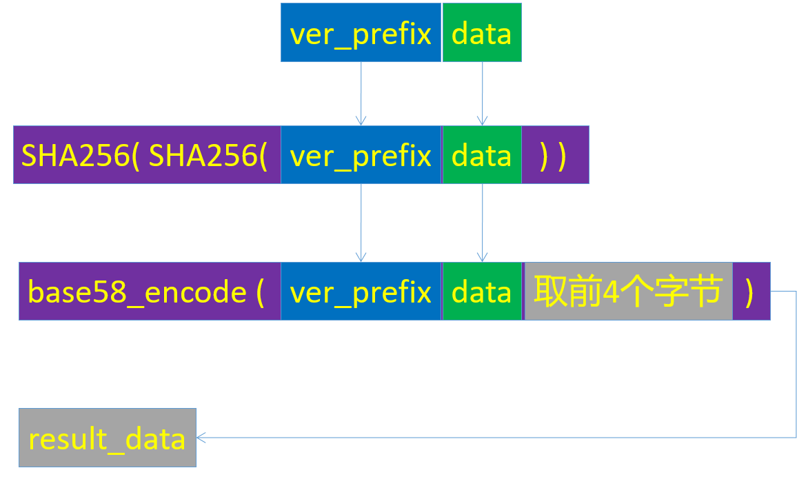
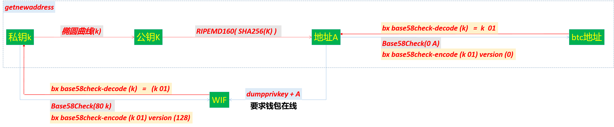
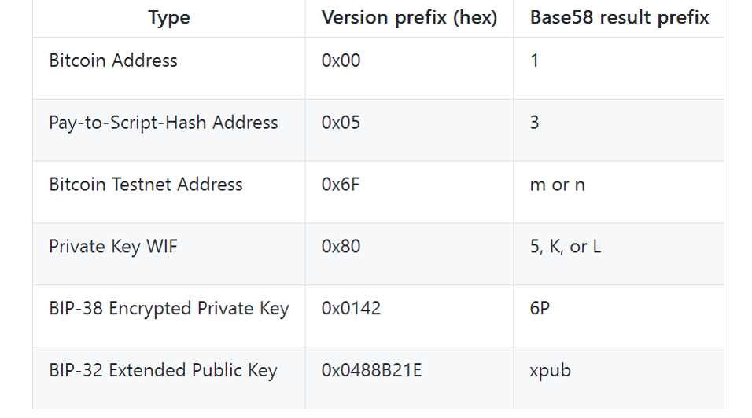
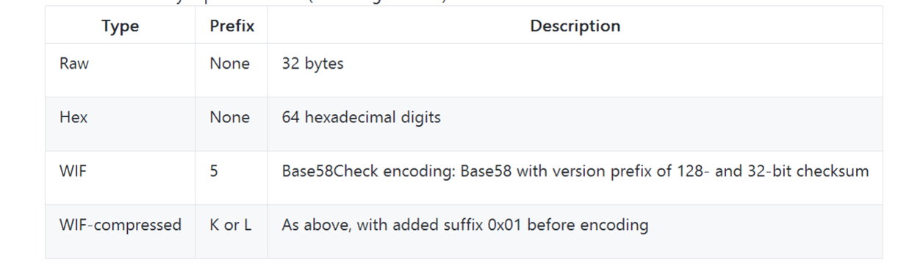
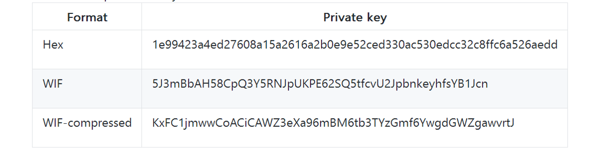
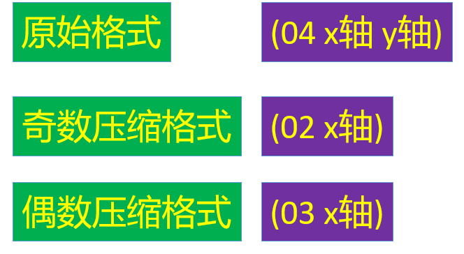
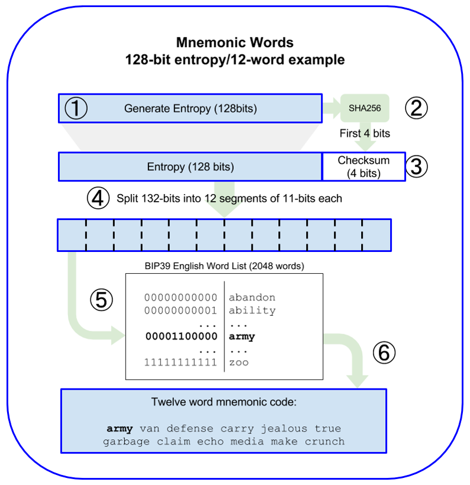
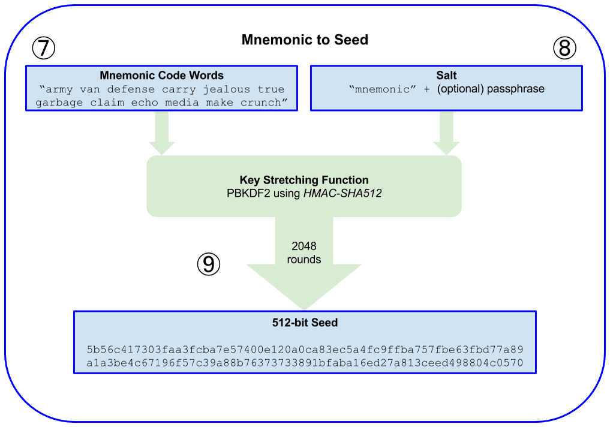

# btc 比特币

- [官方网址](https://github.com/bitcoin) —— <https://github.com/bitcoin>
- [安装](btc.install.md)
- [节点操作](btc.sync.md)
- [bitcoind help](btcd.help.md)

## 椭圆曲线逻辑

## base58check

## 公私钥加密逻辑

## 私钥版本前缀

## 私钥格式

eg.

## 公钥格式

- x和y都是256bits，即64个十六进制字符;
- 通过公钥x坐标解方程 [y2 mod p = (x3 + 7) mod p] 可以得到 y坐标。
- 可以省略y坐标，用以节省空间。
- y前缀是偶数，则可以生成偶数省略格式;
- y前缀是奇数，则可以生成奇数省略格式。
- 私钥生成公钥时，默认是压缩格式，即省略格式。

## 密钥的产生(bip-39标准)

**助记词汇** ---> **种子(密钥)**

1. 创建一个128到256位的随机序列(熵)。 
2. 提出SHA256哈希前几位(熵长/ 32),就可以创造一个随机序列的校验和。 
3. 将校验和添加到随机序列的末尾。 
4. 将序列划分为包含11位的不同部分。 
5. 将每个包含11位部分的值与一个已经预先定义2048个单词的字典做对应。 
6. 生成的有顺序的单词组就是助记码。

7. PBKDF2密钥延伸函数的第一个参数是从步骤6生成的助记符。
8. PBKDF2密钥延伸函数的第二个参数是盐。由字符串常数“助记词”与可选的用户提供的密码字符串连接组成。 
9. PBKDF2使用HMAC-SHA512算法,使用2048次哈希来延伸助记符和盐参数,产生一个512位的值作为其最终输出。

