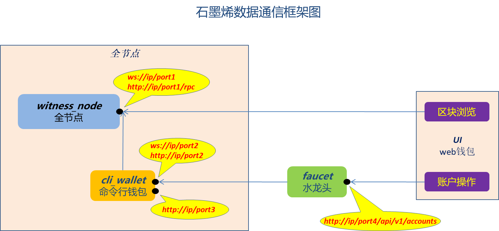

# bts 比特股

- [DPOS共识算法 -- 缺失的白皮书](dpos/readme.md)

## 分叉的处理

由于出块权被牢牢掌握在21个超级节点的手里，如果其中某个节点作恶的话是很容易被追踪到的，这个节点作恶的表现可能是在它出块的轮次人为造成了一个分叉，此时，需要21个节点中的15个节点进行确认，通过确认的这一区块被认为是主链上不可逆的一个块，任何不存在该块的都会被看做无效。这样就避免了分叉的可能。

最后一个不可逆块(LIB)是最近被2/3的块生成器所承认的块。

## 石墨烯架构

