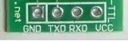
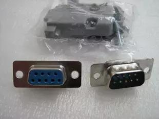
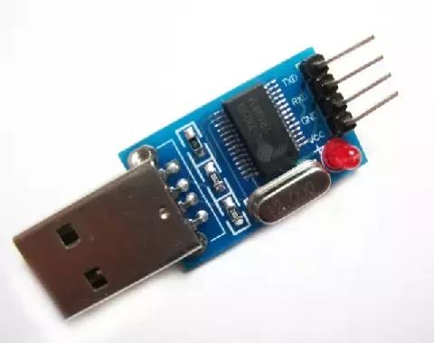
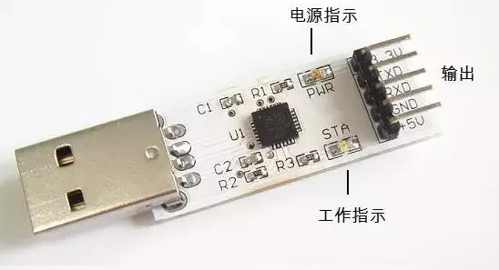
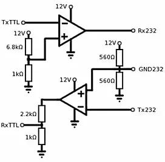
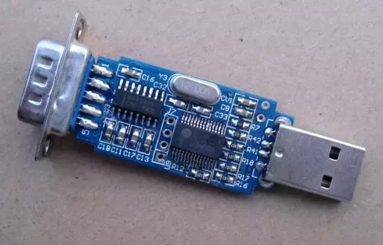
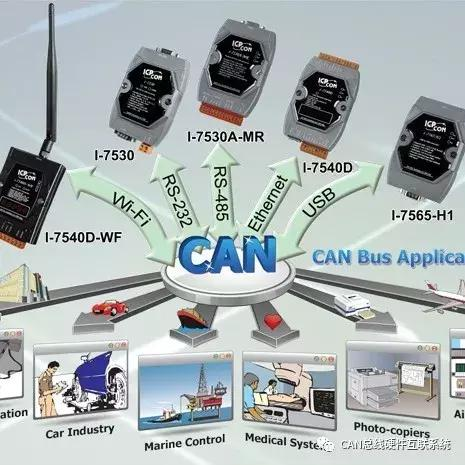

# 串口. COM口. TTL. RS-232. RS-485区别详解

1. `串口` \ `COM` 是指的物理接口形式(硬件)。而 `TTL` \ `RS-232` \ `RS-485` 是指的电平标准(电信号)。
2. 接设备的时候，一般只接GND RX TX。不会接Vcc或者+3.3v的电源线，避免与目标设备上的供电冲突。
3. PL2303\CP2102芯片是 USB 转 TTL串口 的芯片，用USB来扩展串口(TTL电平)。
4. MAX232芯片是 TTL电平与RS232电平的专用双向转换芯片，可以TTL转RS-232，也可以RS-232转TTL。
5. TTL标准是低电平为0，高电平为1(+5V电平)。RS-232标准是正电平为0，负电平为1(±15V电平)。
6. RS-485与RS-232类似，但是采用差分信号负逻辑。这里略过不讲。

## 串口\COM口

COM口即串行通讯端口，简称串口。这里区别于USB的“通用串行总线”和硬盘的“SATA”。

一般我们见到的是两种物理标准。D型9针插头，和4针杜邦头两种。

### 4针串口 -- TTL

这是常见的4针串口，在电路板上常见，经常上边还带有杜邦插针。还有时候有第五根针，3.3V电源端。

由于是预留在电路板上的，协议可以有很多种，要看具体设备。

### 9针串口 -- RS-232和RS-485

在台式电脑后边都可以看到。

记住，这种接口的协议只有两种：RS-232和RS-485。不会是TTL电平的(除非特殊应用)。

我们一般只接出RXD TXD两针，外加GND。

### PL2303HX -- USB转TTL串口

下图是个USB转TTL串口的小板，可以用USB扩展出一个串口。芯片为PL2303HX。

网上经常混淆各种串口，但是这个确实是可以给STC单片机下载程序的。

这是另一种，CP2102芯片的，也是USB转TTL串口。据说比PL2303的好，实际使用中没感觉出来。这个小板就多了+3.3V电源端，以适应不同的目标电路。

### MAX232 -- TTL转RS-232

上边介绍的都是USB转TTL串口，如果目标设备上是RS-232串口(D型9针接口)咋弄?

再接一片MAX232转换一下就行。

你也可以搭一个简单的比较器电路，来实现TTL转RS-232的功能，如下图。

### RS-232转TTL

RS-232转TTL咋弄?这就需要你动点脑子咯。当然，早有人想到了做一款成品。仔细看下图，USB经过PL2303转成了TTL串口，中间四个窟窿可以引出，再经MAX232转换为RS-232电平，9针串口引出。

