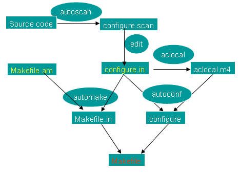

# automake编译工具链

## 1. 标准编译安装

### 1.1 为什么要编译安装

包管理系统是绝大多数发行版的必备组件，也是一个发行版区别于其它发行版的主要特征。但是有些软件，并不能通过包管理系统安装，这就需要下载源码编译安装。

一个软件可能有许多功能，但是发行版中提供的安装包，通常只具有一些常见的功能。如果提供所有功能，那么无疑会占用更多的资源，而这些功能，大多数用户不会用到；而你会用到的功能，可能安装包中刚好没有。编译安装可以灵活地定制软件，选择自己需要的，取消自己不需要的。

编译安装还可以针对特定的硬件进行优化，以获得更好的性能表现。

### 1.2 编译环境

编译环境包括多个工具，它们环环相扣，称作编译工具链。主要包括以下工具：

* binutils   连接器、汇编器和其他用于目标文件和档案的工具
* gcc        编译器，将源代码转换为机器代码
* glibc      C库，提供标准例程(C函数)

还有一些工具，能够调用工具链，实现自动化编译：

* autoconf
* automake   自动生成 Makefile 文件
* make       按照 Makefile 文件中的规则编译程序

在后面的部分将分别介绍这些工具

### 1.3 解压缩

下载源代码，通常是压缩包，如：xxx.tar.gz 或者 xxx.tar.bz2，解包：

* .tar.gz
* .tgz         `tar zxvf xxx.tgz`
* .tar.bz2     `tar jxvf xxx.tar.bz2`

进入解压后目录

```bash
# 配置软件特性，检查编译环境，生成 Makefile文件
# 最常用配置选项:指定软件的安装路径
./configure --prefix=/opt/xxx2

# 根据 Makefile 编译源代码
make

# 将编译完成的程序安装到系统中
make install

# 清除源代码目录中的编译结果
make clean
```

## 2. 自动化编译

在前面的标准编译安装中，第一步是./configure，它会根据Makefile.in生成Makefile文件，然后make根据Makefile自动编译软件。

通常在一个源码包中，已经包含了configure脚本和Makefile文件，作为课外知识，我们大致了解一下怎么生成这两个文件。

### 2.1 autoconf

autoconf用来生成configure脚本，它可以检查系统特性、编译环境、环境变量、软件参数、依赖关系等

#### autoconf需要用到 m4

1. 用autoscan描源代码目录生成configure.scan文件
2. 将configure.scan改名为configure.in
3. 用aclocal根据configure.in文件的内容，自动生成aclocal.m4文件
4. 使用autoconf，根据configure.in和aclocal.m4来产生configure文件

### 2.2 automake

automake可以从Makefile.am文件自动生成Makefile.in，它主要用来配置源代码

automake需用到perl

* 手工写Makefile.am
* 使用automake，根据configure.in和Makefile.am来产生Makefile.in

### 2.3 Makefile

使用configure脚本，配合Makefile.in可以生成Makefile文件，然后用make自动化的编译软件

这里有一张生成Makefile的流程图：


