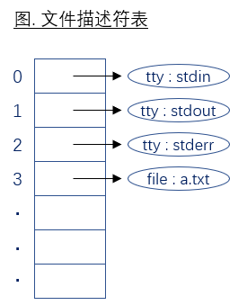

# Unix环境高级编程

- [1. 概述](#1-概述)
  - [1.1 环境搭建](#11-环境搭建)
    - [1.1.1 yum服务器配置](#111-yum服务器配置)
      - [挂载镜像](#挂载镜像)
      - [修改配置文件 `/etc/yum.repos.d/rhel6.repo`](#修改配置文件-etcyumreposdrhel6repo)
    - [1.1.2 编译器安装](#112-编译器安装)
    - [1.1.3 查看版本](#113-查看版本)
  - [1.2 unix历史简介](#12-unix历史简介)
  - [1.3 apue是什么](#13-apue是什么)
  - [1.4 标准](#14-标准)
  - [1.5 posix限制](#15-posix限制)
    - [a. 查看系统限制配置](#a-查看系统限制配置)
    - [b. 修改系统限制配置](#b-修改系统限制配置)
    - [c. 限制相关头文件](#c-限制相关头文件)
    - [d. 数据类型相关头文件](#d-数据类型相关头文件)
    - [e. 查看系统配置的函数](#e-查看系统配置的函数)
    - [f. 参见书《apue》p46, 2.5限制](#f-参见书apuep46-25限制)
  - [1.6 man 手册](#16-man-手册)
  - [1.7 错误检测](#17-错误检测)
- [2. 标准库IO函数](#2-标准库io函数)
  - [2.1. 流](#21-流)
  - [2.2. 打开文件](#22-打开文件)
    - [习题 2.2 maxopen.c](#习题-22-maxopenc)
  - [2.3. 关闭文件](#23-关闭文件)
  - [2.4. 判断流错误](#24-判断流错误)
  - [2.5. 判断流结尾](#25-判断流结尾)
  - [2.6. 读写操作](#26-读写操作)
    - [a) 单字符IO](#a-单字符io)
      - [a.1) 输入](#a1-输入)
      - [a.2) 输出](#a2-输出)
        - [习题 2.6.a mycp.c](#习题-26a-mycpc)
      - [b) 串IO](#b-串io)
      - [b.1) 输入](#b1-输入)
      - [b.2) 输出](#b2-输出)
        - [习题 2.6.b mycp.c](#习题-26b-mycpc)
      - [c) 直接IO,块操作](#c-直接io块操作)
        - [习题 2.6.c.1 mycp.c](#习题-26c1-mycpc)
        - [习题 2.6.c.2 struct  Student](#习题-26c2-struct--student)
      - [d) 格式化io](#d-格式化io)
      - [d.1) 输入](#d1-输入)
      - [d.2) 输出](#d2-输出)
  - [2.7. 缓冲](#27-缓冲)
    - [1) 无缓冲：stderr标准错误](#1-无缓冲stderr标准错误)
    - [2) 行缓冲：stdout标准输出, 其他终端设备等](#2-行缓冲stdout标准输出-其他终端设备等)
    - [3) 全缓冲：面向非标准输出](#3-全缓冲面向非标准输出)
    - [4) 缓冲刷新](#4-缓冲刷新)
      - [a) 程序结束](#a-程序结束)
      - [b) fflush](#b-fflush)
      - [c) 从无缓冲或行缓冲文件进行读取操作, 因引发了底层的系统调用,这时行缓冲也会被刷新.](#c-从无缓冲或行缓冲文件进行读取操作-因引发了底层的系统调用这时行缓冲也会被刷新)
    - [5) 设置缓冲](#5-设置缓冲)
  - [2.8. 文件内位置指针](#28-文件内位置指针)
  - [2.9. 临时文件](#29-临时文件)
- [3. 文件IO](#3-文件io)
  - [3.1 一切接文件](#31-一切接文件)
  - [3.2 头文件](#32-头文件)
  - [3.3 什么是系统调用](#33-什么是系统调用)
  - [3.4 文件io一般是不带缓冲io](#34-文件io一般是不带缓冲io)
  - [3.5 文件描述符](#35-文件描述符)
  - [3.6. 打开文件](#36-打开文件)
  - [3.7. 创建](#37-创建)
  - [3.8. 关闭文件](#38-关闭文件)
  - [3.9. 读写](#39-读写)
  - [3.10. 定位](#310-定位)
  - [3.11. 原子操作和文件共享](#311-原子操作和文件共享)
  - [3.12. 复制文件描述符](#312-复制文件描述符)
  - [3.13. sync    遗留问题：发现前两个函数对文件属性都会影响](#313-sync----遗留问题发现前两个函数对文件属性都会影响)
  - [3.14. fcntl](#314-fcntl)
  - [3.15. ioctl](#315-ioctl)
  - [3.16. mmap](#316-mmap)
- [4. 文件和目录](#4-文件和目录)
  - [4.1. stat](#41-stat)
  - [4.2. 设置用户ID和组ID](#42-设置用户id和组id)
  - [4.3.文件权限](#43文件权限)
  - [4.4. access](#44-access)
  - [4.5 umask](#45-umask)
  - [4.6.更改文件mode](#46更改文件mode)
  - [4.7. 粘住位](#47-粘住位)
  - [4.8. 更改文件的用户ID和组ID](#48-更改文件的用户id和组id)
  - [4.9. 文件长度](#49-文件长度)
  - [4.12. 设备号,设备文件](#412-设备号设备文件)
  - [4.13. 目录](#413-目录)
- [5. 系统文件和信息](#5-系统文件和信息)
  - [5.1. /etc/passwd](#51-etcpasswd)
  - [5.2. /etc/shadow    此节可做简单了解](#52-etcshadow----此节可做简单了解)
  - [5.3. /etc/group    只作了解](#53-etcgroup----只作了解)
  - [5.4. 函数](#54-函数)
  - [5.5. 登录账户记录](#55-登录账户记录)
  - [5.6. uname](#56-uname)
  - [5.7. 时间](#57-时间)
- [6. 进程环境](#6-进程环境)
  - [6.1. 进程启动和结束](#61-进程启动和结束)
  - [6.2. 编译链接](#62-编译链接)
  - [6.3. 动态空间](#63-动态空间)
  - [6.4. 环境变量表](#64-环境变量表)
  - [6.5. 跳转](#65-跳转)
  - [6.6. 限制](#66-限制)
- [7. 进程控制](#7-进程控制)
- [7.1. 进程](#71-进程)
- [7.2. fork](#72-fork)
- [11. 网络](#11-网络)
- [11.1 知识点](#111-知识点)
- [11.1.1 网络架构](#1111-网络架构)
- [11.1.2 IPv4地址分类](#1112-ipv4地址分类)
- [11.1.3 特殊ip地址](#1113-特殊ip地址)
- [11.1.4 NAT](#1114-nat)
- [11.1.5 TCP/IP报文类型](#1115-tcpip报文类型)
- [11.2 socket](#112-socket)
- [11.3 辅助函数](#113-辅助函数)
- [11.3.1 网络地址(与设备无关的标准地址)](#1131-网络地址与设备无关的标准地址)
- [11.3.2 ipv4 ip地址和字符串ip地址相互转换](#1132-ipv4-ip地址和字符串ip地址相互转换)
- [11.3.3 大小端转换函数](#1133-大小端转换函数)
- [11.4 setsockopt](#114-setsockopt)
- [11.5 绑定](#115-绑定)
- [11.6 UDP](#116-udp)
- [11.7. TCP](#117-tcp)
- [12. 线程](#12-线程)
- [12.1 线程基础](#121-线程基础)
- [12.2. 线程同步](#122-线程同步)
- [12.3. 线程取消](#123-线程取消)
- [if    0/////////////////////](#if----0)
- [if    0](#if----0-4)
- [13.16. sigaction](#1316-sigaction)
- [14. 高级IO](#14-高级io)
- [14.1. io多路转接 概念引出](#141-io多路转接-概念引出)
- [14.2. select](#142-select)
- [14.3. poll](#143-poll)
- [15. 原始套接字](#15-原始套接字)

## 1. 概述

### 1.1 环境搭建

#### 1.1.1 yum服务器配置

##### 挂载镜像

```bash
mount -o loop rhel-server-6.5-x86_64-dvd.iso /mnt/cdrom
```

##### 修改配置文件

```bash
vim /etc/yum.repos.d/rhel6.repo
```

```ini
[media]                             # 名称任意
name=media                          # 名称任意
baseurl=file:///mnt/cdrom/Server    # yum安装源位置
enabled=1                           # 使能
gpgcheck=0                          # 不校验
```

#### 1.1.2 编译器安装

```bash
yum install gcc.x86_64 gcc-c++.x86_64 glibc-static.x86_64
```

> 32位上将x86_64换成i386或i686

#### 1.1.3 查看版本

```bash
gcc -v

  gcc 版本 4.4.7 20120313 (Red Hat 4.4.7-4) (GCC)        # 安装成功
```

### 1.2 unix历史简介

unix分支    | 产地
:---------- | :---
svr4        | IBM
bsd,freebsd | 美国伯克利大学
mac os      | 苹果
solaris     | sun
linux       | 杂货铺,linux内核(www.kernel.org)+界面(gnome, kde)的集合
~           | redhat 红帽子: 企业版, 企业版的社区版本CentOS, fedora等
~           | debian
~           | ubuntu
~           | redflag 红旗(中国)

### 1.3 apue是什么

- APUE    Advanced Programming in the Unix Envirionment
- apue = linux操作系统原理 + linux操作系统编程接口,即系统调用

### 1.4 标准

- ISO C
  - C89,C99    C语言标准
  - ANSI    美国国家标准学会
  - 标准化了C库函数接口, 目的是提高程序在各种操作系统之间的可移植性,而不只是unix家族操作系统.
  - 此标准不仅定义了c语法和语义,还定义了标准库, 即glibc.
  - 《apue》p20展示了标准定义的头文件以及各个操作系统对其的支持
- IEEE POSIX
  - unix/linux家族函数标准
  - portable operating system interface 可移植的操作系统接口 POSIX.1
  - IEEE    电气与电子工程协会
  - 标准化了unix家族操作系统的系统调用接口, 目的是提高程序在各种unix家族操作系统之间的可移植性.
  - 此标准只是标准化了函数接口,并没有函数接口定义,定义工作又各个操作系统自己来完成.
  - 本书《apue》遵循POSIX.1的2001版本.（# 《apue》p39展示了标准定义的头文件以及各个系统对其的支持情况）
  - 现在由Austin Group<http://www.opengroup.org/austin>的开放工作组维护.
- Single Unix Specification
  - OSIX.1的一个超集, 被成为XSI (X/Open System Interface), 使用时加载宏定义 __XOPEN_UNIX.
  - 只有遵循XSI的实现才能成为UNIX系统.

### 1.5 posix限制

1. 查看系统限制配置

    ```bash
    ulimit -a

    core file size          (blocks, -c) 0
    data seg size           (kbytes, -d) unlimited
    scheduling priority             (-e) 0
    file size               (blocks, -f) unlimited
    pending signals                 (-i) 30686
    max locked memory       (kbytes, -l) 64
    max memory size         (kbytes, -m) unlimited
    open files                      (-n) 1024
    pipe size            (512 bytes, -p) 8
    POSIX message queues     (bytes, -q) 819200
    real-time priority              (-r) 0
    stack size              (kbytes, -s) 10240
    cpu time               (seconds, -t) unlimited
    max user processes              (-u) 30686
    virtual memory          (kbytes, -v) unlimited
    file locks                      (-x) unlimited
    ```

2. 修改系统限制配置

    ```bash
    ulimit -n <num>    #修改进程中打开文件的最大个数
    ```

3. 跟限制相关头文件

    ```cpp
    #include <linux/limits.h>
    #include <linux/limits.h>
    ```

4. 数据类型相关头文件

    ```cpp
    #include <sys/types.h>
    #include <bits/types.h>
    ```

5. 查看系统配置的函数

    ```cpp
    //获取运行时配置信息
    long sysconf(int name);
        参数name常以_SC_开通。
        _SC_CLK_TCK 每秒时钟滴答数
        _SC_OPEN_MAX    每个进程的最大打开文件数

    long fpathconf(int fd, int name);

    //为文件获取配置信息,参数name常以_PC_开头
    long pathconf(char *path, int name);
    ```

6. 参见书《apue》p46, 2.5限制

### 1.6 man 手册

- `man n xxx`

num | en | chs
:--- | :--- | :---
1 | Standard commands | 标准命令
2 | System calls | 系统调用
3 | Library functions | 库函数
4 | Special devices | 设备说明
5 | File formats | 文件格式
6 | Games and toys | 游戏和娱乐
7 | Miscellaneous | 杂项
8 | Administrative Commands | 管理员命令
9 |  | 其他（Linux特定的）, 用来存放内核例行程序的文档.

- `man xxx`
- `man string.h`
/usr/share/man/**

### 1.7 错误检测

- man查看错误号  
    `man errno`

    ```cpp
    int errno                   //错误号,全局变量. 头文件errno.h
    const char *sys_errlist[]   //错误提示字符串数组,下标对应错误号. 头文件errno.h
    char* strerror(int errnum)  //返回相应的错误号对应的字符串. 头文件string.h
    void perror(const char *s)  //同时打印错误号errno所对应的字符串. 头文件stdio.h
    ```

## 2. 标准库IO函数

### 2.1 流

- FILE

    ```cpp
    #include <stdio.h>
    typedef struct _IO_FILE FILE ;

    #include <libio.h>
    struct _IO_FILE {
        ...
        int _fileno ;    // 文件描述符
        ...
    }
    ```

- stdin, stdout, stderr

    ```cpp
    #include <stdio.h>
    extern struct _IO_FILE *stdin;      // Standard input stream.
    extern struct _IO_FILE *stdout;     // Standard output stream.
    extern struct _IO_FILE *stderr;     // Standard error output stream.
    ```

> 这三个流在进程中默认是已经打开的.

### 2.2 打开文件

```cpp
//以某种方式打开文件
FILE* fopen(const char *path, const char *mode);
    // path    要打开的文件, 绝对路径,相对路径皆可.  
    // mode    打开方式
    //     r   只读,指针定位到文件头  
    //     r+  读写,指针定位到文件头  
    //     w   只写,创建,指针定位到文件头,文件大小立即变为0  
    //     w+  读写,创建,指针定位到文件头,文件大小立即变为0  
    //     a   追加,只写,指针定位到文件尾  
    //     a+  追加,读写,指针定位到文件尾  

// 将指定的文件打开为预定义的流：stdin,stdout,stderr ;
FILE* freopen(const char *path, const char *mode, FILE *stream);
    // eg: newfp = freopen( "test.txt", "w", stdout ) ;    //向newfp中写入数据,即向stdout中写入数据

//将文件描述符fd转换成文件流.
FILE *fdopen(int fd, const char *mode);
```

### 2.3 关闭文件

FILE*指针本身的存放位置 : 因为存在成对函数fclose, 可以断定此指针是在**堆**上创建的.

```cpp
int fclose(FILE *fp);   //冲刷缓冲区,同时,关闭文件流.  stdio.h
```

### 2.4. 判断流错误

int ferror(FILE *stream);    判断是否文件流产生错误  stdio.h
void clearerr(FILE *stream); 清除某个文件流上的错误  stdio.h

### 2.5. 判断流结尾

```cpp
#include <stdio.h>
#ifndef EOF
# define EOF (-1)
#endif
```

int feof(FILE *stream);

    判断是否文件尾,配合ferror一起使用.  

    eg.

        ```cpp
        if ( feof(fp) )    ... ;
        if ( feof(fp) && !ferror(fp) )    ... ;
        ```

### 2.6. 读写操作

#### a) 单字符IO

##### a.1) 输入

在文件流获取一个字符

int fgetc(FILE *stream);
int getc(FILE *stream);  宏定义实现,用法与fgetc相同
int getchar(void); = **getc(stdin);
int ungetc(int c, FILE *stream);    回写字符到某流中.

    `返回值`  成功返回读到的字节,出错或者读到文件末尾时返回EOF

eg.

    ```cpp
    ungetc( 97, stdin ) ;
    向标准输入写入字符'a'

    cout << (char)getchar() << endl;
    不等待输入,直接显示'a'
    ```


    eg.

    ```cpp
    if ( c == EOF )    break ;    //可以这样判断结尾
    ```

##### a.2) 输出

向文件流中写入一个字符

int fputc(int c, FILE *stream);
*int putc(int c, FILE *stream);* 宏定义实现,用法与fputc相同
int putchar(int c); = **putc(c, stdout) ;

    `返回值`    成功返回写入的字节,出错返回EOF.

##### 习题 2.6.a mycp.c

./mycp src.txt dest.txt  
标准C,单字符方式文件拷贝.

#### b) 串IO

##### b.1) 输入

从文件流中读取一串数据,数据末尾自动补齐\0

char *fgets(char *s, int size, FILE *stream);  
size-1为最大读取个数,数据末尾自动补齐\0.

char *gets(char *s); ~= **fgets( s, BUFSIZ, stdin ) ;

    ```cpp
    stdio.h:128:    #define    BUFSIZ       _IO_BUFSIZ  
    libio.h:46:     #define    _IO_BUFSIZ   _G_BUFSIZ  
    _G_config.h:85: #define    _G_BUFSIZ    8192  
    ```

    gets函数bug : 在终端输入超过str大小的字符个数,不做溢出检测.  
    eg.

        ```cpp++
        char    str[5] = { 0x00 } ;
        cout << gets( buf ) << endl ;
        ```

        ```bash
        ./gets
        aaaaaaaaa    # 超出数组大小,但依旧可以输入
        aaaaaaaaa    # 且都打印出来
        ```

    `返回值`  成功返回s指针指向;出错或者读到文件末尾EOF,返回NULL.

##### b.2) 输出

向文件流中写入一串数据

int fputs(const char *s, FILE *stream);

    不输出\n

int puts(const char *s);

    向标准输出写一样,输出最后的\n

    ```cpp
    fputs( "aaa", stdout ) ;    // aaa 没有回车换行
    puts( "aaa" ) ;            // aaa 有回车换行
    aaaaaa回车
    ```

    `返回值`  成功返回一个非负整数,文件尾部或出错返回EOF

##### 习题 2.6.b mycp.c

./mycp src.txt dest.txt

标准C,行读写方式文件拷贝.

#### c) 直接IO,块操作

size_t fread(void \*ptr, size_t size, size_t nmemb, FILE *stream);

    从文件流stream中读取nmemb*size个字节数据保存ptr中.

    **成功返回nmemb,即读取文件的正确次数, 而非nmemb*size个字节数;  
    出错或文件末尾,返回0~nmemb的数值;  
    0代表到达文件结尾.

    文件 | 函数 | desc | return | return_desc
    :--- | :--- | :--- | :--- | :---
    超过10个字节文件 | fread( buf, 10, 1, fp ) | 循环1次 | 返回值1 | 读文件的次数
    少于10个字节文件(比如3个字节) | fread( buf, 1, 10, fp ) | 循环10次 | 返回值3 | 读文件的次数

size_t fwrite(const void \*ptr, size_t size, size_t nmemb, FILE *stream);

    向文件流stream中写入从ptr开始的nmemb*size个字节的数据.

    **成功返回nmemb,即写入文件的正确次数, 而非nmemb*size个字节数;  
    出错或文件末尾,返回0~nmemb的数值;  
    0代表到达文件结尾.

##### 习题 2.6.c.1 mycp.c

./mycp src.txt dest.txt

标准C,块读写方式文件拷贝.

##### 习题 2.6.c.2 struct  Student

    int     id ;
    char    name[20] ;

write_student.c  
write_student student.txt     任意写入一个学生对象  
read_student.c  
read_student student.txt      读出此学生对象,打印  

标准C,块读写方式实现.

#### d) 格式化io

##### d.1) 输入

```cpp
int scanf(const char *format, ...);                    输入来自标准输入
int fscanf(FILE *stream, const char *format, ...);    输入来自文件
int sscanf(const char *str, const char *format, ...); 输入来自字符串
sscanf( "12 abc", "%d%s", i, s ) ;
```

##### d.2) 输出

```cpp
int printf(const char *format, ...);                   格式化到标准输出
int fprintf(FILE *stream, const char *format, ...);   格式化到文件
int sprintf(char *str, const char *format, ...);      格式化到字符串buffer
sprintf( str, "%d,%s", i, s ) ;
puts(str) ;
int snprintf(char *str, size_t size, const char *format, ...);    格式化到字符串buffer
```

### 2.7. 缓冲

缓冲有三种方式：无缓冲、行缓冲、全缓冲.

#### 1) 无缓冲：stderr标准错误

```cpp
fprintf( stderr, "aaa" ) ;
sleep(3) ;    结果立即输出,不等待3秒
```

#### 2) 行缓冲：stdout标准输出, 其他终端设备等

```cpp
printf( "aaa\n" ) ;     sleep(3) ;              结果立即输出,不等待3秒
fwrite( "aaa", 1, 3, stdout ) ; sleep(3) ;      3秒后才有输出
fwrite( "aaa\n", 1, 3, stdout ) ;   sleep(3) ;  3秒后才有输出
fwrite( "aaa\n", 1, 4, stdout ) ;   sleep(3) ;  结果立即输出,不等待3秒
write(1, "aaa", 3 ) ;   sleep(3) ;              结果立即输出,不等待3秒,系统调用函数write是不带缓冲的.
```

#### 3) 全缓冲：面向非标准输出

```cpp
fwrite( "aaa\n", 1, 4, somefile ) ;     sleep(3) ;  带'\n'会也不会立即输出;
write( somefd, "aaa\n", 3 ) ;   sleep(3) ;          结果会立即输出
```

#### 4) 缓冲刷新

##### a) 程序结束

exit(3)函数, return语句,引发缓冲刷新

_exit(2)、_Exit(2)函数不会引发缓冲刷新

##### b) fflush

**int fflush(FILE *stream);

    `返回值`    成功返回0,出错返回EOF并设置errno

**fflush(NULL)**    对所有打开文件的I/O缓冲区做刷新操作.

##### c) 从无缓冲或行缓冲文件进行读取操作, 因引发了底层的系统调用,这时行缓冲也会被刷新.

```cpp
printf("Please input a line: ");
fgets(buf, 20, stdin);
```

#### 5) 设置缓冲

int setvbuf(FILE *stream, char *buf, int mode, size_t size);

    `mode` | 设置的缓冲方式
    :--- | :---
    _IONBF | unbuffered
    _IOLBF | line buffered
    _IOFBF | fully buffered

- 全缓冲,长度BUFSIZ

**void setbuf(FILE *stream, char *buf); = **setvbuf( stream, buf, _IOFBF, BUFSIZ );

```cpp
stdio.h:128:    #define    BUFSIZ        _IO_BUFSIZ
libio.h:46:     #define    _IO_BUFSIZ    _G_BUFSIZ
_G_config.h:85: #define    _G_BUFSIZ    8192
```

- 全缓冲,长度size

**void setbuffer(FILE *stream, char *buf, size_t size); = **setvbuf( stream, buf, _IOFBF, size );

- 行缓冲

**void setlinebuf(FILE *stream); = **setvbuf(stream, (char *) NULL, _IOLBF, 0);

### 2.8. 文件内位置指针

int fseek(FILE *stream, long offset, int whence);

    定位文件位置指针位置

    `offset`  定位的长度,可以为负数  
    `whence`

    `value` | location
    :--- | :---
    SEEK_SET | 文件头
    SEEK_CUR | 当前位置
    SEEK_END | 文件尾

    `返回值`  定位到比文件头小的位置,函数错误,但可以定位到比文件尾大的位置.

long ftell(FILE *stream);                    获取文件位置指针距文件头偏移
void rewind(FILE *stream); = **fseek(steam,0,SEEK_SET) ;   定位到文件头
int fgetpos(FILE *stream, fpos_t \*pos);      获取当前位置指针
int fsetpos(FILE *stream, fpos_t \*pos);      定位文件指针

### 2.9. 临时文件

func | desc
:--- | :---
**char *tmpnam(char *s); | 在/tmp目录下创建唯一的临时文件,若s不为空,返回值为s的拷贝
**int mkstemp(char *template); | 创建临时文件同时打开,返回文件描述符
**FILE *tmpfile(void); | 创建临时文件同时打开,返回文件指针

eg.

```cpp
char    s[10] = { 0x00 } ;
printf( "%s\n", tmpnam( NULL ) ) ;  // 临时文件名
printf( "%s\n", tmpnam( s ) ) ;     // 临时文件名
printf( "%s\n", tmpfile() ) ;       // FILE指针
```

## 3. 文件IO

### 3.1 一切接文件

普通文件,有名无名管道文件,设备文件,符号链接,套接口等

### 3.2 头文件

文件io的头文件是unistd.h,遵循posix标准

标准c io的头文件是stdio.h,遵循iso c标准

标准c的底层调用的是系统调用的文件io来实现的

### 3.3 什么是系统调用

### 3.4 文件io一般是不带缓冲io

### 3.5 文件描述符

FILE fd : /usr/include/libio.h :line 273

```cpp
typedef    struct _IO_FILE FILE ;
struct _IO_FILE {
    ... ...
    int _fileno;    // FILE结构体中包含文件描述符.
    ... ...
}
```

int fileno(FILE *stream);  
获取打开的文件流对应的文件描述符

```cpp
#define STDIN_FILENO 0      标准输入    stdin
#define STDOUT_FILENO 1     标准输出    stdout
#define STDERR_FILENO 2     标准错误    stderr
```

0～OPEN_MAX        // 1024



### 3.6. 打开文件

int open(const char *pathname, int flags);  
**int open(const char *pathname, int flags, mode_t mode);

    `flags`    O_RDONLY,O_WRONLY,O_RDWR此三者必指定其一,不可同时出现. 

    flags | desc
    :--- | :----
    O_RDONLY | 只读打开
    O_WRONLY | 只写打开
    O_RDWR | 可读可写打开
    O_APPEND | 表示追加.始终在文件结尾添加内容,而不覆盖原来的内容.
    O_CREAT | 创建文件.要求mode参数同时存在,表示该文件的访问权限.
    O_EXCL | 用来判断文件是否存在. 如果同时指定了O_CREAT,并且文件已存在,则出错返回.
    O_TRUNC | 将文件长度截断(Truncate)为0字节.
    O_NONBLOCK | 针对阻塞设备文件或管道,以非阻塞I/O方式打开.

    `mode` [请参照4.5 umask](#4.5-umask)

        umask : 0666&~022=0644    创建文件后的权限

    `返回值`    文件描述符, 即程序中文件的标识

### 3.7. 创建

int creat(const char *pathname, mode_t mode);
    =open(path, O_WRONLY|O_CREAT|O_TRUNC, mode) ;    // 没有O_EXCL选项
    =fopen( path, "w" ) ;
    注    creat函数并不判断文件是否存在,直接创建.

### 3.8. 关闭文件

int close(int fd);

示例+训练    maxopen.c

### 3.9. 读写

ssize_t read(int fd, void \*buf, size_t count);        成功返回读取的字节数.返回0表示文件尾.
ssize_t write(int fd, const void \*buf, size_t count);    成功返回写入的字节数.

示例+训练    mycat.c 要求每1秒显示10个字节

### 3.10. 定位

off_t lseek(int fd, off_t offset, int whence);
    文件位置指针定位, 阻塞设备文件或管道一般不可用.
off_t    curpos = lseek( fd, 0, SEEK_CUR ) ;
        返回值    返回文件指针当前位置.（注:fseek不返回文件位置.）

```cpp++ lseek
int    main( void )
{
if ( lseek( STDIN_FILENO, 0, SEEK_CUR) == -1 )    // 要检测返回值是否是-1,而不是判断小于0
    cout << "cannot seek ." << endl ;
else    cout << "seek ok ." << endl ;
return    0 ;
}
/*
./a.out < /etc/motd
seek ok .
cat < /etc/motd | a.out
cannot seek .
./a.out < /val/spool/cron/FIFO
cannot seek .
*/
```

### 3.11. 原子操作和文件共享

a) 非原子操作问题一
lseek( fd, 0, SEEK_END ) ;
sleep(10) ;
write( fd, "xxxx\n", 5 ) ;
// 可以看到在sleep(10)的过程中,若其他程序追加写此文件,sleep后内容会被覆盖.

解决方案1：使用O_APPEND选项

    O_APPEND确保无论何时何种情况,哪怕同时有多个程序在对此文件进行写操作.文件位置指针始终被定位到文件尾,
int    fd = open( "test.txt", O_RDWR | O_APPEND ) ;    // 读也是必须的
sleep(5) ;
write( fd, "xxxx\n", 5 ) ;

    注    O_APPEND只对写操作起作用,使lseek失效,文件位置指针始终被定位在文件尾.
        O_APPEND对读操作不起作用,文件位置指针可以任意lseek.

```cpp++ O_APPEND对写操作和读操作的影响
int    main(int ac, char \- av[])
{
int    fd = open(av[1], O_RDWR | O_APPEND ) ;

// 针对写操作
lseek( fd, 0, SEEK_SET ) ;    // 定位到文件头
write( fd, "12345678", 8 ) ;    // 但是写后发现仍然被写到文件末尾
cout << "current position = " << lseek(fd, 0, SEEK_CUR) << endl ;    // 可以看到依旧到达文件尾

// 针对读操作
lseek( fd, 0, SEEK_SET ) ;    // 定位到文件尾
char    buf[1024] = { 0x00 } ;
read(fd, buf, 10 ) ;        // 从开始处读入数据
cout << "read buf = " << buf << endl ;

close(fd);
return    0 ;
}
```

解决方案2：pread和pwrite

    ssize_t pread(int fd, void \*buf, size_t count, off_t offset);
        ~= lseek+read , 不同点：原子操作,不可被中断,不更新文件指针

    ssize_t pwrite(int fd, const void \*buf, size_t count, off_t offset);
        ~= lseek+write, 不同点：原子操作,不可被中断,不更新文件指针

    示例学生自测.

b) 非原子操作问题
if( (fd = open( pathname, O_WRONLY) ) < 0 )
if ( (fd = creat( pathname, mode ) ) < 0 )
// 因为creat函数不对文件是否存在进行判断就立即创建文件.如果在open和creat之间,有另外一个进程创建了该文件,就会引起问题.

解决方案 : 丢弃creat,采用open,参数选项加上 O_CREAT | O_EXCL
    fd = open( pathname, O_WRONLY | O_CREAT | O_EXCL, mode ) ;

### 3.12. 复制文件描述符

将当前的文件描述符进行赋值,产生出新的文件描述符,新旧描述符同时指代同一个文件.

>    重定向        eg. :     1>/dev/null    标准输出重定向/dev/null无底洞
>>    重定向且追加    eg. :     2>>/dev/null    标准错误重定向追加到/dev/null无底洞

int dup( int oldfd ) ;         == fcntl( oldfd, F_DUPFD, 0 ) ;
    返回值    返回复制后的新的文件描述符.

newfd = dup( oldfd ) ;        复制oldfd到newfd,newfd为新创建的.
int      fd = dup(1) ;        // 复制标准输出到一个新的文件描述符
write( 1, "stdin\n", 6 ) ;    // 终端正常输出
write( fd, "newfd\n", 6 ) ;    // 内容输出到标准终端上

int dup2( int oldfd, int newfd ) ;    复制oldfd到newfd,newfd为已关闭的文件描述符.原子操作.
    == close( newfd ) ; fcntl( oldfd, F_DUPFD, newfd ) ;    不原子,不建议使用.

dup( 1, 3 ) ;        // 复制描述符3为1的一个拷贝,3和1都指向1所指代的终端
write( 1, "stdin\n", 6 ) ;    // 终端正常输出
write( 3, "newfd\n", 6 ) ;    // 结果输出到标准终端上
int    fd = open(FNAME,O_WRONLY|O_CREAT|O_TRUNC,0666);
dup2( 1,fd );        // = close(fd), fcntl( 1, F_DUPFD, fd ) ;
write( fd, "aaaaaaa", 8 ) ;    // 结果输出到标准输出上

### 3.13. sync    遗留问题：发现前两个函数对文件属性都会影响

int fsync(int fd);    对文件进行sync,等待数据真实写入磁盘再返回,影响文件属性.
int fdatasync(int fd);    对文件进行sync,只影响文件数据部分,不影响文件属性.
void sync(void) ;    操作一次sync,不等待;守护进程update周期性sync操作.

### 3.14. fcntl

int fcntl(int fd, int cmd);
int fcntl(int fd, int cmd, long arg);
int fcntl(int fd, int cmd, struct flock *lock);

5种功能

a) 复制文件描述符( cmd = F_DUPFD )        不原子,不建议使用
    fcntl( oldfd, F_DUPFD, newfd ) ;    newfd使用时需要先关闭
dup2( STDOUT_FILENO, fd ) ;
= close(newfd) ;   fcntl( STDOUT_FILENO, F_DUPFD, newfd ) ;

```cpp++ fcntl dup
int    main( void )
{
int    fd = open( "tmp", O_WRONLY|O_CREAT|O_TRUNC ) ;

//dup2( STDOUT_FILENO, fd ) ;

close(fd) ;
fcntl( STDOUT_FILENO, F_DUPFD, fd ) ;

write( fd, "aaaaaaa", 8 ) ;    // 用以上两种方式,最后aaaaaa被输出到标准输出上,而不是文件中
close( fd ) ;

return    0 ;
}
```

b) 获取/设置文件描述符( cmd = F_GETFD, F_SETFD )

c) 获取/设置文件状态( cmd = F_GETFL, F_SETFL )

    1) 获取打开的文件的操作状态特性

    O_RDONLY, O_WRONLY, O_RDWR 三个特性,要用O_ACCMODE才能获取出来.
val = fcntl( fd, F_GETFL) ;
switch( val & O_ACCMODE )
{
case    O_RDONLY:    {    cout << "read only" << endl ;    break;    }
case    O_WRONLY:    {    cout << "write only" << endl ;    break;    }
case    O_RDWR:        {    cout << "read write" << endl ;    break;    }
default:    {    cout << "error" << endl ;    return    1 ;    }
}
if (val & O_APPEND)    cout << ", append" << endl ;
if (val & O_NONBLOCK)    cout << ", nonblocking" << endl ;
---------------------------------------------------------------------------------------
./a.out 0 < /dev/tty
read only
./a.out 1 > temp.foo
cat temp.foo
write only
./a.out 2 2>>temp.foo
write only, append
./a.out 5 5<>temp.foo
read write

    2) 更改文件的操作行为特性
int flags = fcntl(fd, F_GETFL);        // 获取文件操作行为状态
fcntl( fd, F_SETFL, flags | O_APPEND) ;    // 添加追加方式
fcntl( fd, F_SETFL, flags & ~O_APPEND);    // 去掉追加方式

    示例+训练：用fcntl实现解决非原子化问题1 .

d) 获取/设置异步IO所有权( cmd = F_GETOWN, F_SETOWN )
e) 获取/设置记录锁( cmd = F_GETLK, F_SETLK, F_SETLKW )

### 3.15. ioctl

int ioctl(int d, int request, ...);    杂物箱,多用于设备控制,比如串口读写的波特率,校验位读取或设置等

```cpp++ ioctl
int    main( void )
{
struct winsize size;
isatty(STDOUT_FILENO) ;
ioctl(STDOUT_FILENO, TIOCGWINSZ, &size) ;
printf("%d rows, %d columns\n", size.ws_row, size.ws_col);
return 0;
}
```

### 3.16. mmap

将文件映射入内存
void \*mmap(void \*addr, size_t length, int prot, int flags, int fd, off_t offset);
    将磁盘文件fd, 自文件位置偏移量offset开始的, length大小的部分映射到内存地址addr上.如果addr为NULL,则映射的地址通过返回值返回.如此以来,读写此内存,则相当于直接读写文件(而不再需要read/write函数).
    addr    要映射到内存的地址,它如果为NULL,会自动分配一个地址通过返回值返回.
    length    将多大长度映射入内存,取值范围(0~文件总大小).
    off    要映射的部分在文件中的偏移.(页大小的整数倍,32位系统页大小通常为4k, 0是符合要求的.)
    fd    文件描述符.
    prot    映射属性.
        PROT_EXEC    映射的内容可执行,如共享库.
        PROT_READ    可读.
        PROT_WRITE    可写.
        PROT_NONE    不可访问.
    flags    共享属性.
        MAP_SHARED    多进程可共享此映射,进程间通信的一种,可修改文件.
        MAP_PRIVATE    不共享,不可修改文件.
    返回值    如果mmap成功则返回映射首地址,如果出错则返回常数MAP_FAILED.

    注    要映射的文件必须以O_RDWR方式打开.
        length+offset 取值范围( 0 ~ 文件总大小 )
        因文件内存映射跳过了内核缓冲,因此它的运行效率极高.

int munmap(void \*addr, size_t length);        解除映射

当进程终止时,该进程的映射内存会自动解除,也可以调用munmap解除映射.

```cpp++ mmap
#define MMAP_SIZE         10

int    main( void )
{
int fd = open( "test.txt", O_RDWR) ;  // O_RDWR 才能被读写,文件大小必须超过MMAP_SIZE,否则segment default

char-    addr = mmap( NULL, MMAP_SIZE, PROT_READ | PROT_WRITE, MAP_SHARED, fd, 0);
if ( addr == NULL )    return  -1 ;

memcpy( addr, "mmap test\n", MMAP_SIZE );
write( STDOUT_FILENO, addr, MMAP_SIZE );    // 终端上输出了mmap test

munmap( addr, MMAP_SIZE );
close(fd);

exit(0);
}
```

## 4. 文件和目录

### 4.1. stat

stat 命令    stat信息来自于inode节点.

知识点：文件系统

诸多文件系统类型如ext2,ext3,ext4,fat,ntfs,iso9660等,linux通过vfs抽象后挂载到目录,使其访问方式统一.( 详情请查看书《linuxC编程一站式学习》p512,第29章文件系统,第三节VFS,图29.8. vfs )

linux上下层文件操作逻辑

a) 内容部分
    FILE- fp  ->  int fd  ->  设备节点  ->  struct file
    fopen(3)  ->  open(2) ->  设备节点  ->  struct file_operations.open

b) 属性部分
    struct stat  ->  设备节点  ->  struct inode
    stat(2)      ->  设备节点  ->  struct inode_operations.stat

    /lib/modules/$(kernel release)/build/include/linux/fs.h
    struct file
        dup, fork等系统调用导致多个文件描述符指向同一个file结构体.
        f_count 文件打开计数,close(fd)只是减少文件打开计数,直到count为0才真正关闭文件.
    struct file_operations
    struct inode
    struct inode_operation

对于文件系统fat,fat32,ntfs等,通过ls -l,可以看到其文件权限都rwxrwxrwx,这是因为他们本身没有inode和超级块的概念,都是拼凑出来的.

int stat(const char *path, struct stat *buf);    获取文件的stat信息,不能操作链接文件.
int fstat(int fd, struct stat *buf);        获取打开的文件描述符stat信息,不能操作链接文件.
int lstat(const char *path, struct stat *buf);    获取文件的stat信息,可操作链接文件.
    buf    是需要在内存上开辟的一段空间,stat家族函数会填充此空间内容.

struct stat {
    dev_t     st_dev;    // 设备号码.文件所在的实际存储设备的设备号
    ino_t     st_ino;    // i-node节点号.
    mode_t    st_mode;    // 文件类型,权限等.
    nlink_t   st_nlink;    // 链接数.
    uid_t     st_uid;    // 所有者.
    gid_t     st_gid;    // 所有组.
    dev_t     st_rdev;    // 特殊设备号码 major, minor, makedev.
                // st_rdev    主要是针对设备文件,/dev,此设备文件的设备号
    off_t     st_size;    // 大小,字节数.
    blksize_t st_blksize;    // io时的块大小,《apue》 p102.
    blkcnt_t  st_blocks;    // 内容所占块数,inode本身不占块空间.
    time_t    st_atime;    // 最后访问时间.
    time_t    st_mtime;    // 最后内容变化时间.
    time_t    st_ctime;    // 最后属性变化时间.
};

对应关系
stat a.txt
File: "a.txt"
Size: 1061        st_size
Blocks: 8        st_blocks
IO Block: 4096        st_block
普通文件        st_mode一部分
Device: 801h/2049d    st_dev
Inode: 4718907        st_ino
Links: 1        st_nlink
Access: (0644/-rw-r--r--)    st_mode一部分
Uid: (    0/    root)    st_uid
Gid: (    0/    root)    st_gid
Access: 2014-08-02 17:28:20.278017702 +0800    st_atime
Modify: 2014-08-02 17:27:50.890017954 +0800    st_mtime
Change: 2014-08-02 17:27:50.893017888 +0800    st_ctime

```cpp++ 判断文件类型
int    main( int argc, char- argv[] )
{
struct stat    buf ;

printf( "%s : ", argv[1] ) ;
if ( lstat( argv[1], &buf ) < 0 )    return    -1 ;
if ( S_ISREG(buf.st_mode) )    printf( "regular\n" ) ;
else if ( S_ISDIR(buf.st_mode) )    printf( "regular\n" ) ;
else if ( S_ISCHR(buf.st_mode) )    printf( "char device\n" ) ;
else if ( S_ISBLK(buf.st_mode) )    printf( "block device\n" ) ;
else if ( S_ISFIFO(buf.st_mode) )    printf( "fifo\n" ) ;
else if ( S_ISLNK(buf.st_mode) )    printf( "symbolic link\n" ) ;
else if ( S_ISSOCK(buf.st_mode) )    printf( "socket\n" ) ;
else    printf( "** unknown mode **\n" ) ;
return    0 ;
}
```

### 4.2. 设置用户ID和组ID

与一个进程相关联的ID有6个.
————————————————————————————————————————————————————————————————————————————————
实际用户ID        我们实际上是谁,登录者;或者说当前程序的运行者.
实际组ID
————————————————————————————————————————————————————————————————————————————————
有效用户ID        我们对文件的访问权限是怎样的.
有效组ID
附加组ID
————————————————————————————————————————————————————————————————————————————————
保存的用户ID        当我们改变有效用户ID的时候,所保存的有效用户ID的副本.
保存的组ID        这可用于有效用户ID的恢复.
————————————————————————————————————————————————————————————————————————————————

———————————————————————————————————————————————————————————————————————————————————————————————
ID        |  exec            |  exec            |  setuid（uid）|  setuid（uid）
        |  设置用户ID位关闭    |  设置用户ID位打开    |  超级用户    |  普通用户
实际用户ID     |  不变            |  不变            |  设置为uid    |  不变
有效用户ID     |  不变            |  设置为文件用户ID    |  同上        |  设置为uid
保存的设置用户ID|  从有效用户ID复制    |  从有效用户ID复制    |  同上        |  不变
————————————————————————————————————————————————————————————————————————————————————————————————
从中可以看出只有超级用户可以更改实际用户ID,保存的设置用户ID只有在调用exec函数族时才会发生改变.另外,在设置有效用户ID时,有以下两种情况：
（1）超级用户
（2）uid等于实际用户ID或者保存的设置用户ID,并且设置用户ID位已经打开,意思是在普通用户模式下,有效用户ID设置为实际用户ID或者保存的设置用户ID之一,正是这个条件使得有些程序可以在运行时具有额外权限（超出本身应有的权限）,如man,就在运行时利用这一条件可以访问man用户所拥有的文件,但是在执行过滤时又将权限切换回实际用户权限,这样达到保护系统安全的效果.

char *getlogin(void);        获取当前实际登录用户名.
uid_t    getuid( void ) ;    获取进程的实际用户id
int    setuid(uid_t uid);    设置进程的实际用户id

git_t    getgid( void ) ;    获取进程的实际组id
int    setgid(gid_t gid);    设置进程的实际组id

uid_t    geteuid( void ) ;    获取进程的有效用户id
int    seteuid(uid_t euid);    设置进程的有效用户id

git_t    getegid( void ) ;    获取进程的有效组id
int     setegid(gid_t gid);    设置进程的有效组id

int getreuid(uid_t ruid, uid_t euid);    交换实际用户id和有效用户id
int setregid(gid_t rgid, gid_t egid);    交换实际组id和有效组id

### 4.3.文件权限

ls -l
-rwxr-xr-x. 1 root root     7356 1月  23 23:30 apue
-rw-r--r--. 1 root root    33358 1月  23 23:30 apue.c

### 4.4. access

int access(const char *pathname, int mode);
    判断实际用户（当前用户）对文件访问权限.
    mode    F_OK, R_OK, W_OK, X_OK    可进行或操作

### 4.5 umask

umask        查看当前shell位掩码
umask 0022    改当前shell位掩码为0022

umask
0022
touch a.txt
ls -l
-rwxr-xr-x. 1 root root     0 1月  23 23:30 a.txt
umask    0011
touch b.txt
ls -l b.txt
-rwxrw-rw-. 1 root root     0 1月  23 23:30 b.txt

mode_t umask(mode_t mask);
    改变当前程序的位掩码.当然得具有权限才行.
    返回值：返回原来的mask值

int    old_mask = umask( 0044 ) ;
int    fd = open( "a.txt", O_RDWR, 0666 ) ;
... ...
umask( old_mask ) ;    // 恢复旧位掩码

### 4.6.更改文件mode

int chmod(const char *path, mode_t mode);
int fchmod(int fd, mode_t mode) ;
    更改文件mode,除了能够更改文件权限,还能用来更改 设置用户id,和设置组id.

opfile为读写文件内容程序.对于普通用户,opfile具有可执行权限.
若普通用户对对某文件没有读写权限,通过执行opfile读写此文件亦会出现“open: Permission denied”提示.
只有在超级用户 chmod o+s opfile 后,普通用户方可通过执行opfile读写此文件.
----------------------------------------------------------------------------------------------------------
ls -l
-rw-r-----. 1 root root   15 2月  20 14:42 a.txt
-rw-r--r-x. 1 root root 9825 2月  20 14:42 test
su rui
./test
open: Permission denied
exit

chmod +s test        # 在此处设置用户id 设置组id
ls -l
-rw-r-----. 1 root root   15 2月  20 14:42 a.txt
-rwsr-sr--. 1 root root 9825 2月  20 14:42 test
su rui
./test
aaaaaaaaaaaaaaaa
exit

代码实现
chmod( "test", ( statbuf.st_mode & ~S_IXUSR ) | S_ISUID ) ;    注意：不能跟执行位掩码同在

```cpp++ 更改文件模式,设置文件用户id,组id等
int    main( void )
{
struct stat    statbuf ;
stat( "test", &statbuf )  ;
chmod( "test", ( statbuf.st_mode & ~S_IXUSR ) | S_ISUID )  ;
return    0 ;
}
// ls -l test
// -rw-r-Sr--. 1 root root 18 1月  23 23:07 test    # S表示设置组ID位被设置
```

以passwd程序举例

ls -l passwd
-rwsr-xr-x. 1 root root 27848 Dec  5  2012 passwd

s代表了设置用户位已经打开：代表非root用户进程也有权限运行此程序.因为该进程的有效用户id和保存的设置用户id都被设置成为这个可执行程序文件的所有者(即root）.

### 4.7. 粘住位

ls -l /    tmp目录被设置为粘住位
S_ISVTX ：为提高访问效率,将文件粘住在交换区内,而不被交换算法换出.
现今虚拟存储系统及快速文件系统的使用,这种技术很少被使用.

### 4.8. 更改文件的用户ID和组ID

int chown(const char *path, uid_t owner, gid_t group);
int fchown(int fd, uid_t owner, gid_t group);
int lchown(const char *path, uid_t owner, gid_t group);        可操作链接文件
返回值：成功返回0,失败返回-1,设置errno.

注    具有权限才能执行成功.
    owner,group任一个是-1,则对应id不变.
    普通用户不可以将自己的文件给另外的用户.

### 4.9. 文件长度

对于链接文件,文件长度是文件名中的实际字节数.不包含字符串结尾null字符.
对于目录,一般为常数.这跟文件系统的格式化系数相关.如：mkfs.ext3 默认格式化块大小就是4096.
    查看块大小： tune2fs -l /dev/sda1 | grep 'Block size'
    查看当前目录所占空间：du -sh

对于普通文件
    遗留问题：空洞文件,是由文件所设置的偏移量超过文件尾,并写入了某些数据产生的.

```cpp++ 创建空洞文件
int    main( void )
{
int     fd = open( "file.hole", O_CREAT | O_RDWR ) ;
write( fd, "aaaaaaaa", 8 ) ;

lseek( fd, 16384, SEEK_SET ) ;

write( fd, "aaaaaaaa", 8 ) ;

close(fd) ;

return    0 ;
}
```

    ls -l core
    -rw-r--r--     8483248    core

    wc -c core
    8483248    core

    du -s core
    272    core        # 272*512=139264字节,说明存在很大空洞

    cat core > core.copy
    ls -l core*
    -rw-r--r--     8483248    core
    -rw-r--r--     8483248    core.copy

    du -s core*
    272     core
    16592    core.copy    # 16592*512=8495104>8483248;copy中存在若干存放指向实际数据块的各个指针

设置文件长度
int truncate(const char *path, off_t length);
int ftruncate(int fd, off_t length);

*/
```    // comments

```cpp++ trancate
int    main( void )
{
truncate( "test.txt", 3 ) ;
return    0 ;
}
/*
ls -l test.txt
-rwxrwxrwx. 1 root root 18 1月  23 23:02 test.txt    # 18个字节
./apue
ls -l test.txt
-rwxrwxrwx. 1 root root 3 1月  24 13:02 test.txt    # 3个字节
*/
```

知识点:硬链接和符号链接

在实际应用中硬链接和符号链接（即软链接）很难区分,但它们的确是有区别的：

应用区别:
    硬链接,只能应用于文件,而不能应用于目录,且不能跨文件系统（即分区）;
    符号链接,可以应用于文件,而且可以应用于目录和可跨文件系统（分区）;

底层区别：
    硬链接会使用和文件相同的inode号,只不过是inode连接数增加了,由最初的1变为了2.删除原文件不会影响硬链接,只是链接数又会从2变为1;
    软链接会使用一个新的inode,所以软链接的inode号和原文件的inode号不同,因此软链接数始终是1,软链接的inode里存放着指向文件的路径,删除文件,软链接也无法使用了;当我们再次创建这个文件时,软链接又会重新指向这个文件（inode号与之前的不同了）.

/// 创建软硬链接文件,注意链接数
echo "hello, world." > origin
ln origin hard
ln -s origin soft
ls -l
-rw-r--r--. 2 root root 14 11月 22 10:35 hard
-rw-r--r--. 2 root root 14 11月 22 10:35 origin
lrwxrwxrwx. 1 root root  6 11月 22 10:36 soft -> origin
----------------------------------------------------------------------
/// 删除原始文件,查看软硬链接文件情况
rm origin
ls -l
-rw-r--r--. 1 root root 14 11月 22 10:35 hard
lrwxrwxrwx. 1 root root  6 11月 22 10:36 soft -> origin
cat hard
hello, world.
cat soft
cat: soft: 没有那个文件或目录
----------------------------------------------------------------------
/// 恢复原始文件
echo "hello, world." > origin
cat hard
hello, world.
cat soft
hello, world.

### 4.10. 链接文件

创建硬链接
int link(const char *oldpath, const char *newpath);
    只有超级用户才可以给目录创建硬链接
    如果链接文件存在,返回出错-1,设置errno.

link( "test.txt", "newtest.txt" ) ;    // fat32, ntfs等文件系统不可

创建符号链接
int symlink(const char *oldpath, const char *newpath);
    创建指向oldpath的新符号链接文件newpath,不强制oldpath必须存在.

读取符号链接
ssize_t readlink(const char *path, char *buf, size_t bufsiz);
    != open + read + close 这是个原子操作
    读取链接符号本身的内容,即获取所引用的文件名,而不是其文件内容.

count = readlink( "newtest.txt", buf, 10 ) ;    // newtest.txt -> test.txt
cout << count << " : " << buf << endl ;        // 8 : test.txt

文件更名
int rename(const char *oldpath, const char *newpath);
    文件,目录：更名,如果newpath已存在,会自动删除newpath,再更名.

删除文件
int unlink(const char *pathname);    #include <unistd.h> 说明来自unix家族
int remove(const char- pathname) ;    #include <stdio.h> 说明来自iso c.
    remove只比unlink多了一个删除目录的功能,但不能删除非空目录.

    符号链接：直接删除
    普通文件,socket,管道,设备文件：直到打开文件的所在进程关闭释放文件才直接删除文件.
    目录文件：remove可以用来删除目录文件,=rmdir.unlink做不到.

if ( unlink( "somedir" ) < 0 )
perror( "unlink" ) ;    // 产生了删除目录错误提示
----------------------------------------------------------
if ( remove( "somedir" ) < 0 )
perror( "remove" ) ;    // 没产生错误

各个函数对符号链接的处理,书《apue》p109

### 4.11. 文件时间

书《apue》p112, 各种函数对访问、修改和更改状态时间的作用.

修改文件的访问时间和状态修改时间

struct utimbuf
{
    time_t actime;    // access time
    time_t modtime;    // modification time
};

int utime(const char *filename, const struct utimbuf *times);
    times为空,表示设置为当前时间.

*/
```    // comments

```cpp++ utime
int    main( int argc, char- argv[] )
{
// stat a.txt
system( "stat a.txt" ) ;
printf( "\n\n" ) ;
struct stat    buf = { 0x00 } ;
stat( "a.txt", &statbuf ) ;

// sleep 10后更新文件时间到当前时间
printf( "sleep 10\n\n" ) ;
sleep( 10 ) ;
printf( "touch a.txt\n\n" ) ;
system( "touch a.txt" ) ;

// 将保存的时间信息恢复到原来的时间.
struct utimbuf    timebuf = { buf.st_atime, buf.st_mtime } ;
utime( "a.txt", &timebuf ) ;
system( "stat a.txt" ) ;

return    0 ;
}
```

struct timeval
{
    long tv_sec;    // seconds
    long tv_usec;    // microseconds
};

int utimes(const char *filename, const struct timeval times[2]);
    times[0]修改文件的最后访问时间
    times[1]修改文件的状态修改时间
    同utime函数,times如NULL,时间被设置成当前时间值.

学生自行测试此函数

### 4.12. 设备号,设备文件

st_dev    文件所在的实际存储设备的设备号
st_rdev    主要是针对设备文件,/dev,此设备文件的设备号

dev_t makedev(int maj, int min);    根据主次设备号创建设备号
int major(dev_t dev);             根据设备号划分出主设备号
int minor(dev_t dev);             根据设备号划分出次设备号

```cpp++ 设备文件
int    main(int argc, char *argv[])
{
struct stat buf;

stat(argv[1], &buf) ;

printf("dev = %d/%d", major(buf.st_dev), minor(buf.st_dev));
return     0 ;
}
```

作业：stat实现

### 4.13. 目录

a) 创建目录
int mkdir(const char *pathname, mode_t mode);

b) 删除目录
int rmdir(const char *pathname);

c) 获取当前路径

char *getcwd(char *buf, size_t size);
    当buf为NULL时,函数调用malloc,分配size长度的空间,若size为0,则分配PATH_MAX大小.最终需手动free.

char *get_current_dir_name(void);    ~= getcwd(NULL,0) ;    因此也许要最后调用free进行空间释放.

char *getwd(char *buf);        buf需要手动分配至少PATH_MAX的空间,此函数不会自动malloc空间.

更改当前进程工作目录

int chdir(const char *path);
int fchdir(int fd);
    进程范围内,不影响其他进程

14. 遍历目录

a) 方法1 :

struct dirent
{
    ino_t    d_ino;            // inode号
    off_t    d_off;            // 目录文件开头到此目录进入点的位移
    unsigned short    d_reclen;    // 记录长度
    unsigned char    d_type;        // 文件类型; not supported by all file system types
    char    d_name[256];        // 文件名
};

DIR-    opendir(const char *name);    打开一个目录流
struct dirent    *readdir(DIR *dirp);    读目录流,循环遍历
long    telldir(DIR *dirp);        获取当前目录流指针便宜
void    rewinddir(DIR *dirp);        流指针返回当前目录首
void    seekdir(DIR *dirp, long offset);    用来设置参数dir目录流目前的读取位置,在调用readdir()时便从此新位置开始读取.参数offset 代表距离目录文件开头的偏移量.
int    closedir(DIR *dirp);        关闭目录流

```cpp++ readdir示例
int    main(int argc,char** argv)
{
DIR *dirptr = NULL;
struct dirent *entry;
if(argc<2)
{
    printf("the command need a dirname\n");
    return 1;
}
if(argc>2)
{
    printf("the program can only deal with one dir at once\n");
    return 1;
}
if((dirptr = opendir(argv[1])) == NULL)
{
    printf("open dir error !\n");
    return 1;
}
else
{
    while (entry = readdir(dirptr))
    {
        printf("%s\n", entry->d_name);
    }
    closedir(dirptr);
}
return 0;
}
```

```cpp++ 作业 递归遍历各级目录,打印各个文件大小.
void    fsize( char- name )
{
struct stat     s = { 0x00 } ;

stat( name, &s ) ;
printf( "%ld %s\n", s.st_size, name ) ;

if ( S_ISDIR( s.st_mode ) == 0 )    return ;

DIR-    dfd = opendir( name ) ;
if ( dfd == NULL )    return ;
struct dirent-  dp = NULL ;

while ( ( dp = readdir( dfd ) ) != NULL )
{
    if ( strcmp( dp->d_name, "." ) == 0 || strcmp( dp->d_name, ".." ) == 0 )        continue ;
    if ( strlen(name) + strlen(dp->d_name ) + 2 >= 256 )    continue ;

    char    newname[256] = { 0x00 } ;
    strcpy( newname, dp->d_name ) ;
    sprintf( newname, "%s/%s", name, dp->d_name ) ;

    fsize( newname ) ;
}

dp = NULL ;

closedir( dfd ) ;
dfd = NULL ;

return ;
}

int     main( int argc, char- argv[] )
{
if ( argc == 1 )
{
    fsize( "." ) ;
}
else
{
    while ( argc-- > 1 )
    {
        fsize( *(++argv) ) ;
    }
}

return  0 ;
}
```

```cpp++ rewinddir 示例
int    main( void )
{
DIR - dir;
struct dirent *ptr;
dir = opendir("/etc/rc.d");
while((ptr = readdir(dir))!=NULL)
{
    printf("d_name :%s\n",ptr->d_name);
}
rewinddir(dir);
printf( "====================== readdir again! ======================== \n");
while((ptr = readdir(dir))!=NULL)
{
    printf("d_name: %s\n",ptr->d_name);
}
closedir(dir);
}
```

```cpp++ seekdir示例
int    main( void )
{
DIR - dir;
struct dirent - ptr;
long offset,offset_5,i=0;
dir=opendir("/etc/rc.d");
while((ptr = readdir(dir))!=NULL)
{
    offset = telldir(dir);
    if(++i == 5 ) offset_5 =offset;
    printf("d_name :%s, offset :%ld \n",ptr->d_name,offset);
}
seekdir(dir, offset_5);
printf("Readdir again!\n");
while((ptr = readdir(dir))!=NULL)
{
    offset = telldir(dir);
    printf("d_name :%s\toffset :%ld\n",ptr->d_name, offset);
}
closedir(dir);
}
```

2) 附加：glob

typedef struct {
    size_t   gl_pathc;    /- 符合条件的目录项个数  */
    char   **gl_pathv;    /- 符合条件的目录项  */
    size_t   gl_offs;     /- Slots to reserve in gl_pathv.  */
} glob_t;

int glob(const char *pattern, int flags, int (*errfunc) (const char *epath, int eerrno), glob_t *pglob);
    将与pattern匹配的内容存储在pglob中.
    pattern    匹配内容
    pglob    存储匹配的指定模式的文件名或目录
    flags
        GLOB_MARK    在每个返回的项目中加一个斜线
        GLOB_NOSORT    默认字母排序, 按照文件在目录中出现的原始顺序返回（不排序）
        GLOB_NOCHECK    如果没有文件匹配则返回用于搜索的模式
        GLOB_NOESCAPE    反斜线不转义元字符
        GLOB_APPEND    追加结果到pattern中
        GLOB_BRACE    扩充 {a,b,c} 来匹配 'a','b' 或 'c'
        GLOB_ONLYDIR    仅返回与模式匹配的目录项
        GLOB_ERR    停止并读取错误信息（比如说不可读的目录）,默认的情况下忽略所有错误
    errfunc    用处查看错误信息用,一般置为NULL .
    返回值    正确返回0,失败返回非0值.
        GLOB_NOSPACE    再无动态分配空间可分配
        GLOB_ABORTED    运行中断,比如glob运行中拔掉U盘.
        GLOB_NOMATCH    没找到匹配项

void globfree(glob_t *pglob);    释放空间

```cpp++ glob
int    main( void )
{
int err,i;
glob_t globres;
char    PAT[1000] = { 0x00 } ;

strcpy( PAT, "./*" ) ;
if( glob(PAT, 0, NULL,&globres) != 0 )
{
    perror( "glob" ) ;
    exit(1);
}

for(i = 0 ;i < globres.gl_pathc ; i++)
    puts(globres.gl_pathv[i]);

printf( "--------------------\n" ) ;

err = glob(PAT, GLOB_APPEND, NULL,&globres);
if(err)
{
    fprintf(stderr,"Error,code = %d\n",err);
    exit(1);
}

for(i = 0 ;i < globres.gl_pathc ; i++)
    puts(globres.gl_pathv[i]);

globfree(&globres);

return 0;
}
```

```cpp++ mydu.c,查看某个目录所占的空间大小
#define PATHSIZE 1024

static int path_noloop(const char *path)
{
const char-    pos = strrchr(path,'/');
if(pos == NULL)
    exit(1);

if(strcmp(pos+1,".") == 0 || strcmp(pos+1,"..") == 0)
    return 0;
return 1;
}

static int64_t mydu(const char *path)
{
int i;
static struct stat statres;
static char nextpath[PATHSIZE];
glob_t globres;
int64_t sum=0;

/*非目录文件*/
if(lstat(path,&statres) < 0)
{
    perror("lstat()");
    exit(1);
}

if(!S_ISDIR(statres.st_mode))
    return statres.st_blocks;

/*是目录文件*/

//      /etc/*
strncpy(nextpath,path,PATHSIZE);
strncat(nextpath,"/*",PATHSIZE);
glob(nextpath,GLOB_NOSORT,NULL,&globres);

for ( i = 0 ; i < globres.gl_pathc ; i++ )
    puts( globres.gl_pathv[i] ) ;

//  /etc/.*
strncpy(nextpath,path,PATHSIZE);
strncat(nextpath,"/.*",PATHSIZE);
glob(nextpath,GLOB_NOSORT|GLOB_APPEND,NULL,&globres);

sum = statres.st_blocks;
for(i = 0 ; i < globres.gl_pathc; i++)
{
    if(path_noloop(globres.gl_pathv[i]))
        sum += mydu(globres.gl_pathv[i]);
}

return sum;
}

int    main( void )
{
printf( "%d\n", mydu("./") ) ;
return    0 ;
}

```

## 5. 系统文件和信息

### 5.1. /etc/passwd

- 密码文件 ：/etc/passwd

```bash
# 用户名:机密口令:用户id:用户组id:注释字段:初始工作目录:初始shell
root:x:0:0:root:/root:/bin/bash
nobody:x:99:99:Nobody:/:/sbin/nologin
......
```

- 真实的加密口令文件 : /etc/shadow

- 初始工作目录设置  
  - 禁止某人登录 /dev/null
  - 一切返回主失败状态 /bin/false
  - 一切返回终止状态 /bin/true

- nobody用户：类似windows的匿名账户,它们是用来完成特定任务的,比如我们访问LinuxSir.Org的网页程序,就是nobody用户;我们匿名访问ftp时,会用到用户ftp或nobody.也就是说某些服务器需要nobody,ftp等这类的用户来访问,尽量使其访问权限最小.UID(65534)和GID(65534).

```cpp++
struct passwd
{
    char   *pw_name;    // username
    char   *pw_passwd;    // user password
    uid_t   pw_uid;        // user ID
    gid_t   pw_gid;        // group ID
    char   *pw_gecos;    // real name
    char   *pw_dir;        // home directory
    char   *pw_shell;    // shell program
};

struct passwd *getpwnam(const char *name);    根据名字获取用口令信息,可由getpwent函数来实现
struct passwd *getpwuid(uid_t uid);        更具uid获取用户口令信息
```

```cpp++
int    main( int argc, char** argv )
{
    struct passwd - pw = getpwnam( argv[1] );
    if ( pw == NULL) {
        printf("%s is not exist\n", username);
        return -1;
    }
    printf( "%s:%s:%d:%d:%s:%s:%s\n",
        pw->pw_name, pw->pw_passwd, pw->pw_uid, pw->pw_gid,
        pw->pw_gecos, pw->pw_dir, pw->pw_shell );
    }
}
```

```bash
./apue root

root:x:0:0:root:/root/:/bin/bash
```

void setpwent(void);            打开/etc/passwd文件
struct passwd *getpwent(void);        循环遍历文件中所有记录
void endpwent(void);            关闭/etc/passwd文件

练习 ：循环遍历所有passwd记录
练习 ：用这三个函数可以用来实现getpwnam.

setpwent() ;
struct passwd-    ptr = NULL ;
while ( (ptr=getpwent()) != NULL )
if ( strcmp( name, ptr->pw_name ) == 0 )    break ;
endpwent() ;
return    ptr ;

### 5.2. /etc/shadow    此节可做简单了解

cat /etc/shadow
root:$6$096cvfi33dvBWCej$wWmu9WpQ0q07.3pWt ...... LOnJXlR4sc4olye/:16024:0:99999:7:::
nobody:*:15628:0:99999:7:::
    ......

```cpp++
struct spwd
{
    char *sp_namp;                  // Login name.
    char *sp_pwdp;                  // Encrypted password.
    long int sp_lstchg;             // Date of last change.
    long int sp_min;                // Minimum number of days between changes.
    long int sp_max;                // Maximum number of days between changes.
    long int sp_warn;               // Number of days to warn user to change the password.
    long int sp_inact;              // Number of days the account may be inactive.
    long int sp_expire;             // Number of days since 1970-01-01 until account expires.
    unsigned long int sp_flag;      // Reserved.
};

struct spwd *getspnam (har *__name);    根据名字获取spwd信息
struct spwd *sgetspent (char *__string);根据某string来获取spwd信息

void setspent (void);            打开/etc/shadow文件
struct spwd *getspent (void);        遍历文件记录项
void endspent (void);            关闭/etc/shadow文件
```

### 5.3. /etc/group    只作了解

cat /etc/group
root:x:0:
nobody:x:99:
    ......

```cpp++
struct group
{
    char *gr_name;          // Group name.
    char *gr_passwd;        // Password.
    __gid_t gr_gid;         // Group ID.
    char **gr_mem;          // Member list.
};

struct group  *getgrgid(gid_t);        根据组id获取组信息
struct group  *getgrnam(const char *);    根据组名称获取组信息

void          setgrent(void);        打开/etc/group文件
struct group  *getgrent(void);        遍历/etc/group文件
void           endgrent(void);        关闭/etc/group文件
```

附加组    用户想获取对某事物的权力,可加入不同的组.

int getgroups(int size, gid_t list[]);
    获取当前用户的附加组.
    附加组id填到数组list中,并且返回实际获取的附加组id个数.

int setgroups(size_t size, const gid_t *list);
    设置当前用户到某附加组id list表,size为个数.成功返回0.
    size最大位NGROUPS_MAX

int initgroups(const char *user, gid_t group);
    设定组成员,user指针为组成员.成功返回0.
    只有超级用户才能调用此函数

《apue》p156,表6-4,不同的系统使用的不同的加密口令文件区别.

### 5.4. 函数

一般每个数据文件至少有三个函数： get函数,set函数,end函数
————————————————————————————————————————————————————————————————————————————————————————————————
  说明    | 数据文件    | 头文件    | 结构        | 附加管家子查找函数
————————————————————————————————————————————————————————————————————————————————————————————————
  口令    | /etc/passwd    | pwd.h    | passwd    | getpwnam, getpwuid
  组    | /etc/group    | grp.h    | group     | getgrnam, getgrgid
  阴影    | /etc/shadow    | shadow.h    | spwd        | getspnam
  主机    | /etc/hosts    | netdb.h    | hostent    | gethostbyname, gethostbyaddr
  网络    | /etc/networks    | netdb.h    | netent    | getnetbyname, getnetbyaddr
  协议    | /etc/protocols| netdb.h    | protoent    | getprotobyname, getprotobynumber
  服务    | /etc/services    | netdb.h    | servent    | getservbyname, getservbyport
————————————————————————————————————————————————————————————————————————————————————————————————

### 5.5. 登录账户记录

w
/var/run/utmp    /var/log/wtmp
相关函数查看/usr/include/utmp.h

char *getlogin(void);        获取当前实际登录用户名.

### 5.6. uname

uname

/proc/sys/kernel/{ostype, hostname, osrelease, version, domainname}

struct utsname {
    char sysname[];    // Operating system name (e.g., "Linux")
    char nodename[];   // Name within "some implementation-defined network"
    char release[];    // OS release (e.g., "2.6.28")
    char version[];    // OS version
    char machine[];    // Hardware identifier
#ifdef _GNU_SOURCE
    char domainname[]; // NIS or YP domain name
#endif
};

int uname(struct utsname *buf);                查看系统信息
int gethostname(char *name, size_t len);        获取tcp/ip网络主机名
int sethostname(const char *name, size_t len);        设置网络主机名

### 5.7. 时间

```cpp++
time_t    长整型时间值

struct tm {    // 时间结构体
    int tm_sec;         // seconds
    int tm_min;         // minutes
    int tm_hour;        // hours
    int tm_mday;        // day of the month
    int tm_mon;         // month
    int tm_year;        // year
    int tm_wday;        // day of the week
    int tm_yday;        // day in the year
    int tm_isdst;       // daylight saving time
};

struct utimbuf {
    time_t actime;       /- access time */
    time_t modtime;      /- modification time */
};

struct timeval {            // 时间结构体
    time_t      tv_sec;     // seconds
    suseconds_t tv_usec;    // microseconds
};

struct timezone {           // 时区相关
    int tz_minuteswest;     // minutes west of Greenwich
    int tz_dsttime;         // type of DST correction
};

time_t time(time_t *t);     //返回值和t都可获取时间值.t为NULL,直接返回值返回当前时间.精确到秒.

// 精确到微妙
int gettimeofday(struct timeval *tv, struct timezone *tz);
int settimeofday(const struct timeval *tv, const struct timezone *tz);
```

- gettimeofday例子

```cpp++
int    main( void )
{
    struct  timeval    tv = { 0x00 } ;
    struct  timezone   tz = { 0x00 } ;

    gettimeofday(&tv,&tz);
    printf("tv_sec:%ld\n",tv.tv_sec);
    printf("tv_usec:%ld\n",tv.tv_usec);
    printf("tz_minuteswest:%d\n",tz.tz_minuteswest);
    printf("tz_dsttime:%d\n",tz.tz_dsttime);
}
```

- gettimeofday例子, 获取delay函数的运行时间

```cpp++
void delay(void)
{
    int i,j;
    for(i =0;i<10;i++)
    for(j=0;j<5000;j++);
}

int    main( void )
{
    struct  timeval start = { 0x00 } ;
    struct  timeval end = { 0x00 } ;
    unsigned  long diff = 0 ;

    gettimeofday( &start,NULL ) ;

    delay();

    gettimeofday( &end, NULL ) ;

    diff = 1000000 - (end.tv_sec-start.tv_sec)+ end.tv_usec-start.tv_usec;
    printf( "the difference is %ld usecond\n" , diff ) ;

    return 0;
}
```

```h
// 将time_t类型时间值转换成字符串,形式类似date：Tue Feb 10 18:27:30 2004\n\0
char *ctime(const time_t *timep);

//将time_t类型时间值转换成国际标准时间
struct tm *gmtime(const time_t *timep);

//将time_t类型时间值转换成本地时间
struct tm *localtime(const time_t *timep);

//将tm类型时间值转换成字符串,形式类似date：Tue Feb 10 18:27:30 2004\n\0
char *asctime(const struct tm *tm);
```

- localtime例子

```cpp++
int    main( void )
{
    struct tm *t;
    time_t tt;
    time(&tt);
    t=localtime(&tt);
    printf("%4d年%02d月%02d日 %02d:%02d:%02d\n",t->tm_year+1900,t->tm_mon+1,t->tm_mday,t->tm_hour,t->tm_min,t->tm_sec);
    return 0;
}
```

- localtime, asctime 例子

```cpp++
int    main( void )
{
    time_t timer;//time_t就是long int 类型
    struct tm *tblock;

    timer = time(NULL);

    tblock = localtime(&timer);

    printf("Local time is: %s",asctime(tblock));
    printf("Local time is: %s",ctime(&timer));

    return 0;
}
```

```h
//将tm类型时间值转换回time_t类型时间值
time_t mktime(struct tm *tm);

//将tm类型时间值格式化输出为format的形式到字符串s中.
size_t strftime(char *s, size_t max, const char *format, const struct tm *tm );
```

- strftime 例子

```cpp++
int    main( void )
{
    struct tm *newtime;
    char tmpbuf[128];
    time_t lt1;

    time(<1);
    newtime=localtime(<1);

    //strftime( tmpbuf, 128, "Today is %A, day %d of %B in the year %Y.\n", newtime);
    strftime( tmpbuf, 128, "%Y-%M-%d %H:%M:%S", newtime);
    printf("%s\n",tmpbuf);

    return 0;
}
```

## 6. 进程环境

### 6.1. 进程启动和结束

int    main( void ) ;
int    main( int argc, char- argv[] ) ;    解释命令行参数.

正常终止：
    1) 从main函数返回return.
    2) 调用exit() .
    3) 调用_exit()或_Exit() .
    4) 最后一个线程return.
    5) 最后一个线程调用pthread_exit().

异常终止：
    1) 调用abort()函数.
    2) 接到一个信号并终止.
    3) 线程对pthread_cancel取消请求作出响应而退出.

void exit(int status);        执行清理工作 == return x
void _exit(int status);        不执行清理#include <unistd.h>
void _Exit(int status);        不执行清理#include <stdlib.h>

注册程序退出时函数.
int atexit(void (*function)(void));
    退出时的调用顺序跟注册顺序相反.
    _exit,_Exit退出时不调用注册函数.

```cpp++ exit, atexit
static void my_exit1(void)    {    cout << "exit 1 handler ." << endl ;    }
static void my_exit2(void)    {    cout << "exit 2 handler ." << endl ;    }
int    main( void )
{
if(atexit(my_exit1) != 0 )    cout << "can't register my_exit1" << endl ;
if(atexit(my_exit2) != 0 )    cout << "can't register my_exit2" << endl ;

cout << "main is done ." << endl ;

return    0 ;
}
/*
main is done .
exit 2 handler .
exit 1 handler .
# 退出时的调用顺序跟注册顺序相反.
*/
```

### 6.2. 编译链接

main.c fun.h fun.c

动态：

    编译阶段
    gcc fun.c –fPIC –shared –o libfun.so
        # 把fun.c编译成动态库libfun.so
        # -fPIC产生与位置无关的代码
        # -shared 产生共享代码
        # libfun.so 名称格式必须是lib(...).so

    链接阶段
    gcc main.c -lfun -L ./ -o main
    gcc main.c -laaa -L ./aaa/ -lbbb -L ./bbb/ -o main
        # 主程序main.c链接libfun.so库
        # -lfun 指定要链接的库libfun.so
        # -L ./ 指定要使用的动态库所在的目录

    运行阶段
    ./main
        ./main: error while loading shared libraries: libfun.so: cannot open shared object file: No such file or directory
        # 运行时提示找不到动态链接库的位置

        以下三种解决办法,能让shell能够找到动态库的存放位置
        1) export LD_LIBRARY_PATH=/xxx/xxx
            # 配置shell的环境变量LD_LIBRARY_PATH为动态库的实际位置,要求是绝对路径
            set | grep LD_LIBRARY_PATH
                # 用来查看当前shell是否已经配置了此环境变量
            # 此方法只能针对shell环境.

        2) 直接运行命令: ldconfig  /xxx/xxx
            # /xxx/xxx 要求是绝对路径
            # 此方法只能针对当次启动

        3) 把库路径添加到/etc/ld.so.conf文件中,然后运行命令: ldconfig.
            # 修改了系统配置文件,因而可以长久使用

静态：

    编译阶段
    gcc -c fun.c -o fun.o            # 生成目标文件

    打包
    ar cqs libfun.a fun.o            # 生成静态库

    链接阶段
    gcc main.c -static -L ./ -lfun -o main    # 静态链接生存可执行文件

    另一种方式
    gcc -static fun.c main.c -o main    # -static静态编译链接进可执行文件

makefile基础
makefile本身就是脚本,它本身是调用shell命令来完成编译的.

目标:依赖    基本规则(依赖可以省略)
$()    引用某个变量,类似shell中的$, 括号内如果是一个单词,可以省略括号
%    匹配当前目录下所有,类似shell中的./*
$<    代表所有依赖的文件
$@    代表所有目标文件
@    禁止显示运行的命令
-    强制显示运行的命令
带参    make ARG=xxx    引用$(ARG),可多个参数

    eg.
gcc fun.c -fPIC -shared -o libfun.so
gcc main.c -lfun -L ./ -o main
        上面代码用makefile来实现,如下
TARGET    := main
CC    := gcc
SO    := libfun.so
CFLAGS    := -I ./ -fPIC -shared
LDFLAGS := -I ./ -L ./ -lfun
RM    := rm -rf

all: $(SO) main.c
-$(CC) main.c $(LDFLAGS) -o $(TARGET)

$(SO):fun.c
-$(CC) $< $(CFLAGS) -o $@

clean:
-rm -rf %.so $(TARGET)

### 6.3. 动态空间

void \*malloc(size_t size);

void \*calloc(size_t nmemb, size_t size);
    分配nmemb个数长度为size的空间

void \*realloc(void \*ptr, size_t size);
    size是新长度,而不是增长的长度（新旧长度差）.
    若ptr后有足够size的空间,则不分配新地址,否则分配新地址,移动数据,释放原地址空间.

void free(void \*ptr);
ptr = NULL ;

### 6.4. 环境变量表

每个程序都保持着一张环境表,《apue》p174 环境变量表.

环境变量 environ,二维字符数组,全局变量.

extern char** environ ;
for ( int i = 0 ; environ[i] != NULL ; i++ )
cout << environ[i] << endl ;

char *getenv(const char *name);        获取某环境变量取值

cout << getenv("HOME") << endl ;

int setenv(const char *name, const char *value, int overwrite);        更改某环境变量取值
    原表中已有某环境变量时,overwrite为0,跳过;为1,覆盖.
    其结果只对当前进程起作用,程序退出后,shell的PATH依旧.

cout << "PATH = " << getenv("PATH") << endl ;    // PATH = /bin/:/sbin/:.....
setenv("PATH", "hello", 1);
cout << "PATH = " << getenv("PATH") << endl ;    // PATH = hello

int unsetenv(const char *name);        删除某环境变量

### 6.5. 跳转

int setjmp(jmp_buf env);        设置跳转标签
void longjmp(jmp_buf env, int val);    跳转,val为返回值
    此函数会自动跳过从当前位置一直到当前函数结束的代码,因此在main函数中使用此函数不合适,会出现段错误.

```cpp++ setjmp, longjmp示例
static jmp_buf save ;

void    a( void )
{
cout << "a start" << endl ;
setjmp( save ) ;
cout << "a end" << endl ;
}

void    b( void )
{
cout << "b start" << endl ;
longjmp( save, 250 ) ;
cout << "b end" << endl ;
}

int     main( void )
{
a() ;
b() ;

return 0 ;
}

/*
a start
a end
b start
250    # 此处少了b end
a end    # 跳转于此,继续执行, a end
*/
```

### 6.6. 限制

struct rlimit
{
    rlim_t rlim_cur;  // Soft limit
    rlim_t rlim_max;  // Hard limit (ceiling for rlim_cur)
};

int getrlimit(int resource, struct rlimit *rlim);
int setrlimit(int resource, const struct rlimit *rlim);

具体示例查看《apue》p183 程序清单 7-8

## 7. 进程控制

### 7.1. 进程

**pid_t**  
    进程id, 非负整数 unsigned int, 打印输出时注意

**pid_t    getpid( void ) ;  
    获取当前进程id

**pid_t    getppid( void ) ;  
    获取父进程id

### 7.2. fork

**pid_t fork(void);  
    创建子进程  
    调用一次返回两次,子进程中返回0,父进程中返回子进程的进程id,出错返回-1.

子进程是父进程的副本,父进程很多属性将被子进程所继承,即被子进程复制：

- 运行代码.
- 存储映射(栈,堆,静态存储区).
- 文件描述符以及位置指针, 重定向, 文件模式创建屏蔽字, 打开的文件描述符在执行时关闭标志.
- 实际用户id, 实际组id, 有效用户id, 有效组id.
- 附加组id.
- 进程组.
- 会话(session)id.
- 控制终端.
- 设置用户id标志, 设置组id标志.
- 环境变量表(当前工作目录, 家目录).
- 信号屏蔽和信号处理方式.
- 连接的共享存储段.
- 资源限制

父进程没有被子进程继承的：

- fork返回值.
- 进程id.
- 子进程的tms_utime, tms_stime, tms_cutime, tms_ustime均被置0 .
- 文件锁
- alarm信号被清除.
- 未决(pending,产生了,但在递送过程中被阻塞的信号.)信号.

fork的应用场景：
    1) 一个父进程希望复制自己,使父子进程同时执行不同的代码.比如网络服务进程——父进程等待客户端服务请求（最后可以设置成作业）.
    2) 一个进程执行一个不同的程序,fork后调用exec家族函数.

根据系统对进程的调度算法不同,父子进程谁先执行,谁后执行不确定.

if ( fork() == 0 )    cout << "child running... " << endl ;
else    cout << "parent running... " << endl ;

```cpp++ fork,行缓冲的继承.
int    main( void )
{
printf("[%u]:Begin!",(unsigned int)getpid());    // 测试去掉\n,或fflush等的操作,查看缓冲区内容是否被子进程继承.
// fflush(NULL);    // 自行测试此种情况

if( fork() == 0)    printf("[%d]:Child is working!\n",getpid());
else    printf("[%d]:Parent is working!\n",getpid());

printf("[%d]:End!\n",getpid());

return 0;
}

/-    # Begin后没有\n的情况,行缓冲在fork时被继承,因此Begin被打印了两遍.
[9782]:Begin![9782]:Parent is working!
[9782]:End!
[9782]:Begin![9783]:Child is working!
[9783]:End!    # 子进程中没有return或者exit语句,因此这句也会运行.
        # 如果加了return,代表子进程退出函数main,因此下面的End打印不会被执行.
*/

/-    # Begin后有\n的情况,父进程行缓冲中无内容,因此Begin被打印了一遍.
[9750]:Begin!
[9750]:Parent is working!
[9750]:End!
[9751]:Child is working!
[9751]:End!    # 子进程中没有return或者exit语句,因此这句也会运行.
        # 如果加了return,代表子进程退出函数main,因此下面的End打印不会被执行.
*/

```

```cpp++ fork 存储映射
int     main( void )
{
int     val = 0 ;
if( fork() == 0 )    cout << "child : " << ++val << endl ;
else            cout << "parent : " << ++val << endl ;

return  0 ;
}

/*
parent : 1
child : 1
*/
```

将子进程创建放入某函数中,return在子进程返回时,直接返回当前函数,而非直接退出.

```cpp++ fork return
int    test( void )
{
if ( fork() == 0 )    /*return 0*/exit(0) ;
return    1 ;
}

int    main( void )
{
cout << test() << endl ;
return    0 ;
}

/*
1    # 父进程返回1
0    # 子进程返回0
*/

/*
1    # 父进程返回1,说明子进程直接exit(0)时退出了.
# 说明子进程的return语句,也具有退出所在函数功能,而非直接退出.
*/
```

知识点

a) 祖先进程：init进程,它是系统中的一个特殊进程,通常程序文件是/sbin/init ,进程id是1,在系统启动时负责启动各种系统服务,之后就负责清理子进程,只要有子进程终止,init 就会调用wait 函数清理它.

b) 孤儿进程：父进程退出运行,子进程不会伴随退出运行.这样的子进程叫做孤儿进程.孤儿进程最终被init进程所接收wait清理,父进程变为init进程.

```cpp++ 孤儿进程
int    main( void )
{
if ( fork() == 0 )
{
    sleep(60) ;
}

return  0 ;
}

/*
./apue &
[1] 3679
ps ajx | grep apue
1  3680  3679  3265 pts/0     3682 S        0   0:00 ./apue
[1]+  Done                    ./apue
*/
```

```cpp++ coments
/*

孤儿进程并不会脱离继承的先前父进程的终端,孤儿进程会继续在终端上继续运行.

```cpp++ 孤儿进程与终端
int    main( void )
{
if ( fork() == 0)
{
    sleep(1) ;
    cout << "This is the child . " << endl ;
}
else    cout << "This is the parent ." << endl ;

return 0;
}

/*
./apue
This is the parent
This is the child
*/

/*
这个程序是在Shell下运行的,因此Shell进程是父进程的父进程.父进程运行时Shell进程处于等待状态,当父进程终止时Shell进程认为命令执行结束了,于是打印Shell提示符,而事实上子进程这时还没结束,所以子进程的消息打印到了Shell提示符后面.最后光标停在This is the child 的下一行,这时用户仍然可以敲命令,即使命令不是紧跟在提示符后面,Shell也能正确读取.
*/
```

c) 僵尸进程,zombie：子进程已经终止,但父进程并没有对其wait处理.

    ps aux    状态为Z.

```cpp++ 僵尸进程示例
int    main( void )
{
if ( fork() == 0) {
    _exit(0) ;    // 子进程直接终止退出
}

while(1)    sleep(1) ;    // 父进程并没有对其进行善后处理,这样的进程叫做僵尸进程zombie
return 0;
}

/*
ps ajx | grep apue
3265  3777  3777  3265 pts/0     3779 S        0   0:00 ./apue
3777  3778  3777  3265 pts/0     3779 Z        0   0:00 [apue]
*/
```

### 7.3. vfork

pid_t vfork(void);

vfork同样为创建一个新进程,但它专属于linux,它的目的是exec一个新程序.

它并不将父进程的地址空间完全复制到子进程中,也不会访问该地址空间,它采用写时复制的方式,在父进程空间中运行,因此它的运行效率极高.

vfork的子进程是直接访问父进程的的地址空间,而非完全复制副本.

vfork的子进程总是先于父进程执行.子进程要显式调用_exit()或_Exit()退出,退出后,父进程才能执行.

因为vfork的子进程对父进程的地址空间直接访问,而非复制,因此退出时必须调用_exit函数退出,不能调用exit或return,以避免父进程在退出进程时再次执行清理工作,空间被进行双重清理,容易出现问题(这是vfork的一个bug).

```cpp++ vfork 存储映射
int     main( void )
{
int     val = 0 ;
if( vfork() == 0 )
{
    cout << "child : " << ++val << endl ;
    _exit(0) ;
}
else    cout << "parent : " << ++val << endl ;

return  0 ;
}

/*
child : 1
parent : 2
*/
```

### 7.4. wait

当一个进程正常或异常终止时,内核就向其父进程发送SIGCHLD信号,父进程通过wait族函数获取信号,并作相应处理.

pid_t wait(int *status);
    获取子进程的退出状态,包括正常退出,异常退出,暂停状态等.
    如果当前没有任何子进程存在,则wait立即出错返回.
    如果当前没有子进程退出,则wait会一直阻塞等待.
    返回值     返回成功等待了的子进程的pid,出错返回-1.

    status为获取到的子进程的退出状态,用下列宏判断各个状态.
        WIFEXITED(status)    判断子进程是否正常终止.
        WEXITSTATUS（status）    用来获取子进程的exit,_exit,_Exit,return返回值.此值为int的低8位.
        注    退出状态,跟返回值是不同的概念.返回值占退出状态的低8位.

        WIFSIGNALED（status）    判断子进程是否异常终止.
        WTERMSIG(status)    用来获取使子进程终止的信号编号.有些系统通过WCOREDUMP(status)判断是否产生core文件.

        WIFSTOPPED(status)    判断子进程是否为暂停状态.
        WIFCONTINUED(status)    判断在作业控制暂停后子进程是否已经继续.
        WSTOPSIG(status)    获取使子进程暂停的信号编号.

```cpp++ wait,获取退出或暂停状态
void    print( pid_t pid, int status )
{
if ( WIFEXITED( status ) )
    cout << pid << " normal exit : " << WEXITSTATUS(status) << endl ;
else if ( WIFSIGNALED( status ) )
    cout << pid << " abnormal exit : " << WTERMSIG(status) << endl ;
else if ( WIFSTOPPED( status ) )
    cout << pid << " stoped : " << WSTOPSIG(status) << endl ;
else    cout << "error" << endl ;
}

int    main( void )
{
int    status ;
pid_t    pid ;

if ( fork() == 0 )    exit(7) ;    // 子进程直接退出
pid = wait( &status ) ;
print( pid, status) ;

if ( fork() == 0 )    abort() ;    // 子进程终止信号给父进程
pid = wait( &status ) ;
print( pid, status) ;

if ( fork() == 0 )    status /= 0 ;    // 子进程除0操作产生 SIGFPE信号
pid = wait( &status ) ;
print( pid, status) ;

return    0 ;
}
```

pid_t waitpid(pid_t pid, int *status, int options);
    pid 指定符合条件的进程
        pid == -1    等待任一子进程退出.此时waitpid==wait.
        pid>0        等待pid进程退出.
        pid == 0    等待同进程组的任一进程退出.
        pid < -1    等待指定进程组的任一进程.这个进程组id是pid的绝对值.
    options 等待控制
        WCONTINUED    若实现支持作业控制,那么由pid指定的任一子进程在暂停后已经继续,但其状态尚未报告,则返回其状态.注:linux不支持.
        WUNTRACED    若某实现支持作业控制,而由pid指定的任一子进程已处于暂停状态,并且其状态自暂停以来还未报告过,则返回其状态.此参数用于跟踪调试相关方面,极少用到.
        WNOHANG        若由pid指定的子进程没有退出,或是没有退出状态,waitpid不阻塞,此时返回0.
    返回值     返回成功等待了的子进程的pid,出错返回-1.

wait = waitpid( -1, &status, 0 ) ;    wait其实就是对waitpid进行了封装.

示例+练习：waitpid实现,上节代码,wait获取进程退出或暂停状态

```cpp++ waitpid, WNOHANG示例
int    main( void )
{
pid_t    pid = fork() ;
if( pid == 0 )
{
    sleep(4);
    exit(0);
}

while( true )
{
    if (  waitpid(pc, NULL, WNOHANG) == pid )
    {
        cout << "successfully release the child " << pid << endl ;
        break ;
    }
    else
    {
        cout << "No child exited" << endl ;
        sleep(1);
    }
}
}

/*
./waitpid
No child exited
No child exited
No child exited
No child exited
successfully release the child 1526
*/
```

int waitid(idtype_t idtype, pid_t id, siginfo_t *infop, int options)
    此函数类似waitpid,只是使用单独的参数表示要等待的子进程类型,而不是合成为一个参数pid.
    idtype
        P_PID    等待一个特定的进程,id为要等待子进程的进程id.
        P_PGID    等待一个特定进程组的任一子进程,id为要等待子进程的进程组id.
        P_ALL    等待任一子进程,忽略id
    options
        WCONTINUED    等待一个进程,它以前曾被暂停,此后又已继续,但其状态尚未报告
        WEXITED        等待已退出的进程
        WNOHANG        如无可用的子进程退出状态,立即返回而非阻塞
        WNOWAIT        不破坏进程退出状态,该子进程退出状态可由后续的wait,waitid,waitpid调用取得
        WSTOPPED    等待一个进程,它已经暂停,但其状态尚未报告
    infop    siginfo结构体指针,信号一章再作介绍.
    此函数不常用,只作了解.

pid_t wait3(int *status, int options, struct rusage *rusage);
pid_t wait4(pid_t pid, int *status, int options, struct rusage *rusage);
    此2函数不但得到status状态,还能得到系统资源相关信息rusage,只做了解.详情查看man getrusage

作业+练习 : 计算1-1000中所有质数, 判断质数的函数int isprimer(int)中添usleep(10000) ;
    1) 单进程
    2) N个进程(10个为例)
    3) 1000个进程

### 7.5. exec函数族的使用

执行某外部程序.
外部程序直接替换调用进程.
fork()创建子进程后再调用.
被调用后pid不变化.

execl(?"/bin/cat","/bin/cat", "test.txt",NULL);?
cout << "==========" << endl ;    // 此句无输出

int execl(const char *path, const char *cmd, ...);
int execlp(const char *file, const char *cmd, ...);
int execle(const char *path, const char *cmd, ..., char \- const env[]);
int execv(const char *path, char *const cmd[]);
int execvp(const char *file, char *const cmd[]);
int execve(const char *path, char *const cmd[], char *const env[]);

第一个参数    表示可执行程序文件在哪.
    若为file,代表可执行文件名, 如单命令名 cat, ls, df
    若为path,代表可执行文件名的绝对路径,如 /bin/cat, /bin/ls, /bin/df

第二个参数    要执行的内容.

cat test.txt    # 以此为例

l 参数list列表方式,以逗号分隔,以NULL指针作为结束标志.
execl( "/bin/cat","cat", "test.txt",NULL);

v 参数为NULL结尾的字符串数组vector方式.
char-    cmd[]={"cat","test.txt",NULL};
execv( "/bin/cat",?cmd?);

p 表示去PATH变量中查找可执行程序文件.
char-    cmd[]={"cat","test.txt",NULL};
execvp( "cat", cmd ) ;

e 表示明确要传递给此子进程的环境变量.env即此环境变量.以NULL结尾.
  不带后缀e函数,子进程直接复制父进程说有所有环境.

    environ.c    用来打印环境变量
extern char** environ ;
for ( int i = 0 ; environ[i] != NULL ; i++ )
cout << environ[i] << endl ;

    exec.c        调用environ
char-     cmd[] = { "environ", NULL } ;
char-     env[] = { "FILEPATH=/tmp", NULL } ;
execve( "/...pwd.../environ", cmd, env );
---------------------------------------------------
// execle( "/...pwd.../environ", "envrion", env );

./exec
FILEPATH=/tmp

### 7.6. 命令的运行本质

/bin/sh -c "要运行的命令"

ls a.txt    ==    sh -c "ls a.txt"
echo aaa    ==    sh -c "echo aaa"
echo "aaa"    ==    sh -c "echo \"aaa\""

脚本解释器

    #! pathname    # 空格可有可无
    exec函数实际执行的并不是该解释器文件,而是该解释器第一行中pathname指定的文件.

cat test.sh
#! /bin/sh
ls
echo aaa

    运行时,本质上是execl函数执行脚本.脚本内容实质上时通过第一行的命令解释器运行的
execl( "/bin/sh", "sh", "-c", "ls a.txt", NULL ) ;
execl( "/bin/sh", "sh", "-c", "echo aaa", NULL ) ;

作业 : 实现sudo程序.root用户所有,然后root将此程序添加设置保存的用户id功能.普通用户调用此程序.

### 7.7. system

int system(const char *command);
= /bin/sh -c command
system函数是由 fork, exec, waitpid实现的.
system返回值情况:
  成功：子进程正常退出,waipid直接返回子进程的退回状态.
  不成功的情况：
    a) fork函数失败, 返回-1;
    b) exec函数失败,代表shell命令使用错误,如使用了不存在的命令,返回exit(127) ;
    c) 子进程运行失败,返回-1.
    d) 子进程运行被中断,waitpid返回除EINTR之外的出错,则system返回-1,设置errno.

```cpp++ 实现自己的system函数
void    print( int status )
{
    if ( WIFEXITED( status ) )
        cout << "normal exit : " << WEXITSTATUS(status) << endl ;
    else if ( WIFSIGNALED( status ) )
        cout << "abnormal exit : " << WTERMSIG(status) << endl ;
    else if ( WIFSTOPPED( status ) )
        cout << "stoped : " << WSTOPSIG(status) << endl ;
    else    cout << "error" << endl ;
}

int    my_system( const char- command ) {
    pid_t    pid ;
    int    status ;

    if ( command == NULL )    return    1 ;
    if ( (pid=fork()) < 0 )    status = -1 ;
    else if ( pid == 0 ) {
        execl( "/bin/sh", "sh", "-c", command, (char*)0 ) ;
        _exit(127) ;
    }
    else {
        while( waitpid( pid, &status, 0 ) < 0 ) {
            if ( errno != EINTR ) {
                status = -1 ;
                break ;
            }
        }
    }

    return    status ;
}

int    main( void )
{
    int    status ;
    if ( ( status = my_system( "date" ) ) < 0 )    print_exit( status ) ;
    if ( ( status = my_system( "nosuchcommand" ) ) < 0 )    print_exit( status ) ;
    if ( ( status = my_system( "who; exit 44" ) ) < 0 )    print_exit( status ) ;

    return    0 ;
}
```

```text
./apue
Sat Feb  1 23:02:50 CST 2014
sh: nosuchcommand: command not found
root     pts/1        2014-02-01 10:52 (:1.0)
root     pts/2        2014-02-01 10:56 (:1.0)
root     :1           2014-02-01 10:38 (:1)
root     pts/3        2014-02-01 17:11 (:1.0)
root     pts/4        2014-02-01 21:24 (:1.0)
root     pts/5        2014-02-01 22:58 (:1.0)
```

学生作业 ： 通过多进程调用system的ping命令,将所有局域网ip获取出来.
ip地址范围 1~255
ping 192.168.1.2 -c 1 1>/dev/null 2>/dev/null
    -c 1    代表ping一次
    1>/dev/null    重定向标准输出到/dev/null中,信息不被打印到终端上.
    2>/dev/null    重定向标准错误到/dev/null中,信息不被打印到终端上.
    /dev/null    无底洞,可以任意往里面扔东西.

### 7.8. 进程会计

进程会计是每当进程结束时内核就写记录,一般包括：命令名、所使用的CPU时间总量、用户ID和组ID、启动时间等信息到日志文件(linux一般是/var/account/pacct）中,采用二进制格式存放,需要用fread读取.
accton on 打开进程会计服务,off关闭.
只做了解.可以让学生去做测试.

### 7.9. 时间资源

时间转换函数
    asctime(3), ctime(3), gmtime(3), localtime(3), mktime(3), strfstime(3)等

unix,linux跟时间相关的内容有三部分.

a) 针对日历日期的时间,前有敖述.
    time(2), gettimeofday(3)

b) 针对文件的时间：修改时间,访问时间等.
    stat(2), utime(2), utimes(2)

c) 针对进程运行的时间.

    查看某个进程的运行时间 : time ./command

    时钟滴答
        linux内核中的一个常量,用以较方便的计算CPU运行时间.

        时钟滴答由来
    cpu 1GHz = 1秒钟运算1G次.
单次运算时间 = 1/1G秒.
系统启动以来所有运算次数,太过庞大,无法存储.
----------------------------------------------------------
若时钟滴答常数是100 = 1秒钟内始终滴答100次
单次滴答时间 = 1/100秒
单次滴答cpu运算次数 = 1G/100次.
启动以来所有时钟滴答数,数据量变小,易于存储.
----------------------------------------------------------
内核是通过保存滴答数来计算启动时间,而不是保存真实的时间

    linux内核为进程的运行维护着三个独立的时间值：
        1) Wall Clock Time
            时钟时间,墙上时钟时间,系统自举后经过的时钟滴答数.
        2) User CPU Time
            用户cpu时间,进程花在执行用户模式代码上的时间.
        3) System CPU Time
            系统cpu时间,进程花在执行内核模式代码上的时间.

    sysconf(_SC_CLK_TCK);    获取时钟滴答数常量

    clock_t    时钟滴答数据类型
    struct tms
    {
        clock_t tms_utime;  // user time
        clock_t tms_stime;  // system time
        clock_t tms_cutime; // user time of children
        clock_t tms_cstime; // system time of children
    };

    clock_t times(struct tms *buf) ;
        返回值    获取的是从不确定某个时间点到到现在经过的时钟滴答数
        buf    获取的是当前进程及其子进程从main开始到现在所经过的时钟滴答数

```cpp++ Get process times
void doit(char *, clock_t);

int    main( void )
{
clock_t start, end;
struct tms t_start, t_end;

start = times(&t_start);    // 获取开始时时钟滴答数
system("grep -rn extern /usr/include/ > /dev/null 2> /dev/null");
end = times(&t_end);        // 获取结束时时钟滴答数

doit("elapsed", end - start);

puts("parent times");
doit("\tuser CPU", t_end.tms_utime);
doit("\tsys  CPU", t_end.tms_stime);

puts("child times");
doit("\tuser CPU", t_end.tms_cutime);
doit("\tsys  CPU", t_end.tms_cstime);

exit(EXIT_SUCCESS);
}

void doit(char *str, clock_t time)
{
/- Get clock ticks/second */
long tps = sysconf(_SC_CLK_TCK);    // 获取每秒的滴答次数

printf("%s: %6.2f secs\n", str, (float)time/tps);    // 次数除以每秒的滴答次数获得秒数
}
/*
./apue
elapsed:   0.30 secs
parent times
       user CPU:   0.00 secs
       sys  CPU:   0.00 secs
child times
       user CPU:   0.17 secs
       sys  CPU:   0.12 secs
时间上的不精确主要是在硬盘读取数据过程中存在缺页失效问题.
*/
```

### 7.9. 进程资源

struct rusage
{
    struct timeval ru_utime; // user time used
    struct timeval ru_stime; // system time used
    long   ru_maxrss;        // maximum resident set size
    long   ru_ixrss;         // integral shared memory size
    long   ru_idrss;         // integral unshared data size
    long   ru_isrss;         // integral unshared stack size
    long   ru_minflt;        // page reclaims  次要失效：寄存器,高速缓存,L1,L2等未找到数据引起内存访问.
    long   ru_majflt;        // page faults    主要失效：内存中为找到数据引起硬盘访问
    long   ru_nswap;         // swaps 保存了因出现主动失效而必须从磁盘读取的内存页面数量
    long   ru_inblock;       // block input operations
    long   ru_oublock;       // block output operations
    long   ru_msgsnd;        // messages sent
    long   ru_msgrcv;        // messages received
    long   ru_nsignals;      // signals received
    long   ru_nvcsw;         // voluntary context switches
    long   ru_nivcsw;        // involuntary context switches
};

获取进程资源信息
int getrusage(int who, struct rusage *usage);
    who    RUSAGE_SELF    获取当前进程的资源使用信息.
        RUSAGE_CHILDREN    获取子进程的资源使用信息.

```cpp++ Get resource usage with getrusage
int    main( void )
{
struct rusage usage;

system("grep -rn extern /usr/include/ > /dev/null 2> /dev/null");

getrusage(RUSAGE_SELF, &usage);

puts("parent times");
printf("%s: %ld\n", "\tuser CPU", usage.ru_utime.tv_sec);
printf("%s: %ld\n", "\tsys  CPU", usage.ru_stime.tv_sec);

puts("parent memory stats");
printf("%s: %ld\n", "\tminor faults", usage.ru_minflt);
printf("%s: %ld\n", "\tmajor faults", usage.ru_majflt);
printf("%s: %ld\n", "\tpage   swaps", usage.ru_nswap);

getrusage(RUSAGE_CHILDREN, &usage);

puts("child times");
printf("%s: %ld\n", "\tuser CPU", usage.ru_utime.tv_sec);
printf("%s: %ld\n", "\tsys  CPU", usage.ru_utime.tv_sec);

puts("child memory stats");
printf("%s: %ld\n", "\tminor faults", usage.ru_minflt);
printf("%s: %ld\n", "\tmajor faults", usage.ru_majflt);
printf("%s: %ld\n", "\tpage   swaps", usage.ru_nswap);

exit(EXIT_SUCCESS);
}
```

## 8. 进程关系

### 8.1. 终端,了解

w    查看终端登录情况
/dev/ttyS0 ... xxx    实际串口终端
/dev/ttyUSB0 ... xxx    usb串口终端
/dev/tty0 ... xxx    CTRL+F1 ... 字符模拟终端
/dev/pts/0 ... xxx    图形模拟终端
登录方式不同,各种系统对登录的处理也不相同.

### 8.2. 进程组,了解

每个进程除了有一个进程id外,还属于一个进程组,进程组是一个或多个进程的集合.

早期unix采用
int setpgid(pid_t pid, pid_t pgid);     设置进程的进程组id,或者将某进程加入某进程组
pid_t getpgid(pid_t pid);        获取进程进组组id

现代系统采用,意义同上
pid_t getpgrp(void);        POSIX.1 version  = getpgrp(0);
pid_t getpgrp(psid_t pid);    BSD version
int setpgrp(void);        System V version = setpgrp( 0, 0 ) ;
int setpgrp(pid_t pid, pid_t pgid);    BSD version

### 8.3.会话,了解

proc1 | proc2 &     创建后台进程组
proc3 | proc4 | proc5     创建前台进程组

按Ctrl+C,发送中断信号给前台进程组所有进程.
按Ctrl+\,发送退出信号给前台进程组所有进程.
按Ctrl+z,发送暂停信号给前台进程组所有进程.

会话可以包含多个进程组
《apue》p236 会话,进程组,进程关系.

创建会话
pid_t setsid(void)
    a) 只能被非进程组组长进程调用.不满足此条件返回-1.
    c) 当前进程会成为新进程组组长和新会话id.
    b) 断开当前进程与控制终端的连接.

```cpp++ setsid 查看 会话 父进程 子进程 三者关系
int    main( void )
{
if ( fork() == 0 )
{
    cout << "child\t" ;
    cout << "pid\t" << getpid() << endl;
    cout << "\tsid\t" << setsid() << endl ;

    sleep(60) ;
    return    0 ;
}

cout << "father\tpid\t" << getpid() << endl ;
wait(NULL) ;

return    0 ;
}
/*
father    pid    9019
child    pid    9020
    sid    9020

ps ajx | grep apue | head -2

PPID   PID  PGID   SID TTY      TPGID STAT   UID   TIME COMMAND
2956  5806  5806  5806 pts/3     5806 Ss+      0   0:00 bash
5806  9019  9019  5806 pts/3     9019 S+       0   0:00 ./apue
9019  9020  9020  9020 ?           -1 Ss       0   0:00 ./apue

父进程的父进程pid是5806,可以看到就是bash.
bash进程就是当前bash的会话id.
*/
```

pid_t getsid(pid_t pid);    返回当前进程的会话id.

### 8.4. tcgetpgrp,tcsetpgrp,tcgetsid

pid_t tcgetsid(int fd);        获取当前进程打开的文件描述符所在的会话id
pid_t tcgetpgrp(int fd);    获取当前进程打开的文件描述符所在的进程组id
int tcsetpgrp(int fd, pid_t pgrp);    设置当前进程打开的文件描述符所在的进程组id

```cpp++ 进程组
static void judge(void)
{
pid_t    pid = tcgetpgrp(STDIN_FILENO);
if(pid == getpgrp())
    printf("foreground\n");
else    printf("background\n");
}

int    main(void)
{
printf("tcgetsid:%d,pgrp=%d,sid=%d\n",tcgetsid(STDIN_FILENO),getpgrp(),getsid(getpid()));
signal(SIGTTOU,SIG_IGN);
judge();
tcsetpgrp(STDIN_FILENO,getpgrp());
judge();
return 0;
}
```

### 8.5. 作业控制

&后台进程 |管道

## 9. 守护进程

### 9.1. 基础

守护进程就是系统服务进程.

ps axj        不许要-作为参数,否则报错
    a    显示所有用户的所有进程
    x    显示没有控制终端的进程
    j    显示与作业有关的信息：会话id,进程组id,控制终端,终端进程组id

——————————————————————————————————————————————————————————————————————————————————————————————
PPID    PID    PGID    SID    TTY    TPGID    STAT    UID    TIME    COMMAND
10592    10593    2749    2749    ?    -1    S    0    0:00    gnome-pty-helper
10592    10594    10594    10594    pts/0    10594    Ss+    0    0:00    /bin/bash
10592    10617    10617    10617    pts/1    11069    Ss    0    0:00    /bin/bash
10617    11069    11069    10617    pts/1    11069    S+    0    0:00    vim apue.cpp
10592    11133    11133    11133    pts/2    11412    Ss    0    0:00    bash
1    11264    11264    11264    ?    -1    Ss    0    0:00    /usr/sbin/anacron -s
1    11338    1927    1927    ?    -1    S    0    0:00    /usr/sbin/packagekitd
3180    11398    2749    2749    ?    -1    S    0    0:00    sleep 50
11133    11412    11412    11133    pts/2   11412    R+    0    0:00    ps xj
11133    11413    11412    11133    pts/2   11412    R+    0    0:00    tail
0    1    1    1    ?    -1    Ss    0    0:02    /sbin/init
0    2    0    0    ?    -1    S    0    0:00    [kthreadd]
——————————————————————————————————————————————————————————————————————————————————————————————
父进程id,进程id,进程组id,会话id,终端名称,终端进程组id,用户id,命令字符串
无需终端运行的,?号显示

父进程为0的进程通常是内核进程

init    是系统启动后的第一个进程,进程id为1.僵尸进程的父进程会自动变位此进程.
keventd    为在内核中运行计划执行的函数提供进程上下文
kapmd    电源管理守护进程
kswapd    脏页面调出守护进程
bdflush,kupdated    将告诉缓存中的数据刷新到实际硬件的守护进程
bdflush是在内存达到下线时完成冲刷
    kupdate是每个一定时间间隔进行冲啥
portmap    将RPC( Remote Proceduce Call, 远程过程调用 )程序号映射为网络端口号的服务.
syslogd    日志守护进程
inetd    xinetd监听网络接口
cron    计划任务守护进程.指定某时刻执行什么任务.
cupsd    打印假脱机守护进程

### 9.2. 守护进程编程规则

1) umask设置为0
2) fork创建一个新的进程,然后使父进程退出
3) setsid创建新会话
    执行完上三者后,则 a) 成文新会话的首进程, b) 成为了一个新进程组的组长进程, c) 没有控制终端
    这是守护进程的先决条件
4) 更改当前目录为根目录.
5) 关闭不许要的文件描述符.这样守护进程不持有父进程的某些描述符.
6) 关闭0 1 2等描述符.
综上所述,就是要求守护进程是一个非常干净的程序.

```cpp++ 守护进程示例
int     main( void )
{
umask(0);

pid_t    pid = fork();
if(pid < 0)    return -1;
if(pid > 0)    exit(0);

setsid();

chdir("/");

close(0) ;
close(1) ;
close(2) ;

while( true )
{
    cout << "sleeping ." << endl ;
    sleep(1) ;
}

return 0;
}
```

### 9.3. 日志记录

日志系统是由syslogd守护进程管理的, 它用于解决守护进程的日志记录问题

日志文件    /var/log/syslog

打开系统日志

```cpp
void openlog(const char *ident, int option, int facility);

连接syslogd守护进程.此函数可有可无.若不调用,则在第一次调用syslogd时自动调用.

ident    常用来表示信息的来源,一般是程序的名称, 它被固定地添加在每行日志的前面.

option   指定控制标志.第3个参数为facility,这个要与syslogd守护进程的配置文件对应,日志信息会写入syslog.conf文件指定的位置.
    LOG_CONS    发送消息到syslogd时发生错误,直接将相关信息输出到终端.
    LOG_NDELAY    立即打开与系统日志的连接.
    LOG_NOWAIT    在记录日志信息时,不等待可能的子进程的创建.linux不支持.
    LOG_ODELAY    只有在syslog函数调用时才会创建连接.
    LOG_PERROR    写入日志同时,将信息发送到标准错误.
    LOG_PID        每条日志信息中都包括进程号

facility参数
    LOG_KERN    kern
    LOG_USER    user
    LOG_MAIL    mail
    LOG_DAEMON    daemon
    LOG_AUTH    auth
    LOG_SYSLOG    syslog
    LOG_LPR        lpr
    LOG_NEWS    news
    LOG_UUCP    uucp
    LOG_CRON    cron
    LOG_AUTHPRIV    authpriv
    LOG_FTP        ftp
```

关闭系统日志
void closelog(void);
    此函数可有可无.关闭被用于与syslog守护进程通信的描述符.

写入系统日志

```cpp
void syslog( int priority, const char *format, ... ) ;

priority    日志级别
    LOG_EMERG    紧急,最高优先级
    LOG_ALERT    必须立即修复的状态
    LOG_CRIT    严重状态（例如,硬件设备出错）
    LOG_ERR        出错状态
    LOG_WARNING    警告状态
    LOG_NOTICE    正常,通知消息
    LOG_INFO    信息性消息
    LOG_DEBUG    调试信息,最低优先级

format    格式化输出,类似printf,注意每个%m都先被带换成对应的errno值的出错消息字符串(strerror) .
```

```cpp
errno = 2 ;
syslog( LOG_WARNING, "[%d] : %m .\n", getpid() ) ;
```

```bash
tail -f /var/log/syslog

Jul 21 15:00:32 localhost syslog: [7667] : No such file or directory .
```

## 10. 进程间通信

IPC : 进程间通信 ( inter-process communication )

### 10.1. POSIX IPC ：无名管道和有名管道,目前常用.

a) 无名管道

典型的无名管道 cat a.txt | head   "|" . 是一个内存节点,与两个文件描述符相关联.

缺点：
    1) 只能半双工,朝一个方向.
    2) 只能在相关的,有共同祖先的进程间通信

一般规则,读数据的进程应当关闭写端,写数据的进程应当关闭读端.
    1) 读端具有阻塞特性,会一直阻塞等待写端数据写入.
    2) 写端进程必须将写端关闭后,读端在所有数据都被read后返回0,表示到达结尾.
    3) 若读端进程已将读端关闭,写端再往管道中写入数据,则产生SIGPIPE信号. errno为EPIPE.
    4) 管道大小为PIPE_BUF(512字节) .

int pipe(int fd[2]);
    fd[0] 读端        fd[1] 写端

```cpp++ 无名管道读写示例
int    main( void )
{
int    fd[2] = { 0x00 } ;
pipe( fd ) ;

if ( fork() > 0 )
{
    close(fd[0]) ;
    write( fd[1], "hello world .\n" , 15 ) ;    // 父进程写入数据
}
else
{
    close(fd[1]) ;
    char    line[20] = { 0x00 } ;
    int    n = read( fd[0], line, 20 ) ;        // 子进程读取数据
    write( STDOUT_FILENO, line, n ) ;
}

return    0 ;
}
```

示例+训练：
    创建一个管道,fork一个子进程.
    父进程循环读取文件内容,同时通过管道发送文件内容给子进程.最后wait子进程退出后退出.
    子进程循环读取管道,将文件内容一一打印到终端.

上述更为简单的做法是使用popen和pclose替代.
popen创建一个管道然后fork出一个子进程,接着执行一个exec调用,调用/bin/sh -c,执行保存在command中的命令字符串.
尽管popen和pclose使代码量减少,但失去了灵活性和可控性. 限定编程人员只能使用C流库操作,不能使用文件IO操作.另外popen强迫执行了一次exec调用.存在诸多缺陷.

FILE *popen(const char *command, const char *type);    type : "r"或"w".
int pclose(FILE *stream) ;    关闭流,等待command执行完成.

```cpp++ popen示例
int    main( void )
{
FILE-    fp = popen( "cat popen.c", "r" ) ;

char    buf[1024] = { 0x00 } ;
while( (fgets( buf, 1024, fp ) ) != NULL )
    cout << buf << endl ;

pclose(fp) ;
return    0 ;
}
```

学生作业： 多进程ping局域网ip,将成功的ip返回父进程保存到数组中,最终打印.

b) 有名管道

也称为FIFO,先进先出.
只有有名管道是文件系统中实现,其他都是通过内核这个通道实现.不会自动消失.

mknod pipe p
mkfifo pipe    此二命令皆可 mkfifo -m mode pipe ,因此可以创建带位掩码的管道,更灵活.

int mkfifo(const char *pathname, mode_t mode);

读端只能通过O_RDONLY或O_RDWR来打开.
写端只能通过O_WRONLY或O_RDWR来打开.

```cpp++ 有名管道使用示例,rdfifo.c wrfifo.c 两个文件分开独立来运行
// rdfifo.c
int    main( void )
{
// mkfifo("fifo", 0666) ;
// mknod fifo p

int    fd = open("fifo", O_RDONLY) ;
char    buf[1024] = { 0x00 } ;
read(fd, buf, 1024) ;
cout << "fifo read " <<  buf << endl ;

close(fd);

return    0 ;
}
```

```cpp++ 有名管道使用示例,写端
// wrfifo.c
int    main( void )
{
int    fd = open("fifo", O_WRONLY) ;
write( fd, "data transport .", 20 ) ;
close(fd);
return    0 ;
}
```

### 10.2. system V IPC ： 共享内存、消息队列、信号灯.

ipcs    查看ipc资源    provide information on ipc facilities
ipcmk    创建ipc资源    create various ipc resources
ipcrm    删除ipc资源    remove a message queue, semaphore set or shared memory id

a) 共享内存    连续内存空间存储方式

1) 创建

int shmget(key_t key, size_t size, int shmflg);
    key    IPC_PRIVATE,创建新共享内存段
        #define IPC_PRIVATE     ((__key_t) 0)   /- Private key.  */
        若key为某具体值,shmflg为IPC_CREAT|mode,也为创建新共享内存段.
    size    段的大小,最大PAGE_SIZE,不同处理器不同大小,intel 4KB, alpha 8KB .
    shmflg    读写权限,eg. 0666 0444 等
    返回值    共享内存标识id

2) 删除

int shmctl(int shmid, int cmd, struct shmid_ds *buf ) ;
    shmid    要控制的共享内存id
    cmd    IPC_RMID    删除共享内存,等待所有程序分离,引用数为0时,才能被真实删除.
        IPC_STAT    获取共享内存状态,填充到buf中.
        IPC_SET        改变队列uid,gid,访问模式和队列最大字节数

3) 附加（引用）

void \*shmat(int shmid, const void \*shmaddr, int shmflg);
    shmid    要引用的共享内存标识
    shmaddr    把此共享内存映射到指定位置,显然这样做是危险的,NULL即可.
    shmflg    默认对共享内存的访问是读写的
        SHM_RDONLY    只读访问
        SHM_REMAP    要求必须重映射,因此shmaddr不能为NULL .
    返回值    成功返回共享内存地址,否则-1.

4) 分离（去除引用）

int shmdt(const void \*shmaddr);

```cpp++ 共享内存段示例
int    main( void )
{
#if    0
// 创建
int    shmid = shmget(IPC_PRIVATE, 4096, 0666) ;
//int    shmid = shmget( 123/*任意数*/, 4096, IPC_CREATE | 0666) ;
cout << "segment created : " << shmid << endl ;
system("ipcs -m");    // 查看系统中的共享内存情况,m代表memory
```

#if    0
// 删除
shmctl( atoi(argv[1]), IPC_RMID, NULL ) ;
system("ipcs -m");    // 查看系统中的共享内存情况,m代表memory
```

#if    0
// 读写
void-   shmaddr = shmat( atoi(argv[1]), NULL, 0 ) ;
printf( "the shmid %d addr : %p\n", atoi(argv[1]), shmaddr ) ;

// 写
sprintf( (char*)shmaddr, "aaaaaaaaaaaaaaaaaaaa" ) ;

// 读
// printf( (char*)shmaddr ) ;
// fflush( NULL ) ;        // aaaaaaaaaaaaaaaaaaaa

shmdt( shmaddr ) ;
```

return    0 ;
}
/*
------ Shared Memory Segments --------
key        shmid      owner      perms      bytes      nattch     status
0x00000000 98304      root       600        393216     2          dest
0x00000000 557070     root       600        393216     2          dest
0x00000000 851983     root       666        4096       0
*/
// nattch    代表了有几个进程对共享内存进行了引用.叫做附加.n 个数, attch附加.
```

学生作业：
shm_read_struct.c    引用共享内存读结构体数据
shm_write_struct.c    引用共享内存写结构体数据.

b) 消息队列    链表形式存储方式,但可以任意遍历.

1) 创建消息队列

int msgget(key_t key, int msgflg) ;
    key    IPC_PRIVATE    生成新队列,返回值为新队列句柄.
        #define IPC_PRIVATE    ((__key_t) 0)    /- Private key.  */
        若为某实际数字,msgflg=IPC_CREAT|mode,同样也为创建队列.由上可知,0值不可取.
    msgflg    读写权限,eg. 0666 0644等.
    返回值    返回消息队列标识.

2) 删除消息队列
int msgctl(int msqid, int cmd, struct msqid_ds *buf);
    msgid    要控制的消息队列id
    cmd    IPC_RMID    删除消息队列
        IPC_STAT    获取消息队列状态,填充到buf中.
        IPC_SET    改变队列uid,gid,访问模式和队列最大字节数

3) 向队列中写入消息
int msgsnd(int msqid, const void \*msgp, size_t msgsz, int msgflg);
    msqid    指定的消息队列id
    msgp    消息内容,此处可以自行定义结构体
    msgsz    所添加消息的字节数,消息队列不以null结尾
    msgflg    0,阻塞等待;IPC_NOWAIT,不等待.

4) 从消息队列中读消息
ssize_t msgrcv( int msqid, void \*msgp, size_t msgsz, long msgtyp, int msgflg ) ;
    msqid    指定的消息队列id
    msgsz    最大接收长度,如果msgsz小于实际消息大小,会被直接截断.msgflg如果为MSG_NOERROR,那不会有提示产生
    msgp    用来接收实际数据
    msgtyp    =0,返回队列中第一条消息（最上面的消息）
        >0,返回队列中第msgtyp个消息
        <0,返回小于等于msgtyp绝对值的最小值的第一条消息
    msgflg    0,默认等待;IPC_NOWAIT,不等待.

5) 特别注意

    由于历史原因,尽管传递消息是void*类型,但是实际上,在传递消息时应当做成如下的结构体形式.传送时传递消息的长度不应当是sizeof(Msg),而是结构体中消息的长度,即strlen(msg.text) .

typedef struct    Msg
{
    long    pid ;
    char    text[1024] ;
} Msg ;

注意发送时的长度
Msg    msg = { getpid(), "aaaaaaaaaa" } ;
if ( msgsnd( 0/*前面创建了0号队列*/, &msg, strlen(msg.text)/*此处特别注意*/, 0 ) < 0 )
--------------------------------------------------------------------------------------

注意接收时的长度
Msg    msg = { 0x00 }
if ( msgrcv( 0/*前有创建0号队列*/, &msg, 1024, 0, 0 ) < 0 )

```cpp++ 消息队列示例
typedef struct    Msg
{
pid_t    pid ;
char    text[1024] ;
} Msg ;

int    main( void )
{
#if    0
// 创建
int    msgid = msgget(IPC_PRIVATE, 4096, 0666) ;
//int    msgid = msgget( 123/*任意数*/, 4096, IPC_CREATE | 0666) ;

cout << "segment created : " << msgid << endl ;
system("ipcs -m");    // 查看系统中的共享内存情况,m代表memory
```

#if    0
// 删除
msgctl( atoi(argv[1]), IPC_RMID, NULL ) ;
system("ipcs -m");    // 查看系统中的共享内存情况,m代表memory
```

#if    0
// 写消息队列
Msg    msg = { getpid(), "aaaaaaaaaa" } ;
msgsnd( 0/*前面创建了0号队列*/, &msg, strlen(msg.text), 0 )  ;
cout << "Message sended ." << endl ;
```

#if    0
// 读消息队列
Msg    msg = { 0x00 } ;
msgrcv( 0/*前有创建0号队列*/, &msg, 1024, 0, 0 ) ;
cout << "get the message : " << msg.pid << " " << msg.text << endl ;
```

return    0 ;
}
```

c) 信号灯

信号灯不同与前两种ipc.信号灯用于进程间对共享资源的访问的一种同步机制.
当资源被加锁时,不能被其他进程访问时,信号灯为0;而当解锁时为1.
加锁为p操作;解锁为v操作.

1) 创建信号灯

信号灯对象：内核中把持的一个对象标识.
信号灯集合：这个对象上把持着一个信号灯集合,这个集合中可以添加若干个信号灯.
int semget( key_t key, int nsems, int semflg ) ;
    key    IPC_PRIVATE,创建新信号灯对象.
        #define IPC_PRIVATE     ((__key_t) 0)   /- Private key.  */
        若为某具体值,semflg为O_CREAT|mode,同为为创建新信号灯对象.由上可知,0值不可取.
    nsems    信号灯对象中可以创建的信号灯的个数.
    返回值    返回和nsems相关的信号灯对象标识.

2) 操控信号灯行为

int semop(int semid, struct sembuf *sops, unsigned nsops);
    这个函数的最终目的就是为了实现pv操作.
    semid    要操作的信号灯对象标识
    nsops    信号灯集合中信号灯的个数.也就是数组sops的size.
    sops    向信号灯对象中添加信号灯集合.
        #include <sys/sem.h>
        struct sembuf {
            unsigned short int sem_num;   /- semaphore number */
            short int sem_op;             /- semaphore operation */
            short int sem_flg;            /- operation flag */
        };
        sem_op    >0,信号灯控制资源被释放,且信号灯值增加.
            <0,调用进程将等待直到资源被释放,此时信号灯值减小.
            =0,调用进程阻塞知道信号灯变0,如果信号灯已是0,调用立即返回.sem_flg可以为IPC_NOWAIT,表示不等待.或为SEM_UNDO,表示调用semop的进程退出后执行的操作被撤销.

3) 控制信号灯对象
int semctl(int semid, int semnum, int cmd, ...);
    semid    要控制的信号灯对象id
    cmd    IPC_RMID    删除信号灯对象
        具体查看《apue》p302,表17.1

```cpp++ 信号灯操作,模拟p v操作.
#define PROCNUM  20
#define LINESIZE 1024
#define FNAME   "/tmp/out"

static int semid;

static void P(void)
{
struct sembuf op;

op.sem_num = 0;
op.sem_op = -1;
op.sem_flg = 0;
while(semop(semid,&op,1) < 0)
{
    if(errno != EINTR)
    {
        perror("semop()");
        exit(1);
    }
}
}
static void V(void)
{
struct sembuf op;

op.sem_num = 0;
op.sem_op = 1;
op.sem_flg = 0;

if(semop(semid,&op,1) < 0)
{
    perror("semop()");
    exit(1);
}
}

static void \*func_add(void \*p)
{
FILE *fp;
char linebuf[LINESIZE];

fp = fopen(FNAME,"r+");
if(fp == NULL)
{
    perror("fopen()");
    exit(1);
}

P();
fgets(linebuf,LINESIZE,fp);
fseek(fp,0,SEEK_SET);
//      sleep(1);
fprintf(fp,"%d\n",(atoi(linebuf)+1));
fflush(fp);
V();
fclose(fp);

}

int    main( void )
{
pid_t pid;
int i,err;

semid = semget(IPC_PRIVATE,1,0600);
semctl(semid,0,SETVAL,1) ;

for(i = 0 ; i < PROCNUM ; i++)
{
    pid = fork();
    if(pid == 0)
    {
        func_add(NULL);
        exit(0);
    }
}

for(i = 0 ; i < PROCNUM ; i++)
    wait(NULL);

semctl(semid,0,IPC_RMID);

return 0;
}
```

## 11. 网络

### 11.1 知识点

#### 11.1.1 网络架构

简称 | 名称 | 描述
:--- | :--- | :---
C/S | Client/Server | C, C++, java, C#, object c,
B/S | Browser/Server | HTML, asp, jsp(java scripts), php,

#### 11.1.2 IPv4地址分类

根据子网掩码对ip地址进行分类
类别    子网掩码    首位    范围                    网络地址范围    主机最多个数    用途
a类地址 255.0.0.0    0     00000000.0.0.0 - 01111111.255.255.254     0-127        255*255*255-1
b类地址    255.255.0.0    10    10000000.0.0.0 - 10111111.255.255.254     128-191        255*255-1
c类地址    255.255.255.0    110    11000000.0.0.0 - 11011111.255.255.254     192-223        255-1
d类地址    255.255.255.255    1110    11100000.0.0.0 - 11101111.255.255.254     224-239        0        多播用途
e类地址    255.255.255.255    1111    11110000.0.0.0 - 11111110.255.255.254     240-254        0        留将来用

    示例地址    192.168.1.233
    子网掩码    255.255.255.0
    网络地址    192.168.1 = 192.168.1.233 & 255.255.255.0
    主机地址    233 = 192.168.1.233 去除网络地址部分 192.168.1

#### 11.1.3 特殊ip地址

    0.0.0.0        不确定,不清楚地址
    主机号全为0    保留,未使用
    主机号全为1    代表是广播广址.如255
    127.0.0.1    本地回环地址
    多播地址范围    224.0.0.0 - 239.255.255.255
    224.0.0.1    本子网上所有主机 = 224.255.255.255
    224.0.0.2    本子网上所有网关
    224.0.1.1    NTP(网络时间协议)组

#### 11.1.4 NAT

    10.x.x.x,  172.16.x.x ~ 172.31.x.x,  192.168.x.x   私有地址,被大量应用于内网.
    私有地址    它的存在是为避免在接入公网(internet)时引起地址混乱.
    私有网络在接入公网(internet)时,要使用地址翻译(NAT),将私有地址翻译成公用合法地址.
    NAT    Network Address Translation    网络地址转换
        将ip数据包头中的ip地址转换为另一个ip地址的过程.
        NAT有效解决了公用网络上有限的ip地址资源枯竭问题.

#### 11.1.5 TCP/IP报文类型

    inet协议家族,即tcp/ip

    tcp    传输控制协议,流,面向链接,一直连接着.类似打电话.因此它只能是端对端的通信,不能广播或组播.
        eg. : Telnet、FTP、rlogin、X Windows和SMTP等.

    udp    用户数据报协议,数据报,面向非链接,通过发送数据报的方式.类似发短信.

    netstat -apn --ip    查看inet协议家族网络状况（端口占用等）,具体查看man手册.

对网络不了解的话可以查看《linuxc一站式》第36章.

### 11.2 socket

创建网络套接字
int socket(int domain, int type, int protocol);
    domain    各种网络协议家族
        AF_UNIX, AF_LOCAL   Local communication              unix(7)
        《apue》p493 : UNIX域套接字用于同一台机器上运行的进程之间的通信.虽然因特网套接字可用于同一目的,但UNIX域套接字的效率更高.UNIX域套接字仅仅复制数据;它们并不执行协议处理.不需要添加或删除网络报头,无需计算校验和,不要产生顺序号,无需发送确认报文.UNIX域套接字同样提供流和数据报两种接口.UNIX域数据报服务是可靠的,既不会丢失消息,也不会传递出错.UNIX域套接字是套接字和管道之间的混合物.

        AF_INET        IPv4 Internet protocols          ip(7)
        AF_INET6    IPv6 Internet protocols          ipv6(7)
        AF_IPX        IPX - Novell protocols
        AF_NETLINK    Kernel user interface device     netlink(7)
        AF_X25        ITU-T X.25 / ISO-8208 protocol   x25(7)        银行系统大多使用此协议.
        AF_AX25        Amateur radio AX.25 protocol
        AF_ATMPVC    Access to raw ATM PVCs
        AF_APPLETALK    Appletalk                        ddp(7)
        AF_PACKET    Low level packet interface       packet(7)

    type    并非所有协议家族都支持这些链接方式,如AF_INET不支持SOCK_SEQPACKET.
        SOCK_STREAM    tcp,有序,可靠,双向的面向链接字节流,此协议使用时,应用程序意识不到报文界限.
        SOCK_DGRAM    udp,长度固定,无链接的不可到的报文传递
        SOCK_SEQPACKET    AF_INET不支持,长度固定,有序可靠,双向的面向链接字节流
        SOCK_RAW    IP协议的数据报接口,绕过tcp,udp等上层协议,直接访问下面网络层包,因此应用程序可以自己构造自己的协议首部.
        SOCK_RDM
        SOCK_PACKET    类似SOCK_RAW,现以丢弃.
        SOCK_NONBLOCK
        SOCK_CLOEXEC

    protocol    通常为0,表示按给定的域和套接字类型选择默认协议.
            当对同一个域和套接字类型支持多个协议时,可以使用此参数指定一个特定协议.

socket套接字关闭用close()即可.

### 11.3 辅助函数

#### 11.3.1 网络地址(与设备无关的标准地址)

基础网络地址
struct sockaddr {
sa_family_t sa_family;        // 地址类型
char        sa_data[14];    // 14字节
                // 对于ipv4来说,头2个字节留给端口号
                // 紧跟后面4个字节留给IP地址
                // 其余的8个字节备用
} ;

ipv4网络地址
typedef uint16_t in_port_t;
typedef uint32_t in_addr_t;
struct in_addr    {    in_addr_t    s_addr;    } ;

struct sockaddr_in    // 设备无关的标准地址结构体.
{
__SOCKADDR_COMMON (sin_);    // 16位, 总是AF_INET
in_port_t sin_port;        // 端口号
struct in_addr sin_addr;    // ip地址
... ...
};

ipv6网络地址
struct sockaddr_in6    // 设备无关的标准地址结构体.
{
__SOCKADDR_COMMON (sin6_);    // 此16位表示此地址类型为AF_INET6
in_port_t sin6_port;         // 端口号
uint32_t sin6_flowinfo;        // 流控信息
struct in6_addr sin6_addr;    // IP地址
uint32_t sin6_scope_id;        // IPv6 scope-id
};

unix域地址
struct sockaddr_un    // 设备无关的标准地址结构体.
{
__SOCKADDR_COMMON (sun_);    // linux中此16位表示AP_UNIX
char sun_path[108];        // Path name.
};

#### 11.3.2 ipv4 ip地址和字符串ip地址相互转换

typedef uint32_t in_addr_t;
struct in_addr  {       in_addr_t       s_addr; } ;

1) ip地址字符串 -> in_addr

    int    inet_aton(const char *cp, struct in_addr *inp);
    struct in_addr    addr ;
if ( inet_aton( "192.168.1.1", &inp ) == 0 )

    把本机ip转换成网络字节序数据
    in_addr_t    inet_addr(const char *cp);
    inet_addr( "192.168.1.1" );

    把网络ip转换成网络字节序数据
    in_addr_t    inet_network(const char *cp);
    inet_network( "1.1.168.192" );

    int    inet_pton(int af, const char *src, void \*dst);
    inet_pton( AF_INET,"192.168.1.1", &addr );
inet_pton( AF_INET6,"xx.xx.xx.xx.xx.xx", &addr );

2) in_addr -> ip地址字符串

    char *inet_ntoa(struct in_addr in);
    const char *inet_ntop(int af, const void \*src, char *dst, socklen_t size);
        dst要求非空,返回值是dst的一个拷贝.
    inet_ntop( AF_INET, &addr, get_ip_str, INET_ADDRSTRLEN );
//inet_ntop( AF_INET6, &addr, get_ip_str, INET6_ADDRSTRLEN );

#### 11.3.3 大小端转换函数

网络字节序都是大端字节序,如果cpu为小端字节序,那就需要转换.
————————————————————————————————————————————————————————————
 操作系统    处理器架构        字节序
————————————————————————————————————————————————————————————
 FreeBSD    intel pentium        小端
 linux        intel pentium        小端
 Mac OS X    PowerPC            大端
 Solaris 9    Sun SPARC        大端
————————————————————————————————————————————————————————————

uint32_t htonl(uint32_t hostlong);
uint16_t htons(uint16_t hostshort);
uint32_t ntohl(uint32_t netlong);
uint16_t ntohs(uint16_t netshort);

h : host,本机        n : network,网络    l ： long, 32位长整形        s : short, 16为短整形

### 11.4 setsockopt

int setsockopt(int sockfd, int level, int optname,const void \*optval, socklen_t optlen);
    用于任意类型、任意状态套接口的设置选项值.
    在不同协议层上都存在一些选项,但本函数仅定义了最高的“套接口”层次上的选项.
    sockfd    套接口.
    level    支持层次SOL_SOCKET、IPPROTO_TCP、IPPROTO_IP和IPPROTO_IPV6.
    optname    需设置的选项名称.
    optval    选项设置的值,指针指向存放选项待设置值的首地址.
    optlen    值长度.

选项值类型
    布尔型选项    允许或禁止一种特性. optlen=sizeof(int) ;
    整形或结构选项    optlen为整形数或结构体的长度.

setsockopt()支持下列选项.其中“类型”表明optval所指数据的类型.
选项        类型    意义
SO_BROADCAST    BOOL    套接口传送广播开关.
SO_DEBUG    BOOL    调试信息开关.
SO_DONTLINER    BOOL    禁止TIME_WAIT开关.不要因为数据未发送就阻塞关闭操作.
            设置本选项相当于将SO_LINGER的l_onoff元素置为零.
SO_DONTROUTE    BOOL    禁止选径;直接传送.
SO_KEEPALIVE    BOOL    在TCP连接情况下允许使用“保持活动”包.
SO_LINGER    struct linger FAR-    如关闭时有未发送数据,则逗留.
SO_OOBINLINE    BOOL    在常规数据流中接收带外数据.
SO_RCVBUF    int    为接收确定缓冲区大小.
SO_REUSEADDR    BOOL    允许套接口和一个已在使用中的地址捆绑（参见bind()）.
SO_SNDBUF    int    指定发送缓冲区大小.

TCP_NODELAY    BOOL    禁止发送合并的Nagle算法.Nagle算法通过将未确认的数据存入缓冲区直到蓄足一个包一起发送的方法,来减少主机发送的零碎小数据包的数目.但对于某些应用来说,这种算法将降低系统性能.TCP_NODELAY可用来将此算法关闭.T
            TCP_NODELAY是唯一使用IPPROTO_TCP层的选项,其他所有选项都使用SOL_SOCKET层.

setsockopt()不支持的BSD选项有：
选项名 类型 意义
SO_ACCEPTCONN    BOOL    套接口在监听.
SO_ERROR    int    获取错误状态并清除.
SO_RCVLOWAT    int    接收低级水印.
SO_RCVTIMEO    int    接收超时.
SO_SNDLOWAT    int    发送低级水印.
SO_SNDTIMEO    int    发送超时.
SO_TYPE        int    套接口类型.

示例

1. 设置调用closesocket()后,仍可继续重用该socket.调用closesocket()一般不会立即关闭socket,而经历TIME_WAIT的过程.缺省条件下,一个套接口不能与一个已在使用中的本地地址捆绑.但有时会需要“重用”地址.因为每一个连接都由本地地址和远端地址的组合唯一确定,所以只要远端地址不同,两个套接口与一个地址捆绑并无大碍.
    int    on = 1 ;
    setsockopt( s, SOL_SOCKET, SO_REUSEADDR, &on, sizeof(int));

2. 如果要已经处于连接状态的soket在调用closesocket()后强制关闭,不经历TIME_WAIT的过程.
    int    off = 0 ;
    setsockopt( s, SOL_SOCKET, SO_DONTLINGER, &off, sizeof(int));

3. 在send(),recv()过程中有时由于网络状况等原因,收发不能预期进行,可以设置收发时限.
struct timeval tv_out;
tv_out.tv_sec = 2 ; //等待2秒
tv_out.tv_usec = 0 ;

//发送时限
setsockopt( fd_client,SOL_SOCKET,SO_SNDTIMEO,&tv_out, sizeof(tv_out)) ;
//接收时限
setsockopt( fd_client,SOL_SOCKET,SO_RCVTIMEO,&tv_out, sizeof(tv_out)) ;

4. 在send()的时候,返回的是实际发送出去的字节(同步)或发送到socket缓冲区的字节(异步);系统默认的状态发送和接收一次为8688字节(约为8.5K);在实际的过程中如果发送或是接收的数据量比较大,可以设置socket缓冲区,避免send(),recv()不断的循环收发.
    // 接收缓冲区
    int nRecvSize = 32 - 1024; //设置为32K
    setsockopt( s, SOL_SOCKET, SO_RCVBUF, &nRecvSize, sizeof( int ) );
    //发送缓冲区
    int nSendSize = 32*1024; //设置为32K
    setsockopt( s, SOL_SOCKET, SO_SNDBUF, &nSendSize, sizeof( int ) );

5. 在发送数据的时,不执行由系统缓冲区到socket缓冲区的拷贝,以提高程序的性能.
    int nZero = 0;
    setsockopt( socket, SOL_SOCKET, SO_SNDBUF, (const char \- )&nZero, sizeof( nZero ) );

6. 在接收数据时,不执行将socket缓冲区的内容拷贝到系统缓冲区.
    int nZero = 0;
    setsockopt( s, SOL_SOCKET, SO_RCVBUF, ( const char \- )&nZero, sizeof( int ) );

7. 一般在发送UDP数据报的时候,希望该socket发送的数据具有广播特性.
    int    bBroadcast = 1 ;
    setsockopt( s, SOL_SOCKET, SO_BROADCAST, &bBroadcast, sizeof(int) );

8. 在client连接服务器过程中,如果处于非阻塞模式下的socket在connect()的过程中可以设置connect()延时,直到accpet()被调用(此设置只有在非阻塞的过程中有显著的作用,在阻塞的函数调用中作用不大)
    int bConditionalAccept = 1;
    setsockopt( s, SOL_SOCKET, SO_CONDITIONAL_ACCEPT, ( const char- )&bConditionalAccept, sizeof(int) );

9. 如果在发送数据的过程中send()没有完成,还有数据没发送,而调用了closesocket(),以前一般采取的措施是shutdown(s,SD_BOTH),但是数据将会丢失.某些具体程序要求待未发送完的数据发送出去后再关闭socket,可通过设置让程序满足要求.
    struct linger
    {
        u_short l_onoff;
        u_short l_linger;
    };
    struct linger m_sLinger;
    m_sLinger.l_onoff = 1; //在调用closesocket()时还有数据未发送完,允许等待
    // 若m_sLinger.l_onoff=0;则调用closesocket()后强制关闭
    m_sLinger.l_linger = 5; //设置等待时间为5秒
    setsockopt( s, SOL_SOCKET, SO_LINGER, (const char*)&m_sLinger, sizeof(struct linger));

### 11.5 绑定

将套接口、地址、端口等进行绑定.
主要是做报文过滤用途.
将目的ip地址不是本机ip地址,并且目的端口不是本套接字绑定端口的报文过滤掉.
int bind(int sockfd, const struct sockaddr *addr, socklen_t addrlen);
    sockfd    创建的套接口
    addr    网络地址
    注    bind一般用于服务器端,即报文接收端.一经调用,就可以使用read和recv接收数据了.

### 11.6 UDP

数据接收
ssize_t recvfrom(int sockfd, void \*buf, size_t len, int flags,
              struct sockaddr *src_addr, socklen_t *addrlen);
    接收对端网络数据.
    sockfd    网络套接字
    buf    接收到的内容
    len    设置最大接收大小
    flags    设置为0即可.
    src_addr    对端网络地址,既从哪发送来的.
    addrlen        对端网络地址长度

    特别注意    addrlen和src_addr都为非NULL值,否则src_addr接收不到对端ip地址.
            一般情况,addrlen设置初始值为 sizeof( struct sockaddr ) ;即可.

// ssize_t read(int fd, void \*buf, size_t count);

数据发送
ssize_t sendto(int sockfd, const void \*buf, size_t len, int flags,
          const struct sockaddr *dest_addr, socklen_t addrlen);
    发送网络数据到对端.
    sockfd    网络套接字
    buf    发送的内容
    len    发送内容大小
    flags    设置0即可.
    dest_addr    对端网络地址,既要发往何处.
    addrlen        对端网络地址长度.

    sendto在发送数据时,底层也会占用一个本地端口,底层对此端口自动获取并ip地址一起被封装,传给服务器端.

// ssize_t write(int fd, const void \*buf, size_t count);

udp 示例,服务器端

```cpp
int    main( void )
{
    int    fd_server = socket( AF_INET, SOCK_DGRAM, 0 );

    struct sockaddr_in    my_addr = { 0x00 } ;
    my_addr.sin_family = AF_INET ;
    my_addr.sin_port = htons(5000) ;    // 指定端口号为5000
    my_addr.sin_addr.s_addr=htonl(INADDR_ANY) ;        // 接收所有网卡数据
    // my_addr.sin_addr.s_addr=inet_addr( "*" ) ;        // 接收所有网卡数据
    // my_addr.sin_addr.s_addr=inet_addr( "0.0.0.0" ) ;    // 接收所有网卡数据
    // inet_pton( AF_INET, "*", &my_addr.sin_addr ) ;    // 接收所有网卡数据
    // my_addr.sin_addr.s_addr=inet_addr( "192.168.1.233" ) ;    // 只接收此网卡数据
    // my_addr.sin_addr.s_addr=inet_addr( "127.0.0.1" ) ;    // 只接收此网卡数据,本地回环地址

    bind( fd_server, (struct sockaddr *)&my_addr, sizeof(my_addr) ) ;

    char    buf[1024] = { 0x00 } ;
    struct sockaddr_in      client_addr = { 0x00 } ;
    //int    client_addr_len = 0 ;    // 如此,接收不到对端ip.
    int    client_addr_len = sizeof(client_addr) ;    // 如此,就可以接收到对端ip地址了.
    int    recv_size = recvfrom( fd_server, buf, 1024, 0, (struct sockaddr*)&client_addr, (socklen_t*)&client_addr_len );

    out << buf << endl ;
    //cout << inet_ntop( AF_INET, &client_addr.sin_addr, NULL, sizeof(client_addr.sin_addr) ) << endl ;

    close( fd_server ) ;

    return    0 ;
}
```

```cpp++ udp示例,客户端
int    main( void )
{
int    fd_client = socket( AF_INET, SOCK_DGRAM, 0 );

struct sockaddr_in    server_addr = { 0x00 } ;
server_addr.sin_family = AF_INET ;
server_addr.sin_port = htons(5000) ;// 指定端口号为5000
//server_addr.sin_addr.s_addr = inet_addr( "192.168.1.233" ) ;    // 向此地址发送数据
server_addr.sin_addr.s_addr=inet_addr( "127.0.0.1" ) ;    // 本地回环地址发送数据

sendto( fd_client, "aaaaaaaaaa", 10, 0, (struct sockaddr *)&server_addr, sizeof(server_addr) );

close( fd_client ) ;

return    0 ;
}
```

### 11.7. TCP

a) 服务器端

通知服务器准备好接收连接
int listen(int sockfd, int backlog);
    sockfd    网络套接字,服务器套接字.表征了服务器.
    backlog    最大接收客户端个数

等待客户端的连接
int accept(int sockfd, struct sockaddr *addr, socklen_t *addrlen);
    sockfd    网络套接字,服务器套接字.表征了服务器.
    addr    接收到的客户端地址
    addrlen    客户端地址长度
    返回值    返回新的套接字,这个套接字代表了实际客户端的连接,tcp中只能用这个套接字进行数据通信,读写等.

b) 客户端

申请连接服务器端
int connect(int sockfd, const struct sockaddr *addr, socklen_t addrlen);
    sockfd  网络套接字,服务器套接字.表征了服务器.
    addr    要连接的服务器端地址
    addrlen 服务器端地址长度

    注    connect一般用于客户端,即报文发送端.一经调用,就可以使用write和send发送数据了.
        用于tcp客户端时,实现了tcp的三次握手.
        用于udp客户端时,实现了只向某目的服务器发送数据.

c) 收发数据

数据接收
ssize_t recv(int sockfd, void \*buf, size_t len, int flags);
ssize_t read(int fd, void \*buf, size_t count);

数据发送
ssize_t send(int sockfd, const void \*buf, size_t len, int flags);
ssize_t write(int fd, const void \*buf, size_t count);

*/
```    //comments

```cpp++ tcp server
int    main( void )
{
int    fd_server = socket( AF_INET, SOCK_STREAM, 0 ) ;

struct sockaddr_in addr = { 0x00 } ;
addr.sin_family = AF_INET ;
addr.sin_port = htons(5000) ;
addr.sin_addr.s_addr = htonl( INADDR_ANY ) ;

bind( fd_server, (const struct sockaddr *)&addr, (socklen_t)sizeof(addr) ) ;
listen( fd_server, 5 ) ;

struct sockaddr_in    addr_accept = { 0x00 } ;
int    addr_accept_length = sizeof( addr_accept ) ;
int    fd_accept = accept( fd_server, ( struct sockaddr *)&addr_accept, (socklen_t *)&addr_accept_length );
cout << inet_ntoa( addr_accept.sin_addr ) << endl ;

while( 1 )
{
    char    buf[1024] = { 0x00 } ;
    recv( fd_accept, buf, 1024, 0 ) ;
    //read( fd_accept, buf, 1024 ) ;
    send( fd_accept, "aaaaaaa", 8, 0 ) ;
    //write( fd_accept, "aaaaaaaa", 10 ) ;
}
close( fd_accept ) ;
close( fd_server ) ;

return    0 ;
}
```

```cpp++ tcp client
int    main( void )
{
int    fd_client = socket( AF_INET, SOCK_STREAM, 0 ) ;

struct sockaddr_in addr = { 0x00 } ;
addr.sin_family = AF_INET ;
addr.sin_port = htons(5000) ;
addr.sin_addr.s_addr = inet_addr( "192.168.1.7" ) ;

connect( fd_client, (const struct sockaddr *)&addr, (socklen_t)sizeof(addr)) ;

while( 1 )
{
    send( fd_client, "aaaaaaa", 8, 0 ) ;
    //write( fd_client, "aaaaaaaaaaaa", 10 ) ;
    char    buf[1024] = { 0x00 } ;
    recv( fd_client, buf, 1024, 0 ) ;
    //read( fd_client, buf, 1024 ) ;
}
close( fd_client ) ;

return    0 ;
}

```

### 11.8. 广播

发送端向本地子网中的所有ip客户端发送数据.

发送端设置
    1) 设置为广播
    int    on = 1 ;
setsockopt(fd,SOL_SOCKET,SO_BROADCAST,&on,sizeof(int));

    2) 地址要求为广播ip(主机号全为1)或某个固定ip.
        // 192.168.1.233    也可以是某固定ip发送消息
        // 192.168.1.255    本地小型局域网广播ip地址发送消息
        // 255.255.255.255    全球所有ip地址发送消息
    inet_pton( AF_INET,"192.168.1.255", &server_address.sin_addr ) ;

    3) 只能UDP方式通信, sendto

接收端设置
    1) 同udp接收端,recvfrom或read

```cpp++ 广播示例,udp方式,接收端不变
int    main( void )
{
int    fd = socket(AF_INET,SOCK_DGRAM,0);

struct sockaddr_in    myaddr = { 0x00 } ;
myaddr.sin_family    = AF_INET ;
myaddr.sin_por        =htons(5000));
myaddr.sin_addr.s_addr    =htonl(INADDR_ANY);

bind( fd,(struct sockaddr *)&myaddr,sizeof(struct sockaddr_in));

char    buf[1024] = { 0x00 } ;
n=read( fd,buf,1024 ) ;
cout << buf << endl ;

return    0 ;
}
```

```cpp++ 广播示例,发送端
int    main(int argc,char **argv)
{
    int    fd=socket(AF_INET,SOCK_DGRAM,0);

    int    on = 1 ;
    setsockopt(fd,SOL_SOCKET,SO_BROADCAST,&on,sizeof(int));

    struct sockaddr_in    server_address = { 0x00 } ;
    server_address.sin_family    = AF_INET;
    server_address.sin_port        = htons( 5000 );
    inet_pton( AF_INET,"192.168.1.255", &server_address.sin_addr ) ;
    //inet_pton( AF_INET,"192.168.1.233", &server_address.sin_addr ) ;

    sendto(fd,"aaaaaa",6,0,(struct sockaddr *)&server_address,sizeof(struct sockaddr_in)) ;

    return    0 ;
}
```

### 11.9. 组播

又名多播

发送端设置
    1) 发送地址设置为组播地址
        组播地址范围    224.0.0.0 - 239.255.255.255    除去特殊组播地址
    inet_pton(AF_INET,"224.0.4.5",&target.sin_addr) ;

    2) 只能UDP方式通信, sendto
    sendto(fd,"aaaaaa",6,0,(struct sockaddr *)&server_address,sizeof(struct sockaddr_in)) ;

接收端设置
    1) 将本地ip地址加入组播地址中

        struct ip_mreq
        {
            struct in_addr imr_multiaddr;    // 组播ip
            struct in_addr imr_interface;    // 要加入组播地址本地ip地址
        };

    struct ip_mreq mcaddr = { 0x00 };
inet_pton(AF_INET,"192.168.1.233",&mcaddr.imr_interface);
inet_pton(AF_INET,"224.0.4.5",&mcaddr.imr_multiaddr);
setsockopt(sockfd,IPPROTO_IP,IP_ADD_MEMBERSHIP,&mcaddr,sizeof(struct ip_mreq)) ;

    2) 同udp接收端,recvfrom或read

*/
```

```cpp++ 组播示例,发送端
int    main( void )
{
int    sockfd=socket(AF_INET,SOCK_DGRAM,0);
struct sockaddr_in target = { 0x00 } ;
target.sin_family=AF_INET;
inet_pton(AF_INET,"224.0.4.5",&target.sin_addr) ;
target.sin_port=htons(5000);

sendto(sockfd,"aaaaaa",6,0,(struct sockaddr *)&target,sizeof(struct sockaddr_in)) ;

return    0 ;
}

```

```cpp++ 组播示例,接收端
int main(void)
{
int    sockfd=socket(AF_INET,SOCK_DGRAM,0);

struct ip_mreq mcaddr = { 0x00 };
inet_pton(AF_INET,"192.168.1.233",&mcaddr.imr_interface);
inet_pton(AF_INET,"224.0.4.5",&mcaddr.imr_multiaddr);
setsockopt(sockfd,IPPROTO_IP,IP_ADD_MEMBERSHIP,&mcaddr,sizeof(struct ip_mreq)) ;

struct sockaddr_in my = { 0x00 } ;
my.sin_port=htons(5000);
my.sin_addr.s_addr=htonl(INADDR_ANY);

bind(sockfd,(struct sockaddr *)&my,sizeof(struct sockaddr_in)) ;

char    msg[1000] = { 0x00 } ;
read(sockfd,msg,1000);
printf("%s",msg);

return    0 ;
}
```

## 12. 线程

### 12.1 线程基础

编译链接需要添加-lpthread选项

pthread_t    只是一种数据类型.非负整数,unsigned int.是一个很大的数字.

ps -T    可以用来查看内核线程的运行情况,spid是线程.

spid是通过gettid函数获取到的数值,这个函数man手册可以查看到,但实际上可能系统中不存在.自己去造一个.

```cpp++
pid_t gettid( void )
{
    return syscall( SYS_gettid ) ;
}
```

### 12.2 创建线程

- `int pthread_create( pthread_t *thread, const pthread_attr_t *attr, void \*(*start_routine) (void \*), void \*arg);`

  thread    新创建的线程id通过此参数传出.  
  attr    线程属性,NULL空即可,代表默认属性  
  start_routine    线程执行函数  
  arg    传递给线程执行函数的参数  
  返回值    成功返回0. 尽管每个线程都存在errno副本,可以用perror,但实际中线程函数返回值更有意义.

eg. 线程创建

```cpp++
void-    func( void- arg )
{
    printf( "the new thread .\n" ) ;
    return    NULL ;
}

int    main( void )
{
    pthread_t    tid ;
    pthread_create( &tid , NULL, func, NULL ) ;

    sleep(1) ;

    return    0 ;
}
```

eg. 主线程和新线程调用同一函数.

```cpp++
void-    func( void- arg )
{
    printf( "%s\n", (char*)arg ) ;
    return    NULL ;
}

int    main( void )
{
    pthread_create( &g_tid, NULL, func, (void*)"the new thread ." ) ;
    func( "the main thread ." ) ;
    sleep(1) ;
    return    0 ;
}
```

### 12.3 获取当前线程 `pthread_t pthread_self(void);`

### 12.4 线程比较 `int pthread_equal(pthread_t t1, pthread_t t2);`

### 12.5 线程终止

1. return 语句,返回值即为但前线程退出值.
2. 线程调用pthread_exit

> void pthread_exit(void \*retval); //retval    为当前线程退出值

3. 被同进程中的其他线程 pthread_cancel
4. 如果进程中的任一线程调用了exit,_Exit, _exit,那么整个进程就终止了.那所有线程也就终止了.

线程等待

int pthread_join(pthread_t thread, void \**retval);
    thread    当前线程明确等待thread线程退出.类似进程wait函数(但不指定某具体子进程).
    retval    从thread线程返回的数据.
    如果thread线程是被pthread_cancel,则retval==PTHREAD_CANCELED.

线程退出,线程状态接收,传参,以及获取返回值

```cpp++
static void-    func( void- arg )
{
    cout << "thread print int " << (int)( *(int*)arg ) << endl ;

    static int    a = 1 ;
    return    (void*)&a ;
}

int    main( void )
{
    pthread_t    tid ;
    int    arg = 3 ;
    if ( pthread_create( &tid, NULL, func, (void*)&arg ) != 0 )
    {
        perror( "pthread_create" ) ;
        return    -1 ;
    }

    int-    ret = 0 ;
    pthread_join( tid, (void**)&ret ) ;
    cout << "get the return value " << *ret << " from thread" << endl ;

    return    0 ;
}
```

线程退出,线程状态接收,传参,以及获取返回值,针对结构体,这个例子可以作为学生自己写的代码

```cpp++
typedef    struct
{
    int    a ;
    char    str[20] ;
} Test ;

static void-    func( void- arg )
{
    cout << "thread print struct a : " << ( *(Test*)arg ).a << endl ;
    cout << "thread print struct str : " << ( *(Test*)arg ).str << endl << endl ;

    ( (Test*)arg )->a = 2 ;
    strcpy( ( (Test*)arg )->str, "after change" ) ;

    return    arg ;
}

int    main( void )
{
    pthread_t    tid ;
    Test    arg = { 1, "before change" } ;
    if ( pthread_create( &tid, NULL, func, (void*)&arg ) != 0 )
    {
        perror( "pthread_create" ) ;
        return    -1 ;
    }

    Test-    ret = NULL ;
    pthread_join( tid, (void**)&ret ) ;

    cout << "get the return value " << endl ;
    cout << "a : " << ret->a << endl ;
    cout << "str : " << ret->str << endl ;

    return    0 ;
}
```

线程退出时清理工作

    注册清理函数
    void pthread_cleanup_push(void (*routine)(void \*), void \*arg);

    清理函数调用,调用时execute要求为非0值.
    void pthread_cleanup_pop(int execute);

    注    此二函数乃宏实现,push函数中带有左大括号{,pop函数中带有右大括号},因此要求此二函数要成对出现.

```cpp++ 线程清理工作示例
static void    cleanup_func( void- arg )
{
cout << "cleanup function : " << (char*)arg << endl ;
}

static void-    func( void- arg )
{
static int    ret = 1 ;

cout << "111111111111111111111111" << endl ;
pthread_cleanup_push( cleanup_func, (void*)"push cleanup function the first time ." ) ;
pthread_cleanup_push( cleanup_func, (void*)"push cleanup function the second time ." ) ;
cout << "222222222222222222222222" << endl ;    // 此句先输出
//if ( arg )    return (void*)&ret ;        // 程序未完整退出,因此会调用cleanup函数再打印输出内容
// static int ret = 1 ;  // 它的作用域位于push和pop的{}括号内,括号外不可访问,因此无法做返回值使用.
pthread_cleanup_pop(1) ;
pthread_cleanup_pop(1) ;

cout << "333333333333333333333333" << endl ;    // pop结束后,这句话也会被执行
return    (void*)&ret ;
}

int    main( void )
{
pthread_t    tid ;
pthread_create( &tid, NULL, func, (void*)1 ) ;

int-    ret = NULL ;
pthread_join( tid, (void**)&ret ) ;

cout << "thread exit code " << *ret << endl ;

return    0 ;
}
```

### 12.2. 线程同步

互斥量    pthread_mutex_t

    定义互斥锁
    pthread_mutex_t mutex = PTHREAD_MUTEX_INITIALIZER;

    初始化互斥锁
    int pthread_mutex_init(pthread_mutex_t- mutex, const pthread_mutexattr_t- attr);
        attr    一般置NULL即可

    销毁锁
    int pthread_mutex_destroy(pthread_mutex_t *mutex);

    加锁
    int pthread_mutex_lock(pthread_mutex_t *mutex);
        休眠直到可加锁为止,由于它会引起休眠,所以实时性要求较高的地方慎用.比如中断,实时信号处理代码中等.

    尝试加锁,如果其他线程已经加锁,则立即返回
    int pthread_mutex_trylock(pthread_mutex_t *mutex);

    解锁
    int pthread_mutex_unlock(pthread_mutex_t *mutex);

```cpp++ 访问临界区产生错误
static int    i = 0 ;
static void-    func( void- arg )
{
    while( true ) {
        char    str[100] = { 0x00 } ;
        sprintf( str, "echo \"thread %d : %d\" >> a.txt", *(int*)arg, i++ ) ;
        // 读写i值,读写期间如果两个线程同时进来,那就会出现重复i值.
        system( str ) ;
    }
    return    NULL ;
}

int    main( void )
{
    pthread_t    tid1 ;
    pthread_create( &tid1, NULL, func, (void*)1 ) ;

    pthread_t    tid2 ;
    pthread_create( &tid2, NULL, func, (void*)2 ) ;

    cout << "main thread in sleeping ..." << endl ;
    sleep(20) ;

    return    0 ;
}
```

访问临界区加上互斥代码

```cpp++
// 全局互斥锁
pthread_mutex_t    mutex = PTHREAD_MUTEX_INITIALIZER ;
static int    i = 0 ;    // 全局变量i

static void-    func( void- arg )
{
    while( true ) {
        // 加锁
        pthread_mutex_lock( &mutex ) ;

        char    str[100] = { 0x00 } ;
        sprintf( str, "echo \"thread %d : %d\" >> a.txt", *(int*)arg, i++ ) ;
        system( str ) ;

        // 解锁
        pthread_mutex_unlock( &mutex ) ;
    }
    return    NULL ;
}

int    main( void )
{
    // 初始化互斥锁
    pthread_mutex_init( &mutex, NULL ) ;

    pthread_t    tid1 ;
    pthread_create( &tid1, NULL, func, (void*)1 ) ;

    pthread_t    tid2 ;
    pthread_create( &tid2, NULL, func, (void*)2 ) ;

    cout << "main thread in sleeping ..." << endl ;
    sleep(20) ;

    销毁互斥锁
    pthread_mutex_destroy( &mutex ) ;

    return    0 ;
}
```

自旋锁    pthread_spinlock_t

    定义自旋锁
    pthread_spinlock_t    lock = PTHREAD_PROCESS_PRIVATE ;

    初始化自旋锁
    int pthread_spin_init(pthread_spinlock_t *lock, int pshared);
        pshared    PTHREAD_PROCESS_PRIVATE

    销毁
    int pthread_spin_destroy(pthread_spinlock_t *lock);

    加锁
    int pthread_spin_lock(pthread_spinlock_t *lock);
        处理方式是自旋,自循环,而不引进当前线程睡眠.

    尝试加锁,立即返回
    int pthread_spin_trylock(pthread_spinlock_t *lock);

    解锁
    int pthread_spin_unlock(pthread_spinlock_t *lock);

    学生练习

读写锁

    即读锁和写锁. 读锁也叫做共享锁.写锁也叫做独占锁.
    读锁可共存,写锁唯一.
    即当读锁时,所有读锁皆可加锁.但写锁请求要等所有读锁释放后才能加锁.
    当写锁时,所有读锁皆不可加锁.直到写锁释放.

    读写锁非常适合于对数据读的次数远大于写的情况.

    int   pthread_rwlock_init(pthread_rwlock_t *, const pthread_rwlockattr_t *);
    int   pthread_rwlock_destroy(pthread_rwlock_t *);
    int   pthread_rwlock_rdlock(pthread_rwlock_t *);
    int   pthread_rwlock_wrlock(pthread_rwlock_t *);
    int   pthread_rwlock_tryrdlock(pthread_rwlock_t *);
    int   pthread_rwlock_trywrlock(pthread_rwlock_t *);
    int   pthread_rwlock_unlock(pthread_rwlock_t *);

死锁

    线程a和b.
    a对变量x进行了加锁,同时它要访问变量y.
    b对变量y进行了加锁,同时它要访问变量x.
    这种情况下,a等待b释放变量y,b等待a释放x.因而产生了死锁.

### 12.3. 线程取消

int pthread_cancel(pthread_t thread) ;
发送终止信号给thread线程,如果成功则返回0,否则为非0值.
发送成功并不意味着thread会终止.需要pthread_join去等待线程真正退出.
可以终止阻塞中的线程.

int   pthread_setcancelstate(int state, int *oldstate)
设置本线程对Cancel信号的反应
    state    PTHREAD_CANCEL_ENABLE（缺省)    收到信号后设为CANCLED状态
        PTHREAD_CANCEL_DISABLE        忽略CANCEL信号继续运行
    old_state    如果不为NULL, 则保存原来的Cancel状态以便恢复时使用.

pthread_setcancelstate( PTHREAD_CANCEL_DISABLE, NULL ) ;
getchar() ;    // 此期间不可被cancel掉
pthread_setcancelstate( PTHREAD_CANCEL_ENABLE, NULL ) ;
sleep(10) ;
------------------------------------------------------------------
pthread_cancel(tid) ;

int   pthread_setcanceltype(int   type,   int   *oldtype)
设置本线程取消动作的执行时机
    type    仅当Cancel状态为Enable时有效
        PTHREAD_CANCEL_DEFFERED        继续运行至下一个取消点再退出
        PTHREAD_CANCEL_ASYCHRONOUS    立即执行取消动作（退出）
    oldtype    如果不为NULL则存入运来的取消动作类型值.

void   pthread_testcancel(void)
在Canceld状态下用于设置取消点.如果是Canceld状态,则进行取消动作,否则直接返回.

## 13. 信号

### 13.1. 简介

kill -l    查看信号列表,信号都SIG开头.

#include <bits/signum.h>

1) SIGHUP     2) SIGINT     3) SIGQUIT     4) SIGILL     5) SIGTRAP
6) SIGABRT     7) SIGBUS     8) SIGFPE     9) SIGKILL    10) SIGUSR1
11) SIGSEGV    12) SIGUSR2    13) SIGPIPE    14) SIGALRM    15) SIGTERM
16) SIGSTKFLT    17) SIGCHLD    18) SIGCONT    19) SIGSTOP    20) SIGTSTP
21) SIGTTIN    22) SIGTTOU    23) SIGURG    24) SIGXCPU    25) SIGXFSZ
26) SIGVTALRM    27) SIGPROF    28) SIGWINCH    29) SIGIO    30) SIGPWR
31) SIGSYS    34) SIGRTMIN    35) SIGRTMIN+1    36) SIGRTMIN+2    37) SIGRTMIN+3
38) SIGRTMIN+4    39) SIGRTMIN+5    40) SIGRTMIN+6    41) SIGRTMIN+7    42) SIGRTMIN+8
43) SIGRTMIN+9    44) SIGRTMIN+10    45) SIGRTMIN+11    46) SIGRTMIN+12    47) SIGRTMIN+13
48) SIGRTMIN+14    49) SIGRTMIN+15    50) SIGRTMAX-14    51) SIGRTMAX-13    52) SIGRTMAX-12
53) SIGRTMAX-11    54) SIGRTMAX-10    55) SIGRTMAX-9    56) SIGRTMAX-8    57) SIGRTMAX-7
58) SIGRTMAX-6    59) SIGRTMAX-5    60) SIGRTMAX-4    61) SIGRTMAX-3    62) SIGRTMAX-2
63) SIGRTMAX-1    64) SIGRTMAX

### 13.2. 重点掌握信号

SIGHUP    关闭终端时,其session上的所有进程(包括前台和后台,但脱离终端的守护进程除外)接收到此信号.默认终止.

SIGINT    Ctrl+c,针对前台进程组进程.默认终止.

SIGQUIT    Ctrl+\,进程终止,同时产生core dump文件.
    ulimit -c unlimited    用于打开core dump功能.
    ulimit -c 0        用于关闭core dump功能.

SIGABRT    夭折信号,调用abort函数的进程收到此信号.默认终止.它可以被忽略或者执行信号处理函数,但最终依旧会终止进程.

SIGFPE    浮点运算错误,发生知名的算术运算错误是发出,还包括溢出,除以0等.默认动作一直发送此信号.

SIGKILL    强制进程终止.不能被捕获或处理,执行默认动作.

SIGSEGV    非法内存地址访问.默认动作一直发送此信号.

SIGPIPE    管道破裂.这个信号通常在进程间通信产生,比如采用FIFO(管道)通信的两个进程,读管道没打开或者意外终止就往管道写,写进程会收到SIGPIPE信号.此外用Socket通信的两个进程,写进程在写Socket的时候,读进程已经终止.

SIGALRM    闹钟信号,alarm函数设置的计时器超时时给其调用进程产生此信号.

SIGTERM    程序结束(terminate)信号.kill命令缺省产生这个信号.

SIGCHLD    子进程结束时, 父进程会收到这个信号.

SIGSTOP    不能被阻塞,忽略,捕获处理. 默认动作让进程暂停执行.

SIGTSTP    Ctrl+z产生,针对前台进程组,能被捕获或处理.默认动作暂停执行.

SIGCONT    使暂停的进程继续运行.本信号不能被阻塞.

查看《apue》p251 unix系统信号表,详细介绍查看p253.

### 13.3. 信号产生

a) 命令方式

ctrl+c, ctrl+\, ctrl+z 只能给前台进程发送相应信号.

kill -INT pid            向id为pid进程发送SIGINT信号.
killall -INT process_name    向所有进程名为process_name的进程发送SIGINT信号.

b) 程序内部

int kill(pid_t pid, int sig) ;    发送信号给某进程或某进程组
    pid > 0        发送给pid的进程
    pid < 0        发送给pid绝对值的进程组
    pid == 0    发送给同组进程
    pid == -1    发送系统所有进程

int raise(int sig);    = kill( getpid(), sig ) ;

unsigned int alarm(unsigned int seconds);
    等待seconds秒后给自身进程发送SIGALRM信号.
    每个进程只有一个闹钟时钟信号.
    如果存在第二个alarm调用,则第一次的信号自动取消.
    SIGALRM默认动作是终止进程.

int pause( void ) ;
    挂起当前进程,直到捕捉到了一个信号,信号处理函数结束后,再继续执行.

void abort(void);    向自身进程发送SIGABRT信号.此信号可以被忽略或者执行信号处理函数,但依旧终止此进程.
    ~= raise( SIGABRT ) ;
    ~= kill( getpid(), SIGABRT ) ;

unsigned int sleep(unsigned int seconds);    挂起当前进程seconds秒.
    当有信号到来时,捕捉此信号,并从信号处理程序返回,结束此次睡眠.

### 13.4. 收到信号后的处理方式

a) 执行默认动作
b) 捕捉,执行信号处理函数
c) 忽略

### 13.5. signal函数

#include <bits/signum.h>

typedef    __sighandler_t    void (*sighandler_t)(int);

#define SIG_ERR ((__sighandler_t) -1)    // Error return.
#define SIG_DFL ((__sighandler_t) 0)    // Default action.
#define SIG_IGN ((__sighandler_t) 1)    // Ignore signal.

sighandler_t signal(int signum, sighandler_t handler);
    signum    表示对哪个信号进行处理
    handler    SIG_IGN    表示忽略(SIGKILL,SIGSTOP不能被忽略)
        SIG_DFL    表示执行默认动作
        信号处理函数 捕获信号,并处理(SIGKILL,SIGSTOP除外), 其参数即为此信号, 即signum .
    返回值    成功返回之前的处理动作或之前的处理函数地址.失败返回SIG_ERR.

```cpp++ signal 演示 Ctrl c
static void    func( int i )
{
cout << "Ctrl C be pressed ." << endl ;
cout << "signal handler function running ." << endl ;
}

int    main( void )
{
signal( SIGINT, func ) ;    // 执行fun函数,返回前次信号处理,此处为SIG_DFL
signal( SIGINT, SIG_IGN ) ;    // 忽略此信号,此处返回func函数指针
signal( SIGINT, SIG_DFL ) ;    // 执行默认动作,此处返回SIG_IGN

for( ;; ) ;    // 程序在此一直循环,不会停止,除非Ctrl+\
//sleep(10) ;    // 程序再次sleep,Ctrl+c后,信号相应,sleep会觉醒,程序往下走则立即退出.后章有介绍
        // sleep只有满足时间超时到达时,或者信号响应时,才会觉醒.就这两个条件.

return    0 ;
}
```

```cpp++ 针对进程发出相应的信号
void    fun( int signum )
{
cout << "recived signal : " << signum << endl ;
}

int    main( void )
{
signal( SIGHUP, fun ) ;
// 关闭当前终端,ps aux 依旧可以看到进程在运行

signal( SIGINT, fun ) ;
// ctrl+c

signal( SIGQUIT, fun ) ;
// ctrl+\

signal( SIGABRT, fun ) ;
// abort函数调用,执行完处理函数,程序依旧退出

signal( SIGFPE, fun ) ;
// int a = 10 ; a /= 0 ;
// 除以0操作

if ( signal( SIGKILL, fun ) == SIG_ERR )    // SIGKILL不能被处理
    perror( "sigkill" ) ;            // signal: Invalid argument

signal( SIGSEGV, fun ) ;
// char- p = NULL ;    *p = 'a' ;

signal( SIGALRM, fun ) ;
// alarm(2) ;

signal( SIGTERM, fun ) ;
// killall 此进程名,或 kill pid此进程id.

signal( SIGCHLD, fun ) ;
// if ( fork() == 0 )    exit(0) ;
// fun函数中应该有wait已等待子进程退出状态

if ( signal( SIGSTOP, fun ) == SIG_ERR )    // SIGSTOP不能被处理
    perror( "sigstop" ) ;            // signal: Invalid argument

signal( SIGTSTP, fun ) ;
// ctrl+z

signal( SIGCONT, fun ) ;
// kill -CONT xxx

if (signal(888, func) == SIG_ERR)    // 非标准信号
    perror( "signal" ) ;        // signal: Invalid argument

while(true) ;

return    0 ;
}
```

### 13.6. 非标准信号不可用

if (signal(888, func) == SIG_ERR)    // 非标准信号
perror( "signal" ) ;        // signal: Invalid argument

killall -888 apue
bash: kill: 888: invalid signal specification

### 13.7. 当一个进程调用fork时,其子进程继承父进程的信号处理方式.

signal( SIGINT, fun ) ;
if ( fork() == 0 )    { ... } ;
-----------------------------------------
kill -INT childpid    # 也调用fun函数

### 13.9. 信号可靠性

不可靠信号：非实时信号,编号为1 ~ 31的信号,为传统UNIX支持的信号.
可靠信号：实时信号,编号为32 ~ 63的信号,是后来扩充的.

不可靠信号和可靠信号的区别在于前者不支持排队,可能会造成信号丢失,而后者不会.

```cpp++ 可靠信号与不可靠信号测试
static void    func( int signo )
{
cout << signo << endl ;
sleep(3);
}

int    main( void )
{
signal( SIGINT, func );     // 按多次ctrl+c,也只有最后一次ctrl+c被响应

// signal( SIGRTMIN, func ) ;    // linux 本身不是一个实时操作系统,因此实时信号不可发送不用测试了.

while(1);
return 0;
}
//在3秒内向这个程序发送SIGUSR1,只有第一个被接收到,而SIGRTMIN则不会有这样的问题.
```

### 13.10. posix.1 要求 system函数忽略SIGINT,SIGQUIT,阻塞SIGCHLD . 有兴趣的学生可以自己研究.

### 13.11. 信号集

#include <bits/sigset.h>
typedef struct
{
    unsigned long int __val[_SIGSET_NWORDS];
} __sigset_t;
因此信号集就是一个大数组.

信号集的作用就是 将哪些信号放到这个信号集中,然后可以进行何种处理.各种信号也可以称作为信号掩码.

int sigemptyset(sigset_t *set);                清空信号集.
int sigfillset(sigset_t *set);                填充信号集,使其包括所有信号.
int sigaddset(sigset_t *set, int signum);        将某信号添加到信号集中.
int sigdelset(sigset_t *set, int signum);        将某信号从信号集中删除.
int sigismember(const sigset_t *set, int signum);    判断某信号是否从属于信号集.

```cpp++ 获取当前进程的信号集中都有哪些信号
int    main( void )
{
sigset_t    sigset ;
sigemptyset( &sigset ) ;

sigaddset( &sigset, SIGINT );
if ( sigismember( &sigset, SIGINT ) )    printf( "SIGINT\n" ) ;

sigdelset( &sigset, SIGINT ) ;
if ( sigismember( &sigset, SIGINT ) )    printf( "SIGINT\n" ) ;

return    0 ;
}
```

### 13.12. 信号处理过程

当有信号产生时,信号首先被发送到当前进程的信号集中,信号在递送队列中排队,送达后响应.当然由于非可靠信号的缘故,同一种信号只能在递送队列中保存一份,送达后也就只能响应一次.

程序可以通过操作信号集的方式设置某些信号阻塞(SIG_BLOCK)在递送队列中,直到解除阻塞(SIG_UNBLOCK)时才能被送达.

### 13.13. sigprocmask

#include <bits/sigaction.h>
#define    SIG_BLOCK     0
#define    SIG_UNBLOCK   1
#define SIG_SETMASK   2

int  sigprocmask(int  how,  const sigset_t *set, sigset_t *old-set);
    a) 通过操作信号集,保存和恢复先前信号行为;
    b) 将递送队列中的信号阻塞和解除阻塞.
    how    SIG_BLOCK    阻塞信号集
        SIG_UNBLOCK    解阻塞信号集
        SIG_SETMASK    恢复源信号集

    eg.1: 获取先前被进程设置为了阻塞的信号,存放于old_set中.
    sigprocmask( 0, NULL, &old_set ) ;

    eg.2: 恢复进程先前信号阻塞设置.
    sigprocmask( SIG_SETMASK, &old_set,NULL );

    eg.3: 将set中的信号设置为阻塞,同时获取先前被进程设置为了阻塞的信号,存放于old_set中.
    sigprocmask( SIG_BLOCK, &set, &old_set ) ;

    eg.4: 将set中的信号进行解阻塞,不保存先前设置.
    sigprocmask( SIG_UNBLOCK, &set, NULL ) ;

进行SIG_UNBLOCK时,如果阻塞期间,产生过信号,那此时被送达且立即响应.

        在写关于信号阻塞相关的代码时,尽可能的保存住原来的信号集行为,最后恢复行为.

```cpp++ 信号阻塞与解除
static void    func( int signo )
{
printf( "signal received.\n" ) ;
}

int    main( void )
{
signal( SIGINT, func ) ;

sigset_t    newset ;
sigemptyset( &newset ) ;
sigaddset( &newset, SIGINT ) ;

if ( sigprocmask( SIG_BLOCK, &newset, NULL ) < 0 )    // 阻塞SIGINT信号,因此ctrl+c时不再起作用.
{
    perror( "sigpromask" ) ;
    return    -1 ;
}

sleep(5) ;    // 此时间段内,Ctrl+c不起作用.

if ( sigprocmask( SIG_UNBLOCK, &newset, NULL ) < 0 )    // 解除阻塞,ctrl+c又再次其作用了.
{
    perror( "sigpromask" ) ;
    return    -1 ;
}

for ( ; ; ) ;
return    0 ;
}
```

### 13.14. sigpengding

用来查看递送队列(在block期间)有哪些信号产生过.
int sigpending(sigset_t *set);
    set,本质上就是上面提到的递送队列.sigpending用来获取这个队列.

```cpp++ 查看在pending状态中信号
static void    func( int signo )
{
printf( "signal received.\n" ) ;
}

int    main( void )
{
signal( SIGINT, func ) ;

sigset_t    newset ;
sigemptyset( &newset ) ;
sigaddset( &newset, SIGINT ) ;

if ( sigprocmask( SIG_BLOCK, &newset, NULL ) < 0 )    // 阻塞SIGINT,Ctrl+c不再起作用.
{
    perror( "sigpromask" ) ;
    return    -1 ;
}

sleep( 5 ) ;    // 在这个等待过程中,始终按ctrl+c,最后的时候就能获取到有SIGINT在pending中.

sigset_t    blockset ;
if ( sigpending( &blockset ) < 0 )
{
    perror( "sigpending" ) ;
    return    -1 ;
}

if ( sigismember( &blockset, SIGINT ) )        // 可以看到此信号在pending状态中,但最终并没有响应此信号的处理函数
{
    cout << "there is a SIGINT in pending state ." << endl ;
}

return    0 ;
}
```

### 13.15. sigsuspend

int sigsuspend(const sigset_t *mask);
    恢复源信号集,同时休眠等待信号到来,然后再恢复原来设置.原子操作.
~=    sigprocmask( SIG_SETMASK, &oldset, &saveset ) ;
pause();
sigprocmask( SIG_SETMASK, &saveset, NULL ) ;

    在两句代码之间,若解除阻塞前产生过SIGINT信号,此时会先响应信号处理,再运行pause()函数,这样程序将一直休眠.

```cpp++ sigsuspend
static void    func( int signo )
{
   cout << "signal recived ..." << endl ;
}

int    main( void )
{
signal( SIGINT, func ) ;

sigset_t newset,oldset ;
sigemptyset( &newset ) ;
sigaddset( &newset, SIGINT ) ;

sigprocmask( SIG_BLOCK, &newset, &oldset);  //将SIGINT信号阻塞,同时保存当前信号集
cout << "Blocked ..." << endl ;
sleep(5) ;    // 此时发生一次SIGINT信号,信号在取消阻塞后立即执行,而后再执行pause.

sigsyspend( &oldset ) ;

#if    0
sigset_t    saveset = { 0x00 } ;
sigprocmask( SIG_SETMASK, &oldset, &saveset ) ;  // 取消阻塞
pause();
sigprocmask( SIG_SETMASK, &saveset, NULL ) ;  // 恢复阻塞
```

return 0;
}
```

### 13.16. sigaction

int sigaction(int signum, const struct sigaction *act, struct sigaction *oldact);
此函数才是真正的信号注册函数.
struct sigaction {
    void     (*sa_handler)(int);                // 信号处理函数
    void     (*sa_sigaction)(int, siginfo_t *, void \*);    // 不用关心
    sigset_t   sa_mask;                    // 信号掩码,要对那些信号进行处理
    int        sa_flags;                    // 不用关心,置零则可
    void     (*sa_restorer)(void);                // 不用关心
};

而signal函数是对此函数进行了封装后的.

    sighandler_t 数据类型的原型可以这样认为 ：
        void ( *signal(int signum, void (*handler)(int)) ) (int);

    sighandler_t signal(int signum, sighandler_t handler)
    {
        struct sigaction    act, oact ;

        act.sa_handler = &handler ;
        sigemptyset( &act.sa_mask ) ;    // 我觉得有这个信号集就够了,还需要signum有点多余.
                        // 假如这里添加上 sigaddset( &act.sa_mask, signum ) ; 不就可以了吗.
                        // 下面 sigaction( signum, &act, &oact ) ; 是不是觉得多余
                        // 查看code/信号/mydaemon_sigaction.c相关代码.我觉得是多余.
        act.sa_flags = 0 ;
        if ( signum == SIGALRM )
        {
        #ifdef    SA_INTERRUPT
            act.sa_flag |= SA_INTERRUPT ;
        #endif
        }
        else
        {
        #ifdef    SA_RESTART
            act.sa_flags |= SA_RESTART ;
        #endif
        }

        if ( sigaction( signum, &act. &oact ) < 0 )    return    SIG_ERR ;

        return    oact.sa_handler ;
    }

```cpp++ sigaction 使用
static void    func( int argno )
{
cout << "signal recived ." << endl ;
}

int    main( void )
{
struct sigaction act = { 0x00 };

// 只处理这三个成员即可,其他勿动.或置NULL即可.
act.sa_handler = func ;
sigemptyset( &act.sa_mask ) ;
act.sa_flags = 0 ;

if ( sigaction( SIGINT, &act, NULL ) != 0 )
{
    printf( "sigaction register error !\n" ) ;
    return    -1 ;
}

sleep(5) ;

return    0 ;
}

```

用sigaction处理多个信号示例,写出下面这个关键代码,让学生自己写完整程序以进行测试

struct sigaction sa = { 0x00 } ;
// signal(SIGINT, func );
// signal(SIGQUIT, func );
// signal(SIGTERM, func );

sa.sa_handler = func ;
sigemptyset(&sa.sa_mask);
sigaddset(&sa.sa_mask,SIGQUIT);
sigaddset(&sa.sa_mask,SIGTERM);
sigaddset(&sa.sa_mask,SIGINT);
sa.sa_flags = 0;

sigaction(SIGINT,&sa,NULL);
sigaction(SIGQUIT,&sa,NULL);
sigaction(SIGTERM,&sa,NULL);

## 14. 高级IO

### 14.1. io多路转接 概念引出

阻塞与非阻塞
    STDIN_FILENO, pipe等都是阻塞的,即读时需要等待,有的写也需要等待,这就是阻塞io.非阻塞io不需要等待.

while( ( n = read( STDIN_FILENO, buf, BUFSIZE ) ) > 0 )
    if ( write( STDOUT_FILENO, buf, n ) != n )    error .
对于此代码片段,读写都是阻塞的.如果长时间阻塞到一个描述符上,而另外一个描述符如果有数据也不能够得到及时处理.这就产生了问题.
解决办法：
    a) 使描述符变为非阻塞模式O_NONBLOCK,进行两路io描述符的轮循.这种解决办法浪费cpu资源.不好.
    b) fork或pthread创建一个新的执行路径,将两路io描述符放在两个执行路径里.如telnet.
    c) 异步IO.即通过信号机制(SIGPOLL来自系统V,SIGIO来自BSD),同时监听两路io描述符.即select,pselect,poll.此种方式最好.

这就是IO多路转接的来源.

同时监听多路io数据的函数主要是select和poll.其监听的文件类型只能是网络,管道,终端这些带阻塞信号的设备,而不能是普通文件,并且文件打开方式必须带O_NONBLOCK的.

### 14.2. select

int select(int nfds, fd_set *readfds, fd_set *writefds, fd_set *exceptfds, struct timeval *timeout);
    nfds        多路文件描述符中文件最大数再加1.
    readfds     可用于读的描述符集合,不需要时置NULL.
    writefds    可用于写的描述符集合,不需要时置NULL.
    exceptfds    可用于检测异常的描述符集合,不需要时置NULL.

    返回值    > 0    等待到了数据
        == 0    等待超时
        < 0    函数出错,errno被设置.

void FD_CLR(int fd, fd_set *set);    在set中清除fd
int  FD_ISSET(int fd, fd_set *set);    判断fd是否在set中
void FD_SET(int fd, fd_set *set);    添加fd到set中
void FD_ZERO(fd_set *set);        清空set集

```cpp++ select示例,管道测试
int    main( void )
{
int    fd1 = open( "pipe1", O_RDONLY | O_NONBLOCK ) ;
int    fd2 = open( "pipe2", O_RDONLY | O_NONBLOCK ) ;

fd_set    set ;
FD_ZERO( &set ) ;
FD_SET( fd1, &set ) ;
FD_SET( fd2, &set ) ;

select( fd2+1, &set, NULL, NULL, NULL ) ;
for ( int i = 0 ; i < 2 ; i++ )
{
    char    buf[80] = { 0x00 } ;
    if ( read( fd1+i, buf, 80 ) < 0 )
    {
        perror( "read" ) ;
        return    -1 ;
    }

    cout << "fd[" << i << "] : " << buf << endl ;
}

close( fd1 ) ;
close( fd2 ) ;
FD_CLR( fd1, &set ) ;
FD_CLR( fd2, &set ) ;

return    0 ;
}
```

### 14.3. poll

int poll(struct pollfd *fds, nfds_t nfds, int timeout);
    fds    要监听的对象,一般是数组形式,数组中存放监听的各路文件数据.
        struct pollfd
        {
            int   fd;         /- 要监听的文件描述符号 */
            short events;     /- 要监听的事件 */
            short revents;    /- 监听到的事件 */
        };
    nfds    数组中元素个数
    timeout    超时设置
        < 0    一直监听
        == 0    无数据立即返回
        >0    微妙级别的超时等待

    返回值    > 0    等到了数据
        == 0    等待超时,没有获取到数据
        < 0    函数出错,errno被设置

```cpp++ poll示例,管道测试.
int    main( void )
{
struct pollfd fds[2] = { 0x00 } ;

int    fd1 = open ("pipe1", O_RDONLY | O_NONBLOCK ) ;
int    fd2 = open ("pipe2", O_RDONLY | O_NONBLOCK ) ;

fds[0].fd = fd1 ;
fds[0].events = POLLIN ;
fds[1].fd = fd2 ;
fds[1].events = POLLIN ;

poll( fds, 2, -1 ) ;

//printf( "fd[0] : event : 0x%x\t\trevents : 0x%x\n", fds[0].events, fds[0].revents ) ;
//printf( "fd[1] : event : 0x%x\t\trevents : 0x%x\n", fds[1].events, fds[1].revents ) ;

for ( int i = 0 ; i < 2 ; i++ )
{
    if ( fds[i].revents & POLLIN )
    {
        char    buf[1024] = { 0x00 } ;
        if ( read( fds[i].fd, buf, 1024 ) < 0 )
        {
            perror( "read" ) ;
            return    -1 ;
        }

        cout << "fd[" << i << "] : " << buf << endl ;
        fds[i].revents = 0 ;
    }
}
close( fd1 ) ;
close( fd2 ) ;

return    0 ;
}
```

## 15. 原始套接字

---- 本文只讨论针对以太网IPv4的原始套接字

一. 预备知识

linux以太网分层图及相应结构体

二. 引言

在应用层, 用socket(AF_INET, SOCK_DGRAM/*或SOCK_STREAM*/, ..)创建的套接字, 使我们能操作报文的Data段.
在底层, 系统提供了原始套接字, 使我们除了能操作Data段, 还能操作mac段、ip段、子协议段等各个协议段.
那接下来, 我们简单了解一下报文上传递送的流程, 此处以以太网的UDP报文接收为例.
数据链路层
网卡(驱动层)会对报文的过滤    此处以所有协议为例, 不只针对TCP/IP协议.
step 1. mac过滤 [根据网卡设置模式]
    混杂模式    不做任何mac过滤. 即目的为非本机mac的报文网卡驱动也会接收.
    非混杂模式    过滤掉不匹配mac的报文.
step 2. 协议过滤 [根据参数protocol]
    过滤掉不是protocol协议的报文.
step 3. 绑定过滤 [根据bind绑定情况]
    若套接字存在bind绑定, 过滤掉不符合绑定内容的报文. 例：若protocol为以太网, 此处将进行ip过滤.
step 4. 完成过滤
    系统将过滤后的报文拷贝发送到所有套接字的网络层接收缓冲区中.
    若套接字存在bind绑定, 则报文只发送给此套接字的网络层接收缓冲区中.

用socket( AF_PACKET, SOCK_RAW, protocol )创建的套接字可以深入到这个层次.
此套接字是原始套接字.

网络层
TCP/IP协议对报文的过滤    此处以TCP/IP协议中的所有子协议为例
step 1. 协议过滤 [根据参数protocol]
    过滤掉不是protocol协议的报文. 例：若protocol为UDP, 此处将过滤掉非UDP的报文.
step 2. 完成过滤
    系统将过滤后的报文拷贝发送到所有套接字的传输层(TCP/UDP层)接收缓冲区中.
    若套接字存在bind绑定, 则报文只发送给此套接字的传输层(TCP/UDP层)接收缓冲区中.

用socket( AF_INET, SOCK_RAW, protocol )创建的套接字可以深入到这个层次.
此套接字是原始套接字.
注意, linux中, 在此层没有实现绑定过滤.

传输层
UDP协议对报文的过滤    此处仅以UDP协议为例
step 1. 绑定过滤
    必须进行bind绑定, 过滤掉不符合绑定内容的报文. 因为此处以以太网为例, 所以将进行ip过滤和端口过滤.
step 2. 协议过滤
    底层已经过滤掉不是UDP协议的报文, 因此此处并不做协议过滤.
step 3. 完成过滤
    过滤后, 只剩数据了, 系统将数据拷贝发送到当前套接字的应用层接收缓冲区中.

用socket( AF_INET, SOCK_DGRAM, protocol )创建的套接字可以深入到这个层次.
此套接字不是原始套接字.

应用层
直接面向报文中数据部分 ...

注    以上各步骤中, 如果校验和出错, 报文会被直接丢弃.

另注    只有超级用户进程才能操作原始套接字.

三、网络层原始套接字

1. 接收报文

从数据链路层接收报文

普通套接字
int socket( AF_INET, SOCK_DGRAM, 0 );
    sockaddr_in > bind > recvfrom/recv/read > [Data]

int socket( AF_INET, SOCK_STREAM, 0 );
    sockaddr_in > bind > listen > accept > recvfrom/recv/read > [Data]

原始套接字
int socket( AF_INET, SOCK_RAW, IPPROTO_IP );    linux不支持

int socket( AF_INET, SOCK_RAW, IPPROTO_UDP );
    recvfrom > [IP|UDP|Data]
    sockaddr_in > bind > recvfrom/recv/read > [IP|UDP|Data]

int socket( AF_INET, SOCK_RAW, IPPROTO_TCP );
    recvfrom > [IP|TCP|Data]
    sockaddr_in > bind > recvfrom/recv/read > [IP|TCP|Data]

int socket( AF_INET, SOCK_RAW, IPPROTO_RAW );
    recvfrom > [IP|Data]
    sockaddr_in > bind > recvfrom/recv/read > [IP|Data]

2. 发送报文

发送报文到数据链路层

普通套接字
int socket( AF_INET, SOCK_DGRAM, 0 );
    sockaddr_in > [Data] > sendto
    sockaddr_in > connect > [Data] > sendto/send/write

int socket( AF_INET, SOCK_STREAM, 0 );
    sockaddr_in > [Data] > sendto
    sockaddr_in > connect > [Data] > sendto/send/write

原始套接字
int socket( AF_INET, SOCK_RAW, IPPROTO_IP ) ;    linux中不支持

int socket( AF_INET, SOCK_RAW, IPPROTO_UDP ) ;
    sockaddr_in > [UDP|Data] > sendto
    sockaddr_in > connect > [UDP|Data] > sendto/send/write
    sockaddr_in > IP_HDRINCL > [IP|UDP|Data] > sendto
    sockaddr_in > connect > IP_HDRINCL > [IP|UDP|Data] > sendto/send/write
    IP段protocol字段指定为IPPROTO_UDP .

int socket( AF_INET, SOCK_RAW, IPPROTO_TCP ) ;
    sockaddr_in > [TCP|Data] > sendto
    sockaddr_in > connect > [TCP|Data] > sendto/send/write
    sockaddr_in > IP_HDRINCL > [IP|TCP|Data] > sendto
    sockaddr_in > connect > IP_HDRINCL > [IP|TCP|Data] > sendto/send/write
    IP段protocol字段指定为IPPROTO_TCP .

int socket( AF_INET, SOCK_RAW, IPPROTO_RAW ) ;
    sockaddr_in > [IP|Data] > sendto
    sockaddr_in > connect > [IP|Data] > sendto/send/write
    IP_HDRINCL在IPPROTO_RAW方式下默认已经打开.
    IP段protocol字段指定为IPPROTO_RAW .

四、数据链路层原始套接字

1. 接收报文

从物理层网卡驱动接收报文.

int socket( AF_PACKET, SOCK_RAW, htons(ETH_P_IP) );
    recvfrom > [MAC|IP|子协议|Data]
    sockaddr_ll > bind > recvfrom/recv/read > [MAC|IP|子协议|Data]

int socket( AF_PACKET, SOCK_RAW, htons(ETH_P_ALL) );
    recvfrom > [MAC|类型|子协议|Data]
    sockaddr_ll > bind > recvfrom/recv/read > [MAC|类型|子协议|Data]
    可接收从本机发出的所有报文.

int socket( AF_PACKET, SOCK_DGRAM, htons(ETH_P_IP) );
    recvfrom > [IP|UDP|Data]
    sockaddr_ll > bind > recvfrom/recv/read > [IP|UDP|Data]

int socket( AF_PACKET, SOCK_DGRAM, htons(ETH_P_ALL) );
    recvfrom > [IP|UDP|Data]
    sockaddr_ll > bind > recvfrom/recv/read > [IP|UDP|Data]

SOCK_STREAM不被支持,没有这种使用,底层都是数据包传送方式

混杂模式开启后, 可接收非发往本机mac的报文.

2. 发送报文

发送报文到物理层网卡驱动.

int socket( AF_PACKET, SOCK_DGRAM, 0 );
    sockaddr_ll > [IP|子协议|Data] > sendto

int socket( AF_PACKET, SOCK_RAW, 0 );
    sockaddr_ll > [MAC|IP|子协议|Data] > sendto

此层connect不被支持.
