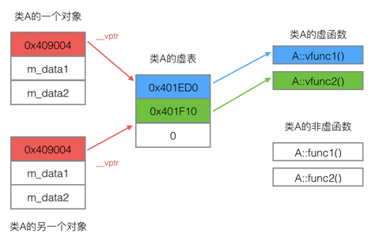

# 易忘重点知识点

- [1. 多继承](#1-多继承)
- [2. 多态](#2-多态)
  - [2.1 绑定](#21-绑定)
  - [2.2 虚析构函数](#22-虚析构函数)
- [3. 虚函数实现原理](#3-虚函数实现原理)
  - [3.1 原理图1，虚表地址](#31-原理图1虚表地址)
  - [3.2 原理图2](#32-原理图2)
  - [3.2 原理图3](#32-原理图3)
- [4. 声明与定义](#4-声明与定义)
- [5. mutable](#5-mutable)
- [6. 类型转换函数](#6-类型转换函数)
- [7. try catch](#7-try-catch)
- [8. 函数对象](#8-函数对象)

## 1. 继承

派生类不会继承基类的构造函数和析构函数。

- **继承**
  - **多级继承** 指C继承B，B继承A;
  - **多重继承** 指D继承A/B/C多个;
  - **多继承** 指 B继承A, C继承A, D继承BC。环状继承
- **纯虚函数**
  - virtual 函数类型 函数名(参数列表) = 0 ;
- **抽象类**  
  带纯虚函数的类。 抽象类无法创建对象，公共接口类。

### 1.1 多继承 - 环状继承


创建类D对象时，若没有使用虚继承，会导致出现两个祖父类A对象。

- 普通继承

```c++
class A{......};
class B:public A{......};
class C:public A{......};
class D:public B,public C{.....};
```

创建D时导致创建两个A对象。解决办法虚继承。

- 虚继承

```c++
class A{......};
class B:virtual public A{......};
class C:virtual public A{......};
class D:public B,public C{.....};
```

创建D时只创建一个A对象。

### 1.2 多态

#### 1.2.1 绑定

- 早期绑定

**静态多态** 即重载，静态关联，编译阶段已确定链接对象

```c++
class A{
public:
    void print() {
        cout<<"A"<<endl;
    }
};

class B:public A{
public:
    void print() {
        cout<<"B"<<endl;
    }
};
```

```c++
A- p=new B;   //实际指向B的A部分
p->print();   //输出A
```

- 后期绑定

**动态多态** 即虚函数, 下溯, 动态关联，通过基类指针访问派生类同名函数。执行阶段动态链接实际对象

```c++
class A{
public:
    virtual void print() {
        cout<<"A"<<endl;
    }
};

class B:public A{
public:
    void print() {
        cout<<"B"<<endl;
    }
};
```

```c++
A- p =new B;   //实际地址还是指向B
p->print();    //输出B
```

#### 1.2.2 虚析构函数

对于A- p指针来说，析构函数如果不是virtual的，delete p时，则只调用基类A的析构函数。因此析构函数都应该是virtual的。

### 1.3 虚函数实现原理

每个类都有一个虚函数表，每个类对象共享同一个虚函数表。

#### 1.3.1 原理图1，虚表地址


#### 1.3.2 原理图2

```c++
class Base{
public:
    virtual void fun1();
    virtual void fun2();
    int base_i;
};
```


```c++
sizeof(Base)=8
```

```c++
class Derive:public Base{
public:
    void fun1();
    int derive_i;
};
```


```c++
sizeof(Derive)=12
```

#### 1.3.2 原理图3

```c++
class A{
public:
    virtual void vfunc1();
    virtual void vfunc2();
    void func1();
    void func2();
private:
    int m_data1,m_data2;
};
```

- 单纯类A图


- 两个A对象的图



- B继承A，C继承B。分别三个对象的图


## 2. 声明与定义

```cpp
void &a=9;         //错误，不能建立void类型的引用
const int &a=i+3;  //正确，i+3产生临时变量，临时变量是const的。

double d=3.1415926;
const int &a=d;    //必须加const。因为产生临时变量 int tmp=d; tmp此时是3.

char- str1="abcdef";      //正确，字符串常量赋给字符串变量
char str2[10];            //此时已经开辟了内存空间，有了地址，这个地址是const的，不可变的。
str2="abcdef";            //错误，因为把一个新地址赋给了一个不可变地址。

char- str="abcdef";       //末尾带'\0'
string string="abcdef";   //末尾不带'\0'

string name[3]={"aaa","bbb","ccc"};    //数组存放的是几个字符串常量的首地址，并不存放字符串本身，因此sizeof(name)=4*3=12;
```

- c++程序中，struct可以有函数;
- c语言中，struct不可以有函数。

调用函数开销，远大于小函数执行开销。因此为请将任何不带循环的函数设置为内联inline。

## 3. mutable

static 静态数据成员只能在类体外初始化。若未初始化，自动默认初始化为0。它在程序编译时被分配空间，程序结束时，释放空间。

const成员函数要修改类似count这样的对象计数器数据成员，需要将数据成员定义为mutable。

```cpp
class TestClass {
    ...
    mutable int count ;     //mutable包含了static的功能，但是在const成员函数中可以被修改。
} ;

const void TestClass::add() { count++; }
```

## 4. 类型转换函数

```c++
class TestClass {
    ...
    double real;
    operator double() { return this->real ; }   //此处进行了类型转换
} ;

double d = TestClass();   //只能隐式调用
```

## 5. try catch

```c++
catch(...) {}            //捕捉所有错误
catch(...) { throw; }    //交给上级处理
```

```c++
double fun() throw(double,int) ;  //抛出double和int异常
double fun() throw() ;            //啥都不抛出
```

## 6. 函数对象

```c++
class print{
public:
    print() {
        std::cout<<"construct()"<<std::endl;
    }

    void operator()() {
        std::cout<<"operator()"<<std::endl;
    }
};

int main() {
    print p;   //函数对象的定义
    p();       //函数对象的使用
}
```

此程序输出 :

construct()  
operator()

代表构造函数依旧是第一调用的
