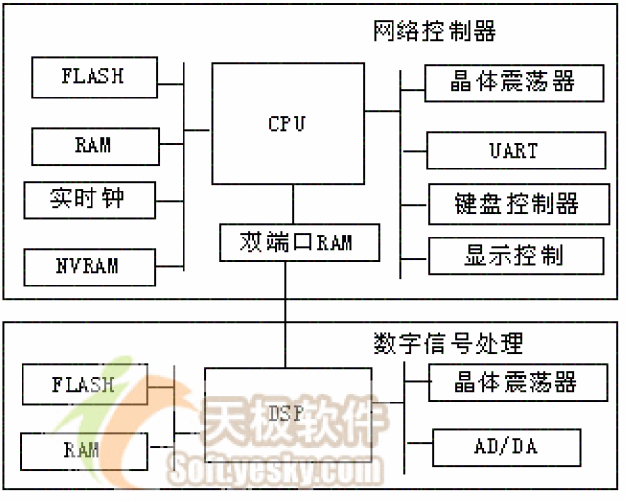
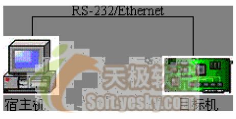
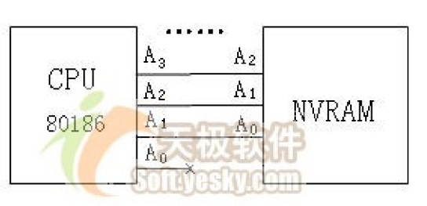
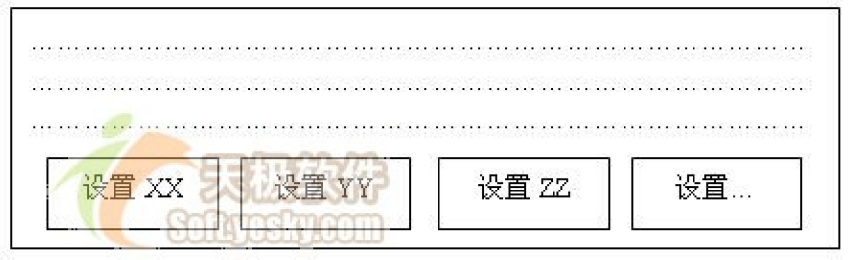
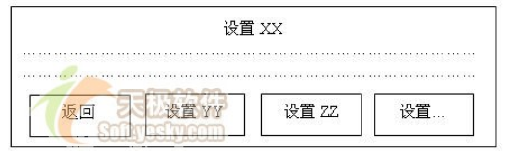

# C 语言嵌入式系统编程修炼

## 1. 背景篇

不同于一般形式的软件编程, 嵌入式系统编程建立在特定的硬件平台上, 势必要求其编程语言具备较强的硬件直接操作能力。无疑, 汇编语言具备这样的特质。但是, 归因于汇编语言开发过程的复杂性, 它并不是嵌入式系统开发的一般选择。而与之相比, C 语言--一种"高级的低级"语言, 则成为嵌入式系统开发的最佳选择。笔者在嵌入式系统项目的开发过程中, 一次又一次感受到C 语言的精妙, 沉醉于C 语言给嵌入式开发带来的便利。



上图给出了本文的讨论所基于的硬件平台, 实际上, 这也是大多数嵌入式系统的硬件平台。它包括两部分:

1. 以通用处理器为中心的协议处理模块, 用于网络控制协议的处理；
2. 以数字信号处理器（DSP）为中心的信号处理模块, 用于调制、解调和数/模信号转换。

本文的讨论主要围绕以通用处理器为中心的协议处理模块进行, 因为它更多地牵涉到具体的C 语言编程技巧。而DSP 编程则重点关注具体的数字信号处理算法, 主要涉及通信领域的知识, 不是本文的讨论重点。

着眼于讨论普遍的嵌入式系统C 编程技巧, 系统的协议处理模块没有选择特别的CPU, 而是选择了众所周知的CPU 芯片--80186, 每一位学习过《微机原理》的读者都应该对此芯片有一个基本的认识, 且对其指令集比较熟悉。

* 80186 的字长是16 位, 可以寻址到的内存空间为1MB, 只有实地址模式。C 语言编译生成的指针为32 位（双字）, 高16 位为段地址, 低16 位为段内编译, 一段最多64KB。
* 协议处理模块中的FLASH 和RAM 几乎是每个嵌入式系统的必备设备, 前者用于存储程序, 后者则是程序运行时指令及数据的存放位置。系统所选择的FLASH 和RAM 的位宽都为16 位, 与CPU 一致。
* 实时钟芯片可以为系统定时, 给出当前的年、月、日及具体时间（小时、分、秒及毫秒）, 可以设定其经过一段时间即向CPU 提出中断或设定报警时间到来时向CPU 提出中断（类似闹钟功能）。
* NVRAM（非易失去性RAM）具有掉电不丢失数据的特性, 可以用于保存系统的设置信息, 譬如网络协议参数等。在系统掉电或重新启动后, 仍然可以读取先前的设置信息。其位宽为8 位, 比CPU 字长小。文章特意选择一个与CPU 字长不一致的存储芯片, 为后文中一节的讨论创造条件。
* UART 则完成CPU 并行数据传输与RS-232 串行数据传输的转换, 它可以在接收到[1~MAX_BUFFER]字节后向CPU 提出中断, MAX_BUFFER 为UART 芯片存储接收到字节的最大缓冲区。
* 键盘控制器和显示控制器则完成系统人机界面的控制。

以上提供的是一个较完备的嵌入式系统硬件架构, 实际的系统可能包含更少的外设。之所以选择一个完备的系统, 是为了后文更全面的讨论嵌入式系统C 语言编程技巧的方方面面, 所有设备都会成为后文的分析目标。

嵌入式系统需要良好的软件开发环境的支持, 由于嵌入式系统的目标机资源受限, 不可能在其上建立庞大、复杂的开发环境, 因而其开发环境和目标运行环境相互分离。因此, 嵌入式应用软件的开发方式一般是, 在宿主机(Host)上建立开发环境, 进行应用程序编码和交叉编译, 然后宿主机同目标机(Target)建立连接, 将应用程序下载到目标机上进行交叉调试, 经过调试和优化, 最后将应用程序固化到目标机中实际运行。

CAD-UL 是适用于x86 处理器的嵌入式应用软件开发环境, 它运行在Windows 操作系统之上, 可生成x86 处理器的目标代码并通过PC 机的COM 口（RS-232 串口）或以太网口下载到目标机上运行, 如图2。其驻留于目标机FLASH 存储器中的monitor 程序可以监控宿主机Windows 调试平台上的用户调试指令, 获取CPU 寄存器的值及目标机存储空间、I/O 空间的内容。



后续章节将从软件架构、内存操作、屏幕操作、键盘操作、性能优化等多方面阐述C 语言嵌入式系统的编程技巧。软件架构是一个宏观概念, 与具体硬件的联系不大；内存操作主要涉及系统中的FLASH、RAM 和NVRAM 芯片；屏幕操作则涉及显示控制器和实时钟；键盘操作主要涉及键盘控制器；性能优化则给出一些具体的减小程序时间、空间消耗的技巧。

在我们的修炼旅途中将经过25 个关口, 这些关口主分为两类, 一类是技巧型, 有很强的适用性；一类则是常识型, 在理论上有些意义。

## 2. 软件架构篇

### 2.1 模块划分

模块划分的"划"是规划的意思, 意指怎样合理的将一个很大的软件划分为一系列功能独立的部分合作完成系统的需求。C 语言作为一种结构化的程序设计语言, 在模块的划分上主要依据功能（依功能进行划分在面向对象设计中成为一个错误, 牛顿定律遇到了>相对论）, C 语言模块化程序设计需理解如下概念:

1. 模块即是一个.c 文件和一个.h 文件的结合, 头文件(.h)中是对于该模块接口的声明；
2. 某模块提供给其它模块调用的外部函数及数据需在.h 中文件中冠以extern关键字声明；
3. 模块内的函数和全局变量需在.c 文件开头冠以static 关键字声明；
4. 永远不要在.h 文件中定义变量！定义变量和声明变量的区别在于定义会产生

内存分配的操作, 是汇编阶段的概念；而声明则只是告诉包含该声明的模块在连接阶段从其它模块寻找外部函数和变量。如:

```c
/*module1.h*/
int a = 5;              /* 在模块1 的.h 文件中定义int a */

/*module1 .c*/
#include "module1.h"    /* 在模块1 中包含模块1 的.h 文件*/

/*module2 .c*/
#include "module1.h"    /* 在模块2 中包含模块1 的.h 文件*/

/*module3 .c*/
#include "module1.h"    /* 在模块3 中包含模块1 的.h 文件*/
```

以上程序的结果是在模块1、2、3 中都定义了整型变量a, a 在不同的模块中对应不同的地址单元, 这个世界上从来不需要这样的程序。正确的做法是:

```c
/*module1.h*/
extern int a;           /* 在模块1 的.h 文件中声明int a */

/*module1 .c*/
#include "module1.h"    /* 在模块1 中包含模块1 的.h 文件*/
int a = 5;              /* 在模块1 的.c 文件中定义int a */

/*module2 .c*/
#include "module1.h"    /* 在模块2 中包含模块1 的.h 文件*/

/*module3 .c*/
#include "module1.h"    /* 在模块3 中包含模块1 的.h 文件*/
```

这样如果模块1、2、3 操作a 的话, 对应的是同一片内存单元。

一个嵌入式系统通常包括两类模块:

1. 硬件驱动模块, 一种特定硬件对应一个模块；
2. 软件功能模块, 其模块的划分应满足低偶合、高内聚的要求。

### 2.2 多任务还是单任务

所谓"单任务系统"是指该系统不能支持多任务并发操作, 宏观串行地执行一个任务。而多任务系统则可以宏观并行（微观上可能串行）地"同时"执行多个任务。

多任务的并发执行通常依赖于一个多任务操作系统（OS）, 多任务OS 的核心是系统调度器, 它使用任务控制块（TCB）来管理任务调度功能。TCB 包括任务的当前状态、优先级、要等待的事件或资源、任务程序码的起始地址、初始堆栈指针等信息。调度器在任务被激活时, 要用到这些信息。此外, TCB 还被用来存放任务的"上下文"（context)。

任务的上下文就是当一个执行中的任务被停止时, 所要保存的所有信息。通常, 上下文就是计算机当前的状态, 也即各个寄存器的内容。当发生任务切换时, 当前运行的任务的上下文被存入TCB, 并将要被执行的任务的上下文从它的TCB 中取出, 放入各个寄存器中。

嵌入式多任务OS 的典型例子有Vxworks、ucLinux 等。嵌入式OS 并非遥不可及的神坛之物, 我们可以用不到1000 行代码实现一个针对80186 处理器的功能最简单的OS 内核, 作者正准备进行此项工作, 希望能将心得贡献给大家。

究竟选择多任务还是单任务方式, 依赖于软件的体系是否庞大。例如, 绝大多数手机程序都是多任务的, 但也有一些小灵通的协议栈是单任务的, 没有操作系统, 它们的主程序轮流调用各个软件模块的处理程序, 模拟多任务环境。

### 2.3 单任务程序典型架构

1. 从 CPU 复位时的指定地址开始执行；
2. 跳转至汇编代码startup 处执行；
3. 跳转至用户主程序main 执行, 在main 中完成:
   * 初试化各硬件设备；
   * 初始化各软件模块；
   * 进入死循环（无限循环）, 调用各模块的处理函数

用户主程序和各模块的处理函数都以C 语言完成。用户主程序最后都进入了一个死循环, 其首选方案是:

```c
while(1){}
```

有的程序员这样写:

```c
for(;;){}
```

这个语法没有确切表达代码的含义, 我们从for(;;)看不出什么, 只有弄明白for(;;)在C 语言中意味着无条件循环才明白其意。

下面是几个"著名"的死循环:

1. 操作系统是死循环；
2. WIN32 程序是死循环；
3. 嵌入式系统软件是死循环；
4. 多线程程序的线程处理函数是死循环。

你可能会辩驳, 大声说: "凡事都不是绝对的, 2、3、4 都可以不是死循环"。Yes, you are right, 但是你得不到鲜花和掌声。实际上, 这是一个没有太大意义的牛角尖,

因为这个世界从来不需要一个处理完几个消息就喊着要OS 杀死它的WIN32 程序, 不需要一个刚开始RUN 就自行了断的嵌入式系统, 不需要莫名其妙启动一个做一点事就干掉自己的线程。有时候, 过于严谨制造的不是便利而是麻烦。君不见, 五层的TCP/IP协议栈超越严谨的ISO/OSI 七层协议栈大行其道成为事实上的标准？

经常有网友讨论:

```c
printf("%d,%d",++i,i++); /* 输出是什么？*/
c = a+++b; /* c=? */
```

等类似问题。面对这些问题, 我们只能发出由衷的感慨: 世界上还有很多有意义的事情等着我们去消化摄入的食物。

实际上, 嵌入式系统要运行到世界末日。

### 2.4 中断服务程序

中断是嵌入式系统中重要的组成部分, 但是在标准C 中不包含中断。许多编译开发商在标准C 上增加了对中断的支持, 提供新的关键字用于标示中断服务程序(ISR), 类似于__interrupt、#program interrupt 等。当一个函数被定义为ISR 的时候, 编译器会自动为该函数增加中断服务程序所需要的中断现场入栈和出栈代码。

中断服务程序需要满足如下要求:

1. 不能返回值；
2. 不能向ISR 传递参数；
3. ISR 应该尽可能的短小精悍；
4. printf(char * lpFormatString,…)函数会带来重入和性能问题, 不能在ISR 中采用。

在某项目的开发中, 我们设计了一个队列, 在中断服务程序中, 只是将中断类型添加入该队列中, 在主程序的死循环中不断扫描中断队列是否有中断, 有则取出队列中的第一个中断类型, 进行相应处理。

```c
/* 存放中断的队列*/
typedef struct tagIntQueue
{
  int intType; /* 中断类型*/
  struct tagIntQueue *next;
}IntQueue;

IntQueue lpIntQueueHead;

__interrupt ISRexample ()
{
  int intType;
  intType = GetSystemType();
  QueueAddTail(lpIntQueueHead, intType)；/* 在队列尾加入新的中断*/
}
```

在主程序循环中判断是否有中断:

```c
while(1)
{
  If( !IsIntQueueEmpty() )
  {
    intType = GetFirstInt();
    switch(intType) /* 是不是很象WIN32 程序的消息解析函数? */
    {
      /* 对, 我们的中断类型解析很类似于消息驱动*/
      case xxx: /* 我们称其为"中断驱动"吧？*/
        …
        break;
      case xxx:
        …
        break;
      …
    }
  }
}
```

按上述方法设计的中断服务程序很小, 实际的工作都交由主程序执行了。

### 2.5 硬件驱动模块

一个硬件驱动模块通常应包括如下函数:

1. 中断服务程序ISR
2. 硬件初始化
    * 修改寄存器, 设置硬件参数（如UART 应设置其波特率, AD/DA 设备应设置其采样速率等）；
    * 将中断服务程序入口地址写入中断向量表:

    ```c
    /* 设置中断向量表*/
    m_myPtr = make_far_pointer(0l); /* 返回void far 型指针void far * */
    m_myPtr += ITYPE_UART; /* ITYPE_UART: uart 中断服务程序*/
    /* 相对于中断向量表首地址的偏移*/
    *m_myPtr = &UART _Isr; /* UART _Isr: UART 的中断服务程序*/
    ```

3. 设置CPU 针对该硬件的控制线
    * 如果控制线可作PIO（可编程I/O）和控制信号用, 则设置CPU 内部对应寄存器使其作为控制信号；
    * 设置CPU 内部的针对该设备的中断屏蔽位, 设置中断方式（电平触发还是边缘触发）。
4. 提供一系列针对该设备的操作接口函数。例如, 对于LCD, 其驱动模块应提供绘制像素、画线、绘制矩阵、显示字符点阵等函数；而对于实时钟, 其驱动模块则需提供获取时间、设置时间等函数。

### 2.6 C 的面向对象化

在面向对象的语言里面, 出现了类的概念。类是对特定数据的特定操作的集合体。

类包含了两个范畴: 数据和操作。

而C 语言中的struct 仅仅是数据的集合, 我们可以利用函数指针将struct 模拟为一个包含数据和操作的"类"。下面的C 程序模拟了一个最简单的"类":

```c
#ifndef C_Class
#define C_Class struct
#endif
C_Class A
{
  C_Class A *A_this;              /* this 指针*/
  void (*Foo)(C_Class A *A_this); /* 行为: 函数指针*/
  int a;                          /* 数据*/
  int b;
};
```

我们可以利用C 语言模拟出面向对象的三个特性: 封装、继承和多态, 但是更多的时候, 我们只是需要将数据与行为封装以解决软件结构混乱的问题。C 模拟面向对象思想的目的不在于模拟行为本身, 而在于解决某些情况下使用C 语言编程时程序整体框架结构分散、数据和函数脱节的问题。我们在后续章节会看到这样的例子。

### 2.7 总结

本篇介绍了嵌入式系统编程软件架构方面的知识, 主要包括模块划分、多任务还是单任务选取、单任务程序典型架构、中断服务程序、硬件驱动模块设计等, 从宏观上给出了一个嵌入式系统软件所包含的主要元素。
请记住: 软件结构是软件的灵魂！结构混乱的程序面目可憎, 调试、测试、维护、升级都极度困难。

## 3. 内存操作

### 3.1 数据指针

在嵌入式系统的编程中, 常常要求在特定的内存单元读写内容, 汇编有对应的MOV指令, 而除C/C++以外的其它编程语言基本没有直接访问绝对地址的能力。在嵌入式系统的实际调试中, 多借助C 语言指针所具有的对绝对地址单元内容的读写能力。

以指针直接操作内存多发生在如下几种情况:

1. 某I/O 芯片被定位在CPU 的存储空间而非I/O 空间, 而且寄存器对应于某特定地址；
2. 两个CPU 之间以双端口RAM 通信, CPU 需要在双端口RAM 的特定单元（称为mail box）书写内容以在对方CPU 产生中断；
3. 读取在ROM 或FLASH 的特定单元所烧录的汉字和英文字模。

譬如:

```c
unsigned char *p = (unsigned char *)0xF000FF00;
*p=11;
```

以上程序的意义为在绝对地址0xF0000+0xFF00(80186 使用16 位段地址和16 位偏移地址)写入11。

在使用绝对地址指针时, 要注意指针自增自减操作的结果取决于指针指向的数据类别。

上例中p++后的结果是p= 0xF000FF01, 若p 指向int, 即: `int *p = (int *)0xF000FF00;`. p++(或++p)的结果等同于: `p = p+sizeof(int)`, 而p-(或-p)的结果是 `p = p-sizeof(int)`。

同理, 若执行: `long int *p = (long int *)0xF000FF00;`, 则p++(或++p)的结果等同于: `p = p+sizeof(long int)` , 而p-(或-p)的结果是 `p = p-sizeof(long int)`。

> 记住: CPU 以字节为单位编址, 而C 语言指针以指向的数据类型长度作自增和自减。

理解这一点对于以指针直接操作内存是相当重要的。

### 3.2 函数指针

首先要理解以下三个问题:

1. C 语言中函数名直接对应于函数生成的指令代码在内存中的地址, 因此函数名可以直接赋给指向函数的指针；
2. 调用函数实际上等同于"调转指令＋参数传递处理＋回归位置入栈", 本质上最核心的操作是将函数生成的目标代码的首地址赋给CPU 的PC 寄存器；
3. 因为函数调用的本质是跳转到某一个地址单元的code 去执行, 所以可以"调用"一个根本就不存在的函数实体, 晕？请往下看:

请拿出你可以获得的任何一本大学《微型计算机原理》教材, 书中讲到, 186 CPU启动后跳转至绝对地址0xFFFF0（对应C 语言指针是0xF000FFF0, 0xF000 为段地址, 0xFFF0 为段内偏移）执行, 请看下面的代码:

```c
typedef void (*lpFunction) ( );               /* 定义一个无参数、无返回类型的*/
/* 函数指针类型*/
lpFunction lpReset = (lpFunction)0xF000FFF0;  /* 定义一个函数指针, 指向CPU 启动后所执行第一条指令的位置*/
lpReset(); /* 调用函数*/
```

在以上的程序中, 我们根本没有看到任何一个函数实体, 但是我们却执行了这样的函数调用: lpReset(), 它实际上起到了"软重启"的作用, 跳转到CPU 启动后第一条要执行的指令的位置。

> 记住: 函数无它, 唯指令集合耳；你可以调用一个没有函数体的函数, 本质上只是换一个地址开始执行指令！

### 3.3 数组 vs 动态申请

在嵌入式系统中动态内存申请存在比一般系统编程时更严格的要求, 这是因为嵌入式系统的内存空间往往是十分有限的, 不经意的内存泄露会很快导致系统的崩溃。

所以一定要保证你的malloc 和free 成对出现, 如果你写出这样的一段程序:

```c
char* function(void)
{
  char *p;
  p = (char *)malloc(…);
  if(p==NULL)  …;
  … /* 一系列针对p 的操作*/
  return p;
}
```

在某处调用function(), 用完function 中动态申请的内存后将其free, 如下:

```c
char *q = function();
…
free(q);
```

上述代码明显是不合理的, 因为违反了malloc 和free 成对出现的原则, 即"谁申请, 就由谁释放"原则。不满足这个原则, 会导致代码的耦合度增大, 因为用户在调用function函数时需要知道其内部细节！

正确的做法是在调用处申请内存, 并传入function 函数, 如下:

```c
char *p=malloc(…);
if(p==NULL) …;
function(p);
…
free(p);
p=NULL;
```

而函数function 则接收参数p, 如下:

```c
void function(char *p)
{
  … /* 一系列针对p 的操作*/
}
```

基本上, 动态申请内存方式可以用较大的数组替换。对于编程新手, 笔者推荐你尽量采用数组！嵌入式系统可以以博大的胸襟接收瑕疵, 而无法"海纳"错误。毕竟, 以最笨的方式苦练神功的郭靖胜过机智聪明却范政治错误走反革命道路的杨康。

给出原则:

1. 尽可能的选用数组, 数组不能越界访问（真理越过一步就是谬误, 数组越过界限就光荣地成全了一个混乱的嵌入式系统）；
2. 如果使用动态申请, 则申请后一定要判断是否申请成功了, 并且malloc 和free应成对出现！

### 3.4 关键字const

const 意味着"只读"。区别如下代码的功能非常重要, 也是老生长叹, 如果你还不知道它们的区别, 而且已经在程序界摸爬滚打多年, 那只能说这是一个悲哀:

```c
const int a;
int const a;
const int *a;
int * const a;
int const * a const;
```

1. 关键字const 的作用是为给读你代码的人传达非常有用的信息。例如, 在函数的形参前添加const 关键字意味着这个参数在函数体内不会被修改, 属于"输入参数"。在有多个形参的时候, 函数的调用者可以凭借参数前是否有const 关键字, 清晰的辨别哪些是输入参数, 哪些是可能的输出参数。
2. 合理地使用关键字const 可以使编译器很自然地保护那些不希望被改变的参数, 防止其被无意的代码修改, 这样可以减少bug 的出现。

const 在C++语言中则包含了更丰富的含义, 而在C 语言中仅意味着: "只能读的普通变量", 可以称其为"不能改变的变量"（这个说法似乎很拗口, 但却最准确的表达了C 语言中const 的本质）, 在编译阶段需要的常数仍然只能以#define 宏定义！故在C 语言中如下程序是非法的:

```c
const int SIZE = 10;
char a[SIZE];         /* 非法: 编译阶段不能用到变量*/
```

### 3.5 关键字volatile

C 语言编译器会对用户书写的代码进行优化, 譬如如下代码:

```c
int a,b,c;
a = inWord(0x100);    /*读取I/O 空间0x100 端口的内容存入a 变量*/
b = a;
a = inWord (0x100);   /*再次读取I/O 空间0x100 端口的内容存入a 变量*/
c = a;
```

很可能被编译器优化为:

```c
int a,b,c;
a = inWord(0x100); /*读取I/O 空间0x100 端口的内容存入a 变量*/
b = a;
c = a;
```

但是这样的优化结果可能导致错误, 如果I/O 空间0x100 端口的内容在执行第一次读操作后被其它程序写入新值, 则其实第2 次读操作读出的内容与第一次不同, b 和c的值应该不同。在变量a 的定义前加上volatile 关键字可以防止编译器的类似优化, 正确的做法是:

```c
volatile int a；
```

volatile 变量可能用于如下几种情况:

1. 并行设备的硬件寄存器（如: 状态寄存器, 例中的代码属于此类）；
2. 一个中断服务子程序中会访问到的非自动变量(也就是全局变量)；
3. 多线程应用中被几个任务共享的变量。

### 3.6 CPU 字长与存储器位宽不一致处理

在背景篇中提到, 本文特意选择了一个与CPU 字长不一致的存储芯片, 就是为了进行本节的讨论, 解决CPU 字长与存储器位宽不一致的情况。80186 的字长为16, 而NVRAM 的位宽为8, 在这种情况下, 我们需要为NVRAM 提供读写字节、字的接口, 如下:

```c
typedef unsigned char BYTE;
typedef unsigned int WORD;

/* 函数功能: 读NVRAM 中字节
* 参数: wOffset, 读取位置相对NVRAM 基地址的偏移
* 返回: 读取到的字节值
*/
extern BYTE ReadByteNVRAM(WORD wOffset)
{
  LPBYTE lpAddr = (BYTE*)(NVRAM + wOffset * 2);   /* 为什么偏移要×2? */
  return *lpAddr;
}

/* 函数功能: 读NVRAM 中字
* 参数: wOffset, 读取位置相对NVRAM 基地址的偏移
* 返回: 读取到的字
*/
extern WORD ReadWordNVRAM(WORD wOffset)
{
  WORD wTmp = 0;
  LPBYTE lpAddr;

  /* 读取高位字节*/
  lpAddr = (BYTE*)(NVRAM + wOffset * 2);      /* 为什么偏移要×2? */
  wTmp += (*lpAddr)*256;

  /* 读取低位字节*/
  lpAddr = (BYTE*)(NVRAM + (wOffset +1) * 2); /* 为什么偏移要×2? */
  wTmp += *lpAddr;

  return wTmp;
}

/* 函数功能: 向NVRAM 中写一个字节
*参数: wOffset, 写入位置相对NVRAM 基地址的偏移
* byData, 欲写入的字节
*/
extern void WriteByteNVRAM(WORD wOffset, BYTE byData)
{
…
}

/* 函数功能: 向NVRAM 中写一个字
* 参数: wOffset, 写入位置相对NVRAM 基地址的偏移
* wData, 欲写入的字
*/
extern void WriteWordNVRAM(WORD wOffset, WORD wData)
{
…
}
```

子贡问曰: Why 偏移要乘以2?  
子曰: 请看图1, 16 位80186 与8 位NVRAM 之间互连只能以地址线A1 对其A0,CPU
本身的A0 与NVRAM 不连接。因此, NVRAM 的地址只能是偶数地址, 故每次以0x10
为单位前进！



子贡再问: So why 80186 的地址线A0 不与NVRAM 的A0 连接？  
子曰: 请看《IT 论语》之《微机原理篇》, 那里面讲述了关于计算机组成的圣人之
道。

### 3.76 总结

本篇主要讲述了嵌入式系统C 编程中内存操作的相关技巧。掌握并深入理解关于数据指针、函数指针、动态申请内存、const 及volatile 关键字等的相关知识, 是一个优秀的C 语言程序设计师的基本要求。当我们已经牢固掌握了上述技巧后, 我们就已经学会了C 语言的99%, 因为C 语言最精华的内涵皆在内存操作中体现。

我们之所以在嵌入式系统中使用C 语言进行程序设计, 99%是因为其强大的内存操作能力！

## 4. 屏幕操作

### 4.1 汉字处理

现在要解决的问题是, 嵌入式系统中经常要使用的并非是完整的汉字库, 往往只是需要提供数量有限的汉字供必要的显示功能。例如, 一个微波炉的LCD 上没有必要提供显示"电子邮件"的功能；一个提供汉字显示功能的空调的LCD 上不需要显示一条"短消息", 诸如此类。但是一部手机、小灵通则通常需要包括较完整的汉字库。

如果包括的汉字库较完整, 那么, 由内码计算出汉字字模在库中的偏移是十分简单的: 汉字库是按照区位的顺序排列的, 前一个字节为该汉字的区号, 后一个字节为该字的位号。每一个区记录94 个汉字, 位号则为该字在该区中的位置。因此, 汉字在汉字库中的具体位置计算公式为: **94\*(区号-1)+位号-1** 。减1 是因为数组是以0 为开始而区号位号是以1 为开始的。只需乘上一个汉字字模占用的字节数即可, 即: **(94\*(区号-1)+位号-1)\*一个汉字字模占用字节数**, 以16*16 点阵字库为例, 计算公式则为: **(94\*(区号-1)+(位号-1))\*32**。汉字库中从该位置起的32 字节信息记录了该字的字模信息。

对于包含较完整汉字库的系统而言, 我们可以以上述规则计算字模的位置。但是如果仅仅是提供少量汉字呢？譬如几十至几百个？最好的做法是:

定义宏:

```c
# define EX_FONT_CHAR(value)
# define EX_FONT_UNICODE_VAL(value) (value),
# define EX_FONT_ANSI_VAL(value) (value),
```

定义结构体:

```c
typedef struct _wide_unicode_font16x16
{
  WORD value;     /* 内码*/
  BYTE data[32];  /* 字模点阵*/
}Unicode;
#define CHINESE_CHAR_NUM … /* 汉字数量*/
```

字模的存储用数组:

```c
Unicode chinese[CHINESE_CHAR_NUM] =
{
  {
    EX_FONT_CHAR("业")
    EX_FONT_UNICODE_VAL(0x4e1a)
    {
      0x04, 0x40, 0x04, 0x40, 0x04, 0x40, 0x04, 0x44, 0x44, 0x46, 0x24, 0x4c,
      0x24, 0x48, 0x14, 0x50, 0x1c, 0x50, 0x14, 0x60, 0x04, 0x40, 0x04, 0x40,
      0x04, 0x44, 0xff, 0xfe, 0x00, 0x00, 0x00, 0x00
    }
  },
  {
    EX_FONT_CHAR("中")
    EX_FONT_UNICODE_VAL(0x4e2d)
    {
      0x01, 0x00, 0x01, 0x00, 0x21, 0x08, 0x3f, 0xfc, 0x21, 0x08, 0x21, 0x08,
      0x21, 0x08, 0x21, 0x08, 0x21, 0x08, 0x3f, 0xf8, 0x21, 0x08, 0x01, 0x00,
      0x01, 0x00, 0x01, 0x00, 0x01, 0x00, 0x01, 0x00
    }
  },
  {
    EX_FONT_CHAR("云")
    EX_FONT_UNICODE_VAL(0x4e91)
    {
      0x00, 0x00, 0x00, 0x30, 0x3f, 0xf8, 0x00, 0x00, 0x00, 0x00, 0x00, 0x0c,
      0xff, 0xfe, 0x03, 0x00, 0x07, 0x00, 0x06, 0x40, 0x0c, 0x20, 0x18, 0x10,
      0x31, 0xf8, 0x7f, 0x0c, 0x20, 0x08, 0x00, 0x00
    }
  },
  {
    EX_FONT_CHAR("件")
    EX_FONT_UNICODE_VAL(0x4ef6)
    {
      0x10, 0x40, 0x1a, 0x40, 0x13, 0x40, 0x32, 0x40, 0x23, 0xfc, 0x64, 0x40,
      0xa4, 0x40, 0x28, 0x40, 0x2f, 0xfe, 0x20, 0x40, 0x20, 0x40, 0x20, 0x40,
      0x20, 0x40, 0x20, 0x40, 0x20, 0x40, 0x20, 0x40
    }
  }
}
```

要显示特定汉字的时候, 只需要从数组中查找内码与要求汉字内码相同的即可获得字模。如果前面的汉字在数组中以内码大小顺序排列, 那么可以以二分查找法更高效的查找到汉字的字模。

这是一种很有效的组织小汉字库的方法, 它可以保证程序有很好的结构。

### 4.2 系统时间显示

从NVRAM 中可以读取系统的时间, 系统一般借助NVRAM 产生的秒中断每秒读取一次当前时间并在LCD 上显示。

关于时间的显示, 有一个效率问题。因为时间有其特殊性, 那就是60 秒才有一次分钟的变化, 60 分钟才有一次小时变化, 如果我们每次都将读取的时间在屏幕上完全重新刷新一次, 则浪费了大量的系统时间。

一个较好的办法是我们在时间显示函数中以**静态变量分别存储小时、分钟、秒**, 只有在其内容发生变化的时候才更新其显示。

```c
extern void DisplayTime(…)
{
  static BYTE byHour,byMinute,bySecond;
  BYTE byNewHour, byNewMinute, byNewSecond;

  byNewHour = GetSysHour();
  byNewMinute = GetSysMinute();
  byNewSecond = GetSysSecond();

  if(byNewHour!= byHour)
  {
    … /* 显示小时*/
    byHour = byNewHour;
  }

  if(byNewMinute!= byMinute)
  {
    … /* 显示分钟*/
    byMinute = byNewMinute;
  }

  if(byNewSecond!= bySecond)
  {
    … /* 显示秒钟*/
    bySecond = byNewSecond;
  }
}
```

这个例子也可以顺便作为C 语言中static 关键字强大威力的证明。当然, 在C++语言里, static 具有了更加强大的威力, 它使得某些数据和函数脱离"对象"而成为"类"的一部分, 正是它的这一特点, 成就了软件的无数优秀设计。

### 4.3 动画显示

动画是无所谓有, 无所谓无的, 静止的画面走的路多了, 也就成了动画。随着时间的变更, 在屏幕上显示不同的静止画面, 即是动画之本质。所以, 在一个嵌入式系统的LCD 上欲显示动画, 必须借助定时器。没有硬件或软件定时器的世界是无法想像的:

1. 没有定时器, 一个操作系统将无法进行时间片的轮转, 于是无法进行多任务的调度, 于是便不再成其为一个多任务操作系统；
2. 没有定时器, 一个多媒体播放软件将无法运作, 因为它不知道何时应该切换到下一帧画面；
3. 没有定时器, 一个网络协议将无法运转, 因为其无法获知何时包传输超时并重传之, 无法在特定的时间完成特定的任务。

因此, 没有定时器将意味着没有操作系统、没有网络、没有多媒体, 这将是怎样的黑暗？所以, 合理并灵活地使用各种定时器, 是对一个软件人的最基本需求！

在80186 为主芯片的嵌入式系统中, 我们需要借助硬件定时器的中断来作为软件定时器, 在中断发生后变更画面的显示内容。在时间显示"xx:xx"中让冒号交替有无, 每次秒中断发生后, 需调用ShowDot:

```c
void ShowDot()
{
  static BOOL bShowDot = TRUE; /* 再一次领略static 关键字的威力*/
  if(bShowDot)
  {
    showChar(’:’,xPos,yPos);
  }
  else
  {
    showChar(’ ’,xPos,yPos);
  }

  bShowDot = ! bShowDot;
}
```

### 4.4 菜单操作

无数人为之绞尽脑汁的问题终于出现了, 在这一节里, 我们将看到, 在C 语言中哪怕用到一丁点的面向对象思想, 软件结构将会有何等的改观！

笔者曾经是个笨蛋, 被菜单搞晕了, 给出这样的一个系统:


要求以键盘上的"← →"键切换菜单焦点, 当用户在焦点处于某菜单时, 若敲击键盘上的OK、CANCEL 键则调用该焦点菜单对应之处理函数。我曾经傻傻地这样做着:

```c
/* 按下OK 键*/
void onOkKey()
{
  /* 判断在什么焦点菜单上按下Ok 键, 调用相应处理函数*/
  Switch(currentFocus)
  {
    case MENU1:
      menu1OnOk();
      break;
    case MENU2:
      menu2OnOk();
      break;
    …
  }
}

/* 按下Cancel 键*/
void onCancelKey()
{
  /* 判断在什么焦点菜单上按下Cancel 键, 调用相应处理函数*/
  Switch(currentFocus)
  {
    case MENU1:
      menu1OnCancel();
      break;
    case MENU2:
      menu2OnCancel();
      break;
    …
  }
}
```

终于有一天, 我这样做了:

```c
/* 将菜单的属性和操作"封装"在一起*/
typedef struct tagSysMenu
{
  char *text;     /* 菜单的文本*/
  BYTE xPos;      /* 菜单在LCD 上的x 坐标*/
  BYTE yPos;      /* 菜单在LCD 上的y 坐标*/
  void (*onOkFun)();        /* 在该菜单上按下ok 键的处理函数指针*/
  void (*onCancelFun)();    /* 在该菜单上按下cancel 键的处理函数指针*/
}SysMenu, *LPSysMenu;
```

当我定义菜单时, 只需要这样:

```c
static SysMenu menu[MENU_NUM] =
{
  {
    "menu1", 0, 48, menu1OnOk, menu1OnCancel
  }
  ,
  {
    "menu2", 7, 48, menu2OnOk, menu2OnCancel
  }
  ,
  {
    "menu3", 7, 48, menu3OnOk, menu3OnCancel
  }
  ,
  {
    "menu4", 7, 48, menu4OnOk, menu4OnCancel
  }
  …
};
```

OK 键和CANCEL 键的处理变成:

```c
/* 按下OK 键*/
void onOkKey()
{
  menu[currentFocusMenu].onOkFun();
}

/* 按下Cancel 键*/
void onCancelKey()
{
  menu[currentFocusMenu].onCancelFun();
}
```

程序被大大简化了, 也开始具有很好的可扩展性！我们仅仅利用了面向对象中的封装思想, 就让程序结构清晰, 其结果是几乎可以在无需修改程序的情况下在系统中添加更多的菜单, 而系统的按键处理函数保持不变。

### 4.5 模拟MessageBox 函数

MessageBox 函数, 这个Windows 编程中的超级猛料, 不知道是多少入门者第一次用到的函数。还记得我们第一次在Windows 中利用MessageBox 输出"Hello,World!"对话框时新奇的感觉吗？无法统计, 这个世界上究竟有多少程序员学习Windows 编程是从MessageBox ("Hello,World!",…)开始的。在我本科的学校, 广泛流传着一个词汇, 叫做"’Hello,World’级程序员", 意指入门级程序员, 但似乎"’Hello,World’级"这个说法更搞笑而形象。


嵌入式系统中没有给我们提供MessageBox, 但是鉴于其功能强大, 我们需要模拟之, 一个模拟的MessageBox 函数为:

```c
/*
 * 函数名称: MessageBox
 * 功能说明: 弹出式对话框,显示提醒用户的信息
 * 参数说明: lpStr --- 提醒用户的字符串输出信息
 * TYPE --- 输出格式(ID_OK = 0, ID_OKCANCEL = 1)
 * 返回值: 返回对话框接收的键值,只有两种KEY_OK, KEY_CANCEL
 */
typedef enum TYPE { ID_OK,ID_OKCANCEL }MSG_TYPE;
extern BYTE MessageBox(LPBYTE lpStr, BYTE TYPE)
{
  BYTE keyValue = -1;
  ClearScreen(); /* 清除屏幕*/
  DisplayString(xPos,yPos,lpStr,TRUE); /* 显示字符串*/
  /* 根据对话框类型决定是否显示确定、取消*/
  switch (TYPE)
  {
    case ID_OK:
      DisplayString(13,yPos+High+1, " 确定", 0);
      break;
    case ID_OKCANCEL:
      DisplayString(8, yPos+High+1, " 确定", 0);
      DisplayString(17,yPos+High+1, " 取消", 0);
      break;
    default:
      break;
  }

  DrawRect(0, 0, 239, yPos+High+16+4); /* 绘制外框*/

  /* MessageBox 是模式对话框, 阻塞运行, 等待按键*/
  while( (keyValue != KEY_OK) || (keyValue != KEY_CANCEL) )
  {
    keyValue = getSysKey();
  }

  /* 返回按键类型*/
  if(keyValue== KEY_OK)
  {
    return ID_OK;
  }
  else
  {
    return ID_CANCEL;
  }
}
```

上述函数与我们平素在VC++等中使用的MessageBox 是何等的神似啊？实现这个函数, 你会看到它在嵌入式系统中的妙用是无穷的。

### 4.6 总结

本篇是本系列文章中技巧性最深的一篇, 它提供了嵌入式系统屏幕显示方面一些很巧妙的处理方法, 灵活使用它们, 我们将不再被LCD 上凌乱不堪的显示内容所困扰。

屏幕乃嵌入式系统生存之重要辅助, 面目可憎之显示将另用户逃之夭夭。屏幕编程若处理不好, 将是软件中最不系统、最混乱的部分, 笔者曾深受其害。

## 5. 键盘操作

### 5.1 处理功能键

功能键的问题在于, 用户界面并非固定的, 用户功能键的选择将使屏幕画面处于不同的显示状态下。例如, 主画面如图1:



当用户在设置XX 上按下Enter 键之后, 画面就切换到了设置XX 的界面, 如图2:



程序如何判断用户处于哪一画面, 并在该画面的程序状态下调用对应的功能键处理函数, 而且保证良好的结构, 是一个值得思考的问题。

让我们来看看WIN32 编程中用到的"窗口"概念, 当消息（message）被发送给不同窗口的时候, 该窗口的消息处理函数（是一个callback 函数）最终被调用, 而在该窗口的消息处理函数中, 又根据消息的类型调用了该窗口中的对应处理函数。通过这种方式, WIN32 有效的组织了不同的窗口, 并处理不同窗口情况下的消息。

我们从中学习到的就是:

1. 将不同的画面类比为WIN32 中不同的窗口, 将窗口中的各种元素（菜单、按钮等）包含在窗口之中；
2. 给各个画面提供一个功能键"消息"处理函数, 该函数接收按键信息为参数；
3. 在各画面的功能键"消息"处理函数中, 判断按键类型和当前焦点元素, 并调用对应元素的按键处理函数。

```c
/* 将窗口元素、消息处理函数封装在窗口中*/
struct windows
{
  BYTE currentFocus;
  ELEMENT element[ELEMENT_NUM];
  void (*messageFun) (BYTE keyValue);
  …
};

/* 消息处理函数*/
void messageFunction(BYTE keyValue)
{
  BYTE i = 0;
  /* 获得焦点元素*/
  while ( (element [i].ID!= currentFocus)&& (i < ELEMENT_NUM) )
  {
    i++;
  }

  /* "消息映射" */
  if(i < ELEMENT_NUM)
  {
    switch(keyValue)
    {
      case OK:
        element[i].OnOk();
        break;
      …
    }
  }
}
```

在窗口的消息处理函数中调用相应元素按键函数的过程类似于"消息映射", 这是我们从WIN32 编程中学习到的。编程到了一个境界, 很多东西都是相通的了。其它地方的思想可以拿过来为我所用, 是为编程中的"拿来主义"。

在这个例子中, 如果我们还想玩得更大一点, 我们可以借鉴MFC 中处理MESSAGE_MAP 的方法, 我们也可以学习MFC 定义几个精妙的宏来实现"消息映射"。

### 5.2 处理数字键

用户输入数字时是一位一位输入的, 每一位的输入都对应着屏幕上的一个显示位置（x 坐标, y 坐标）。此外, 程序还需要记录该位置输入的值, 所以有效组织用户数字输入的最佳方式是定义一个结构体, 将坐标和数值捆绑在一起:

```c
/* 用户数字输入结构体*/
typedef struct tagInputNum
{
  BYTE byNum;   /* 接收用户输入赋值*/
  BYTE xPos;    /* 数字输入在屏幕上的显示位置x 坐标*/
  BYTE yPos;    /* 数字输入在屏幕上的显示位置y 坐标*/
}InputNum, *LPInputNum;
```

那么接收用户输入就可以定义一个结构体数组, 用数组中的各位组成一个完整的数:

```c
InputNum inputElement[NUM_LENGTH];  /* 接收用户数字输入的数组*/

/* 数字按键处理函数*/
extern void onNumKey(BYTE num)
{
  if(num==0|| num==1) /* 只接收二进制输入*/
  {
    /* 在屏幕上显示用户输入*/
    DrawText(inputElement[currentElementInputPlace].xPos,
    inputElement[currentElementInputPlace].yPos, "%1d", num);

    /* 将输入赋值给数组元素*/
    inputElement[currentElementInputPlace].byNum = num;

    /* 焦点及光标右移*/
    moveToRight();
  }
}
```

将数字每一位输入的坐标和输入值捆绑后, 在数字键处理函数中就可以较有结构的组织程序, 使程序显得很紧凑。

### 5.3 整理用户输入

继续第2 节的例子, 在第2 节的onNumKey 函数中, 只是获取了数字的每一位, 因而我们需要将其转化为有效数据, 譬如要转化为有效的XXX 数据, 其方法是:

```c
/* 从2 进制数据位转化为有效数据: XXX */
void convertToXXX()
{
  BYTE i;
  XXX = 0;
  for (i = 0; i < NUM_LENGTH; i++)
  {
    XXX += inputElement[i].byNum*power(2, NUM_LENGTH - i - 1);
  }
}
```

反之, 我们也可能需要在屏幕上显示那些有效的数据位, 因为我们也需要能够反向转化:

```c
/* 从有效数据转化为2 进制数据位: XXX */
void convertFromXXX()
{
  BYTE i;
  XXX = 0;
  for (i = 0; i < NUM_LENGTH; i++)
  {
    inputElement[i].byNum = XXX / power(2, NUM_LENGTH - i - 1) % 2;
  }
}
```

当然在上面的例子中, 因为数据是2 进制的, 用power 函数不是很好的选择, 直接用"<< >>"移位操作效率更高, 我们仅是为了说明问题的方便。试想, 如果用户输入是十进制的, power 函数或许是唯一的选择了。

### 5.3 总结

本篇给出了键盘操作所涉及的各个方面: 功能键处理、数字键处理及用户输入整理, 基本上提供了一个全套的按键处理方案。对于功能键处理方法, 将LCD 屏幕与Windows窗口进行类比, 提出了较新颖地解决屏幕、键盘繁杂交互问题的方案。

计算机学的许多知识都具有相通性, 因而, 不断追赶时髦技术而忽略基本功的做法是徒劳无意的。我们最多需要"精通"三种语言（精通, 一个在如今的求职简历里泛滥成灾的词语）, 最佳拍档是汇编、C、C++（或JAVA）, 很显然, 如果你"精通"了这三种语言, 其它语言你应该是可以很快"熟悉"的, 否则你就没有"精通"它们.

## 6. 性能优化

### 6.1 使用宏定义

在C 语言中, 宏是产生内嵌代码的唯一方法。对于嵌入式系统而言, 为了能达到性能要求, 宏是一种很好的代替函数的方法。

写一个"标准"宏MIN , 这个宏输入两个参数并返回较小的一个:

* 错误做法:

  ```c
  #define MIN(A,B) ( A <= B ? A : B )
  ```

* 正确做法:

  ```c
  #define MIN(A,B) （（A）<= (B) ? (A) : (B) )
  ```

对于宏, 我们需要知道三点:

1. 宏定义"像"函数；
2. 宏定义不是函数, 因而需要括上所有"参数"；
3. 宏定义可能产生副作用。

下面的代码:

```c
least = MIN(*p++, b);
```

将被替换为:

```c
( (*p++) <= (b) ?(*p++):(b) )
```

发生的事情无法预料。

因而不要给宏定义传入有副作用的"参数"。

### 6.2 使用寄存器变量

当对一个变量频繁被读写时, 需要反复访问内存, 从而花费大量的存取时间。为此, C 语言提供了一种变量, 即寄存器变量。这种变量存放在CPU 的寄存器中, 使用时, 不需要访问内存, 而直接从寄存器中读写, 从而提高效率。寄存器变量的说明符是register。

对于循环次数较多的循环控制变量及循环体内反复使用的变量均可定义为寄存器变量, 而循环计数是应用寄存器变量的最好候选者。

1. 只有局部自动变量和形参才可以定义为寄存器变量。因为寄存器变量属于动态存储方式, 凡需要采用静态存储方式的量都不能定义为寄存器变量, 包括: 模块间全局变量、模块内全局变量、局部static 变量；
2. register 是一个"建议"型关键字, 意指程序建议该变量放在寄存器中, 但最终该变量可能因为条件不满足并未成为寄存器变量, 而是被放在了存储器中, 但编译器中并不报错（在C++语言中有另一个"建议"型关键字: inline）。

下面是一个采用寄存器变量的例子:

```c
/* 求1+2+3+….+n 的值*/
WORD Addition(BYTE n)
{
  register i,s=0;
  for(i=1;i<=n;i++)
  {
    s=s+i;
  }
  return s;
}
```

本程序循环n 次, i 和s 都被频繁使用, 因此可定义为寄存器变量。

### 6.3 内嵌汇编

程序中对时间要求苛刻的部分可以用内嵌汇编来重写, 以带来速度上的显著提高。

但是, 开发和测试汇编代码是一件辛苦的工作, 它将花费更长的时间, 因而要慎重选择要用汇编的部分。

在程序中, 存在一个80-20 原则, 即20%的程序消耗了80%的运行时间, 因而我们要改进效率, 最主要是考虑改进那20%的代码。

嵌入式C 程序中主要使用在线汇编, 即在C 程序中直接插入_asm{ }内嵌汇编语句:

```c
/* 把两个输入参数的值相加, 结果存放到另外一个全局变量中*/
int result;
void Add(long a, long *b)
{
  _asm
  {
    MOV AX, a
    MOV BX, b
    ADD AX, [BX]
    MOV result, AX
  }
}
```

### 6.4 利用硬件特性

首先要明白CPU 对各种存储器的访问速度, 基本上是:

CPU 内部RAM > 外部同步RAM > 外部异步RAM > FLASH/ROM

对于程序代码, 已经被烧录在FLASH 或ROM 中, 我们可以让CPU 直接从其中读取代码执行, 但通常这不是一个好办法, 我们最好在系统启动后将FLASH 或ROM 中的目标代码拷贝入RAM 中后再执行以提高取指令速度；

对于UART 等设备, 其内部有一定容量的接收BUFFER, 我们应尽量在BUFFER 被占满后再向CPU 提出中断。例如计算机终端在向目标机通过RS-232 传递数据时, 不宜设置UART 只接收到一个BYTE 就向CPU 提中断, 从而无谓浪费中断处理时间；

如果对某设备能采取DMA 方式读取, 就采用DMA 读取, DMA 读取方式在读取目标中包含的存储信息较大时效率较高, 其数据传输的基本单位是块, 而所传输的数据是从设备直接送入内存的（或者相反）。DMA 方式较之中断驱动方式, 减少了CPU 对外设的干预, 进一步提高了CPU 与外设的并行操作程度。

### 6.5 活用位操作

使用C 语言的位操作可以减少除法和取模的运算。在计算机程序中数据的位是可以操作的最小数据单位, 理论上可以用"位运算"来完成所有的运算和操作, 因而, 灵活的位操作可以有效地提高程序运行的效率。举例如下:

```c
/* 方法1 */
int i,j;
i = 879 / 16;
j = 562 % 32;

/* 方法2 */
int i,j;
i = 879 >> 4;
j = 562 - (562 >> 5 << 5);
```

对于以2 的指数次方为"*"、"/"或"%"因子的数学运算, 转化为移位运算"<< >>"通常可以提高算法效率。因为乘除运算指令周期通常比移位运算大。

C 语言位运算除了可以提高运算效率外, 在嵌入式系统的编程中, 它的另一个最典型的应用, 而且十分广泛地正在被使用着的是位间的与（&）、或（|）、非（~）操作, 这跟嵌入式系统的编程特点有很大关系。我们通常要对硬件寄存器进行位设置, 譬如, 我们通过将AM186ER 型80186 处理器的中断屏蔽控制寄存器的第低6 位设置为0（开中断2）, 最通用的做法是:

```c
#define INT_I2_MASK 0x0040
wTemp = inword(INT_MASK);
outword(INT_MASK, wTemp &~INT_I2_MASK);
```

而将该位设置为1 的做法是:

```c
#define INT_I2_MASK 0x0040
wTemp = inword(INT_MASK);
outword(INT_MASK, wTemp | INT_I2_MASK);
```

判断该位是否为1 的做法是:

```c
#define INT_I2_MASK 0x0040
wTemp = inword(INT_MASK);
if(wTemp & INT_I2_MASK)
{
  … /* 该位为1 */
}
```

上述方法在嵌入式系统的编程中是非常常见的, 我们需要牢固掌握。

### 6.6 总结

在性能优化方面永远注意80-20 准备, 不要优化程序中开销不大的那80%, 这是劳而无功的。

宏定义是C 语言中实现类似函数功能而又不具函数调用和返回开销的较好方法, 但宏在本质上不是函数, 因而要防止宏展开后出现不可预料的结果, 对宏的定义和使用要慎而处之。很遗憾, 标准C 至今没有包括C++中inline 函数的功能, inline 函数兼具无调用开销和安全的优点。

使用寄存器变量、内嵌汇编和活用位操作也是提高程序效率的有效方法。

除了编程上的技巧外, 为提高系统的运行效率, 我们通常也需要最大可能地利用各种硬件设备自身的特点来减小其运转开销, 例如减小中断次数、利用DMA 传输方式等。
