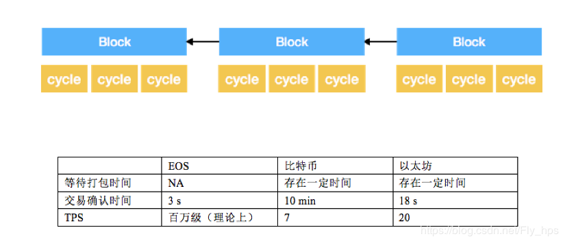
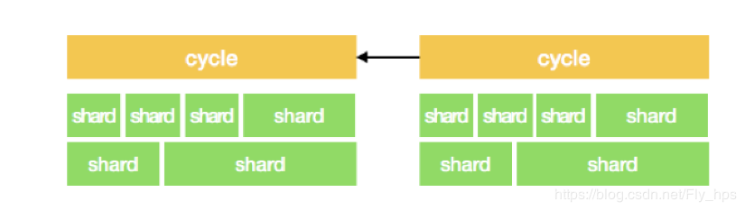
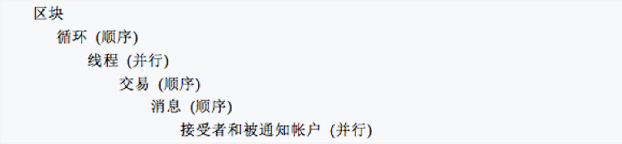
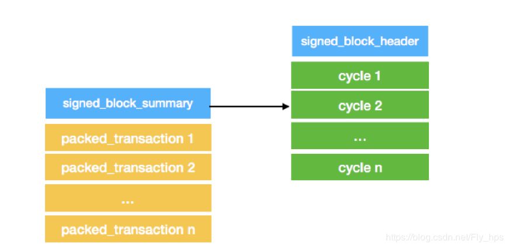

# EOS代码架构及分析（三）

[TOC]

EOS采用DPoS算法和块内分片技术，实现了百万级别TPS的超高性能，可以媲美中心化服务器的处理能力，同时保持去中心化的属性，成为了区块链3.0的代表。那么为什么EOS有如此出色的性能表现？本文将从EOS的核心设计原理以及主要数据结构进行分析。

## 1. EOS vs Bitcoin

我们知道，比特币采用POW共识算法确认区块：

1）Bob向Alice发出一笔转账消息；

2）客户端将消息广播给所有矿工节点，暂存在矿工的交易池中；

3）矿工根据区块的所能容纳的交易数量，从交易池中取出一定量的交易，假设Bob的这笔转账很幸运，或者是手续费给的足够高，刚好被选中打包进区块；

4）矿工开始进行POW计算，10分钟碰撞出结果，将区块打包广播，这次Bob的转账才生效（不考虑6次确认）。


**从此处开始，以下讲的东西都是胡扯。源代码里根本没有的。**


我们可以看到，这种交易确认的效率和传统的中心化金融机构的效率没法比，接下来看看EOS的确认过程。

EOS通过股东投票选举出可信的21个超级节点，然后由他们轮流生产区块，每3秒出一个区块，这样就避免的POW算法的耗时问题，相当于信任提前建立起来。但是3秒的确认时间也是太长了，所以EOS采用块内分片技术，即在区块中维护了一条私有区块链，将一个block分割成多个cycle（循环），每个cycle的生成时间很短，而且不用等待完整的block确认完成（3秒），生成后直接异步广播发送，这样，交易在很快就被确认了。另外，块内分片使交易确认时间更平滑，比如，Bob向Alice的转账信息如果在打包最后时刻发送，那么交易确认时间几乎是0秒，如果在打包开始时刻发送，打包时间则是3秒。



交易时间缩短了，但是面对海量并发的交易数据，还是无法提供高TPS的表现，那么EOS如何解决高并发问题呢？EOS引入了shard概念，在打包cycle的时候，由多个shard并行处理交易信息。每个shard是一个线程，在线程内部的交易是顺序处理的，在线程间的交易是并行处理的。



问题来了，究竟哪些交易可以并行执行，哪些交易只能串行执行？EOS的设计者给出如下解释，涉及同一个账户U的交易A和B，只能包含在同一个cycle中的同一个thread（后来改也叫shard）或者包含在不同cycle的thread中，也就是说涉及相同账户的交易必须串行处理。

简单打个比方，有如下两笔涉及同一个账户的交易：

Transaction A：Bob将账户的10个token转给Alice（Alice的账户最开始为空）；

Transaction B：Alice将接收到的10个token中的5个转给Carol；

如果Transaction B先于A执行，则因为Alice的账户为空，无法转账给Carol，出现验证失败，所以必须保证Transaction A在B前执行。这样，在一个cycle内，生产者可以利用多核多线程并发的处理“不相干”的Transaction，极大的提升交易处理速度。

EOS为了降低最小通信延迟，在一个单独的区块内部实现了两个账户之间的交互通信，而不用等待一个完整的区块时间，而且将信息处理过程尽可能的并行化，提升吞吐量。



## 2. 区块数据结构分析

### 2.1 Block

签名的区块主要由两部分组成：**签名区块摘要**（signed_block_summary）和**交易数据**（input_transactions）。

- 区块摘要用于管理交易数据，相当于交易索引信息，packed_transaction是原始的交易信息，最终保存在数据库中，通过id检索。

```cpp
struct signed_block : public signed_block_summary {
    …
    vector<packed_transaction>   input_transactions;
};
```

- 签名区块摘要主要包含签名区块头部（signed_block_header）和包含的cycle集合（cycles_summary）。

```cpp
struct signed_block_summary : public signed_block_header {
	vector<region_summary>    regions;
};

struct region_summary {
    uint16_t region = 0;
    vector<cycle>    cycles_summary;
};
```



- 区块头部主要包括前一个区块的hash值、区块时间戳、交易信息默克尔树根、智能合约默克尔树根、生产者等信息。

```cpp
struct block_header{
    …
    block_id_type                    previous;  // 前一个区块的hash值
    block_timestamp_type             timestamp; // 区块时间戳
    checksum256_type                 transaction_mroot; // 交易信息默克尔树根
    checksum256_type                 action_mroot;
    checksum256_type                 block_mroot;
    account_name                     producer; // 生产者
    /** The producer schedule version that should validate this block, this is used to
    * indicate that the prior block which included new_producers->version has been marked
    * irreversible and that it the new producer schedule takes effect this block.
    */
    uint32_t                          schedule_version = 0;
    optional<producer_schedule_type>  new_producers;
}
```

在生产者打包区块时，通过_generate_block函数完成对区块头部信息的赋值，其中交易信息的索引信息通过默克尔树组织起来，便于信息检索和分块校验。

```cpp
chain_controller::_generate_block () {
    …
    _pending_block->timestamp   = when;
    _pending_block->producer    = producer_obj.owner;
    _pending_block->previous    = head_block_id();
    _pending_block->block_mroot=get_dynamic_global_properties().block_merkle_root.get_root();
    _pending_block->transaction_mroot = _pending_block_trace->calculate_transaction_merkle_root();
    _pending_block->action_mroot = _pending_block_trace->calculate_action_merkle_root();
    …
}
```

### 2.2 Cycle

cycle可以理解为block内部的私有区块，主要用于提升交易确认速度，不需要等待一个完整block打包时间。一个cycle内部包含一个shard（分片）集合，cycle和cycle之间是串行处理打包的。

```cpp
typedef vector<shard_summary>    cycle;


 


struct shard_summary {


 


…


 


vector<transaction_receipt>   transactions; /// new or generated transactions


 


};
```


### 2.3 Shard

分片结构中包含一系列交易索引信息，一个分片内部的交易是串行处理的，分片之间的交易可以并行处理。交易索引信息主要用于通过交易id在数据库中查找对应的交易信息。

```cpp
struct shard_summary {


 


…


 


vector<transaction_receipt>   transactions; /// new or generated transactions


 


};


 


struct transaction_receipt {


 


fc::enum_type<uint8_t,status_enum>  status;


 


fc::unsigned_int                    kcpu_usage;


 


fc::unsigned_int                    net_usage_words;


 


transaction_id_type                 id;


 


}
```

