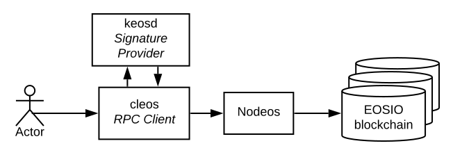

# eos 相关网站

- 官方 —— <https://developers.eos.io/>
- github —— <https://github.com/EOSIO/eos>
- eos中文社区 —— <https://eosfans.io/>
- 某个区块浏览器 —— <https://eospark.com/>
- EOS开发系列目录_币乎 —— https://bihu.com/article/293974
- EOS.IO中文文档 —— https://eos.readthedocs.io/zh_CN/latest/

## eos架构图

## 操作

- [安装和运行单节点](eosio.start.md)
- [钱包命令](eosio.wallet.md)
- [创建账户](eosio.account.md)
- [合约开发工具包 —— eosio.cdt](eosio.cdt.md)
- [系统智能合约部署及转账](eosio.contract.md)
- [hello智能合约](eosio.hello.md)

### 扩展操作

- [eos 9大系统账户名称及作用](eosio.sysaccount.md)

- [eos 同步数据及支持mongodb存储节点搭建](eosio.sync.md)

- [eos多节点环境配置](eosio.multinode.md)

### 源码学习

- [EOS系列 - 源码框架剖析（v1.7.2）](eosio.src.md)
- **EOS代码架构及分析**
  - [01](src01/01.md)
  - [02](src01/02.md)
  - [03](src01/03.md)
  - [04](src01/04.md)
- **EOS源码分析**
  - [01](src02/01.md)
  - [02](src02/02.md)
  - [03](src02/03.md)
  - [04](src02/04.md)

最后一个不可逆块(LIB)是最近被2/3的块生成器所承认的块。
