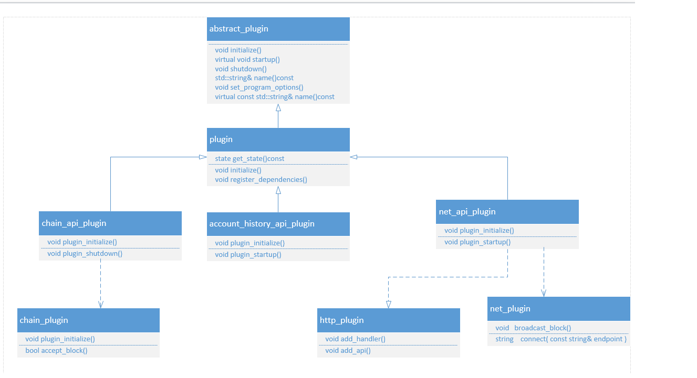

# EOS整体介绍

## 1. EOS的插件式设计

EOS中，虽然编程的复杂度和设计较比特币大幅提高，但其核心的思想其实并没有多大改变，目前来看，仍然以BOOST的signal,boost::asio的信号消息机制来完成模块间的解耦。相比比特币来言，做得更优雅，封装也更良好。

先看一下插件设计的整体类图：



从上面的类图可以清楚的看到，整个插件的依赖和传导机制。然后在下面的流程分析中会详细说明一下它的具体的应用。

## 2. EOS的整体流程

EOS的版本做了一次比较大的更迭，至少从形式上看是，它的生成路径下，完成了以下几个目标：

cleos:客户端，用来处理和区块链通信。帐户钱包等的管理。

eosio-abigen:二进制ABI的生成程序。

eosio-launcher:简化了eosd节点跨局域网或者跨更宽泛的网络的分布。

keosd:钱包和帐户的实现控制程序

nodeos:核心的节点程序，这个和老版本不一样了，至少名字不一样了。


一般情况下会启动cleos调用keosd来创建帐户和钱包。然后通过启动nodeos来产生节点，进行通信并根据配置生成区块和验证。进入重点，直接看一下 nodeos的创建代码：


``` c++
int main(int argc, char** argv)
{
   try {
      app().set_version(eosio::nodeos::config::version);
      auto root = fc::app_path();
      app().set_default_data_dir(root / "eosio/nodeos/data" );
      app().set_default_config_dir(root / "eosio/nodeos/config" );
      //这里直接初始化了四个插件
      if(!app().initialize<chain_plugin, http_plugin, net_plugin, producer_plugin>(argc, argv))
         return -1;
      initialize_logging();
      ilog("nodeos version ${ver}", ("ver", eosio::nodeos::config::itoh(static_cast<uint32_t>(app().version()))));
      ilog("eosio root is ${root}", ("root", root.string()));
      app().startup();
      app().exec();
   } catch (const fc::exception& e) {
      elog("${e}", ("e",e.to_detail_string()));
   } catch (const boost::exception& e) {
      elog("${e}", ("e",boost::diagnostic_information(e)));
   } catch (const std::exception& e) {
      elog("${e}", ("e",e.what()));
   } catch (...) {
      elog("unknown exception");
   }
   return 0;
}

```
代码看上去并不多，当然，比之比特币最新中的几行代码来看，还是要稍有复杂的感觉，但是还可以承受，不过，随后可能c++技能的消耗水平会极剧增加。忽略开前几行的相关文件配置直接进行初始化代码看看去。


``` c++

template<typename... Plugin>
bool                 initialize(int argc, char** argv) {
   return initialize_impl(argc, argv, {find_plugin<Plugin>()...});
}
```
没啥，一个向量的初始化。不过有一个变参模板，如果想深入学习的得去看看相关资料。


``` c++
bool application::initialize_impl(int argc, char** argv, vector<abstract_plugin*> autostart_plugins) {
   set_program_options();//设置命令选项

   bpo::variables_map options;//声明保存结果变量
   bpo::store(bpo::parse_command_line(argc, argv, my->_app_options), options);//分析参数并保存

   if( options.count( "help" ) ) {
      cout << my->_app_options << std::endl;
      return false;
   }

   ......

   //分析配置文件
   bpo::store(bpo::parse_config_file<char>(config_file_name.make_preferred().string().c_str(),
                                           my->_cfg_options, true), options);

   if(options.count("plugin") > 0)
   {
      auto plugins = options.at("plugin").as<std::vector<std::string>>();
      for(auto& arg : plugins)
      {
         vector<string> names;
         boost::split(names, arg, boost::is_any_of(" \t,"));
         for(const std::string& name : names)
            get_plugin(name).initialize(options);//分步初始化第一步，获取指定名插件并初始化，其它类同
      }
   }
   //下面是注册插件，并查寻依赖的相关插件，然后调用，并初始化
   for (auto plugin : autostart_plugins)
      if (plugin != nullptr && plugin->get_state() == abstract_plugin::registered)
         plugin->initialize(options);//分步初始化第一步，获取指定名插件并初始化，其它类同

   bpo::notify(options);//更新最新参数至options

   return true;
}

```
里面反复的参数控制代码略过了。里面主要是使用了BOOST的参数解析和更新机制


这里的调用很简单，其实就是从map里查找相关的插件，用类名和字符串，这里面用到了BOOST中的一些库boost::core::demangle(typeid(Plugin).name()),用来返回类型的名字。然后再用名字的字符串查找出插件。这里面有一个问题，为什么从plugins这个map中可以查找出对象，仔细看一下有些插件的CPP文件中会有类似的代码：


``` c++
static appbase::abstract_plugin& _net_plugin = app().register_plugin<net_plugin>();
```

静态注册了啊。但是有一些插件里没有啊，怎么回事儿？其实接着看代码就发现了问题所在。如下：


``` c++
virtual void initialize(const variables_map& options) override {
   if(\_state == registered) {
      \_state = initialized;
      //分步初始化，第二步
      static_cast<Impl*>(this)->plugin_requires([&](auto& plug){ plug.initialize(options); });//初始化此插件依赖的插件,并递归调用依赖插件
      static_cast<Impl*>(this)->plugin_initialize(options);  //初始化插件
      //ilog( "initializing plugin ${name}", ("name",name()) );
      app().plugin_initialized(*this);//保存启动的插件
   }
   assert(\_state == initialized); /// if initial state was not registered, final state cannot be initiaized
}
```

plugin_requires，这个函数的定义就通过宏来产生了。


``` C++
//先看一个调用实现
class chain_plugin : public plugin<chain_plugin> {
public:
   APPBASE_PLUGIN_REQUIRES()
......
};
#define APPBASE_PLUGIN_REQUIRES_VISIT( r, visitor, elem ) \
  visitor( appbase::app().register_plugin<elem>() );

#define APPBASE_PLUGIN_REQUIRES( PLUGINS )                               \
   template<typename Lambda>                                           \
   void plugin_requires( Lambda&& l ) {                                \
      BOOST_PP_SEQ_FOR_EACH( APPBASE_PLUGIN_REQUIRES_VISIT, l, PLUGINS ) \
   }
//再看另外一个调用实现
class producer_plugin : public appbase::plugin<producer_plugin> {
public:
   APPBASE_PLUGIN_REQUIRES((chain_plugin))
......
};

```

就这样，基础的插件和基础插件依赖的插件，就这么被一一加载初始化。


## 3. EOS的程序技术特点


### 3.1 使用了较多的宏，并配合BOOST库。


在EOS的代码中，可以隐约看到类似MFC的代码实现机制，举一个例子：


``` C++
#define FC_CAPTURE_AND_RETHROW( ... ) \
   catch( fc::exception& er ) { \
      FC_RETHROW_EXCEPTION( er, warn, "", FC_FORMAT_ARG_PARAMS(__VA_ARGS__) ); \
   } catch( const std::exception& e ) {  \
      fc::exception fce( \
                FC_LOG_MESSAGE( warn, "${what}: ",FC_FORMAT_ARG_PARAMS(__VA_ARGS__)("what",e.what())), \
                fc::std_exception_code,\
                BOOST_CORE_TYPEID(decltype(e)).name(), \
                e.what() ) ; throw fce;\
   } catch( ... ) {  \
      throw fc::unhandled_exception( \
                FC_LOG_MESSAGE( warn, "",FC_FORMAT_ARG_PARAMS(__VA_ARGS__)), \
                std::current_exception() ); \
   }

FC_CAPTURE_AND_RETHROW( (t) )
```
包括前面提到的递归调用插件化的宏定义，再通过上面的调用实现对比，基本上是以动态生成代码为主，在比特币也有类似的实现，但规模和应用要小得多。


### 3.2 模板的使用普及化


在工程代码上广泛使用了模板，看一下插件的例子：


``` c++
template<typename Impl>
class plugin : public abstract_plugin {
   public:
      plugin():\_name(boost::core::demangle(typeid(Impl).name())){}
      virtual ~plugin(){}

      virtual state get_state()const override         { ... }
      virtual const std::string& name()const override { ... }

      virtual void register_dependencies() {
.......
      }

      virtual void initialize(const variables_map& options) override {
......
      }

      virtual void startup() override {
......
      }

      virtual void shutdown() override {
......
      }

......
};
```


### 3.3 更深入的绑定使用了c++1X和BOOST

这个就非常明显了，试举一个简单的例子：


``` c++
//c++11语法糖
for (const auto& at: trx_trace.action_traces) {
   for (const auto& auth: at.act.authorization) {
      result.emplace_back(auth.actor);
   }

   result.emplace_back(at.receiver);
}
//BOOST的网络通信
using boost::asio::ip::tcp;
unique_ptr<tcp::acceptor>        acceptor;
std::unique_ptr<class net_plugin_impl> my;
void net_plugin::plugin_startup() {
   if( my->acceptor ) {
      my->acceptor->open(my->listen_endpoint.protocol());
      my->acceptor->set_option(tcp::acceptor::reuse_address(true));
      my->acceptor->bind(my->listen_endpoint);
      my->acceptor->listen();
      ilog("starting listener, max clients is ${mc}",("mc",my->max_client_count));
      my->start_listen_loop();
   }

   my->chain_plug->chain().on_pending_transaction.connect( &net_plugin_impl::transaction_ready);
   my->start_monitors();

   for( auto seed_node : my->supplied_peers ) {
      connect( seed_node );
   }
}
```
目前初步看来，EOS对BOOST和c++14的依赖更深。
