# 写给技术小白的以太坊完整工作原理和运行机制

* 以太坊就是一个保存了数字交易永久记录的公共数据库
* 这个数据库不需要任何中间方来维护和双方的权益.
* 它可以作为一种「无需信任」交易系统来运作，也就是你可以在不需要第三方的情况下进行点对点交易

## 1. 区块链的定义

区块链是具有「共享状态的加密安全交易单机」。

* 「加密安全」是指，数字货币的创造是通过复杂的数学算法来保证的，而这些算法很难破解.

* 「交易单机」是指，有一个机器的单个实例，就可以负责系统中产生的所有交易。 换句话说，每个人都相信「一个单一的全局真相」。

* 「共享状态」意思是，在这一系统中所存储的状态对每个人都是透明和开放的。

## 2. 以太坊区块链算法

以太坊区块链本质上是一个为交易服务的状态机。在计算机科学中，一个状态机指的是这样一种东西，它可以读取一系列的输入，并基于这些输入产生一个新的状态。

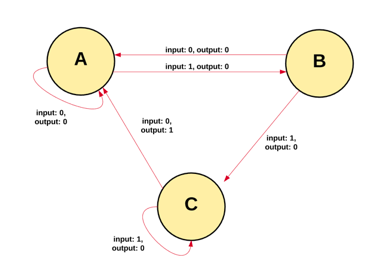

以太坊状态机的运行从一个「元状态」开始，这类似于在网络上没有发生任何交易之前的一块空白石板。当交易执行时，这个元状态就转变为一些最终状态。在任何时候，这个最终状态都代表着以太坊区块链的现状。

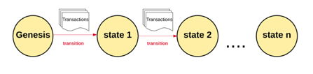

以太坊系统中运行着数百万笔交易，这些交易被分组归类为「区块」。一个区块包含一系列交易，每个块与其前面的区块串联在一起。

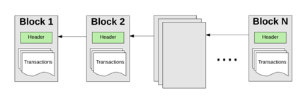

要从一个状态转到另一个状态，必须证明交易是有效的。如果一个交易被认为是有效的，就必须通过一个验证过程，这一过程称为「挖矿」。挖矿是指一组节点（即计算机）消耗它们的计算资源来创建一个有效交易的区块。

网络中任何声明自己是「矿工」的节点都可以尝试创建和验证区块，全世界有许多矿工试图同时创建和验证区块。每个矿工在向区块链提交一个区块时同时，都要提供一个数学的「证明」，且把这个证明作为一个保证：如果这个数学证明存在，则该区块必然是有效的。

如果要在主区块链上添加一个区块，矿工必须比其他竞争对手更快地对其证明。通过让矿工提供数学证明来验证每个区块的过程被称为「工作量证明」。

一个矿工如果验证了一个新的区块，这个验证工作就会得到一定数额的价值回报。这个价值是多少呢？以太坊区块链使用了一种内部数字令牌，叫做「以太币」。 每当一个矿工证明了一个区块，就会生成并得到一个新的以太币。

正如我们在上文给区块链的定义，区块链是一个具有共享状态的交易单机。这个定义决定了，区块链的当前状态是一个单一的全局状态，每个人都必须接受。如果拥有多个状态（或链条）会破坏整个系统，因为人们不可能就哪个状态是正确的状态达成一致意见。如果这些链条是分开的，就会出现一个人在一条链上有10个以太币，在另一条链上有20个的情况。在这种情况下，我们没有办法确定哪一个链条最「有效」，无法确定哪个人有多少硬币。

多条链的产生，被称为「分叉」。因为分叉会破坏系统，因此我们通常会避免分叉，迫使人们选择他们「相信」的链条。

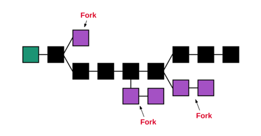

为了确定哪个路径是最有效的，并防止分叉的发生，以太坊使用了一种叫做「GHOST协议」的机制。
`GHOST = Greedy Heaviest Observed Subtree`

简单地说，GHOST协议让我们必须选择在链上做最多计算的路径。确定该路径的一种方法是使用最新区块的数量，来表示当前路径中的区块总数（不计算起源块）。块数越多，路径越长，挖矿的难度越大，最终就一定会到达最新区块。使用这个方式让我们对当前区块链状态的唯一版本达成一致。

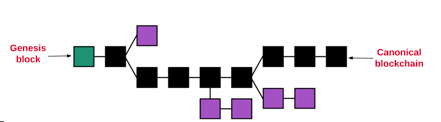

到这里，我们就对以太坊区块链就有了一个宏观的认识，接下来我们就更深入地看看以太坊系统的主要组成部分:

* 帐户；
* 状态；
* Gas与费用；
* 交易；
* 区块；
* 交易执行；
* 挖矿；
* 工作量证明。

## 3. 以太坊的帐户

以太坊的全球「共享状态」是由许多账户组成的，它们能够通过一个消息传递框架相互通信。每个帐户都有一个与它关联的状态和一个20字节的地址。以太坊的地址是一个160位比特的标识符，用于识别帐户。

### 3.1 以太坊有两种账户类型

* 外部帐户由私人密钥控制，没有与之相关的代码。
* 合约账户由其合约代码控制，并具有与其相关的代码。

外部账户可以通过创建和使用其私人密钥签署一项交易，向其他外部账户或其他合约账户发送消息。两个外部账户之间的消息只是一种价值转移。但从一个外部帐户到一个合约账户的消息会激活合约账户的代码，使它能够执行各种操作（例如转移代币、写入内存、生成新的代币、执行一些计算、创建新合约等）。

与外部账户不同，合约账户不能自行启动新的交易。相反，合约账户只能根据它们收到的其他交易（从外部账户或从另一个合约账户）进行交易，这点我们会在下文进行探讨。

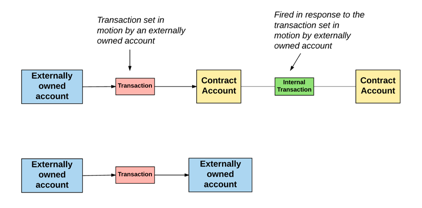

因此我们可以得出结论：在以太坊区块链上发生的任何操作都是由外部控制账户的交易引起的。

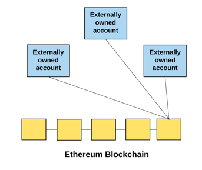

### 3.2 帐户状态

无论帐户是哪种类型，帐户状态都由以下四个部分组成。

* nonce：如果帐户是一个外部帐户，这个数字代表从帐户地址发送的交易数量。如果帐户是一个合约帐户，nonce是帐户创建的合约数量。
* balance：这个地址拥有的Wei（以太坊货币单位）数量，每个以太币有1e+18 Wei。
* storageRoot ：一个Merkle Patricia树根节点的哈希，它对帐户的存储内容的哈希值进行编码，并默认为空。
* codeHash：EVM（以太坊虚拟机）的哈希值代码。 对于合约帐户，这是一个被哈希后并存储为codeHash的代码。对于外部帐户，codeHash字段是空字符串的哈希。

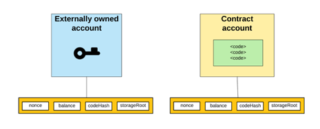

## 4. 全局状态

我们知道以太坊的全局状态包括帐户地址和帐户状态之间的映射，这个映射存储在一个数据结构中，这种结构被称为Merkle Patricia树。

Merkle Patricia树是一种由一组树状节点构成的二进制结构，它包括:

* 底层有大量的叶子节点，其中包含了潜在的数据；
* 一组中间节点，其中每个节点是其两个子节点的哈希；
* 一个单个的根节点，也是由它的两个子节点的哈希形成的，代表树的顶部。

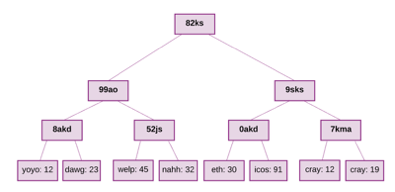

树的底部数据是通过把我们想要存储的数据分割成块后而生成的，然后将这些数据块分成几个桶，然后对每个桶的进行哈希迭代，值到剩下的哈希总数变为一个根哈希。  

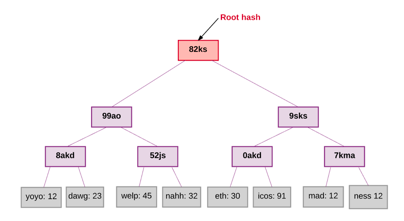

此外，树需要存储在里面的每一个值的密钥。从树的根节点开始，密钥告诉你要遵循哪个子节点来获取相应的值，这些值存储在叶子节点中。在以太坊中，状态树的键值对是地址和相关帐户之间的映射，包括每个帐户的balance、nonce、codeHash和storageRoot（storageRoot本身就是一棵树）。

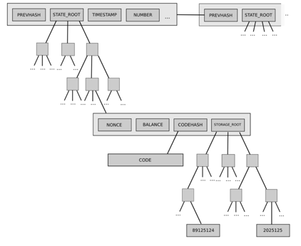

同样的树结构也用于存储交易和收据。更具体地说，每个块都有一个「header」，它存储三个不同Merkle树结构根节点的哈希，包括:

1. 状态树；
2. 交易树；
3. 收据树。

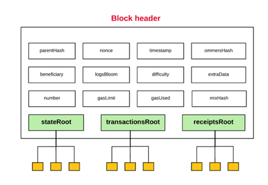

Merkle树能够高效存储信息的特性在以太坊系统中十分被看重，我们可以称之为「轻节点」或「轻客户端」，其实区块链的节点有两种：完整节点和轻节点

一个完整的节点需要下载完整的链，从元区块到当前的头部块，执行所有的交易也都包含其中。通常情况下，矿工储存完整的档案节点，因为他们必须这样做才能完成挖矿的过程。当然，也可以在不执行交易的情况下下载完整的节点。无论如何，任何完整的节点都包含整条链。

轻节点的概念与之相对，除非一个节点需要执行每个交易或查询历史数据，否则就没有必要存储整个链。这就是轻节点的意义所在。轻节点并不下载和存储完整链并执行所有的交易，而是只下载从元区块到当前头部区块的信息，而不执行任何交易或检索任何关联状态。因为轻节点可以访问包含三个树的区块头部哈希，所以仍然可以很容易地生成和接收关于交易、事件、余额等可验证的结果。

这样做的原因是因为Merkle树中的哈希会向上传播ーー如果一个恶意用户试图将一个伪造的交易交换到Merkle树的底部，这种变化将导致上面节点的哈希变化，也将改变上面节点的哈希值。

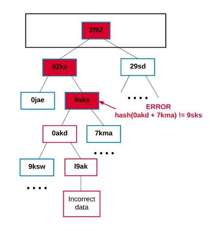

任何想要验证一段数据的节点都可以使用所谓的「Merkle证明」来执行。一个Merkle 证明包括：

1. 需要验证的大量数据及其哈希值；
2. 树的根哈希；
3. 「分支」（所有的参与者的哈希沿着路径上升，一直到「树根」）。

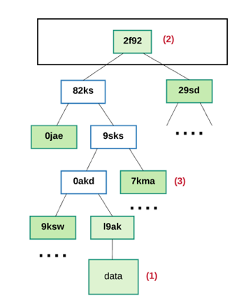

任何读取该证明的人都可以验证树上所有的分枝是否一致，因此给定的数据块实际上位于树中的某个位置。

总之，使用Merkle树的好处是，该结构的根节点依据树中存储的数据进行加密，因此根节点的哈希可以作为该数据的安全证明。由于区块头包括状态、交易和收据树的根哈希。因此任何节点都可以在不需要存储整个状态的情况下，验证以太坊的一小部分状态，而整个状态的大小可能是无限的。

## 5. Gas和支付

在以太坊中，费用的计算是一个非常重要的概念。在以太坊网络上进行的每一笔交易都会产生费用ーー没有免费的午餐！这笔费用被称为「Gas」。

Gas Price是指：你愿意花在每一个单位Gas上的以太币数量，是用「gwei」来计算的。Wei是以太币中最小的单位，其中1018 Wei代表1个以太币。一个gwei是1,000,000,000 Wei。

每次交易，发送方都要设置一个Gas Limit和Gas Price。Gas Limit和Gas Price代表发送方愿意为执行交易支付的最大金额。

例如，发送方将Gas Limit设置为50,000，一个Gas Price设置为20 gwei。这意味着发送者愿意花费最多50,000 x 20 gwei，也就是：1,000,000,000,000,000 Wei（0.001以太币）来执行这一交易。

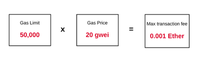

这里需要留意的是，Gas限额是发送方愿意花钱的最大限度。如果他们的账户余额中以太币的数量大于这个最大值，那么他就可以进行交易。在交易结束时，发送方将被退还的那些未使用的Gas，按原来的价格进行兑换。

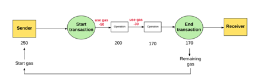

如果发送方没有提供执行交易所必需的Gas，则该交易运行的结果会是「余额不足」，并被认为无效。在这种情况下，交易处理中止，其间的产生的任何状态都会发生逆转，这样就可以在交易发生之前返回到以太坊区块链。此外，交易失败的记录会被记录下来，显示尝试过哪些交易，失败了哪些交易。由于系统已经在Gas用光之前做完了运算工作，所以从逻辑上看，Gas不会被退还给发送方。

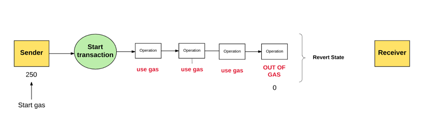

那么，这些Gas的钱到底去哪了呢？发送方花在Gas上的所有钱都寄给了「受益人」地址，也就是矿工地址。由于矿工们正在努力运行计算和验证交易，所以收到了Gas作为奖励。

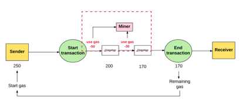

通常情况下，发送方愿意支付的Gas价格越高，矿工从交易中获得的价值就越大，矿工们也就越有可能选择这个交易。通过这种方式，矿工可以自由地选择交易。为了给发送者设置Gas Price做参考，矿工们可以直接提出他们执行交易所需的最低Gas Price。

### 5.1 存储费用

Gas不仅用于支付计算的费用，还用于支付存储的使用费用。存储的总费用与使用的32字节的最小倍数成正比。

存储费用与交易费用有一些不同。由于增加的存储量增加了所有节点上的以太坊状态数据库的大小，所以存储数据的数量会变小。由于这个原因，如果一个交易有一个步骤可以清除存储中的条目，则可以免除执行该操作的存储费用，并且还能因此得到退款。

#### 5.1.1 费用的目的是什么？

以太坊工作方式的一个重要方面是，网络执行的每一个操作都同时受到每个完整节点的影响。然而，在以太坊虚拟机上的计算步骤非常昂贵。因此，以太坊智能合约更适合简单的任务，比如运行简单的业务逻辑或验证签名和加密其他对象，而不适合更复杂的用途，比如文件存储、电子邮件或机器学习，这些都会给网络带来压力。收费的目的就是使整个网络不会因用户的不当使用而变得负担过重。

除此之外，以太坊是一种图灵完整语言（图灵机是一种能够模拟任何计算机算法的机器）。这就允许了循环，使得以太坊区块链容易受到暂停问题的影响，因为在这个问题中，无法确定一个程序是否会无限运行。如果没有费用，意图不良的人可以通过在交易中执行一个无限循环来扰乱网络，从而产生不良的影响。因此，费用保护了网络免受蓄意攻击。

那么，为什么我们还要支付存储费用呢？就像计算一样，在以太坊网络上的存储也是整个网络必须承担的一个成本。

## 6. 交易与消息

我们在上面说到，以太坊是一个基于交易的状态机。换句话说，不同账户之间发生的交易正是以太坊从一个状态转移到另一个状态的原因。

因此，交易可以看做是一个由外部拥有的帐户生成的序列化加密签名指令，然后提交给区块链。

交易分为两类：「`消息调用`」和「`合约创建`」（创建新的以太坊合约的交易）。不管哪一类，所有交易都包含以下组件：

* Nonce：发送方发送的交易数量的计数；
* gasPrice：发送方愿意支付每单位Gas所需执行交易的Wei数量；
* gasLimit：发送方愿意支付的执行这一交易的Gas最大数量。这个数额是预先设定和支付的；
* to：接收方的地址，在创建合约的交易中，合约帐户地址还不存在，因此使用了空值；
* Value：从发送方转移到收件方的金额，在创建合约的交易中，这个Value作为新创建合约账户内的起始余额；
* v, r, s：用于生成识别交易发送方的签名；
* Init（只存在于创建合同的交易中）：用于初始化新合约帐户的EVM代码片段，它只运行一次，然后被丢弃，当init第一次运行时，它会返回帐户代码的主体，这个代码是与合约帐户永久关联的一段代码；
* data（只存在于消息调用中的可选字段）：消息调用的输入数据（即参数）。例如，如果一个智能合约充当域名注册服务，那么对该合约的调用可能会有诸如域名以及IP地址等输入字段。

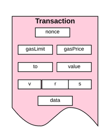

在说「账户」的时候，我们看到，交易（包括消息调用和合约创建的交易），总是由外部账户启动并提交给区块链的。另一种思考方式是，交易是连接外部世界与以太坊内部状态的桥梁。

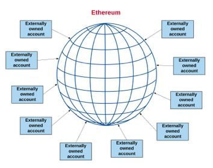

但这并不意味着一个合约不能与其他合约对话。在全局范围内存在的合约，可以与同一范围内的其他合约进行交流。它们是以通过「消息」或「内部交易」的方式来实现的。我们可以认为消息或内部交易类似于交易，其主要区别在于它们不是由外部账户所产生的，相反，是由合约产生的，是虚拟对象。与交易不同，合约不是序列化的，而是只存在于以太坊的执行环境中。

当一个合约将一个内部交易发送到另一个合约时，存在于接收方合约账户上的关联代码就会被执行。

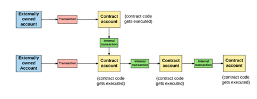

需要注意的一点是，内部交易或消息不包含Gas Limit。这是因为Gas Limit是由原始交易的外部创建者（即部分外部帐户）来决定的。外部账户集合的Gas Limit必须足够高，以便进行交易，这包括由这一交易而导致发生的任何次级处理运行，例如合约对合约的消息。如果在交易和消息链中，特定的消息执行耗尽了Gas，那么该消息的执行将与执行引发的所有后续消息一起恢复。不过，上一级的执行不需要恢复。

## 7. 以太坊的区块

所有的交易都被组合成「区块」，区块链则包含一系列这样被链接在一起的区块。在以太坊中，一个区块包括「区块头」、关于包含在此区块中交易集的信息，与当前块的ommers相关的一系列其他区块头Ommer解释

### 7.1 Ommer是什么？

比起比特币之类的区块链，以太坊的构建方式使区块生成时间要低很多。这样可以更快地处理交易。然而，缩短区块生成时间的一个缺点是，矿工们要找到更多相互竞争的区块解决方案。这些相互竞争的区块也被称为「孤儿区块」，不能进入主链。

Ommer的目的是帮助奖励矿工，也包括这些孤儿区块。矿工的ommer必须是「有效的」，也就是说在目前区块的第六代或更小的范围内。六代之后，陈旧的孤儿区块就不能再被引用。比起完整的区块，Ommer块获得的奖励要小一些。尽管如此，矿工们仍然有一定的动力去挖掘这些孤儿区块并获得回报。

### 7.2 区块头

回到区块本身，之前提到每个区块都有一个区块头，但到底什么什么是区块头？区块头是区块的一部分，包括：

* Parenthash：一个父区块头的哈希（这就是为什么区块链被称为区块「链」）；
* Ommershash：当前区块ommer列表的哈希；
* beneficiary：收取采矿费用的帐户地址；
* Stateroot：状态树的根节点哈希；
* transactionsRoot：包含在此区块中列出的所有交易树根节点的哈希值；
* receiptsRoot ：包含本区块中列出的所有交易树根节点的哈希的收据；
* logsBloom：一个由log组成的Bloom过滤器（数据结构）；
* difficulty：这个区块的难度水平；
* number：当前区块的记数（元区块的编号为0；每个后续区块的块数增加1）；
* gasLimit：当前每个区块的Gas限制；
* gasUsed：本区块交易所使用的总Gas之和；
* timestamp：这个区块注入的unix时间戳；
* extraData：与此区块相关的其他数据；
* mixHash：当与nonce结合时，证明这个区块执行了足够计算的哈希值；
* Nonce：当与mixHash结合时，证明这个区块已经执行了足够计算的哈希值；

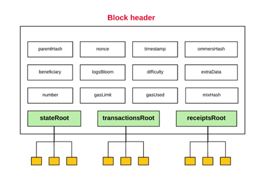

每个区块头包含三个树结构：

* 状态根（stateRoot）；
* 交易根（transactionsRoot）；
* 收据根（receiptsRoot）。

这些树结构只不过是之前讨论过的Merkle树而已，没有什么特别的。不过，从上面的描述中可以看到，有一些术语还需要进一步说说。

### 7.3 日志（Log）

以太坊允许log跟踪各种交易和消息。合约也可以通过定义需要记录的「事件」来显式生成log。

一条log包含：

* 记录器的帐户地址；
* 一系列主题，它们表示此交易所进行的各种事件;
* 任何与这些事件有关的数据。

log存储在一个bloom过滤器中，它以有效的方式存储海量的日志数据。

### 7.4 交易收据

区块头中存储的日志来自于交易收据中包含的日志信息。就像在商店买东西时收到收据一样，以太坊会为每笔交易生成一张收据。不出所料，每张收据都包含有关交易的某些信息。 这样的收据包括以下内容:

* 区块编号；
* 区块哈希；
* 交易哈希；
* 当前交易所使用的Gas；
* 在当前交易执行后，当前区块中使用的Gas；
* 执行当前交易时创建的日志。

### 7.5 区块的难度

区块的「难度」用于在验证区块的时间内来加强一致性。元区块的难度为131,072，并用一个特殊的公式来计算后面每个区块的难度。如果某个区块比前一个区块更快地被验证，那么以太坊协议会增加该区块的难度。

该区块的难度会影响nonce，这是一个哈希，必须在挖矿时使用工作量证明算法来计算。

区块的难度与nonce之间的关系在数学上表示为:

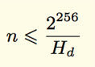

这里Hd代表了难度。找到满足难度阈值的nonce的唯一方法是使用工作量证明算法来枚举所有的可能性。 寻找解决方案的预期时间与难度成正比，难度越大，找到nonce就越困难，因此验证区块的难度就越大，这反过来增加了验证新区块的时间。通过调整区块的难度，协议可以调整验证区块的时长。

另一方面，如果验证时间变慢，那么协议就会减少难度。通过这种方式，验证时间可以自我调整从而保持一个常量ーー平均每15秒一个区块。

## 8. 交易的执行

看到这，你已经来到了以太坊协议中最复杂的部分之一。假设将一个交易发送到以太坊网络进行处理，如果以太坊状态要将你的交易包括在内，会发生什么？

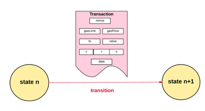

首先，所有交易都必须满足初始的一组需求才能执行。 其中包括以下几个部分。

* 交易必须是正确的RLP格式（RLP是「递归长度前缀」的缩写，是用于二进制数据编码嵌套数组的数据格式，RLP是以太坊使用的序列化对象的格式）。
* 有效的交易签名。
* 有效的交易nonce，回想一下，一个帐户的nonce是从该帐户发送的交易的统计，为了有效，交易nonce必须与发送方帐户的nonce相等。
* 交易的Gas限额必须等于或大于交易所使用的内部Gas， 内部Gas包括：
  1. 为执行交易预先确定的费用为21,000 Gas；
  2. 与该交易一起发送的数据Gas费用（对于每一个等于零的数据或代码的每个字节收取4个Gas，每个非零字节的数据或代码为68个Gas）；
  3. 如果这笔交易是一笔合约创建交易，则额外收取32,000 Gas。

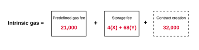

* 发送方的账户余额必须有足够的以太币来支付前期的Gas费用。前期Gas成本的计算很简单：首先，交易的Gas Limit乘以交易的Gas Price，以确定最大的Gas成本。 然后，这个最大的成本被算在从发送方转移到接收方的总额中。

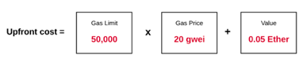

如果交易符合上述有效性的所有要求，那么，就可以进入下一个步骤。

首先，从发送方的余额中扣除执行的前期成本，并将发送方帐户的nonce加1。我们可以计算剩余的Gas，因为交易的Gas Limit要减去所使用的内在Gas。

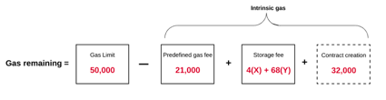

然后，交易开始执行。在交易的整个执行过程中，以太坊都跟踪「子状态」。子状态记录交易中产生的信息，这些信息也是交易完成后所马上需要用到的。具体来说，它包含：

* 自毁集合：交易完成后将丢弃的一组帐户（如果有的话）；
* 日志序列：虚拟机代码执行的存档和可索引的检查点；
* 退款余额：交易完成后退还给发送者账户的余额。

一旦处理完交易中的所有步骤，并假定没有无效状态，则通过确定向发送方退还未使用的Gas数量，来最终判定最终状态。除了未使用的Gas外，发送方还从上文所述的「退款余额」中退还了一些余额。

一旦发送者获得退款：

* Gas（以太币）就会给到给矿工；
* 该交易所使用的Gas被添加到区块的Gas计数器（该计数器记录该区块中所有交易使用的总Gas）；
* 删除自毁集合中的所有帐户（如果有的话）；

最后，只剩下了新的状态和已创建交易的一组log。至此，我们就讲完了交易执行的基本原理，下面再来看看合约创建的交易和消息调用之间的一些差异。

### 8.1 合约创建

前面说过，以太坊的账户分为两类：合约帐户和外部账户。当交易是「契约创建」（Contract Creating）时，意思是，交易的目的是创建一个新的合约账户。

为了创建一个新的合约帐户，我们首先使用一个特殊的公式来声明新账户的地址，然后通过以下方式初始化新帐户：

* 将nonce设置为零；
* 如果发送方在交易中发送了一定数量的以太币作为价值，则将帐户余额设置为该价值；
* 从发送方的余额中扣除这个新账户余额的增加部分；
* 将存储设置为空；
* 将合约的codeHash设置为空字符串的哈希值；

一旦帐户完成了初始化就可以创建帐户了，使用与交易一起发送的init代码。在执行这个init代码的过程中，可能发生很多情况。根据合约的构造函数，它可能更新帐户的存储，创建其他的合约账户，或其他的消息调用，等等。

一旦初始化合约的代码被执行就将开始消耗Gas，交易使用的Gas不能超出账户的余额，一旦超出，将会出现「Gas耗光」的异常并且退出。如果交易由于Gas耗光的异常而退出。

但是，如果发送方在交易中发送了一些以太币，这时合约创建失败也会退还以太币吗？答案是，不会。

如果初始化代码执行成功，则支付最终的合约创建成本。这是一个存储成本，并且与创建合约代码的大小成正比。如果剩余的Gas不足以支付这笔最终成本，那么这笔交易将再次声明为一个「Gas耗光」异常。

如果一切顺利，而且没有遇到任何异常，那么剩余的Gas都会退还给交易的原始发送方，并允许改变状态继续存在！

## 9. 消息调用

消息调用的执行类似于合约创建，但有一些不同之处。

消息调用的执行不包含任何init代码，因为没有创建新的帐户。但是，如果这些数据是由交易发送方提供的，它可以包含输入数据。一旦执行，消息调用也有一个额外的组件，其中包含输出数据，如果后续执行需要此数据，则使用这些数据。

如同合约创建一样，如果由于Gas耗尽或交易无效（例如堆栈溢出、无效的跳转目的地或无效指令），则所使用的任何Gas都不会退还给原来的调用者，取而代之的是，所有剩余的Gas都会被消耗掉，并且状态被重置到余额转移之前的情况。

## 10. 执行模式

现在，我们来看看在VM中，交易实际上是如何执行的。

实际处理交易的部分是以太坊自己的虚拟机，被称为EVM。就像之前定义的那样，EVM是一个「图灵完备」的虚拟机。唯一的不同是EVM有内在Gas的约束。因此，可以完成的计算总量本质上受到所提供Gas数量的限制。

此外，EVM 有一个基于栈机器的架构。栈机器是一种使用「后入先出」的堆栈来保存临时值的计算机。EVM中每个栈条目的大小为256位，最大为1024位。

EVM具有内存，其中存储的条目是字地址字节数组（word-addressed byte arrays）。 内存是易失性的，这意味着它不是永久性的。

EVM还有存储空间。与内存不同，内存的存储是非易失性的，并作为系统状态的一部分来维护。EVM在一个虚拟ROM中独立存储程序代码，只能通过特殊的指令访问虚拟ROM。这就是EVM与典型的冯·诺伊曼结构的不同，冯·诺伊曼结构中程序代码是在内存或存储中。

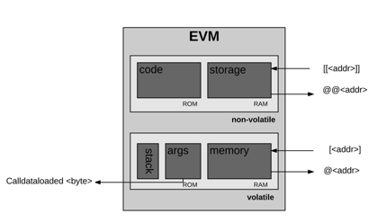

EVM也有自己的语言——EVM字节码。当程序员在以太坊上写智能合约的时候，通常用高级语言写代码，比如Solidity。然后，可以编译成EVM字节码，以便EVM可以理解执行。

接下来我们来看看EVM如何运行。在执行特定的计算之前，处理器要确保以下信息是可用且有效的：

* 系统状态；
* 用于计算的剩余Gas；
* 拥有执行代码的帐户地址；
* 产生此执行交易的发送方地址；
* 引发代码执行的帐户地址（可能与原始发送方不同）；
* 产生此次执行交易的Gas Price；
* 此执行的输入数据；
* 作为当前执行的一部分，价值（以Wei为单位）传递到这个帐户；
* 要执行的机器码；
* 当前块的区块头；
* 当前消息调用或合约创建的栈深度；
* 在执行开始时，内存和栈是空的，程序计数器归零。

然后，EVM递归执行交易，计算系统状态和每个循环的机器状态。简单地说，这个系统状态就是全局状态。机器状态包括:

* 可用的Gas；
* 程序计数器；
* 内存的内容；
* 内存中的字活跃数；
* 栈内容。

栈中条目是从该系列最左边的部分中添加或删除。表现为，在每个循环中，从剩余的Gas中减少适当的Gas，并且程序计数器递增。

在每个循环的结束时，有三种可能性:

1. 机器达到一个特殊状态（例如Gas不足、指令无效、栈条目不足、栈条目溢出超过1024、无效的JUMP/JUMPI等），因此必须停止，任何更改都将被丢弃；
2. 这个序列继续进入下一个循环；
3. 系统被迫停止。

假设执行没有达到一个特殊状态，并达到一个「可控制的状态」或正常停止，那么机器就会生成结果状态、保留执行后剩余的Gas。

说了这么多，终于结束了以太坊中最复杂的部分。即使没有完全理解这部分，也没关系，除非是从事底层的开发工作，否则并不需要真正理解这些细节。

## 11. 一个区块的最终完成

最后，来看看多个交易块是如何最终完成的。

这里所说的「最终」可能是指两种不同的东西，这取决于区块是新的还是已经存在的。如果是一个新区块，「最终」指的是挖掘这个区块所需要的过程。如果是一个现有的区块，那么「最终」指的是验证块的过程。在这两种情况下，对于要到「最终」状态的区块有以下四个要求。

1. 验证（如果是挖矿，就是判定）ommer：每个区块头中的每个ommer区块都必须是一个有效的区块头，并且在当前区块的六代以内。
2. 验证（如果是挖矿，就是判定）交易：区块上的gasUsed数字必须等于该区块中所列交易所使用Gas的累积。
3. 申请奖励（只限于挖矿的情况）：受益人地址被授予5以太币，用于开采该区块。 （根据以太坊EIP-649，这5个ETH的报酬将很快减少到3个)。此外，对于每一个 ommer，当前区块的受益者将额外获得当前区块奖励的1/32。最后，ommer区块的受益人也可以得到一定数额的赔偿。
4. 验证（如果挖矿，计算一个有效的）状态和nonce：确保应用所有交易和由此产生的状态更改，在区块奖励应用于最终交易的结果状态之后，定义新区块的状态。通过检查这个最终状态来验证存储在区块头中的状态。

## 12. 挖矿的工作量证明

将区块难度赋予意义的算法叫做「工作量证明」(PoW)。以太坊的工作量证明算法被称为「Ethash」（之前被称为Dagger-Hashimoto）。

该算法的公式如下：

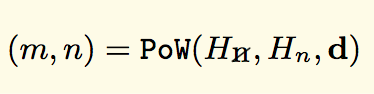

这里m是mixHash、n是nonce、Hn是新区块的头（不包括nonce和mixHash组件）、Hn是块头的nonce、d是DAG（一个大数据集）。

还记得上面谈到的在区块头中存在的mixHash和nonce两个字段吗？

* mixHash是一个哈希，当与nonce结合时，可证明这个区块执行了足够的计算；
* nonce是一个哈希，当与mixHash结合时，可证明这个区块已经执行了足够的计算

PoW的功能就是评估这两个字段。至于如何使用的PoW函数来精确计算mixHash和nonce说起来有点复杂，但从总体上看，它的工作原理是这样的。

每个区块都算出一个「seed」，每个「epoch」对应的seed都不相同，一个epoch相当于3万个区块的长度。在第一个epoch，seed是一系列32字节零的哈希。对于后来的每一个epoch来说，它都是以前seed哈希的哈希。使用seed，一个节点可以计算一个伪随机的「缓存」。

这个缓存非常有用，因为它使之前讨论过的「轻节点」成为可能。轻节点的目的是为了使某些节点能够有效地验证交易，而没有存储整个块环链数据集的负担。一个轻节点可以完全基于这个缓存来验证交易的有效性，因为缓存可以重新生成需要验证的特定区块。

使用缓存，节点可以生成DAG数据集，数据集中的每个项都依赖于缓存中的少量伪随机选择（pseudo-randomly-selected）的项。为了成为一名矿工，必须生成这个完整的数据集；所有客户和矿工都存储这个数据集，并且数据集随时间线性增长。

然后，矿工们可以随机抽取数据集的片段，然后通过数学函数将它们混合成一个mixHash。矿工将反复生成mixHash，直到输出低于预期目标的nonce。当输出满足这个要求时，这个nonce被认为是有效的，并且块可以添加到链上。

### 12.1 挖矿作为一种安全机制

总体而言，PoW的目的是以一种安全加密方式证明工作量，基于特定的计算量生成某些输出（即nonce）。这是因为除了穷举所有可能性之外，没有更好的办法来找到低于要求阈值的nonce。重复应用哈希函数的输出具有均匀分布，因此我们可以确信，找到这样一个nonce所需的平均时间取决于难度阈值。难度越大，解决问题的时间就越长。这样，PoW算法对难度概念赋予了真实的意义，这个概念被用来增强区块链的安全。

那么，区块链安全又是指什么？很简单：就是要创建一个每个人都信任的区块链。正如先前在本文中讨论的那样，如果存在一个以上的链，用户将对其失去信任，因为他们无法合理地确定哪一个链是「有效的」链。为了让一组用户接受存储在块环链上的基本状态，需要一个大家都相信的且单一规范的区块链。

而这正是PoW的作用：它确保一个特定的区块链可以保持规范，使攻击者难以创建新的区块，或者覆盖历史的某一部分（例如擦除交易或创建虚假的交易），或者对一个分叉进行维护。为了验证他们的区块，攻击者需要比网络中的其他任何人都更快地解决nonce问题，这样网络就会相信他们的链条是最重链（基于之前提到的GHOST协议的原则）。这是基本上不可能的，除非攻击者拥有超过一半的网络挖掘能力，因此这种情况被称为「51%攻击」。

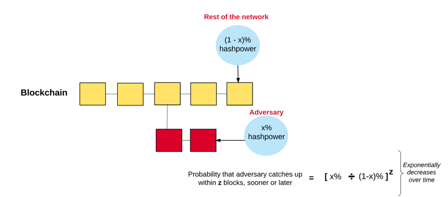

### 12.2 挖矿作为一种财富分配机制

除了确保一个安全的区块链环境，对那些为了提供这种安全而消耗算力的人，Pow还是一种分配财富的方式。回想一下，矿工在开采一个区块时会得到奖励，其中包括：

* 「获胜」区块获得的5以太币（不久将改为3以太币）的奖赏；
* 该区块所包括的交易在区块内消耗的Gas成本；
* 将ommer作为区块的一部分的额外奖励。

从长远来看，为了确保PoW机制在安全和财富分配方面的使用是可持续的，以太坊努力培养它的两个特性：

* 让尽可能多的人能够接触到它，换句话说，人们不应该需要专门的硬件来运行算法，这样做的目的是使财富分配模型尽可能开放，以便任何人都可以根据自身的情况提供计算能力，以换取以太币。
* 减少单个节点（或小集）产生不成比例利润的可能性，任何节点，如果能够获得不成比例的利润，就意味着节点对规范区块链的确定有很大的影响，这会降低网络的安全性。

在比特币区块链网络中，与上述两个属性有关的一个问题是，PoW算法是一个 SHA256哈希函数。这类函数的弱点在于，它可以通过使用专门的硬件更有效地解决问题，也就是所谓的ASIC。

为了解决这一问题，以太坊选择了将PoW算法按顺序存储到内存硬件中。这意味着这个算法是经过设计的，所以计算nonce需要大量的内存和带宽。大量的内存需求使得计算机很难同时使用它的内存来同时发现多个nonce，而且高带宽的要求使得即使是超级计算机也很难同时发现多个nonce。这减少了集中化的风险，也为正在进行验证的节点创建了一个更公平的机制。

需要注意的是，以太坊正在从PoW机制过渡到PoS机制，这又是另一个话题了，希望可以在今后的文章中探讨。

## 13. 结束语

终于到底了，这篇文章是不是有很多东西需要消化？

如果真的对以太坊感兴趣，建议可以多读几次。我也是亲自阅读了以太坊的白皮书和代码，然后才搞清楚以太坊要做的究竟是什么。还是那句话，你无需理解文章的每一个细节，只要力求对整理原理有把握就很不错了。