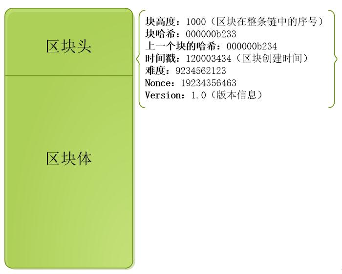
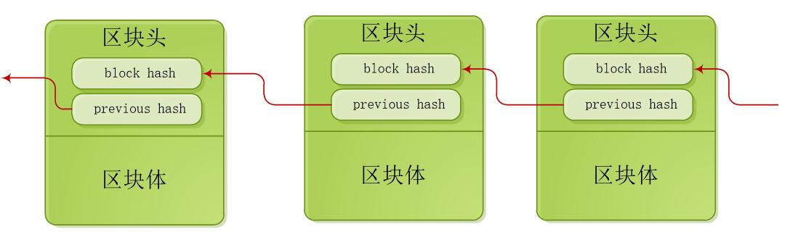

# 区块链技术原理

区块链从字面上理解：数据记录在区块中，通过一定的算法把区块连成一个链。

区块链通过哈希（Hash）算法，生成一串字符串，保存在区块的头部中，一个的区块通过指向上一个Hash值，加入到区块链中；Hash算法是一种加密算法，指对原始信息进行特定的转换运算，换算成对应的加密值（称为Hash值）；是一种单向的加密方式，加密后的密文不可逆推，只有加密过程，没有解密过程；区块链中使用SHA-256算法对区块进行加密。

区块是区块链中的主要数据存储结构，一个区块由区块头和区块体两部分组成，区块头保存着区块之间的连接信息，区块体保存着业务数据信息，区块结构如下：

图：区块

一个区块头中的previous Hash字段，保存着上一个区块的Hash值，通过某个区块就可以找到整个区块链的第一个区块，区块链结构如下：

图：区块链

篡改一个区块时，需要修改区块链中的后面所有区块，计算一个区块的哈希值是极其困难，再加上还需要修改后面的所有区块的哈希什则难上加难，所以篡改区块链中的业务信息就成为几乎不可能做到的事，保证了区块链中数据的可靠性。