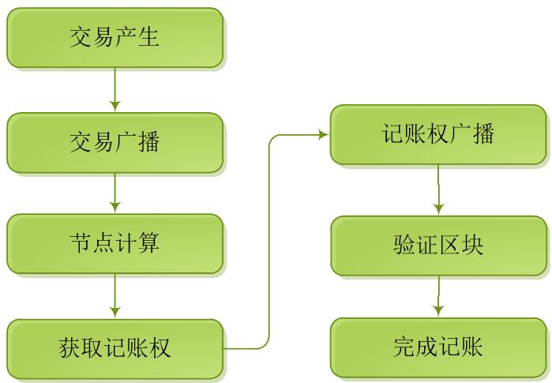

# 区块链工作过程

区块链的工作过程分交易产生、交易广播、节点计算、获取记账权、记账权广播、接收区块、验证区块和完成记账七个过程。

* 交易产生

用户向区块链发了一笔交易信息，将产生交易；

* 交易广播

当一笔新交易产生时，区块链网络会广播出去，网络中的其它节点都会收到该交易信息；

* 节点计算

收到交易信息的节点把新交易放到区块中，通过共识算法决定谁有记账权，共识算法有POW、POS、DPOS、PBFT；

* 获取记账权

根据不同的共识算法，其中一个节点将获取记账权，如POW，使用工作量证明，谁最快计算出，将获取记账权；

* 记账权广播

获取记账权的节点，把区块广播给网络中的所有节点；

* 验证区块

收到广播信息的节点对区块所包含的交易信息进行验证，确认有效后，接收该区块，并在区块链尾部接上新的区块；

* 完成记账

所有节点全部接受该区块后，完成一个新区块上链，网络中的节点，等待下一个交易的产生。