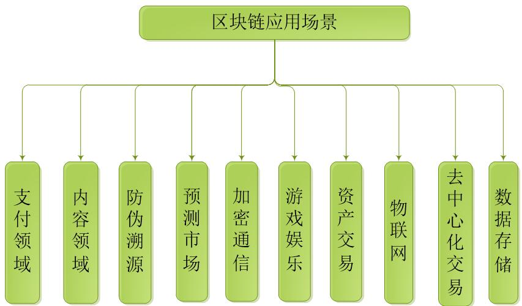

# 区块链应用场景（3.1）

比特币是区块链应用最早的场景，随着比特币安全稳定运行多年以后，数字货币的场景应用遍地开花，各种山寨币泛滥，通过ICO(Initial Coin Offering 首次币发行)就能融到大量资金，上市后的数字货币就像股票一样可以进自由交易，这类应用主流称为区块链1.0。

技术人员通过对比特币等数字货币的技术研究，梳理出数字货币中涉及的各类技术，如加密算法、端对端传输、共识算法，提炼并形成区块链架构理论；在区块链1.0架构的基础上，加上智能合约，应用扩展到金融领域，解决跨境支付与结算、证券发行与交易、贸易金融等行业痛点，可以大幅减少人工核对工作，为金融机构节省成本，形成了区块链2.0。

在金融领域区块链的快速落地的同时，区块链发展到3.0时代，各种行业使用区块链技术去解决本行业的痛点，区块链去中心化、不可篡改和数据本地化存储的特性，给传统的架构方式带来了变革，最终改善人类互信的社会关系。

各类行业应用场景如下：

