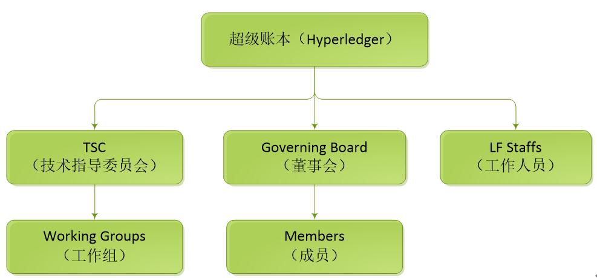
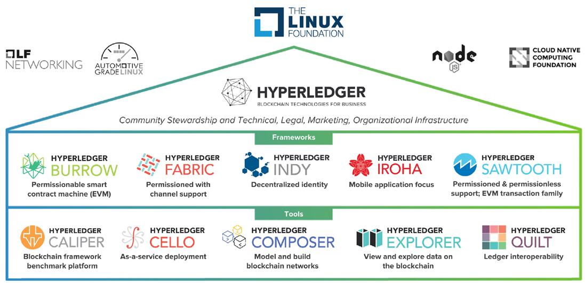

# Hyperledger

## 1. 起源

至比特币开源以来，无数技术人员对其进行研究，并且对该系统经过了无数次改进，超级账本项目（Hyperledger）最初也是用来改善比特币的底层技术，最终由Linux基金会组织发展起来。

开放式账本项目（Open Ledger Project）是超级账本（Hyperledger）前身，由Linux基金会于2015年发起的推进区块链数字技术和交易验证的开源项目，在2015年底IBM宣布加入到开放式账本项目（Open Ledger Project）后，该项目更名为超级账本（Hyperledger）。项目发布后受到金融、科技业和区块链行业的广泛关注，除了IBM以外，Intel、思科、摩根大通等国际大公司陆续加入，让超级账本（Hyperledger）项目更具影响力，也促进超级账本快速发展。

2016年12月1日，超级账本项目（Hyperledger Project）开源联盟技术指导委员会（TSC）宣布成立TWG China 中国技术工作组，促进超级账本当中的各国成员与中国贡献者和技术用户之间的交流，目前中国区成员有百度、万达、小米、华为、招商银行、民生银行等。

## 2. 简介

超级账本（Hyperledger）是推动区块链跨行业应用的开源项目的总称，组织成员可以发起新的区块链项目，加入到超级账本项目（Hyperledger）中，但需要遵循Hyperledger的生命周期。

Hyperledger的生命周期分为五个阶段，分别为Proposal（提案）、Incubation（孵化）、Active（活跃）、Deprecated（过时）、End of Life（结束）。成员发起新项目时，首先发起者撰写草案，草案内容包括实现的目标、开发过程、代码维护等信息，提交给技术委员进行审核，该阶段为提案阶段；当技术委员会有三分之二通过，则进入孵化阶段，在孵化期将对项目进行开发、测试，直到项目完成；项目参与者对该项目没有疑问，项目将进入活跃阶段；经过几年以上时间后，随着技术的进步，该项目跟不上时代，将进入过时阶段，最后被淘汰，结束整个生命周期。

超级账本（Hyperledger）中的项目采用Linux foundation ID作为开发ID，任务管理项目采用jira（项目与事务跟踪工具），代码管理工具采用Gerrit（代码审查软件），沟通工具采用RocketChat（团队合作聊天工具）。

超级账本（Hyperledger）有Fabric、Sawtooth、Iroha、Blockchain Explorer、Cello、Indy、Composer、Burrow八大顶级项目，目前提到超级账本（Hyperledger）默认指Fabric。

## 3. 组织

超级账本组织分为TSC（技术指导委员会）、Governing Board（董事会成员）、LF Staffs（工作人员）三个组织，组织架构图如下：

* TSC：技术指导委会员，主导社区的开发工作，下设多个工作组，每个工作组负责具体的项目进行开发；
* Governing Board：董事会，负责决策社区的所有事物，对社区成员负责；
* LF Staffs：工作人员，为社区提供服务；

Linux基金会经过票选机制，选举出组织的技术指导委员会主席、董事会主席等关键领导角色，同时公布了10名技术委员会成员，以及13名董事会成员。

技术指导委员会主席由IBM开放式云首席技术官Chris Ferris担任。10位技术指导委员会成员，分别有区块链技术新创 Digital Asset Holdings、区块链联盟 R3、全球衍生品交易所 CME Group、德国证券交易所 Deutsche Börse、美国证券集中保管结算公司 DTCC、全球管理咨询公司 Accenture、Intel、Fujitsu、Hitachi、以及 J.P. Morgan，他们将决定开源区块链技术发展方向，管理项目的代码，建立一套统一的标准。

董事会主席由区块链技术新创Digital Asset Holdings执行长Blythe Masters来担任，13名董事会成员，分别有itBit、Hitachi、IBM、Intel、R3、DTCC、CME Group、Deutsche Börse、Accenture、Fujitsu、J.P. Morgan、SWIFT。

## 4. 项目

超级账本（Hyperledger）项目分框架类和工具类两种项目，框架类有Hyperledger Burrow、Hyperledger Fabric、Hyperledger Indy、Hyperledger Iroha和Hyperledger Sawtooth五个顶级项目；工具类有Hyperledger Caliper、Hyperledger Cello、Hyperledger Composer、Hyperledger Explorer和Hyperledger Quilt五个项目。项目结构图如下：

图：项目结构

### 4.1 框架类

* Hyperledger Burrow

提供以太坊虚拟机的支持，实现支持高效交易的带权限的区块链平台，由Monax 、Intel等企业于2 017 年4 月提交到社区。

在GitHub 上源码地址为<https://github.com/hyperledger/burrow>

* Hyperledger Fabric

最早加入到超级账本项目中的顶级项目，包括Fabric 、Fabric CA 、Fabric SDK （包括Node.Js 、Python 和Java 等语言）和fabric-api 等，目标是区块链的基础核心平台，支持PBFT 等新的共识机制，支持权限管理。由IBM 、DAH 等企业于2015年底提交到社区。

在GitHub 上源码地址为<https://github.com/hyperledger/fabric>

* Hyperledger Indy

由Sovrin 基金会牵头进行开发，致力于打造一个基于区块链和分布式账本技术的数字中心管理平台。

在GitHub 上源码地址为<https://github.com/hyperledger/indy-node>

* Hyperledger Iroha

是账本平台项目， 基于C++实现，带有面向Web 和Mobile 的特性，由日本Soramitsu 等企业于2016 年10 月提交到社区。

在GitHub 上源码地址为<https://github.com/hyperledger/iroha>

* Hyperledger Sawtooth

包括arcade 、core 、dev-tools 、validator 、mktplace 等。是Intel 主要发起和贡献的区块链平台，支持全新的基于硬件芯片的共识机制ProofofElapsed Time (PoET)，由Intel 等企业于2016 年4 月提交到社区。

在GitHub 上源码地址为<https://github.com/hyperledger/sawtooth-core>

### 4.2 工具类

* Hyperledger Caliper

是一款区块链基准工具，旨在通过一组预定义用例来衡量特定区块链实施的性能。由华为于2017年5月提交到社区。可以为Hyperleger Fabric, Hylerledger Sawtooth和Hyperledger Iroha提供分析支持，预计会在2018年底会加入更多区块链网络。

在GitHub 上源码地址为<https://github.com/hyperledger/caliper>

* Hyperledger Cello

提供区块链平台的部署和运行时管理功能。使用Cello ，管理员可以轻松部署和管理多条区块链；应用开发者可以无需关心如何搭建和维护区块链，由IBM 技术团队于2017 年1 月贡献到社区。

在GitHub 上源码地址为<https://github.com/hyperledger/cello>

* Hyperledger Composer

一个广泛的，开放的开发工具集和框架，可以使开发区块链应用程序变得更容易, 目标是加快实现价值的时间，并使您更容易将区块链应用程序与现有业务系统集成, 是一个编程模型，包含一种建模语言，以及一组API，用于快速建网和应用程序，允许参与者发起交易，转移资产(Assets)。

在GitHub 上源码地址为<https://github.com/hyperledger/composer>

* Hyperledger Explorer

提供Web 操作界面，通过界面快速查看查询绑定区块链的状态（区块个数、交易历史）信息等,由Intel 、DTCC 、IBM等企业于2016 年8 月提交到社区。

在GitHub 上源码地址为<https://github.com/hyperledger/blockchain-explorer>

* Hyperledger Quilt

是Interledger Protocol (ILP)协议的Java实现，定义了分布式账本与分布式账本之间、传统账本与分布式账本之间的交互过程，由日本的NTT Data提交到社区。

在GitHub 上源码地址为<https://github.com/hyperledger/quilt>