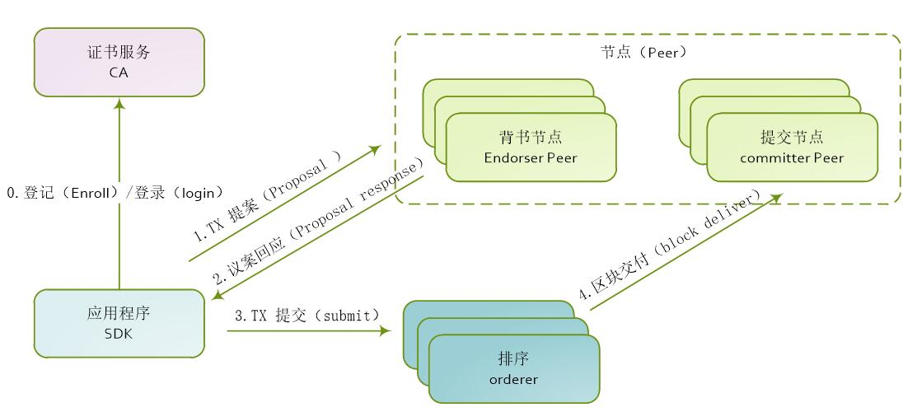

# 交易流程

区块链最主要的特性之一是去中心化，没有了中心机构的集中处理，为了达成数据的一致性，就需要网络中全民参与管理，并以某种方法达成共识，所以区块链的交易流程也就是共识的过程。

在Fabric中，本由一个节点处理的过程，在逻辑上被分解为不同的角色，每个角色承担不同的功能；节点（Peer）分解为背书节点（Endorser peer）和提交节点（Committer peer），为了达到处理的顺序性，提炼出排序（Orderer）角色。

Fabric是应用于联盟链的场景，在处理每一笔交易时，每个环节上需要对交易信息进行权限校验。

Fabric交易流程图如下所示：

图：Fabric交易流程

交易过程详细流程：

1) 应用程序客户端通过SDK调用证书服务（CA）服务，进行注册和登记，并获取身份证书；

2) 应用程序客户端通过SDK向区块链网络发起一个交易提案（Proposal），交易提案把带有本次交易要调用的合约标识、合约方法和参数信息以及客户端签名等信息发送给背书（Endorser）节点。

3) 背书（Endorser）节点收到交易提案（Proposal）后，验证签名并确定提交者是否有权执行操作，同时根据背书策略模拟执行智能合约，并将结果及其各自的CA证书签名发还给应用程序客户端。

4) 应用程序客户端收到背书（Endorser）节点返回的信息后，判断提案结果是否一致，以及是否参照指定的背书策略执行，如果没有足够的背书，则中止处理；否则，应用程序客户端把数据打包到一起组成一个交易并签名，发送给Orderers。

5) Orderers对接收到的交易进行共识排序，然后按照区块生成策略，将一批交易打包到一起，生成新的区块，发送给提交（Committer）节点；

6) 提交（Committer）节点收到区块后，会对区块中的每笔交易进行校验，检查交易依赖的输入输出是否符合当前区块链的状态，完成后将区块追加到本地的区块链，并修改世界状态。