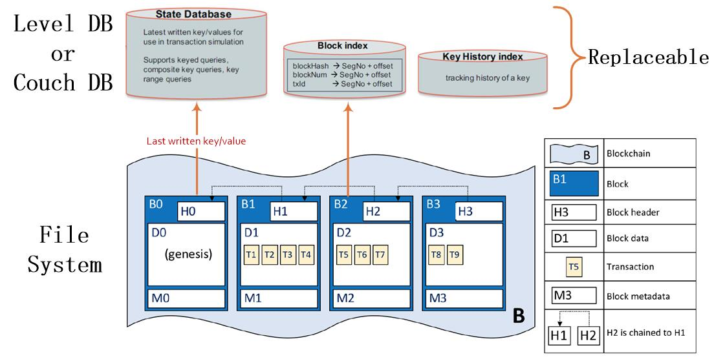
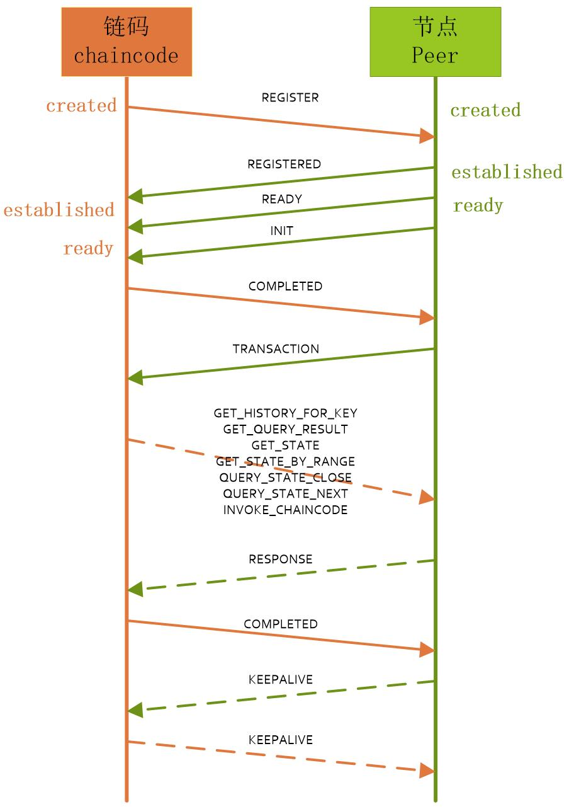
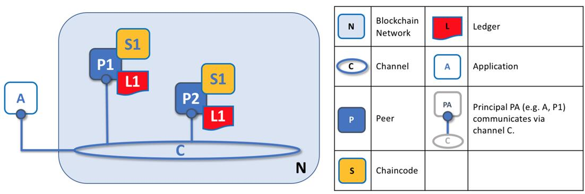
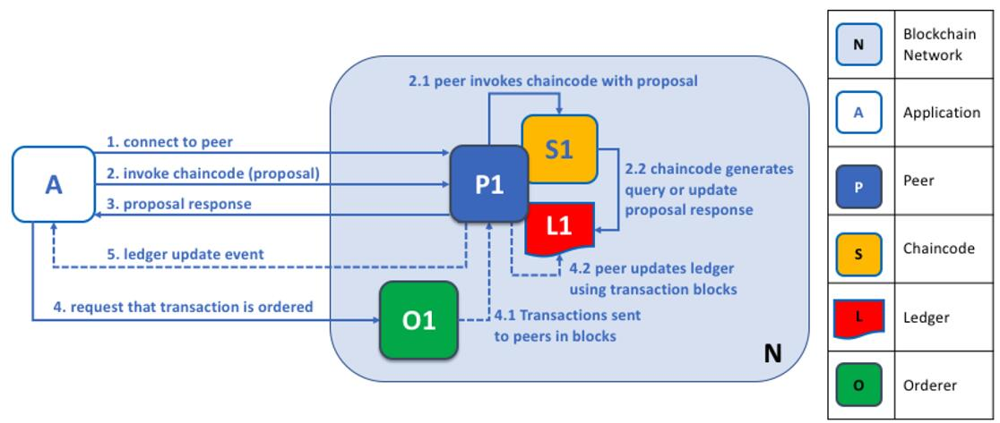
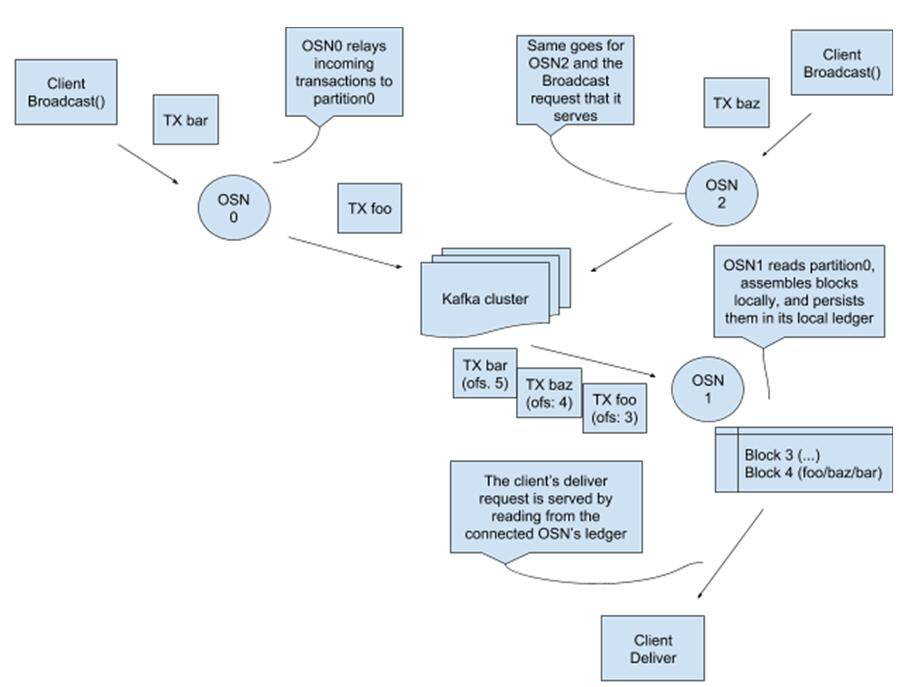

# 关键技术

本节介绍从最底层的账本开始，逐一讲解账本的结构和存储、智能合约的编写和部署、通道的操作、节点的背书和提交、排序的共识和客户端SDK的接口调用，与交易流程顺序相反，由里及表的说明Fabric最关键的技术，通过学习了这六种关键技术知识，能初步掌握Fabric的核心，了解Fabric运作原理。

## 1. 帐本（Ledger）

Fabric帐本（Ledger）是一系列有序和防篡改的状态转换的记录，结构由一个区块链构成，并将不可变的、有序的记录存放在区块中；同时包含一个状态数据库来记录当前的状态，账本的当前状态信息是链交易日志中记录过的所有键的最新值，由于当前状态表示的是通道已知的所有键的最新值，由此也被称为世界状态。区块链结构保存在本地的文件系统中；世界状态由数据库来维护，以键值对（k-v）的方式保存在数据库，默认数据库为LevelDB，数据库版本可替换为KV类型的数据库，如CouchDB等。

帐本结构图如下：

图：帐本结构图

* 区块链(Blockchain）：

 区块链（Blockchain）是基于本地文件系统，将区块存储于文件系统的硬盘中，每个区块中保存有区块头（Block header）、区块数据（Block data）、区块元数据（Block metadata），通过区块头中的前一个区块的哈希值（Previous Block Hash）指向前一个区块的当前哈希值（Current Block Hash），连接成区块链。

上图中区块图示说明：

    B：Blockchain 区块链

    B1：Block 区块

    H3：Block header 区块头

    D1：Block data 区块数据

    T5：Transaction 交易数据，保存在区块数据中

    M3：Block metadata区块元数据

    H1-H2：H2 is chained to H1 区块2指向区块1

* 状态数据库（State Database）：

状态数据库是存储所有在交易中出现的键值对的最新值，调用链码执行交易可以改变状态数据，为了高效的执行链码调用，所有数据的最新值都被存放在状态数据库中；状态数据库被设计为组件，可以通过配置替换数据库，目前有LevelDB和CouchDB两种数据库， LevelDB是默认的内置的数据库。

LevelDB：适用于简单的链值对k-v场景，LevelDB嵌入在peer进程中。

CouchDB：适用于支持丰富的查询和数据类型的场景，应用系统作为JSON文档存储时，CouchDB是一个特别合适的选择，支持对chaincode数据进行丰富的查询。

* 账本索引数据库（Block index）：

区块链保存到文件系统时，会在LevelDB 中存储区块交易对应的文件块及其偏移，也就是将 LevelDB 作为账本数据库的索引。文件形式的区块存储方式如果没有快速定位的索引，那么查询区块交易信息会非常的慢。

* 历史状态数据库（History index）

历史状态数据库用于查询某个 key 的历史修改记录，历史数据库并不存储 key 具体的值，而只记录在某个区块的某个交易里，某 key 变动了一次，后续需要查询的时候，根据变动历史去查询实际变动的值，虽然减少了数据的存储，当然也增加了查询逻辑的复杂度。

## 2. 智能合约（Smart contract）

智能合约又称为链码，是在区块链上运行的一段代码，是应用系统与区块链底层交互的中间件，通过智能合约可以实现各种复杂的应用。

目前使用Go语言来开发智能合约以外，还可以使用java、node.js开发，支持最好的还是Go语言。

智能合约安装在节点（Peer）上，运行在Docker容器中，通过gRPC与Peer进行数据交互，交互步骤如下：

图：链码与节点消息交互

1) 链码（chaincode）调用 shim.Start()方法后，给节点（Peer）发送 ChaincodeMessage_REGISTER 消息尝试进行注册。客户端链码等待接收来自节点（Peer）的消息。此时链码（chaincode）和节点（Peer）的状态为初始的created。

2) 节点（Peer）在收到来自链码容器的 ChaincodeMessage_REGISTER 消息后，会注册到本地的一个handle结构，返回 ChaincodeMessage_REGISTERED 消息给链码容器。并且更新状态为 established ，然后会自动发出 ChaincodeMessage_READY 消息给链码（chaincode），并且更新状态为ready。

3) 链码（chaincode）在收到 ChaincodeMessage_REGISTERED 消息之后，先不进行任何的操作，完成注册步骤。更新状态为 established 。在收到 ChaincodeMessage_READY 消息之后再更新状态为 ready 。

4) 节点（Peer）发出 ChaincodeMessage_INIT 消息给链码容器，对链码进行初始化。

5) 链码容器收到 ChaincodeMessage_INIT 消息之后，调用用户代码 Init()方法进行初始化，成功之后，返回 ChaincodeMessage_COMPLETED 消息。到此，链码容器可以被调用了。

6) 链码（chaincode）被调用的时候，节点（Peer）发出 ChaincodeMessage_TRANSACTION 消息给链码。

7) 链码在收到 ChaincodeMessage_TRANSACTION 消息之后，会调用 Invoke()方法，根据Invoke方法中用户的逻辑，可以发送如下的消息给节点（Peer）：

    ChaincodeMessage_GET_HISTORY_FOR_KEY

    ChaincodeMessage_GET_QUERY_RESULT

    ChaincodeMessage_GET_STATE

    ChaincodeMessage_GET_STATE_BY_RANGE

    ChaincodeMessage_QUERY_STATE_CLOSE

    ChaincodeMessage_QUERY_STATE_NEXT

    ChaincodeMessage_INVOKE_CHAINCODE

8) 节点（Peer）在收到这些消息之后，会进行相应的处理，并回复 ChaincodeMessage_RESPONSE 消息。最后，链码（chaincode）会回复调用完成的消息 ChaincodeMessage_COMPLETE至节点（Peer）。

9) 上述消息交互过程完成后，节点（Peer）和链码（chaincode）会定期相互发送 ChaincodeMessage_KEEPALIVE 消息给对方，以确保彼此是在线状态。

## 3. 通道（Channel）

通道是两个节点（Peer）或多个节点之间信息通信的私有空间，在通道内的交易的数据与通道外隔绝，保证通道内数据的安全。在网络上的交易都要在某个通道（Channel）上执行，参互交易的每个成员都需要进行身份验证和授权，才能在通道（Channel）上进行处理。

Fabric是多通道设计，系统可以创建多条通道，某个节点（Peer）可以加入到不同的通道中，在每个通道中有自身的创世区块和实例化智能合约（Smart contract）。

每个通道都有属于自己的锚节点，通过锚节点可以与其它通道进行信息交互，但本身通道内的账本不会通过一个通道传到另一个通道上，通道对账本是分离的。

通道结构图：

图：通道结构图

上图中通道图示说明：

    N：Blockchain Network区块链网络

    C：Channel 通道

    P：Peer 节点

    S：Chaincode 链码

    L：Ledger 账本

    A：Application 客户端

    PA-C：Principal PA（e.g. A，P1）communicaties via channel C 客户端A与节点P（Peer）通过通道C（channel）进行通信。

    H1-H2：H2 is chained to H1 区块2指向区块1

## 4. 节点（Peer）

节点（Peer）是区块链的交易处理和账本维护的主体，主要负责参与共识过程和通过执行链码（chaincode）实现对账本的读写操作。节点（Peer）根据功能不同分为背书节点（Endorser peer）和提交节点（Committer peer）；根据通讯不同分为锚节点（Anchor peer）和主节点（Leading peer）。

* 背书节点（Endorser peer）

背书节点（Endorser peer）负责对交易根据事先设定策略进行签名背书，背书节点（Endorser peer）根据链码在实例化的时候设置背书策略，指定哪些节点用于背书。当客户端向节点发起交易背书时，该Peer节点才雎有背书功能，其它时间只是普通的记账节点。

* 记账节点（Committer peer）

记账节点（Committer）负责维护状态数据和账本的副本。

* 锚节点（Anchor peer）

锚节点（Anchor peer）是随通道（Channel）存在，是能被其它通道发现的的节点（peer），每个通道（channel）上有一个或多个锚节点（Anchor peer）。

* 主节点（Leading peer）

主节点（Leading peer）负责与排序（Orderer）通信，把共识后的区块传输到其他节点。

应用程序与节点交互图：

图：客户端与节点交互

上图中通道图示说明：

    N：Blockchain Network区块链网络

    A：Application 应用程序

    P：Peer 节点

    S：Chaincode 链码

    L：Ledger 账本

    O：Orderer 排序

交互流程：

1）应用程序成功连接到节点（Peer）后,调用链码向节点（Peer）进行提案；

2）节点（Peer）根据提案信息调用链码；

3）链码进行查询和更新，然后返回提案信息给应用程序；

4）应用程序发送交易信息给排序（Orderer）;

5）排序（Orderer）把含有交易信息的区块发送给节点（Peer）;

6）节点（Peer）把交易区块更新到账本中，最终完成处理；

## 5. 排序（Orderer）

排序（Orderer）指对区块链网络中不同通道产生的交易进行排序，并广播给节点（Peer）。排序（Orderer）是以可插拔组件的方式实现，目前分为SOLO和Kafka两种类型。

SOLO：仅有一个Orderer服务节点负责接收交易信息进行排序，是最简单的排序算法，一般用于测试环境。

Kafka：是由Apache软件基金会开发的一个开源流处理平台，一种高吞吐量的分布式发布订阅消息系统，它可以处理消费者规模的网站中的所有动作流数据，可以配置多个排序节点集群方式，以便使用在生成环境。Hyperledger Fabric利用kafka的高吞吐、低延时的特性，对交易信息进行排序处理，实现在集群内部支持节点故障容错。

正式环境中需要使用Kafka搭建，保证数据可靠性和安全性，以下介绍基于Kafka集群和ZooKeeper集群的排序服务的原理。

### 5.1 Kafka处理概述

Kafka处理流程示意图：

说明：

* 排序（Orderer）节点（Ordering Service Node）简称为OSN，Orderer集群连接到Kafka集群和Zookeeper集群，利用Kafka的共识功能，实现网络中交易的排序和生成区块的任务。
* 当排序（Orderer）节点通过RPC广播（Broadcast）接收到从节点（Peer）来的交易数据时，先判断发送交易的客户端是否有权限处理该通道（Channel）数据，如果有权限，排序（Orderer）节点会把交易保存到Kafka的分区（partition）中,每个通道（Channel）对应Kafka中的单独的单分区（partition）的类别中（topic）。
* 排序（Orderer）节点使用该分区（partition），将接收到交易分组写入到本地区块中，并加入到本地的区块链中，最后通过RPC传输（Deliver）给需要接收的客户端。

### 5.2 Kafka集群和ZooKeeper集群的节点数量规定

* kafka集群节点的最小值为4，是故障容错所需要的最小数值。四个kafka结点可以容许一个节点崩溃后，所有的通道（Channel）还可以继续读写且创建通道。

* zookeeper可以为3,5或7。它必须是一个奇数来避免分裂(split-brain)情景，同时选择大于1是为了避免单点故障,超过7个ZooKeeper节点是多余的。

### 5.3 排序（Orderer）操作步骤

1）在网络的创世块中写入Kafka相关的信息

在生成创世区块时，需要在configtx.yaml文件中配置Kafka相关的信息，如Orderer.OrdererType设置为kafka、Orderer.Kafka.Brokers设置Kafka集群中的节点IP地址和端口；

2）设置区块最大容量

区块最大容量在configtx.yaml文件中设置Orderer.AbsoluteMaxBytes项的值，以字节为位置，不包括区块头信息大小。

3）创建创世区块

使用 configtxgen 工具，根据步骤1和2中配置生成创世区块。

4）配置Kafka集群

* 设置unclean.leader.election.enable为false；
* 设置min.insync.replicas为M（数字），数据提交时会写入至少M个副本，值的范围为1<M<N（N为default.replication.factor值）；
* 设置default.replication.factor为N（数字），N表示在Kafka节点上每个channel都保存N个副本的数据；值的范围为1<K（K为Kafak集群数量）；
* 设置message.max.bytes值，message.max.bytes应该严格小于socket.request.max.bytes的值，socket.request.max.bytes的值默认被设置为100MB；
* 设置replica.fetch.max.bytes值，每个通道获取的消息的字节数；
* 设置log.retention.ms为-1，关闭基于时间的日志保留方式。

5） 所有排序（Orderer）节点都指向创世区块

在 orderer.yaml 文件中配置 General.GenesisFile参数， 让排序（Orderer）节点指向步骤3中所创建的初始区块。

6）调整轮询间隔和超时时间

在orderer.yaml 文件中配置Kafka.Retry参数， 调整 metadata/producer/consumer 请求的频率以及socket的超时时间。

7） 设置排序节点和 Kafka 集群间为SSL 通讯

在orderer.yaml文件中配置Kafka.TLS参数，确定是否通过TLS（安全传输层协议）进行通信。

8） 集群启动顺序

先启动ZooKeeper 集群,然后启动 Kafka 集群,最后启动排序（Orderer）节点。

## 6. 接口（SDK）

Fabric SDK提供调用账本（Ledger）、智能合约（Smart contract）、通道（Channel）、节点（Peer）、排序（Orderer）等接口，方便用第三方应用程序的开发，大大扩展了Fabric的应用场景。

Hyperledger Fabric提供了许多SDK来支持各种编程语言，目前正式发布了Node.js和Java两种版本的SDK。将来还会发布Python、Go、REST版本的SDK，还在测阶段。

Fabric SDK应该可以为开发人员提供编写应用程序的多种操作区块链网络的方式。应用程序可以部署/执行chaincode，监听网络中产生的事件，接收块信息，把交易存储到账本中等。

接口模块如下：

### 6.1 Package: Hyperledger Fabric Client

模块 | 等级 | 功能
:--- | :--- | :---
Client | 0 | 主要的入口模块。它必须允许用户创建需要的任何对象来执行所有支持的操作，例如直接连接网络，chaincode部署，交易执行，多种查询。另外，基于编码规范和普遍的社区练习，每一种语言的实现也能决定是否添加方便的方法，如sendTransaction(chain, tx)
Chain | 1 | 一个链代表一些节点特别形成的一个网络，启动一个共识的通道，在通道中交易可以被独立的处理。一个网络可能有一个或多个链。链上的节点维护一个单独的账本包含交易在链上派发，包括成员关系的任何配置。所有的交易都是在链上发送，一个应用可能操作多个链。
Peer | 2 | 代表网络上的计算节点。节点的角色有背书节点和提交节点，它们都在维护着账本。应用可能连接到一定数量的可用的节点
Orderer | 2 | 类似节点，不同的是它代表排序服务的终端，可能是一个单独的节点（开发时本地安装）或者一个网络排序者的代理节点。基于区块链网络的fabric会有一个由多个排序者节点组成的单独的排序服务。应用可以选择信任特定的排序者，或者一部分排序者，或者设置代理去给排序者节点广播交易。
User | 2 | 代表在网络上交易的用户。用户实例可以基于登记证书被初始化。证书可以从成员服务或者外部CA获取。理论上，这种用户也能代表网络上的节点成员。然而，这与应用程序无关（这更像是网络管理方面的问题），所以在这个设计中没有开放。
Proposal | 3 | 登记的用户可以向节点列表提出交易提案来背书交易。一旦接收到背书响应，应用程序可以决定是否已经获取背书签名，是否需要执行提交交易到共识服务。这是关于提案原始的GRPC消息的包装类，它提供了便利的创建方法。
ProposalResponse | 3 | 提案调用背书节点的响应，打包背书结果（是或否），签名，等等。这是关于提案响应原始的GRPC消息包装类，它提供了便利的方法来利用它自己的内容（背书，签名，等等）。
Transaction | 3 | 登记用户收集了背书之后可以提交交易。交易请求包含背书签名和MVCC+post-image，并且使用排序服务API。交易有两种类型：部署和执行。这是交易有关原始GRPC消息的包装类，它提供了便利的创建方法。
CryptoSuite | 3 | 加密模块打包了数字签名算法，非对称加密的密钥对，对称加密的密钥消息，安全的hash和MAC。

### 6.2 Package: Member Service

模块 | 等级 | 功能
:--- | :--- | :---
MemberService | 0 |这是fabric可选模块的客户端，成员服务。本模块的主要功能是从成员服务获取用户登记证书。另外，这个模块本身或它的扩展类也应该能在fabric默认的成员服务的实现中提供可用的额外的功能，如用户注册功能。
