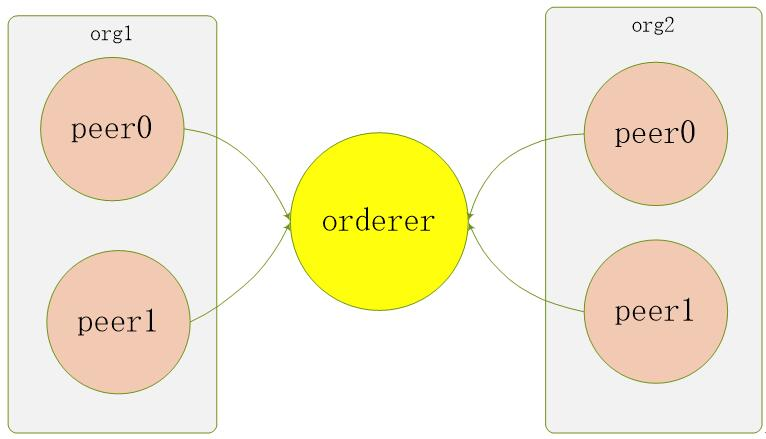

# 多机多节点模式

多机多节点指在多台服务器上部署多个组织和节点。

本例部署由 `1orderer + org1(peer0,peer1) + org2(peer0,peer1)` 组成，需要五台服务器，配置如下：

| 名称 | 地址 |
| :--- |:--- |
| peer0.org1 | 10.100.194.211 |
| peer1.org1 | 10.100.194.212 |
| peer0.org2 | 10.100.194.213 |
| peer1.org2 | 10.100.194.214 |
| orderer | 10.100.194.215 |

结构图如下：



## 1. orderer 准备相关文件，及全节点同步

### 1.1 **请先 [搭建基础环境](../../../build.md)**

### 1.2 组织基础文件

文件或目录 | 含义
:--- | :---
[~/multipeer/configtx.yaml](configtx.yaml) | 链的公私钥和证书信息配置文件
[~/multipeer/crypto-config.yaml](crypto-config.yaml) | 链的创世区块和通道配置文件
[~/multipeer/orderer.yaml](orderer.yaml) | orderer容器配置文件
[~/multipeer/peer0.org1.yaml](peer0.org1.yaml) | peer0.org1容器配置文件
[~/multipeer/peer1.org1.yaml](peer1.org1.yaml) | peer1.org1容器配置文件
[~/multipeer/peer0.org2.yaml](peer0.org2.yaml) | peer0.org2容器配置文件
[~/multipeer/peer1.org2.yaml](peer1.org2.yaml) | peer1.org2容器配置文件
[~/multipeer/chaincode/go/test.go](chaincode/go/test.go) | 测试代码

#### ! 服务器以root用户登录，将此目录拷贝到服务器的家目录中。

### 1.3 生成公私钥、证书、创世区块、通道配置区块

* **生成公私钥和证书**

```bash
cd ~/multipeer/
cryptogen generate --config=crypto-config.yaml
```

* **生成创世区块**

```bash
configtxgen -profile TwoOrgsOrdererGenesis -outputBlock channel-artifacts/genesis.block
```

* **生成通道配置区块**

```bash
configtxgen -profile TwoOrgsChannel -outputCreateChannelTx channel-artifacts/mychannel.tx -channelID mychannel
cd ~
```

### 1.4 全节点同步

```bash
scp -r multipeer root@10.100.194.211:~
scp -r multipeer root@10.100.194.212:~
scp -r multipeer root@10.100.194.213:~
scp -r multipeer root@10.100.194.214:~
```

## 2. 启动服务

* **orderer启动**

| node | ip | script |
| :--- | :--- | :--- |
| orderer | 10.100.194.215 |`docker-compose -f ~/multipeer/orderer.yaml up -d` |

* **Peer启动**

| node | ip | script |
| :--- | :--- | :--- |
| peer0.org1 | 10.100.194.211 | `docker-compose -f ~/multipeer/peer0.org1.yaml up -d` |
| peer1.org1 | 10.100.194.212 | `docker-compose -f ~/multipeer/peer1.org1.yaml up -d` |
| peer0.org2 | 10.100.194.213 | `docker-compose -f ~/multipeer/peer0.org2.yaml up -d` |
| peer1.org2 | 10.100.194.214 | `docker-compose -f ~/multipeer/peer1.org2.yaml up -d` |

## 3. peer0.org1 创建通道 `mychannel.block`，及其他peers同步

* **进入容器**

```bash
docker exec -it cli bash
```

* **创建channel**

```bash
ORDERER_CA=/opt/gopath/src/github.com/hyperledger/fabric/peer/crypto/ordererOrganizations/example.com/orderers/orderer.example.com/msp/tlscacerts/tlsca.example.com-cert.pem
peer channel create -o orderer.example.com:7050 -c mychannel -f channel-artifacts/mychannel.tx --tls --cafile $ORDERER_CA
```

* **保存mychannel.block**

```bash
exit
docker cp cli:/opt/gopath/src/github.com/hyperledger/fabric/peer/mychannel.block ~/multipeer/
```

* **mychannel.block拷贝到其他所有peer服务器中**

```bash
scp ~/multipeer/mychannel.block root@10.100.194.212:~/multipeer/
scp ~/multipeer/mychannel.block root@10.100.194.213:~/multipeer/
scp ~/multipeer/mychannel.block root@10.100.194.214:~/multipeer/
```

## 4. 其他各peer加入通道中

* **拷贝mychannel.block到各个peer cli容器中**

```bash
docker cp ~/multipeer/mychannel.block cli:/opt/gopath/src/github.com/hyperledger/fabric/peer/
```

* **各个peer分别加入Channel**

```bash
docker exec -it cli bash
peer channel join -b mychannel.block
```

## 5. 测试智能合约

! **本例，在peer0.org1上初始化智能合约的a和b变量的数值，在peer1.org1上查询合约。**

### 5.1 peer0.org1和peer1.org1上分别 安装智能合约

```bash
docker exec -it cli bash
peer chaincode install -n mycc -p github.com/hyperledger/fabric/multipeer/chaincode/go/ -v 1.0
```

### 5.2 peer0.org1 调用智能合约

* 初始化数据为a为100，b为200。

```bash
ORDERER_CA=/opt/gopath/src/github.com/hyperledger/fabric/peer/crypto/ordererOrganizations/example.com/orderers/orderer.example.com/msp/tlscacerts/tlsca.example.com-cert.pem
peer chaincode instantiate -o orderer.example.com:7050 --tls --cafile $ORDERER_CA -C mychannel -n mycc -v 1.0 -c '{"Args":["init","a","100","b","200"]}' -P "OR ('Org1MSP.peer','Org2MSP.peer')"
```

* 查询a，显示100

```bash
peer chaincode query -C mychannel -n mycc -c '{"Args":["query","a"]}'
```

* 进行a向b转10交易

```bash
peer chaincode invoke --tls --cafile $ORDERER_CA -C mychannel -n mycc -c '{"Args":["invoke","a","b","10"]}'
```

* 查询b，显示210

```bash
peer chaincode query -C mychannel -n mycc -c '{"Args":["query","b"]}'
```

### 5.3 peer1.org1 查询智能合约

* 查询b，显示210

```bash
docker exec -it cli bash
peer chaincode query -C mychannel -n mycc -c '{"Args":["query","b"]}'
```

> 如果是阿里云，部署过程中遇到的坑，请查看**[部署时阿里云存在巨大的坑](../../../aliyun.keng.md)**