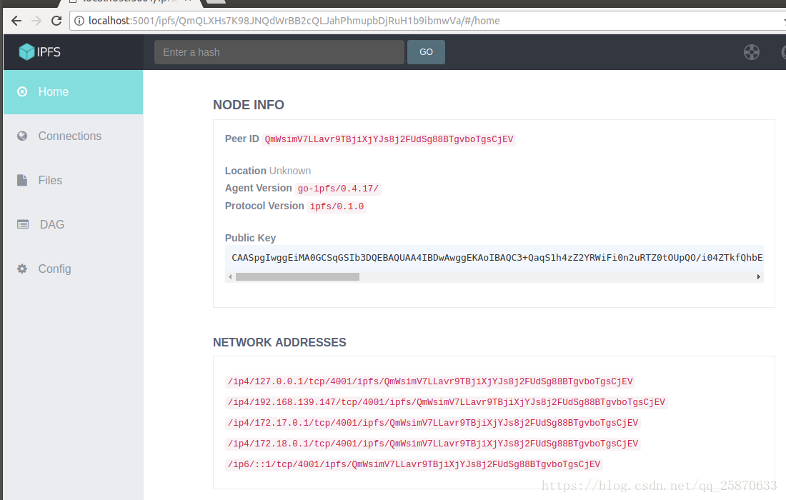

# 谈一谈IPFS原理及玩法

现在大家都知道很多区块链底层都只是支持存储小量数据。

> 比如以太坊，存储太昂贵了，在黄皮书中有一个gas的消耗规定可以参考：
>
> 一般账户存储 (storage) 将0值转为非0需要消耗2W的gas，修改非0值需要消耗5K的gas，但将非0改为0可以得到1.5W的gas;而memory 空间每32 byte 消耗 3gas。

那么我们想把大文件，譬如：图片，视频等等上传到链上怎么办呢？

> 在以太坊中可以参考把数据存到日志里，日志每个字节花费8个Gas，而合约存储是每32个字节20,000个Gas。

目前市面上比较火的底层 <b>IPFS <星际文件系统></b> 应该可以满足我们的需求。所以，今天我们的主题是 IPFS 。

## 1. 环境

```text
Ubuntu 16.04.4 LTS
go-ipfs 0.4.17
git   2.7.4
go   go1.10.3 linux/amd64
node  v10.6.0
npm  6.1.0
docker  1.13.1
docker-compose  1.8.0
```

## 2. 安装（略）

## 3. 基本应用

### 3.1 初始化IPFS节点：ipfs init

```text
generating 2048-bit RSA keypair...done
peer identity: Qmf2bD3rsMrCBLKkTF3M5QyiQu3rXMcN2NmpxuQfZS8tLJ
to get started, enter:

        ipfs cat /ipfs/QmS4ustL54uo8FzR9455qaxZwuMiUhyvMcX9Ba8nUH4uVv/readme

```

`QmS4ustL54uo8FzR9455qaxZwuMiUhyvMcX9Ba8nUH4uVv` 代表初始化成功。

执行完ipfs init命令后，会在根目录生成 `~/.ipfs` 文件夹存储节点数据, 文件、block都在这个目录中。

ipfs节点默认存储空间为10个G。

`vim ~/.ipfs/config`



### 3.2 根据hash查看readme

`ipfs cat /ipfs/QmS4ustL54uo8FzR9455qaxZwuMiUhyvMcX9Ba8nUH4uVv/readme`

```text
Hello and Welcome to IPFS!

██╗██████╗ ███████╗███████╗
██║██╔══██╗██╔════╝██╔════╝
██║██████╔╝█████╗  ███████╗
██║██╔═══╝ ██╔══╝  ╚════██║
██║██║     ██║     ███████║
╚═╝╚═╝     ╚═╝     ╚══════╝

If you're seeing this, you have successfully installed
IPFS and are now interfacing with the ipfs merkledag!

 -------------------------------------------------------
| Warning:                                              |
|   This is alpha software. Use at your own discretion! |
|   Much is missing or lacking polish. There are bugs.  |
|   Not yet secure. Read the security notes for more.   |
 -------------------------------------------------------

Check out some of the other files in this directory:

  ./about
  ./help
  ./quick-start     <-- usage examples
  ./readme          <-- this file
  ./security-notes
```

### 3.3 查看当前本地节点的ID ：ipfs id

`ipfs id`

```json
{
        "ID": "Qmf2bD3rsMrCBLKkTF3M5QyiQu3rXMcN2NmpxuQfZS8tLJ",
        "PublicKey": "CAASpgIwggEiMA0GCSqGSIb3DQEBAQUAA4IBDwAwggEKAoIBAQDuPGzFwjKUy8SXgY2KWx2oh59d8U6GQLoTAN0o04KW8TXHwcPxrWL9RF2d57HqCpptLeRoIi/eqq1Lb+9Dt+fxc2CBpAodsTsYp3cWz5I7KFLaaTrSiiTPjnGykD0vJaqQD39vRPjkz90980C+jVGoH9i1rPwaVeCeQrmqWbKMadl5LU0Gh8Vev4rKR2meLa8C5+yQA1Mu4DtPpQf+QMXyUMU4/FTt40aa3SzPjk2zs3s+GeNb2a/CFjHtYSJQSPq9rZHQYQO3ooAqXQ/bbBTpfNhEhTTHzqj+IwgK2neKd4ypeCqlQj8UaQmFW0tSK98mWlvU5VGGvwrF0tNSe2cJAgMBAAE=",
        "Addresses": null,
        "AgentVersion": "go-ipfs/0.4.18/",
        "ProtocolVersion": "ipfs/0.1.0"
}
```

### 3.4 启动一个IPFS 节点服务：ipfs daemon

`ipfs daemon`

```text
Initializing daemon...
go-ipfs version: 0.4.18-
Repo version: 7
System version: amd64/linux
Golang version: go1.11.1
Successfully raised file descriptor limit to 2048.
Swarm listening on /ip4/10.98.0.201/tcp/4001
Swarm listening on /ip4/127.0.0.1/tcp/4001
Swarm listening on /ip6/::1/tcp/4001
Swarm listening on /p2p-circuit
Swarm announcing /ip4/10.98.0.201/tcp/4001
Swarm announcing /ip4/127.0.0.1/tcp/4001
Swarm announcing /ip6/::1/tcp/4001
API server listening on /ip4/127.0.0.1/tcp/5001
Gateway (readonly) server listening on /ip4/127.0.0.1/tcp/8080
Daemon is ready
```

### 3.5 浏览器查看 : <http://localhost:5001/webui>


### 查看和自己相连的其他节点：ipfs swarm peers

> 这一步必须是 在 ipfs daemon 即 本地服务开启情况下才可以看的，因为这时候才和网络其他节点相连。

`ipfs swarm peers`

```text
/ip4/100.0.243.202/tcp/4001/ipfs/QmfDx56hJcPKLu4Ma4iP2Tr3eyhFCNsPmUFkQErGcutE8J
/ip4/100.25.76.28/tcp/4001/ipfs/QmaoYU4JFsca865jMBoNF1nx6sBwquA1EHp6gdJMRNbKU9
/ip4/100.34.217.214/tcp/26443/ipfs/QmWABRCqWoYCGyGV2PZ2T3D9upV39yMgkmFCprXVsKvAZr
/ip4/101.132.146.188/tcp/4001/ipfs/Qme3EZN8GYpcxz93rM7MGg3r6vxcbWefAk9Xaa7drdnC4a
/ip4/101.251.230.212/tcp/4001/ipfs/QmU5pHSzLpKt8RvHMtJYb1Rq2pAeisQzNGAaywssNQ1YB3
/ip4/101.251.230.214/tcp/4001/ipfs/QmPj31HZujPhhkjM4nFm4sxB3tRLsAwUtVoi6FoLbazijo
... ...
```

### 3.6 获取 IPFS 对象的底层结构：ipfs object get 一串文件Hash

`ipfs object get QmS4ustL54uo8FzR9455qaxZwuMiUhyvMcX9Ba8nUH4uVv`

```json
{
    "Links":[
        {
            "Name":"about",
            "Hash":"QmZTR5bcpQD7cFgTorqxZDYaew1Wqgfbd2ud9QqGPAkK2V",
            "Size":1688
        },
        {
            "Name":"contact",
            "Hash":"QmYCvbfNbCwFR45HiNP45rwJgvatpiW38D961L5qAhUM5Y",
            "Size":200
        },
        {
            "Name":"help",
            "Hash":"QmY5heUM5qgRubMDD1og9fhCPA6QdkMp3QCwd4s7gJsyE7",
            "Size":322
        },
        {
            "Name":"ping",
            "Hash":"QmejvEPop4D7YUadeGqYWmZxHhLc4JBUCzJJHWMzdcMe2y",
            "Size":12
        },
        {
            "Name":"quick-start",
            "Hash":"QmXgqKTbzdh83pQtKFb19SpMCpDDcKR2ujqk3pKph9aCNF",
            "Size":1692
        },
        {
            "Name":"readme",
            "Hash":"QmPZ9gcCEpqKTo6aq61g2nXGUhM4iCL3ewB6LDXZCtioEB",
            "Size":1102
        },
        {
            "Name":"security-notes",
            "Hash":"QmQ5vhrL7uv6tuoN9KeVBwd4PwfQkXdVVmDLUZuTNxqgvm",
            "Size":1173
        }
    ],
    "Data":"\u0008\u0001"
}
```

### 3.7 查看本地所有文件 : ipfs pin ls

`ipfs pin ls`

```text
QmYCvbfNbCwFR45HiNP45rwJgvatpiW38D961L5qAhUM5Y indirect
QmY5heUM5qgRubMDD1og9fhCPA6QdkMp3QCwd4s7gJsyE7 indirect
QmejvEPop4D7YUadeGqYWmZxHhLc4JBUCzJJHWMzdcMe2y indirect
QmS4ustL54uo8FzR9455qaxZwuMiUhyvMcX9Ba8nUH4uVv recursive
QmUNLLsPACCz1vLxQVkXqqLX5R1X345qqfHbsf67hvA3Nn recursive
QmXgqKTbzdh83pQtKFb19SpMCpDDcKR2ujqk3pKph9aCNF indirect
QmPZ9gcCEpqKTo6aq61g2nXGUhM4iCL3ewB6LDXZCtioEB indirect
QmZTR5bcpQD7cFgTorqxZDYaew1Wqgfbd2ud9QqGPAkK2V indirect
QmQ5vhrL7uv6tuoN9KeVBwd4PwfQkXdVVmDLUZuTNxqgvm indirect
```

### 3.8 添加文件 ： ipfs add

`vim a.txt`   内容：aaaaaaaaaaa

`ipfs add a.txt`

```text
added QmcTHKv6m29kPrhJXq11PFyrMb5GsnazCjwqvkCKhyfEXP a.txt
 12 B / 12 B [==================] 100.00%
```

`ipfs pin ls`

```text
... ...
QmQ5vhrL7uv6tuoN9KeVBwd4PwfQkXdVVmDLUZuTNxqgvm indirect
QmcTHKv6m29kPrhJXq11PFyrMb5GsnazCjwqvkCKhyfEXP recursive
QmejvEPop4D7YUadeGqYWmZxHhLc4JBUCzJJHWMzdcMe2y indirect
```

`ipfs cat /ipfs/QmcTHKv6m29kPrhJXq11PFyrMb5GsnazCjwqvkCKhyfEXP`

```text
aaaaaaaaaaa
```

### 3.9 将本地文件发布到IPFS网络之中：ipfs name publish 一串文件Hash

`ipfs name publish QmcTHKv6m29kPrhJXq11PFyrMb5GsnazCjwqvkCKhyfEXP`

```text
Published to Qmf2bD3rsMrCBLKkTF3M5QyiQu3rXMcN2NmpxuQfZS8tLJ: /ipfs/QmcTHKv6m29kPrhJXq11PFyrMb5GsnazCjwqvkCKhyfEXP
```

### 3.10 从任意节点下载文件：ipfs get 一串文件Hash

`ipfs get QmcTHKv6m29kPrhJXq11PFyrMb5GsnazCjwqvkCKhyfEXP`

```text
Saving file(s) to QmcTHKv6m29kPrhJXq11PFyrMb5GsnazCjwqvkCKhyfEXP
 20 B / 20 B [========================================] 100.00% 0s
```

`cat QmcTHKv6m29kPrhJXq11PFyrMb5GsnazCjwqvkCKhyfEXP`

```text
aaaaaaaaaaa
```

## 4. 底层机制

### 4.1 Repo

ipfs节点本地是有类似于 repo 的概念存在的。我们可以通过命令查看 本地仓库的统计信息：

`ipfs repo stat`

```text
NumObjects: 19
RepoSize:   347946
StorageMax: 10000000000
RepoPath:   /root/.ipfs
Version:    fs-repo@7
```

在IPFS 中，我们想 ipfs 请求某个文件的时候，是先从 这个 repo 中查找，在 repo 目录中的数据分为两部分：`metadata（元数据）`、`block（真实的数据）`。

当我们先向本地添加一个文件，`NumObjects` 和 `RepoSize` 项的值变大了。

### 4.2 Bootstrap

Bootstrap 即引导项

什么是Bootstrap呢？在 ipfs 的config文件中我们会看到：

```json

  "Bootstrap": [
    "/dnsaddr/bootstrap.libp2p.io/ipfs/QmNnooDu7bfjPFoTZYxMNLWUQJyrVwtbZg5gBMjTezGAJN",
    "/dnsaddr/bootstrap.libp2p.io/ipfs/QmQCU2EcMqAqQPR2i9bChDtGNJchTbq5TbXJJ16u19uLTa",
    "/dnsaddr/bootstrap.libp2p.io/ipfs/QmbLHAnMoJPWSCR5Zhtx6BHJX9KiKNN6tpvbUcqanj75Nb",
    "/dnsaddr/bootstrap.libp2p.io/ipfs/QmcZf59bWwK5XFi76CZX8cbJ4BhTzzA3gU1ZjYZcYW3dwt",
    "/ip4/104.131.131.82/tcp/4001/ipfs/QmaCpDMGvV2BGHeYERUEnRQAwe3N8SzbUtfsmvsqQLuvuJ",
    "/ip4/104.236.179.241/tcp/4001/ipfs/QmSoLPppuBtQSGwKDZT2M73ULpjvfd3aZ6ha4oFGL1KrGM",
    "/ip4/128.199.219.111/tcp/4001/ipfs/QmSoLSafTMBsPKadTEgaXctDQVcqN88CNLHXMkTNwMKPnu",
    "/ip4/104.236.76.40/tcp/4001/ipfs/QmSoLV4Bbm51jM9C4gDYZQ9Cy3U6aXMJDAbzgu2fzaDs64",
    "/ip4/178.62.158.247/tcp/4001/ipfs/QmSoLer265NRgSp2LA3dPaeykiS1J6DifTC88f5uVQKNAd",
    "/ip6/2604:a880:1:20::203:d001/tcp/4001/ipfs/QmSoLPppuBtQSGwKDZT2M73ULpjvfd3aZ6ha4oFGL1KrGM",
    "/ip6/2400:6180:0:d0::151:6001/tcp/4001/ipfs/QmSoLSafTMBsPKadTEgaXctDQVcqN88CNLHXMkTNwMKPnu",
    "/ip6/2604:a880:800:10::4a:5001/tcp/4001/ipfs/QmSoLV4Bbm51jM9C4gDYZQ9Cy3U6aXMJDAbzgu2fzaDs64",
    "/ip6/2a03:b0c0:0:1010::23:1001/tcp/4001/ipfs/QmSoLer265NRgSp2LA3dPaeykiS1J6DifTC88f5uVQKNAd"
  ],
```

这些就是在我们ipfs init 之后，生成的 config文件中默认配置好的 一些由 ipfs 官方维护运行的 ipfs 节点，就是为了方便我们寻址和下载文件用的，建议不要删除。

#### 4.2.1 查看Bootstrap列表

`ipfs bootstrap list`

```text
/dnsaddr/bootstrap.libp2p.io/ipfs/QmNnooDu7bfjPFoTZYxMNLWUQJyrVwtbZg5gBMjTezGAJN
/dnsaddr/bootstrap.libp2p.io/ipfs/QmQCU2EcMqAqQPR2i9bChDtGNJchTbq5TbXJJ16u19uLTa
/dnsaddr/bootstrap.libp2p.io/ipfs/QmbLHAnMoJPWSCR5Zhtx6BHJX9KiKNN6tpvbUcqanj75Nb
/dnsaddr/bootstrap.libp2p.io/ipfs/QmcZf59bWwK5XFi76CZX8cbJ4BhTzzA3gU1ZjYZcYW3dwt
/ip4/104.131.131.82/tcp/4001/ipfs/QmaCpDMGvV2BGHeYERUEnRQAwe3N8SzbUtfsmvsqQLuvuJ
/ip4/104.236.179.241/tcp/4001/ipfs/QmSoLPppuBtQSGwKDZT2M73ULpjvfd3aZ6ha4oFGL1KrGM
/ip4/104.236.76.40/tcp/4001/ipfs/QmSoLV4Bbm51jM9C4gDYZQ9Cy3U6aXMJDAbzgu2fzaDs64
/ip4/128.199.219.111/tcp/4001/ipfs/QmSoLSafTMBsPKadTEgaXctDQVcqN88CNLHXMkTNwMKPnu
/ip4/178.62.158.247/tcp/4001/ipfs/QmSoLer265NRgSp2LA3dPaeykiS1J6DifTC88f5uVQKNAd
/ip6/2400:6180:0:d0::151:6001/tcp/4001/ipfs/QmSoLSafTMBsPKadTEgaXctDQVcqN88CNLHXMkTNwMKPnu
/ip6/2604:a880:1:20::203:d001/tcp/4001/ipfs/QmSoLPppuBtQSGwKDZT2M73ULpjvfd3aZ6ha4oFGL1KrGM
/ip6/2604:a880:800:10::4a:5001/tcp/4001/ipfs/QmSoLV4Bbm51jM9C4gDYZQ9Cy3U6aXMJDAbzgu2fzaDs64
/ip6/2a03:b0c0:0:1010::23:1001/tcp/4001/ipfs/QmSoLer265NRgSp2LA3dPaeykiS1J6DifTC88f5uVQKNAd
```

所以，bootstrap的用法就是，根据 ipfs 默认的 节点列表来提供给我们在请求某个文件时，本地仓库因为没有，而能够先从这些节点中拉取文件的。然后下载下来的文件会保存到自己本地的repo中。

### 4.3 Pinning

ipfs有一个相当积极的缓存机制，可以在对其执行任何ipfs操作后很短时间内将对象保留在本地，但这些对象可能会被定期垃圾清理。 为了防止垃圾收集简单地固定你关心的哈希，固定的方法就是Pinning。

Pinning 是ipfs中非常重要的概念。因为 ipfs试图让它感觉每个单独的对象都是本地的，固定是允许你告诉ipfs始终保持给定对象本地的机制。

####　4.3.1 查看本地固定住的内容：ipfs pin ls

ipfs 会默认的把本地上传的文件做固定。

> 远端下载过来的不会固定，而是短时间的保存在本地 repo 中

使用 `ipfs repo gc` 可清空 repo 中的缓存文件

想要删除某个本地上传的文件，需要先解除固定侯，再删除。

解除固定: `ipfs pin rm -r 文件Hash`
清除: `ipfs repo gc`

【注意】：我们可以试验下，先在本地添加一个文件，然后发布，最后再把本地文件删了，然后在执行 ipfs cat 来查看之前的文件，看看能不能从网络中查找到：
我自己试了下貌似不行，而且用 ipfs get  文件hash 也是获取不到之前发布到网络中的同Hash文件，谁试了可以的话和我说声啊。。但是发现了 不管对同一个文件Hash发布N次的结果都是一样的：

好了言归正传，我们接着说底层，参考自：<https://www.jianshu.com/p/e4703ad30f65>

IPFS获取文件的工作流程
【第一步】：先查询Pinning 如果没有，则进入第二步
【第二步】：查询本地的repo ,如果没有，则进入第三步
【第三步】：根据bootstrap list 查寻其它节点 ，如果没有，就真的没有

IPFS的对象：
以下参考自：<https://blog.csdn.net/yichigo/article/details/79655922>

IPFS本质上是一个用于检索和共享IPFS对象的P2P系统。一个IPFS对象是一个具有两个字段的数据结构:

Data ：大小小于256 kB的非结构化数据块（blob）
Links  ： 一个Link结构体的数组。其中包含的Link指向其他IPFS对象。
而Link结构有三个数据字段:

Name ：Link的名字
Hash ：Link指向的IPFS对象的hash
Size ：Link指向对象的累计大小，计算Link指向的对象大小，需要计入这个被指对象所指向所有对象的大小（注：除了被指向对象自身的size，如果它里面有link，那么还要把link中的size加进来）
可以通过： ipfs  object get  文件hash 来查看：

json格式如下：

{
    "Links":[
        {
            "Name":"AnotherName",
            "Hash":"QmVtYjNij3KeyGmcgg7yVXWskLaBtov3UYL9pgcGK3MCWu",
            "Size":18
        },
        {
            "Name":"SomeName",
            "Hash":"QmbUSy8HCn8J4TMDRRdxCbK2uCCtkQyZtY6XYv3y7kLgDC",
            "Size":58
        }
    ],
    "Data":"Hello World!"
}
读者可能会注意到，所有的散列都是以“Qm”开头的。这是因为它实际上是一个multihash，前两个字节用于指定哈希函数和哈希长度。在上面的例子中，前两个字节的十六进制是1220，其中12表示这是SHA256哈希函数，20代表哈希函数选择32字节长度计算。

在ipfs中，数据和命名链接 【就是Link里面有 Name的那种】构成的IPFS对象的集合即是 Merkle DAG 结构。顾名思义，DAG表明了这一种有向无环图，而Merkle说明这是一个密码验证的数据结构，使用加密哈希来寻址内容。读者可以思考为什么在这个图中不可能有环：

下图表示IPFS对象关系，图的节点代表数据对象中的数据，图的边表示指向其他IPFS对象的链接，链接的名称是图的一条边上的标签

文件系统（Filesystems）

IPFS可以很容易地表示由文件和目录组成的文件系统。

小文件（Small Files）

IPFS对象表示一个小文件(< 256 kb)时，对象结构中的data是该文件内容(还会在文件数据的开始和结尾处还要分别附加一小段header数据和一个footer数据)，对象中不含链接，即Links数组是空的。【注意】文件名称不是IPFS对象的一部分，因此两个具有不同名称和相同内容的文件将具有相同的IPFS对象表示，同样具有相同的hash值。

大文件（Large Files）

大文件(> 256kb)是由一个链接（Link）列表来表示的，列表中每个链接分别指向的是小于256 kB的文件块，于是只需用包含了很小的数据量的对象就能代表一个大文件。指向文件块的链接的name字段为空字符串。

目录结构（Directory Structures）

目录由指向表示文件或其他目录的IPFS对象的链接（Link）列表来表示。链接的name字段是文件和目录的名称

目录结构表示为一个IPFS对象图时，它看起来是这样的：

【注意】包含Hello World!\n的文件会被的自动去重，文件中的数据仅存储在IPFS中的一个逻辑位置(由其hash寻址)。

版本化文件系统（Versioned File Systems）

IPFS可以表示Git所使用的数据结构，以支持版本化的文件系统。

IPFS提交对象的主要属性是，它包含一个或多个名称为parent0、parent1等链接，这些链接指向先前的提交；另外，还包含一个名字为object的链接(Git中称为树)，指向该提交引用的文件系统结构。

我们以前面的文件系统目录结构为例，这里显示了两个提交（commit）：第一个提交是原始结构；第二个提交中，我们更新了文件my_file.txt，内容改成了Another World!而不是原来的Hello World!：

就是以上的这些数据和 命名链接 构成了 markle DAG
在IPFS的中的BlockChain：

在将状态数据库放在IPFS上时，会发现重复数据——在两个块之间，只有已经更改的状态条目需要显式存储。

在区块链上存储数据和将数据的hash存储在区块链上的区别。

Ethereum + IPFS 时是，以太坊（Ethereum）平台上，为了最小化状态数据库的膨胀（bloat）(“区块链膨胀”)，需要支付相当大的费用来存储相关的状态数据库中的数据。因此，对于更大的数据块来说，Ethereum 存储状态数据库中数据的IPFS hash，而不是存储数据本身，是一种常用的设计模式。

下面推荐一些链接大家看看：

<https://zhuanlan.zhihu.com/p/37455540>

<https://www.zybuluo.com/zhenxi/note/912913>
