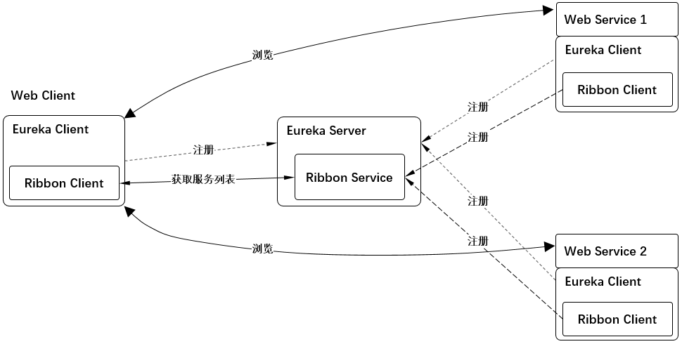

# 示例7 http声明式、模板化的HTTP客户端 -- feign



1. `Web客户端` 和 `两台Web服务器` 的 `Euroka客户端` 和 `Ribbon客户端` 都分别注册到 `中心Euroka服务器` 上。
2. 通过http声明式、模板化的HTTP客户端 feign 访问 `ribbon服务器` 的web服务。

## 1. Eureka Server 端, 提供注册服务

* 请参照 [示例2 Eureka注册服务与服务发现 1. Eureka Server](../eg02/readme.md#1-Eureka-Server)

* `spring-cloud-starter-netflix-eureka-server`这个包中已经包含了ribbon服务包`spring-cloud-starter-netflix-ribbon` 。

## 2. 两台Web服务端

* 请参照 [示例3 Ribbon的基本使用 2. 两台Web服务端](../eg03/readme.md#2-两台Web服务端)

## 3. Web客户端

### 3.1 pom.xml

```xml
<dependency>
    <groupId>org.springframework.boot</groupId>
    <artifactId>spring-boot-starter-web</artifactId>
</dependency>

<dependency>
    <groupId>org.springframework.cloud</groupId>
    <artifactId>spring-cloud-starter-eureka</artifactId>
</dependency>

<dependency>
    <groupId>org.springframework.cloud</groupId>
    <artifactId>spring-cloud-starter-netflix-ribbon</artifactId>
</dependency>

<dependency>
    <groupId>org.springframework.cloud</groupId>
    <artifactId>spring-cloud-starter-openfeign</artifactId>
</dependency>
```

### 3.2 application.yml

* 请参照 [示例3 Ribbon的基本使用 3.2 application.xml](../eg06/readme.md#32-applicationyml)

### 3.3 MyFeign.java

```java
@FeignClient("webserver")   //这里代表的是使用webserver这个服务器域名
public interface MyFeign {

    @RequestMapping(
            value = "/hello",
            method = RequestMethod.GET  //这里地方有坑，必须显示声明调用方法，这里使用的是GET
    )
    String get();

    @RequestMapping(
            value = "/hello",
            method = RequestMethod.POST //这里使用的是POST，代表通过post方法跟webserver的hello进行传递数据
    )
    String post();
}
```

### 3.4 MyController.java

```java
@RestController
public class MyController
{
    @Resource
    private MyFeign myFeign;

    @RequestMapping(
            value = "/get",
            method = RequestMethod.GET  //feign这里只支持GET方法
    )
    public String get() {
        return myFeign.get();
    }

    @RequestMapping(
            value = "/post",
            method = RequestMethod.GET   //feign这里只支持GET方法
    )
    public String post() {
        return myFeign.post();
    }
}
```

### 3.5 访问

* 请参照 [示例3 Ribbon的基本使用 3.4 访问](../eg03/readme.md#34-访问)

### 3.5 验证结果

* 访问 <http://localhost:8080/get>，并且不挺的刷新。出现返回 `hello from 'webserver: 8002'` 代表成功。
* 访问 <http://localhost:8080/post>，并且不挺的刷新。出现返回 `hello from 'webserver: 8002'` 代表成功。