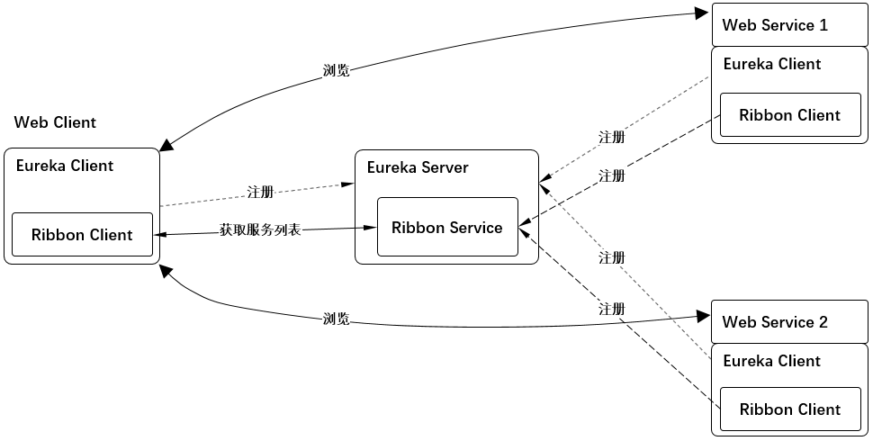

# 示例8 修改feign的默认配置



1. `Web客户端` 和 `两台Web服务器` 的 `Euroka客户端` 和 `Ribbon客户端` 都分别注册到 `中心Euroka服务器` 上。
2. 通过http声明式、模板化的HTTP客户端 feign 访问 `ribbon服务器` 的web服务。
3. 修改feign的默认配置

## 1. Eureka Server 端, 提供注册服务

* 请参照 [示例2 Eureka注册服务与服务发现 1. Eureka Server](../eg02/readme.md#1-Eureka-Server)

* `spring-cloud-starter-netflix-eureka-server`这个包中已经包含了ribbon服务包`spring-cloud-starter-netflix-ribbon` 。

## 2. 两台Web服务端

* 请参照 [示例3 Ribbon的基本使用 2. 两台Web服务端](../eg03/readme.md#2-两台Web服务端)

## 3. Web客户端 -- feign

### 3.1 pom.xml

* 请参照 [示例7 Ribbon的基本使用 3.1 pom.xml](../eg07/readme.md#3.1-pomxml)

### 3.2 application.yml

```yml
web.ribbon:
  ribbon:
    listOfServers : localhost:8002   #这里只使用一台ribbon服务器

ribbon:
  eureka:
    enabled: false  #禁止掉eureka功能

spring:
  application:
    name: client.feigh

eureka:
  instance:
    prefer-ip-address: true
  client:
    service-url:
      defaultZone: http://localhost:8000/eureka/
    healthcheck:
      enabled: true
logging:
  level:
    com.example.demo.feign.MyFeign1: DEBUG  #让MyFeign1的日志输出级别为DEBUG。
```

### 3.3 应用1

#### 3.3.1 MyApplication1.java

```java
@SpringBootApplication
@EnableFeignClients     //使能feign客户端
public class MyApplication1 {
    public static void main(String[] args) {
        SpringApplication.run(MyApplication1.class, args);
    }
}
```

### 3.3.2 MyController1.java

```java
@RestController
public class MyController1 {
    @Resource
    private MyFeign1 myFeign1;

    @RequestMapping("/test1")
    public String test() {
        return myFeign1.test();
    }
}
```

### 3.3.3 MyFeign1.java

```java
/**
 * name : 通过ribbon服务器名称访问ribbon的web服务
 * configuration : 采用MyConfiguration1的的配置访问ribbon的web服务
 */
@FeignClient( name = "web.ribbon", configuration = MyConfiguration1.class )
public interface MyFeign1 {
    @RequestLine("GET /hello")
    String test();
}
```

### 3.3.4 MyConfiguration1.java

```java
@Configuration
public class MyConfiguration1 {
    @Bean
    public Contract feignContract() {
        return new feign.Contract.Default();    //采用feign的默认配置
    }
}
```

### 3.3.5 验证结果

* 访问 <http://localhost:8080/test1>，并且不挺的刷新。出现返回 `hello from 'webserver: 8002'` 代表成功。

### 3.4 应用2

#### 3.4.1 MyApplication1.java

```java
@SpringBootApplication
@EnableFeignClients     //使能feign客户端
public class MyApplication2 {
    public static void main(String[] args) {
        SpringApplication.run(MyApplication2.class, args);
    }
}
```

### 3.4.2 MyController2.java

```java
@RestController
public class MyController2 {
    @Resource
    private MyFeign2 myFeign2;

    @RequestMapping("/test2")
    public String test() {
        return myFeign2.test();
    }
}
```

### 3.4.3 MyFeign2.java

```java
/**
 * name : 通过ribbon服务器名称访问ribbon的web服务, 但这里没用到，此处使用的url访问ribbon的web服务
 * url : 通过url访问ribbon的web服务
 * configuration : 采用MyConfiguration2的的配置访问ribbon的web服务
 */
@FeignClient(name = "", url = "http://localhost:8000/", configuration = MyConfiguration2.class )
public interface MyFeign2 {
    @RequestLine("GET /eureka/apps/web.ribbon") //http://localhost:8000/eureka/apps/web.ribbon 这是查看ribbon的服务器的xml信息。
    public String test();
}
```

### 3.4.4 MyConfiguration2.java

```java
@Configuration
public class MyConfiguration2 {
    @Bean
    public BasicAuthRequestInterceptor basicAuthRequestInterceptor() {
        return new BasicAuthRequestInterceptor("", "");     //这里是登陆ribbon服务器所使用的用户名密码。这里为空
    }
}
```

### 3.4.5 验证结果

* 访问 <http://localhost:8080/test2>，并且不挺的刷新。出现返回 ribbon的服务器xml信息 代表成功。