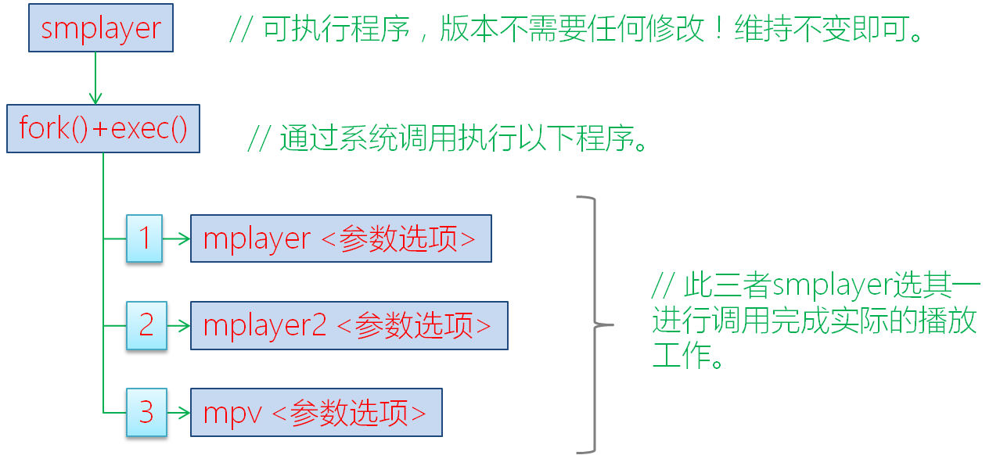

# smplayer开启硬解的方法

本文主要关注smplayer的底层播放软件mplayer的硬件加速方法。

对于1080p的mp4视频文件，在没有硬件解码的情况下，mplayer的cpu占用率在100%；在开启硬件解码后，cpu占有率控制在10%以内。

## 1. 基本概念

- 硬件加速  
  本质上就是媒体解码工作由gpu或者专门的解码器来完成，从而使cpu得到释放。
- 开源项目vaapi
  - VAAPI : 视频加速API (Video Acceleration API, 缩写为VA-API) 是一套提供视频硬件编解码的开源库和标准。其项目为完全开源，遵循GPL协议。它开启了mplayer的硬件加速功能。
  - 官网为：<https://www.freedesktop.org/wiki/Software/vaapi/>
- mplayer、mplayer2、mpv  
  - mplayer是支持几乎所有媒体格式的播放器，它也是开源项目。在此基础上，又发展出了mplayer2和mpv另外两个分支。它们三者都提供了各自的硬件加速版本。

本文只讨论mplayer的硬件加速版本，称为mplayer-vaapi。它独立于mplayer主版本，但同时也支持软件解码。

## 2. smplayer播放媒体文件的逻辑

smplayer在进行播放多媒体时，其逻辑框架如如下：



由此可知，smplayer播放多媒体文件，实际的工作是由下层的mplayer、mplayer2或mpv来完成的。

因此开启smplayer硬件加速的工作，就是mplayer、mplayer2或mpv支持硬件加速。

## 3. mplayer硬件加速支持

通过调研实践，我们已成功实现了通过mplayer的硬件加速版本mplayer-vaapi，来开启多媒体播放的硬件加速功能。具体开启流程如下：

### 3.1 查看gpu是否支持硬件加速

vainfo软件是用来查看硬件加速支持情况的。

它的运行逻辑为：vainfo  -->  libva  -->  针对不同显卡的上层so库  -->  显卡驱动

- 安装

  ```bash
  apt-get install vainfo
  ```

- 运行

  ```bash
  vainfo

    libva: VA-API version 0.32.0                            # libva软件版本
    libva: va_getDriverName() returns 0
    libva: Trying to open /usr/lib/dri/s3g_drv_video.so     # s3g显卡驱动上层so库。
    libva: va_openDriver() returns 0
    vainfo: VA-API version: 0.32 (libva 1.0.15)
    vainfo: Driver version: S3G Driver 2.1                  # s3g显卡驱动版本
    vainfo: Supported profile and entrypoints
        VAProfileMPEG2Simple        : VAEntrypointVLD       # 显卡支持的硬解格式，此处为mpeg2simple
        VAProfileMPEG2Main          : VAEntrypointVLD
        VAProfileMPEG4Simple        : VAEntrypointVLD
        VAProfileMPEG4AdvancedSimple: VAEntrypointVLD
        VAProfileMPEG4Main          : VAEntrypointVLD
        VAProfileH264Baseline       : VAEntrypointVLD
        VAProfileH264Baseline       : VAEntrypointEncSlice  # 显卡支持的硬件编码格式
        VAProfileH264Main           : VAEntrypointVLD
        VAProfileH264Main           : VAEntrypointEncSlice
        VAProfileH264High           : VAEntrypointVLD
        VAProfileH264High           : VAEntrypointEncSlice
        VAProfileVC1Simple          : VAEntrypointVLD
        VAProfileVC1Main            : VAEntrypointVLD
        VAProfileVC1Advanced        : VAEntrypointVLD
  ```

不同显卡，显示的内容会不太一样！！！

### 3.2 下载mplayer-vaapi源码

  ```bash
  git clone https://github.com/gbeauchesne/mplayer-vaapi
  ```

### 3.3 编译安装

- vaapi的支持安装依赖库libva-dev

  ```bash
  apt-get install libva-dev
  ```

- 切换分支

  ```bash
  git branch –r
    origin/HEAD -> origin/master
    origin/hwaccel-common
    origin/hwaccel-vaapi
    origin/hwaccel-vdpau
    origin/master

  git checkout hwaccel-vaapi        # 切换到这个分支是必须的
  ```

- 编译安装

  ```bash
  ./configure --enable-vaapi        #配置过程中会自动下载ffmpeg，并进行配置。
  make
  make install
  ```

### 3.4 查看是否编译安装成功

  ```bash
  mplayer -vo help
    MPlayer SVN-r36265-4.7 (C) 2000-2013 MPlayer Team
    Available video output drivers:
        gl_nosw     OpenGL no software rendering
        x11         X11 ( XImage/Shm )
        xover       General X11 driver for overlay capable video output drivers
        gl          OpenGL
        gl_tiled    X11 (OpenGL) - multiple textures version
        fbdev       Framebuffer Device
        fbdev2      Framebuffer Device
        matrixview  MatrixView (OpenGL)
        v4l2        V4L2 MPEG Video Decoder Output
        xvidix      X11 (VIDIX)
        cvidix      console VIDIX
        null        Null video output
        mpegpes     MPEG-PES to DVB card
        yuv4mpeg    yuv4mpeg output for mjpegtools
        png         PNG file
        tga         Targa output
        pnm         PPM/PGM/PGMYUV file
        md5sum      md5sum of each frame
        vaapi       VA API with X11                  # 出现此选项，代表编译安装成功
  ```

### 3.5 运行测试

  ```bash
  mplayer -vo vaapi 1080i_25.mp4
  ```

此时出现图像即运行成功。通过top命令查看mplayer的cpu占用率，可以看到在10%以内。

## 4. smplayer使用开启硬件加速

smplayer界面上开启硬件加速的方法: 选项 > 首选项 > 常规 > 视频, 并设置输出驱动为 vaapi。
