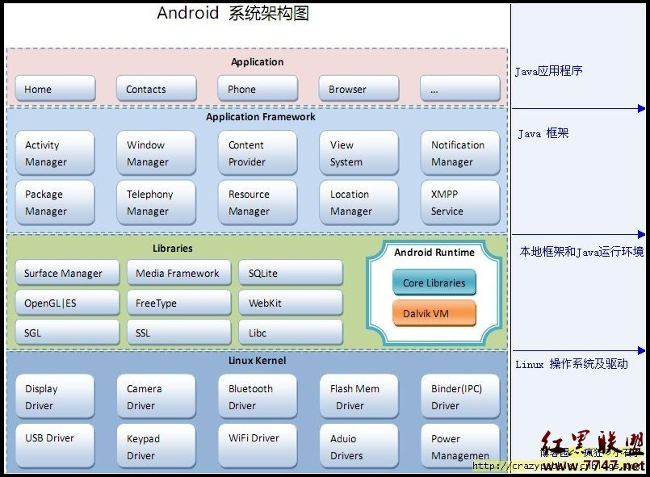

# NDK技术总结

## 1. 简介

Android系统分层如下:



* 应用层和框架层为java语言开发。
* 本地框架及java虚拟机为C/C++语言开发。
* linux内核层为C语言开发。

连接方式：上层java语言通过 jni 技术访问下层C语言的动态连接库.SO文件进行数据交互。

嵌入式的动态库当然可以直接用交叉编译工具链直接编译。但是Android提供了更为便捷的工具, 即NDK。

## 2. NDK简介

NDK提供了一系列的工具, 帮助开发者快速开发C（或C++）的动态库, 并能自动将so和java应用一起打包成apk。

NDK集成了交叉编译器, 并提供了相应的mk文件隔离CPU、平台、ABI等差异, 开发人员只需要简单修改mk文件（指出“哪些文件需要编译”、“编译特性要求”等）, 就可以创建出so或可执行文件。

## 3. 配置NDK环境

```bash
tar xjvf android-ndk64-r10-linux-x86_64.tar.bz2 -c /opt
export PATH=$PATH:/opt/android-ndk-r10
```

## 4. 编译嵌入式版的可执行程序

```c
// test.c
int main( void )
{
   printf( "aaaaaaaa\n" ) ;
}
```

```makefile
# Android.mk
LOCAL_PATH := $(call my-dir)

include $(CLEAR_VARS)
LOCAL_MODULE := test
LOCAL_SRC_FILES := test.c
include $(BUILD_EXECUTABLE)        #BUILD_EXECUTABLE代表编译为可执行程序
```

### 4.1 Android工程内, 非NDK编译方式

文件位于Android系统源码工程路径内, 例如：extern/test/

```bash
source build/env.sh         #加载环境变量
lunch xxxx                  #选择平台
cd extern/test/
mm 或者 mmm .               #编译
```

### 4.2 位于非Android工程内, NDK编译方式

默认情况下, 要求当前源码所在文件夹名为jni

```bash
ndk-build                       #默认为arm平台
ndk-build APP_ABI="mips"        #指定为mips平台)
```

若当前文件夹名不为jni, 则会出现如下错误：

```log
Android NDK: Could not find application project directory !
Android NDK: Please define the NDK_PROJECT_PATH variable to point to it.
/opt/android-ndk-r10/build/core/build-local.mk:148: *** Android NDK: Aborting    .  Stop.
```

解决办法：

```bash
ndk-build  NDK_PROJECT_PATH=.  APP_BUILD_SCRIPT=./Android.mk
```

## 5. 编译嵌入式版的动态库

```c
// test.c
int test( void )
{
   printf( "aaaaaaaa\n" ) ;
}
```

```makefile
# Android.mk
LOCAL_PATH := $(call my-dir)

include $(CLEAR_VARS)
LOCAL_MODULE := test
LOCAL_SRC_FILES := test.c
LD_FLAGS := -shared                #编译为动态库, 此句可写可不写
include $(BUILD_SHARED_LIBRARY)    #BUILD_SHARED_LIBRARY代表编译为动态库
```

若当前文件夹名为jni

```bash
ndk-build                       #默认为arm平台
ndk-build APP_ABI="mips"        #指定为mips平台
```

若当前文件夹名不为jni

```bash
ndk-build  NDK_PROJECT_PATH=.  APP_BUILD_SCRIPT=./Android.mk
```
