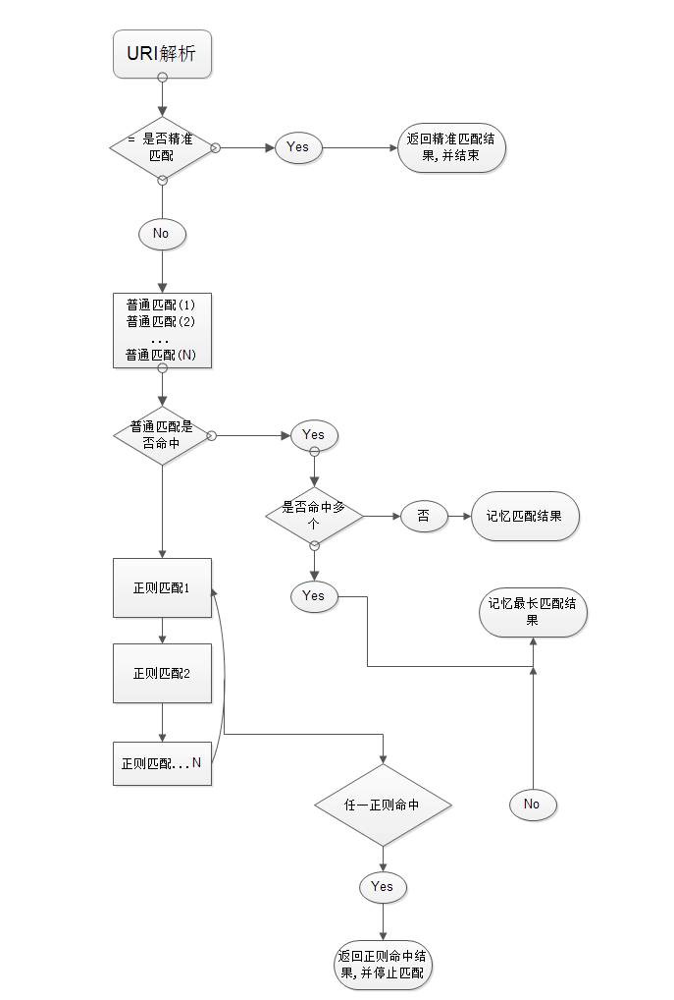
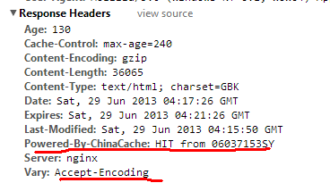

# nginx配置

## 1. 基本结构

```nginx
#全局区
worker_processes 1;             #有1个工作的子进程,可以自行修改,但太大无益,因为要争夺CPU,一般设置为 CPU数*核数

#一般是配置nginx连接的特性
Event {
    worker_connections  1024;   #一个worker子进程最大允许连1024个连接
}

#这是配置http服务器的主要段
http {
    Server1 {                   #这是虚拟主机段
        Location {              #定位,把特殊的路径或文件再次定位 ,如image目录单独处理
        }                       #/ 如.php单独处理
    }

    Server2 {
    }
}
```

### 1.1 基于域名的虚拟主机

```nginx
server {
    listen 80;                  #监听端口
    server_name a.com;          #监听域名

    location / {
        root /var/www/a.com;    #根目录定位
        index index.html;
    }
}
```

### 1.2 基于端口的虚拟主机配置

```nginx
server {
    listen 8080;
    server_name 192.168.1.204;

    location / {
        root /var/www/html8080;
        index index.html;
    }
}
```

## 2. log 日志管理

### 2.1 main日志格式

```nginx
log_format main '$remote_addr - $remote_user [$time_local] "$request" '
                '$status $body_bytes_sent "$http_referer" '
                '"$http_user_agent" "$http_x_forwarded_for"';

access_log /var/log/nginx/access.log;   #访问日志文件,默认main格式
error_log /var/log/nginx/error.log;     #错误日志文件,默认main格式
```

- 远程IP
- 远程用户/用户时间
- 请求方法(如GET/POST)
- 请求体body长度
- referer来源信息
- http-user-agent 用户代理/蜘蛛, 被转发的请求的原始IP
- http_x_forwarded_for 在经过代理时,代理把你的本来IP加在此头信息中,传输你的原始IP

### 2.2 自定义日志格式

```nginx
log_format mylog '$remote_addr- "$request" '
                 '$status $body_bytes_sent "$http_referer" '
                 '"$http_user_agent" "$http_x_forwarded_for"';

access_log /var/log/nginx/access.log mylog;   #访问日志文件
error_log /var/log/nginx/error.log mylog;     #错误日志文件
```

### 2.3 日志按日期备份存储 ———— shell+定时任务+nginx信号管理

- 分析思路: 凌晨00:00:01,把昨天的日志重命名,放在相应的目录下。再用USR1信息号控制nginx重新生成新的日志文件。
- 具体脚本

```bash
#!/bin/bash
base_path='/usr/local/nginx/logs'
log_path=$(date -d yesterday +"%Y%m")
day=$(date -d yesterday +"%d")
mkdir -p $base_path/$log_path
mv $base_path/access.log $base_path/$log_path/access_$day.log
echo $base_path/$log_path/access_$day.log
kill -USR1 `cat /usr/local/nginx/logs/nginx.pid`
```

- 定时任务

```bash
vim /etc/crontab

01 00 * * * /xxx/path/b.sh  每天0时1分(建议在02-04点之间,系统负载小)
```

## 3. location 定位

```nginx
location [=|~|~*|^~] patt {
}
```

- 一般匹配 `location patt {}`
- 精准匹配 `location = patt {}`
- 正则匹配 `location ~ patt {}` , ~区分大小写，~*不区分大小写。

### 3.1 命中规则

1. 判断精准命中，如果命中，立即返回结果并结束解析过程
2. 判断普通命中，如果有多个命中，"记录"下来"最长"的命中结果（注意：记录但不结束，最长的为准）
3. 继续判断正则表达式的解析结果，按配置里的正则表达式顺序为准，由上到下开始匹配，一旦匹配成功 1 个，立即返回结果，并结束解析过程．
4. 延伸分析
  - 普通命中, 顺序无所谓，按长短确定命中，长的有限命中。  
  - 正则命中, 顺序有所谓，按从前往后去定命中。



### 3.2 例子1：精准命中和普通命中

```nginx
location = / {
    root   /var/www/html/;
    index  index.htm index.html;
}

location / {
    root   /usr/local/nginx/html;
    index  index.html index.htm;
}
```

如果访问　　http://xxx.com/

1. 精准匹配中"/", 得到index页为index.htm
2. 再次访问"/index.htm", 此次命中普通命中，内部转跳uri已经是"/index.htm", 根目录为/usr/local/nginx/html
3. 最终结果,访问了 /usr/local/nginx/html/index.htm

### 3.2 例子2：普通命中和正则命中

```nginx
location / {
    root   /usr/local/nginx/html;
    index  index.html index.htm;
}

location ~ image {
    root /var/www;
    index index.html;
}
```

如果我们访问 "http://xx.com/image/logo.png" ，此时, "/" 与 "/image/logo.png" 匹配，同时 "image"正则 与"image/logo.png"也能匹配,谁发挥作用? 正则表达式的成果将会使用，优先命中长的. 图片真正会访问 /var/www/image/logo.png 

### 3.3 例子3: 普通命中

```nginx
location / {
    root   /usr/local/nginx/html;
    index  index.html index.htm;
}

location /foo {
    root /var/www/html;
    index index.html;
}
```

访问 http://xxx.com/foo

对于uri "/foo", 两个location的patt,都能匹配他们, 即 '/'能从左前缀匹配 '/foo', '/foo'也能左前缀匹配'/foo', 此时, 真正访问 /var/www/html/index.html , '/foo'匹配的更长,因此使用之.

## 4. rewrite 重定向

```nginx
if (条件){}  #设定条件,再进行重写 
set         #设置变量
return      #返回状态码 
break       #跳出rewrite
rewrite     #重写
```

### 4.1 if

1. "="来判断相等, 用于字符串比较
2. "\~" 用正则来匹配(此处的正则区分大小写), "\~*" 不区分大小写的正则
3. -f -d -e 来判断是否为文件,为目录,是否存在.

```nginx
if ($remote_addr = 192.168.1.100) {
    return 403;
}

if ($http_user_agent ~ MSIE) {
    rewrite ^.*$ /ie.htm;
    break;                      #不break会循环重定向
}

if (!-e $document_root$fastcgi_script_name) {
    rewrite ^.*$ /404.html break;
} 
```

### 4.2 rewrite语法

```nginx
Rewrite 正则表达式  定向后的位置 模式

Goods-3.html ---->Goods.php?goods_id=3
goods-([\d]+)\.html ---> goods.php?goods_id =$1  

location /ecshop {
    index index.php;
    rewrite goods-([\d]+)\.html$ /ecshop/goods.php?id=$1;
    rewrite article-([\d]+)\.html$ /ecshop/article.php?id=$1;
    rewrite category-(\d+)-b(\d+)\.html /ecshop/category.php?id=$1&brand=$2;

    rewrite category-(\d+)-b(\d+)-min(\d+)-max(\d+)-attr([\d\.]+)\.html /ecshop/category.php?id=$1&brand=$2&price_min=$3&price_max=$4&filter_attr=$5;

    rewrite category-(\d+)-b(\d+)-min(\d+)-max(\d+)-attr([\d+\.])-(\d+)-([^-]+)-([^-]+)\.html /ecshop/category.php?id=$1&brand=$2&price_min=$3&price_max=$4&filter_attr=$5&page=$6&sort=$7&order=$8;
}
```

> 用url重写时, 正则里如果有"{}",正则要用双引号包起来

## 5. gzip 压缩传输优化

配置 | 说明
:--- | :---
gzip on\|off | 是否开启gzip
gzip_buffers 32 4K \| 16 8K | 缓冲(压缩在内存中缓冲几块? 每块多大?)
gzip_comp_level [1-9] | 推荐6 压缩级别(级别越高,压的越小,越浪费CPU计算资源)
gzip_disable | 正则匹配UA 什么样的Uri不进行gzip
gzip_min_length 200 | 开始压缩的最小长度(再小就不要压缩了,意义不在)
gzip_http_version 1.0\|1.1 | 开始压缩的http协议版本(可以不设置,目前几乎全是1.1协议)
gzip_proxied | 设置请求者代理服务器,该如何缓存内容
gzip_types text/plain  application/xml | 对哪些类型的文件用压缩 如txt,xml,html ,css
gzip_vary on\|off | 是否传输gzip压缩标志

- 图片/mp3这样的二进制文件,不必压缩, 因为压缩率比较小, 比如100->80字节,而且压缩也是耗费CPU资源的.
- 比较小的文件不必压缩, 压缩后可能更大

## 6. expires 缓存设置

对于网站的图片,尤其是新闻站, 图片一旦发布, 改动的可能是非常小的.我们希望在用户访问一次后, 图片缓存在用户的浏览器端,且时间比较长的缓存.

这个缓存是指针对浏览器所做的缓存,不是指服务器端的数据缓存。



Vary是用来标志缓存的依据, 缓存的内容受 Accept-Encoding头信息的影响.

浏览器请求时, 如果不支持gzip, 缓存服务器将会生成一份未gzip的内容. 如果支持gzip, 缓存服务器将会生成一份gzip的内容.

expires来设置过期时间,非常简单, 在location或if段里,来写.

```nginx
expires 30s;
expires 30m;
expires 2h;
expires 30d;
```

> 服务器的日期要准确,如果服务器的日期落后于实际日期,可能导致缓存失效

```nginx
location ~ \.(jpg|jpeg|png|gif)$ {
    expires 1d;             # 在大型的新闻站,或文章站中,图片变动的可能性很小,建议做1周左右的缓存
}
location ~ \.js$ {
    expires 1h;             # Js,css等代码，可能要经常跟新，建议小时级的缓存.
}
```

设置并载入新配置文件,用浏览器console观察,会发现 图片内容,没有再次产生新的请求,原因--利用了本地缓存的效果.

### **如果信息流动比较快,也可以不用expires指令, 用last_modified, etag, 304功能，也是一种很好的缓存手段**

- 原理: 服务器响应文件内容是,同时响应etag标签(内容的签名,内容一变,他也变), 和 last_modified_since 2个标签值浏览器下次去请求时,头信息发送这两个标签, 服务器检测文件有没有发生变化,如无,直接头信息返回 etag,last_modified_since浏览器知道内容无改变,于是直接调用本地缓存.这个过程,也请求了服务器, 但是传着的内容极少. 对于变化周期较短的,如静态html,js,css,比较适于用这个方式. 
- 响应: 计算响应内容的签名, etag 和 上次修改时间
- 请求: 发送 etatg, If-Modified-Since 头信息.
- 服务器收到后,判断etag是否一致, 最后修改时间是否大于if-Modifiled-Since. 如果监测到服务器的内容有变化,则返回304; 内容没变,直接用缓存.
- 304 比起上面的expires 指令多了1次请求,但是比200状态,少了传输内容.

## 7. proxy 反向代理

## 8. upstream 负载均衡

