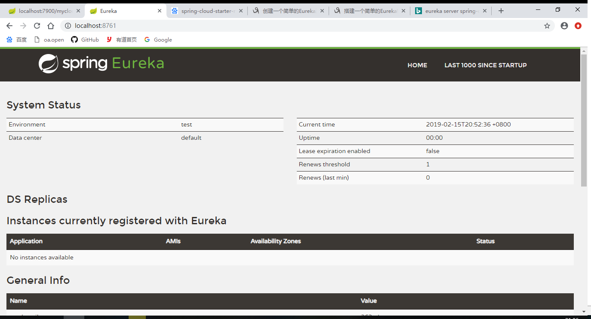
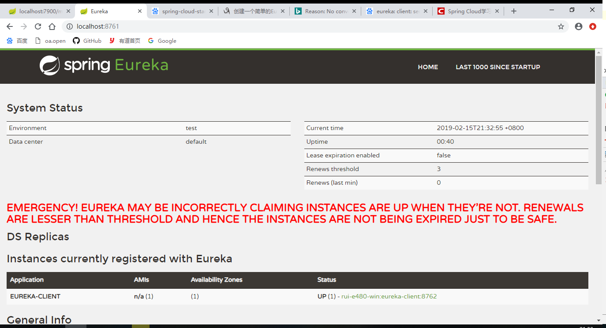
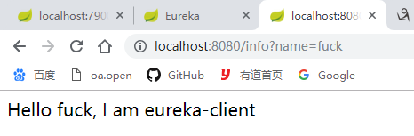

# 示例2 Eureka注册服务与服务发现

Eureka是发现服务

## 1. Eureka Server

Eureka 服务器端, 提供注册服务。

### 1.1 pom.xml

```xml
<dependency>
    <groupId>org.springframework.boot</groupId>
    <artifactId>spring-boot-starter-web</artifactId>
</dependency>
<dependency>
    <groupId>org.springframework.cloud</groupId>
    <artifactId>spring-cloud-starter-netflix-eureka-server</artifactId>
</dependency>
```

### 1.2 application.yml

```yml
server:
  port: 8761
eureka:
  instance:
    hostname: localhost
  client:
    register-with-eureka: false
    fetch-registry: false
    service-url:
      default-zone : http://${eureka.instance.hostname}:${server.port}/eureka/
```

### 1.3 MyApplication.java

```java
@SpringBootApplication
@EnableEurekaServer     //这一句是添加的，其他的默认不动
public class MyApplication {
    public static void main(String[] args) {
        SpringApplication.run(MyApplication.class, args);
    }
}
```

### 1.4 访问

* <http://localhost:8761>



## 2. Eureka客户端端, 访问服务端，进行注册

### 2.1 pom.xml

```xml
<dependency>
    <groupId>org.springframework.boot</groupId>
    <artifactId>spring-boot-starter-web</artifactId>
</dependency>
<dependency>
    <groupId>org.springframework.cloud</groupId>
    <artifactId>spring-cloud-starter-netflix-eureka-client</artifactId>
</dependency>
```

### 2.2 application.yml

```yml
eureka:
  client:
    service-url:
      defaultZone: http://localhost:8761/eureka/
spring:
  application:
    name: eureka-client
```

### 2.3 MyController.java

```java
@RestController
@EnableEurekaClient    //eureka客户端注解
public class MyController {
    @Value("${spring.application.name}")
    private String serverName;

    @RequestMapping("/info")
    public String getInfo(@RequestParam String name) {
        return "Hello " + name + ", I am " + serverName;
    }
}
```

### 2.4 访问

* 刷新服务网页：<http://localhost:8761>



可以看到 `eureka-client` 就代表注册成功了。

### 2.5 验证结果

* 访问 <http://localhost:8080/info?name=fuck>

