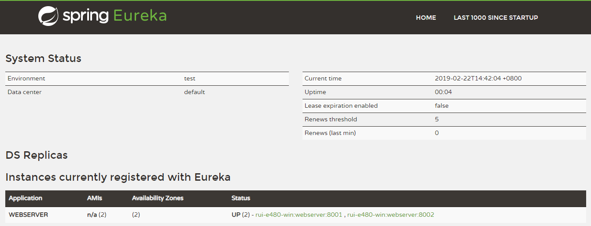
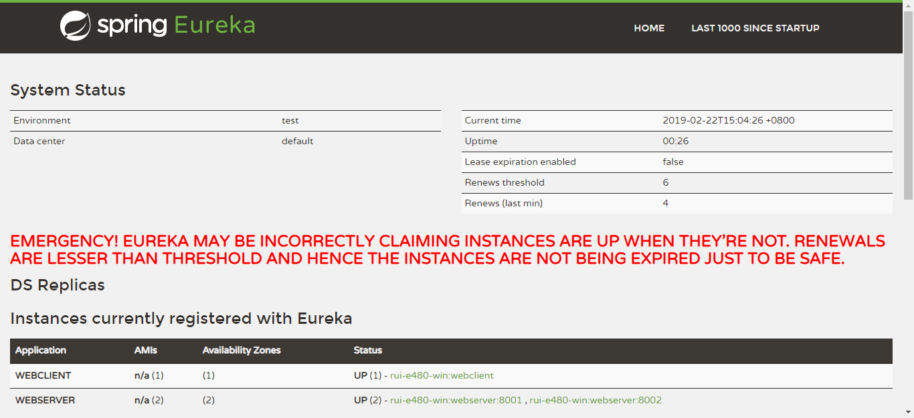

# 示例3 Ribbon的基本使用


1. `Web客户端` 和 `两台Web服务器` 的 `Euroka客户端` 和 `Ribbon客户端` 都分别注册到 `中心Euroka服务器` 上。
2. `Web客户端`访问`两台Web服务器`时，`Ribbon服务器`为它负载均衡。

## 1. Eureka服务器端, 提供注册服务

* 请参照 [示例2 Eureka注册服务与服务发现 1. Eureka Server](../eg02/readme.md#1-Eureka-Server)

* `spring-cloud-starter-netflix-eureka-server`这个包中已经包含了ribbon服务包`spring-cloud-starter-netflix-ribbon` 。

## 2. 两台Web服务端

### 2.1 pom.xml

```xml
<dependency>
    <groupId>org.springframework.boot</groupId>
    <artifactId>spring-boot-starter-web</artifactId>
</dependency>

<dependency>
    <groupId>org.springframework.cloud</groupId>
    <artifactId>spring-cloud-starter-netflix-eureka-client</artifactId>
</dependency>
```

* `spring-cloud-starter-netflix-eureka-client`这个包中已经包含了ribbon服务包`spring-cloud-starter-netflix-ribbon` 。

### 2.2 application.yml

```yml
server:
  port: 8001
eureka:
  client:
    service-url:
      defaultZone: http://localhost:8761/eureka/

spring:
  application:
    name: webserver  #这里是配置的eureka的ribbon服务器的名称
```

* 注意两台Web服务器的 eureka注册名 都是 `webserver`
* 端口分别设置为 `8001` 和 `8002`

### 2.3 MyController.java

```java
@RestController
public class MyController {
    @Value("${server.port}")
    private String port;

    @RequestMapping("/hello")
    public String hello() {
        return "hello from 'webserver: " + port + "'";
    }
}
```

### 2.4 访问

* 刷新服务网页：<http://localhost:8761>



可以看到 `webserver:8001`和`webserver:8002` 就代表注册成功了。

### 2.5 验证结果

* 访问 <http://localhost:8001/hello>，返回 `hello from 'webserver: 8001'`代表成功
* 访问 <http://localhost:8002/hello>，返回 `hello from 'webserver: 8002'`代表成功

## 3. Web客户端

### 3.1 pom.xml

```xml
<dependency>
    <groupId>org.springframework.boot</groupId>
    <artifactId>spring-boot-starter-web</artifactId>
</dependency>
<dependency>
    <groupId>org.springframework.cloud</groupId>
    <artifactId>spring-cloud-starter-netflix-eureka-client</artifactId>
</dependency>
```

### 3.2 application.yml

```yml
eureka:
  client:
    service-url:
      defaultZone: http://localhost:8761/eureka/

spring:
  application:
    name: webclient    #web客户端名称
```

### 3.3 MyController.java

```java
@RestController
@EnableEurekaClient
public class MyController
{
    /**
     * web客户端通过ribbon获取到web服务器列表。
     * 这里的ribbon客户端驱使web客户端交替访问两个web服务器端。
     * ribbon默认的访问策略是交替访问
     */
    @Bean
    @LoadBalanced   //这是ribbon负载均衡的注解。
    public RestTemplate restTemplate() {
        return new RestTemplate();
    }

    @Resource
    public RestTemplate restTemplate;

    @RequestMapping("/hello")
    public String hello() {
        return restTemplate.getForObject("http://webserver/hello", String.class);
    }
}
```

### 3.4 访问

* 刷新服务网页：<http://localhost:8761>



可以看到 `webclient` 就代表注册成功了。

### 3.5 验证结果

* 访问 <http://localhost:8080/hello>，并且不挺的刷新。交替返回 `hello from 'webserver: 8002'`和`hello from 'webserver: 8001'` 代表负载均衡已经成功。