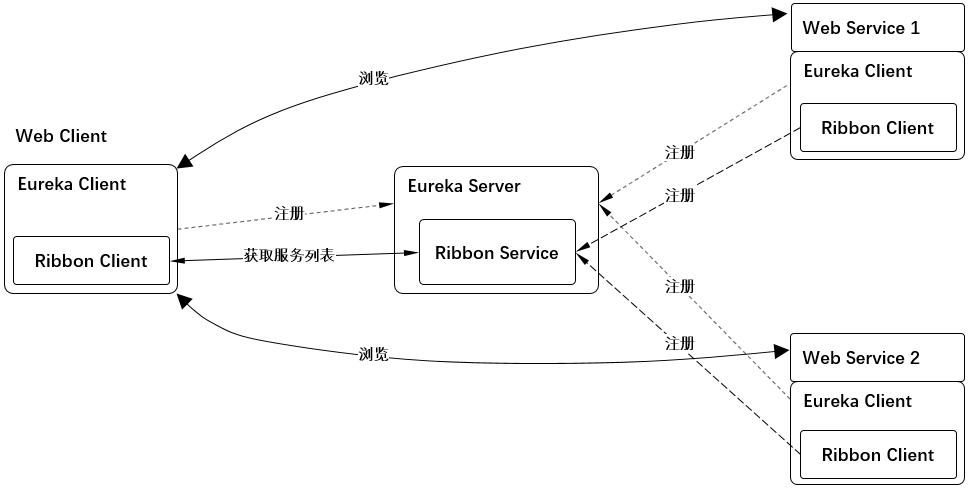

# 示例6 Ribbon客户端去除eureka，同时通过代码访问固定的ribbon服务器



1. `Web客户端` 和 `两台Web服务器` 的 `Euroka客户端` 和 `Ribbon客户端` 都分别注册到 `中心Euroka服务器` 上。
2. `Web客户端`访问`两台Web服务器`时，`Ribbon服务器`为它负载均衡。
3. 去掉配置文件中的eureka功能，只保留ribbon功能。
4. 通过代码直接访问某台固定的 `ribbon服务器`。

## 1. Eureka Server 端, 提供注册服务

* 请参照 [示例2 Eureka注册服务与服务发现 1. Eureka Server](../eg02/readme.md#1-Eureka-Server)

## 2. 两台Web服务端

* 请参照 [示例3 Ribbon的基本使用 2. 两台Web服务端](../eg03/readme.md#2-两台Web服务端)

## 3. Web客户端

### 3.1 pom.xml

> 只保留ribbon功能，去除下面的eureka功能

```xml
<dependency>
    <groupId>org.springframework.cloud</groupId>
    <artifactId>spring-cloud-starter-netflix-ribbon</artifactId>
</dependency>

<!--<dependency>-->
    <!--<groupId>org.springframework.cloud</groupId>-->
    <!--<artifactId>spring-cloud-starter-netflix-eureka-client</artifactId>-->
<!--</dependency>-->
```

### 3.2 application.yml

```yml
webserver:  # 这里是eureka的ribbon服务器的名称
  ribbon:
    listOfServers : localhost:8002   #这里只使用一台ribbon服务器

ribbon:
  eureka:
    enabled: false   #禁止掉eureka功能
```

### 3.3 MyController.java

```java

@RestController
public class MyController
{
    @Bean
    //@LoadBalance 这里一定要去掉负载均衡的注解，因为本例是只访问一台ribbon服务器， 即 application.xml中的 listOfServers
    public RestTemplate restTemplate() {
        return new RestTemplate();
    }

    @Resource
    private RestTemplate restTemplate;

    @RequestMapping("/hello")
    public String hello() {
        return restTemplate.getForObject("http://webserver/hello", String.class);
    }

    /**
     * 以下是通过代码访问 ribbon服务器的web服务。
     */
    @Resource
    private LoadBalancerClient lbc ;

    @RequestMapping("api")
    public String api() {
        ServiceInstance si = this.lbc.choose("webserver");
        System.out.println("-----------------------------------------------------");
        String address = "http://" + si.getHost() + ":" + si.getPort() + "/hello";
        System.out.println(address);
        System.out.println("-----------------------------------------------------");
        return restTemplate.getForObject(address, String.class);
    }
}
```

### 3.4 访问

* 请参照 [示例3 Ribbon的基本使用 3.4 访问](../eg03/readme.md#34-访问)

### 3.5 验证结果

* 访问 <http://localhost:8080/hello>，并且不挺的刷新。出现返回 `hello from 'webserver: 8002'` 代表成功。