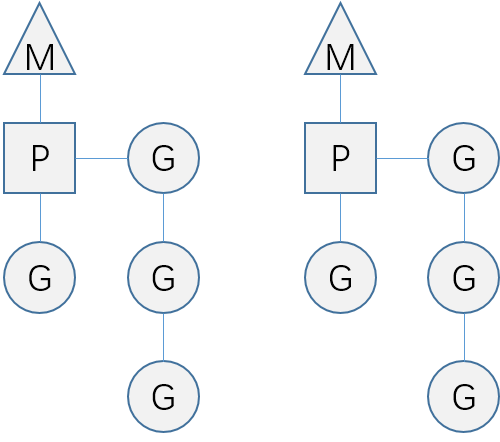

# goroutine

* 进程 > 线程 > 协程
* 一个线程上可以跑多个协程，轻量级线程
* 协程：独立的栈空间，共享堆空间，调度由用户自己控制
* 调度模型：
  * M : 线程
  * P : 上下文
  * G : 协程



## 1. cpu核数

* `runtime.NumCPU()`    获取CPU核数
* `runtime.GOMAXPROCS(n)`   当前程序要使用几个核

据说最新的版本已经不需要设置核数了

## 2. 通道

```golang
func write(ch chan int) {
    for i := 0; i < 10; i++ {
        ch <- i
        fmt.Println("write : ", i)
    }
}

func read(ch chan int) {
    for {
        var b int
        bool ok false
        b, ok = <-ch    //读管道要注意管道被关闭的情况，因此要加判断
        if ok == false {
            fmt.Println("nothing")
            return
        }
        fmt.Println(b)
        time.Sleep(time.Second)
    }
}

func main() {
    //ch := make(chan int)        //无缓冲的通道
    ch := make(chan int, 10)    //创建10个缓冲的通道
    defer close(ch)             //最后关闭通道
    go write(ch)    //启动协程
    go read(ch)     //启动协程
    time.Sleep(10 * time.Second)
}
```

结果如下：

```golang
write :  0
write :  1
write :  2
write :  3
write :  4
write :  5
write :  6
write :  7
write :  8
write :  9
0
1
2
3
4
5
6
7
8
9
```

* `var ch <-chan int`   只读管道
* `var ch chan<- int`  只写管道

## 3. 死锁

* 产生死锁： 不带缓冲的通道，要求存在一个goroutine在实时监听，否则死锁

```golang
func main() {
    ch := make(chan int)    //不带缓冲的通道
    ch <- 1                 //写入时，没有其他goroutine在等待读，因此产生死锁

    var b int = <-ch
    fmt.Println(b)          //fatal error: all goroutines are asleep - deadlock!
}
```

修改如下:

```golang
func main() {
    ch := make(chan int, 1) //带缓冲
    ch <- 1                 //只可以暂存一个，可以后起一个goroutine来读，或者后面代码读一次

    var b int = <-ch        //此处代码从通道中读一次
    fmt.Println(b)
}
```

* 产生死锁： 带缓冲的通道，在没有其他goroutine的情况下，读取和写入都最多只能有缓冲个数次，否则死锁

```golang
func main() {
    ch := make(chan int, 1) //带缓冲, 但缓冲个数只一个, 写入两个，或者读取两个都会死锁
    ch <- 1
    //ch <- 1               //缓冲只有一个，写入第二个就会产生死锁，因此没有其他goroutine在实时读

    var b int = <-ch
    b = <-ch                //缓冲只有一个，读取第二个就会产生死锁，因此没有其他goroutine在实时写
    fmt.Println(b)          //fatal error: all goroutines are asleep - deadlock!
}
```

```golang
func main() {
    ch := make(chan int, 1)
    ch <- 1

    for {
        var b int = <-ch
        fmt.Println(b)      //缓冲只有个，读取多个就产生了死锁。
    }
}
```

## 4. select用法解决死锁问题

* select 必须配合channel使用

```golang
func main() {
    ch := make(chan int, 1)
    ch <- 1

    for {
        select {
        case b := <-ch:
            fmt.Println(b)
        default:
            fmt.Println("default")
            return
        }
    }
}
```

结果如下：

```result
1
default
```