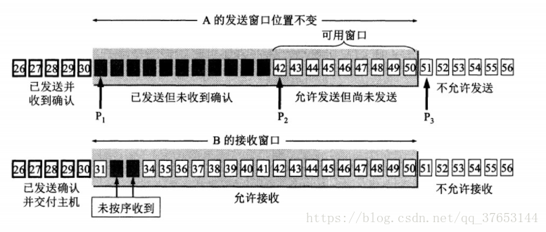
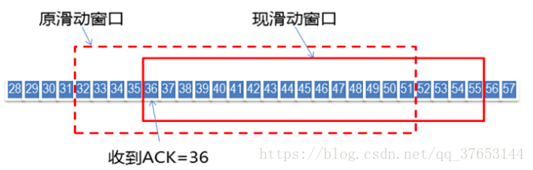
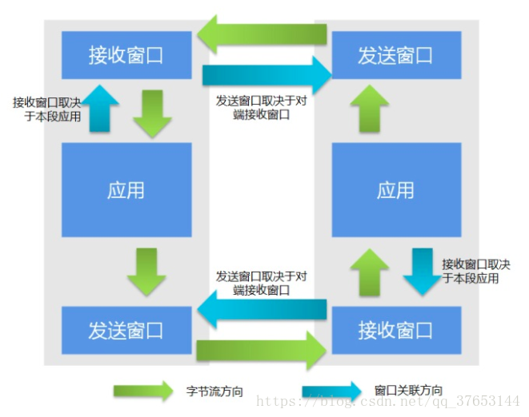

# TCP滑动窗口与流量控制

TCP采用可变滑动窗口来实现流量控制。

TCP连接的两端交互作用，互相提供数据流的相关信息，包括报文段序列号、ACK号和窗口大小（即接收端的可用空间）。

发送端根据这些信息动态调节窗口大小来控制发送，以达到流量控制的目的。每个TCP头部的窗口大小字段表明接收端可用缓存空间的大小，以字节为单位。该字段长度为16位，但窗口缩放选项可用大于65535的值。报文段发送方在相反方向上可接受的最大序列号值为TCP头部中ACK号和窗口大小字段之和（单位保持一致）。

## 1. 滑动窗口

TCP连接的两端都可收发数据，连接的收发数据量是通过一组窗口结构（window structure）来维护的，如下图所示：

每个TCP连接的两端都维护一组窗口：发送窗口结构（send window structure）和接收窗口结构（receive window structure）。

TCP以字节为单位维护其窗口结构。TCP头部中的窗口大小字段相对ACK号有一个字节的偏移量。发送端计算其可用窗口，即它可以立即发送的数据量。可用窗口（允许发送但还未发送）计算值为提供窗口（即由接收端通告的窗口）大小减去在传（已发送但未得到确认）的数据量。图中P1、P2、P3分别记录了窗口的左边界、下次发送的序列号、右边界。

如上图所示， 随着发送端接收到返回的数据ACK，滑动窗口也随之右移。发送端根据接收端返回的ACK可以得到两个重要的信息：

- 一是接收端期望收到的下一个字节序号；
- 二是当前的窗口大小（再结合发送端已有的其他信息可以得出还能发送多少字节数据）。

> 需要注意的是：发送窗口的左边界只能右移，因为它控制的是已发送并受到确认的数据，具有累积性，不能返回；右边界可以右移也可以左移（能左移的右边界会带来一些缺陷，下文会讲到）。

接收端也维护一个窗口结构，但比发送窗口简单（只有左边界和右边界）。该窗口结构记录了已接收并确认的数据，以及它能够接收的最大序列号，该窗口能保证接收数据的正确性（避免存储重复的已接收和确认的数据，以及避免存储不应接收的数据）。由于TCP的累积ACK特性，只有当到达数据序列号等于左边界时，窗口才能向前滑动。

## 2. 发送窗口与接收窗口的关系

TCP是双工的可靠传输协议，连接的双方都可以同时接收、发送数据。

TCP连接的双方都各自维护一个“发送窗口”和一个“接收窗口”。

其中各自的“接收窗口”大小取决于应用、系统、硬件的限制（TCP传输速率不能大于应用的数据处理速率）。各自的“发送窗口”则要求取决于对端通告的“接收窗口”，要求相同。

## 3. 零窗口与TCP持续计时器

当窗口的左右边界重合（即窗口大小为0）时，发送端将停止发送数据直到窗口大小恢复为非零值，这样的窗口称为零窗口。当接收端重新获得可用空间，会给发送端发送一个窗口更新（window update），告知其可以继续发送数据。这样的窗口更新通常不包含数据（为纯ACK）。

但接收端发送的窗口更新是ACK报文，不能保证传输的可靠性。因此如果一个包含窗口更新的ACK丢失，通信双方就会一直处于等待状态：接收方等待接收数据（它已经发送了窗口更新），发送方等待窗口更新告知其可以继续发送，这样就会陷入死锁状态。为避免死锁发生，发送端会采用一个持续计时器间歇性地询问接收端，看其窗口是否增长。持续窗口计时器会触发窗口探测（window probe）消息的发送，强制要求接收端返回ACK。窗口探测包含一个字节的数据，采用TCP可靠传输（重传），强制要求接收端返回ACK，因此可以避免因窗口更新丢失而导致的死锁。

## 4. 糊涂窗口综合症

TCP基于窗口的流量控制机制的缺陷是可能会出现糊涂窗口综合征（Silly Window Syndrome，SWS）。当出现该问题时，TCP连接之间的数据交换可能是较小的数据段（极端情况下只有1字节的数据负载，却要消耗40字节的TCP头部），导致传输效率低下，造成资源浪费。一些针对这一特性的网络攻击的原理是，在TCP连接建立后，要么不做任何行为，要么只产生很小的应答，使得发送速率不断减慢。

TCP连接的收发方两者都可能导致SWS的出现：接收端的通告窗口较小（例如没有等到窗口变大才通告），或者发送端发送的数据段较小（没有等待其他数据组合成一个更大的报文段）。引起SWS的原因不同，解决方案也不同。

对于接收端来说，不应通告较小的窗口值。某些协议规定，在窗口可增至一个全长的报文段（MSS）或者接收端缓存空间的一半（取两者中的较小者）之前，不能通告比当前窗口更大的窗口值。

而对于发送端来说，不应发送较小的报文段。具体实现的规则有所不同。