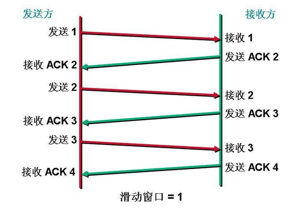
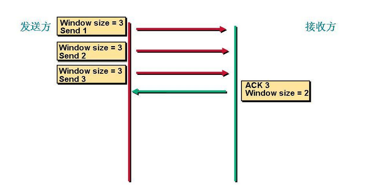
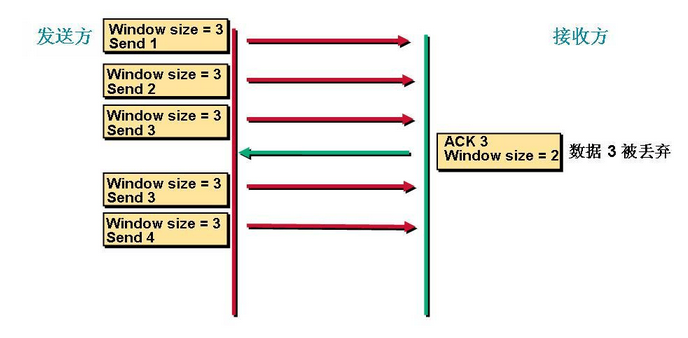

# TCP的滑动窗口机制

[TOC]

## 1. TCP的滑动窗口机制 

TCP这个协议是网络中使用的比较广泛，他是一个面向连接的可靠的传输协议。

既然是一个可靠的传输协议就需要对数据进行确认。

TCP协议里窗口机制有2种：

- 一种是固定的窗口大小；
- 一种是滑动的窗口。

这个窗口大小就是我们一次传输几个数据。对所有数据帧按顺序赋予编号，发送方在发送过程中始终保持着一个发送窗口，只有落在发送窗口内的帧才允许被发送；同时接收方也维持着一个接收窗口，只有落在接收窗口内的帧才允许接收。这样通过调整发送方窗口和接收方窗口的大小可以实现流量控制。

TCP滑动窗口技术通过动态改变窗口大小来调节两台主机间数据传输。

每个TCP/IP主机支持全双工数据传输，因此TCP有两个滑动窗口：

- 一个用于接收数据，
- 另一个用于发送数据。

TCP使用肯定确认技术，其确认号指的是下一个所期待数据包的序列号。 假定发送方设备以每一次三个数据包的方式发送数据，也就是说，窗口大小为3。发送方发送序列号为1、2、3的三个数据包，接收方设备成功接收数据包，用序列号4确认。发送方设备收到确认，继续以窗口大小3发送数据。当接收方设备要求降低或者增大网络流量时，可以对窗口大小进行减小或者增加，本例降低窗口大小为2，每一次发送两个数据包。当接收方设备要求窗口大小为0，表明接收方已经接收了全部数据，或者接收方应用程序没有时间读取数据，要求暂停发送。发送方接收到携带窗口号为0的确认，停止这一方向的数据传输。

## 2. 固定窗口大小问题

 
这里我们可以看到假设窗口的大小是1，也是就每次只能发送一个数据，并且发送方只有接受方对这个数据进行确认了以后才能发送下一个数据。 所以就会存在如下两个问题：

1. 如果说窗口过小，那么当传输比较大的数据的时候需要不停的对数据进行确认，这个时候就会造成很大的延迟。
2. 如果说窗口的大小定义的过大。我们假设发送方一次发送100个数据。但是接收方只能处理50个数据。这样每次都会只对这50个数据进行确认。发送方下一次还是发送100个数据，但是接受方还是只能处理50个数据。这样就有不必要的数据来拥塞我们的链路。

所以我们就引入了滑动窗口机制，窗口的大小并不是固定的而是根据我们之间的链路的带宽的大小、链路是否拥护塞、接受方是否能处理这么多数据，三个元素共同决定。

## 3. 滑动窗口是工作机制

  

首先是**第一次发送数据这个时候的窗口大小是根据链路带宽的大小来决定的**。我们假设这个时候窗口的大小是3。这个时候接受方收到数据以后会对数据进行确认告诉发送方我下次希望手到的是数据是多少。这里我们看到**接收方发送的ACK=3(这是发送方发送序列2的回答确认，下一次接收方期望接收到的是3序列信号)**。这个时候发送方收到这个数据以后就知道我第一次发送的3个数据对方**只收到了2个**。就知道第3个数据对方没有收到。下次在发送的时候就从第3个数据开始发。这个时候**窗口大小就变成了2** 。 
 

这个时候发送方发送2个数据。 

看到接收方发送的ACK是5就表示他下一次希望收到的数据是5，发送方就知道我刚才发送的2个数据对方收了这个时候开始发送第5个数据。

这就是滑动窗口的工作机制，当链路变好了或者变差了这个窗口还会发生变话，并不是第一次协商好了以后就永远不变了。    

滑动窗口协议优势：

1. 允许发送方在停止并等待确认前可以连续发送多个分组。由于发送方不必每发送每确认，因此该协议可以加速数据的传输。 
2. 在接收窗口向前滑动时（与此同时也发送了确认），发送窗口也会同步向前滑动，收发两端的窗口按照以上规律不断地向前滑动 ，可以动态调整窗口大小
