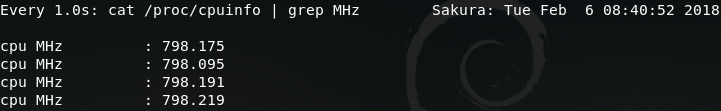
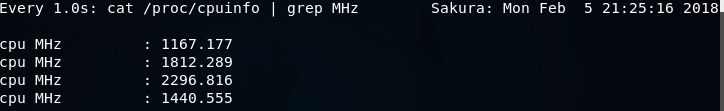

# 调整cpu使用

[TOC]

## 1. cpu状态

cpu工作分为两种状态：[**CPU电源状态：C state**] 和 [**CPU性能状态：P state**]

### 1.1 **CPU电源状态：C state**，即idle(offline)，待机状态

| 状态                     | 基本解释                                                     |
| ------------------------ | ------------------------------------------------------------ |
| **C0状态**（激活）       | 这是CPU最大工作状态，在此状态下可以接收指令和处理数据 ,所有现代处理器必须支持这一功耗状态。 |
| **C1状态**（挂起）       | 可以通过执行汇编指令“HLT（挂起）”进入这一状态，唤醒时间超快！（快到只需10纳秒！），可以节省70%的CPU功耗，所有现代处理器都必须支持这一功耗状态。 |
| **C2状态**（停止允许）   | 处理器时钟频率和I/O缓冲被停止，换言之，处理器执行引擎和I/0缓冲已经没有时钟频率，在C2状态下也可以节约70%的CPU和平台能耗，从C2切换到C0状态需要100纳秒以上。 |
| **C3状态**（深度睡眠）   | 总线频率和PLL均被锁定，在多核心系统下，缓存无效，在单核心系统下，内存被关闭，但缓存仍有效，可以节省70%的CPU功耗，但平台功耗比C2状态下大一些，唤醒时间需要50微秒。 |
| **C4状态**（更深度睡眠） | 与C3相似，但有两大区别，一是核心电压低于1.0V，二是二级缓存内的数据存储将有所减少，可以节约98%的CPU最大功耗，唤醒时间比较慢，但不超过1秒。 |
| **C5状态**               | 二级缓存的数据被减为零，唤醒时间超过200微妙。                |
| **C6状态**               | 这是Penryn处理器中新增的功耗管理模式，二级缓存减至零后，CPU的核心电压更低，不保存CPU context，功耗未知，应该接近零，唤醒时间未知。 |

> 以上状态，不同的cpu可能支持，可能不支持。

### 1.2 **CPU性能状态：P state**，即active(online)，活跃状态

|                  |                |                                                              |
| ---------------- | -------------- | ------------------------------------------------------------ |
| **ondemand**     | 超频模式       | 系统默认的，按需调节，内核提供的功能，不是很强大，但有效实现了动态频率调节，平时以低速方式运行，当系统负载提高时候自动提高频率。以这种模式运行不会因为降频造成性能降低，同时也能节约电能和降低温度。一般官方内核默认的方式都是ondemand。 |
| **interactive**  | 交互模式       | ，直接上最高频率，然后看CPU负荷慢慢降低，比较耗电。Interactive 是以 CPU 排程数量而调整频率，从而实现省电。InteractiveX 是以 CPU 负载来调整 CPU 频率，不会过度把频率调低。所以比 Interactive 反应好些，但是省电的效果一般。 |
| **conservative** | 保守模式       | ，类似于ondemand，但调整相对较缓，想省电就用他吧。Google官方内核，kang内核默认模式。 |
| **smartass**     | 聪明模式       | ，是I和C模式的升级，该模式在比interactive 模式不差的响应的前提下会做到了更加省电。 |
| **performance**  | 性能模式       | ！只有最高频率，从来不考虑消耗的电量，性能没得说，但是耗电量。 |
| **powersave**    | 省电模式       | ，通常以最低频率运行。                                       |
| **userspace**    | 用户自定义模式 | ，系统将变频策略的决策权交给了用户态应用程序，并提供了相应的接口供用户态应用程序调节CPU 运行频率使用。也就是长期以来都在用的那个模式。可以通过手动编辑配置文件进行配置 |
| **Hotplug**      | 热插拔模式     | 类似于ondemand, 但是cpu会在关屏下尝试关掉一个cpu，并且带有deep sleep，比较省电。 |
| **interactive**  | 交互模式       | 有些android的叫法，啥意思不知道。                            |

## 2. ubuntu中调节主频

### 2.1 禁止intel_pstate driver

从Ubuntu15的某个版本开始，在使用intel某些cpu的pc上默认使用 **intel_pstate cpufreq driver**。后果就是只有**performance**和**powersave**两个governor可用。可通过下面命令确认：

```bash
cat /sys/devices/system/cpu/cpu0/cpufreq/scaling_available_governor
  powersave performance
```

```bash
vim /etc/default/grub

#修改GRUB_CMDLINE_LINUX_DEFAULT="quietsplash" 为
GRUB_CMDLINE_LINUX_DEFAULT="quietsplash intel_pstate=disable"
```

```bash
update-grub #需要重启
```

重启

### 2.2 关闭BD PROCHOT，这是个啥，我也不知道

> **出现问题**：CPU频率被限制在0.78GHz

查看CPU频率：

```bash
watch -n 1 "cat /proc/cpuinfo | grep MHz"	#这个命令真好使
```



> **解决方法**：关闭 `BD PROCHOT`

```bash
#安装msr-tools
apt install msr-tools
modprobe msr

#关闭BD PROCHOT
wrmsr 0x1FC 2 
```


> **注意**：关闭后可以看到CPU频率飙升，但同时要注意散热，否则主板可能会被烧坏！！

> 

### 2.3 调节主频

#### 2.3.1  安装cpufrequtils

```bash
apt -y install cpufrequtils
```

#### 2.3.2 临时固定主频

```bash
# 固定在最高主频
cpufreq-set -g performance

#固定在最低主频
cpufreq-set -g powersave

#固定固定频率
cpufreq-set -g userspace
cpufreq-set -f 2000000

#查看频率
cpufreq-info
```

#### 2.3.3 永久固定主频

```bash
vim /etc/init.d/cpufrequtils

GOVERNOR=”performance”
```

```bash
/etc/init.d/cpufrequtils restart 
```

