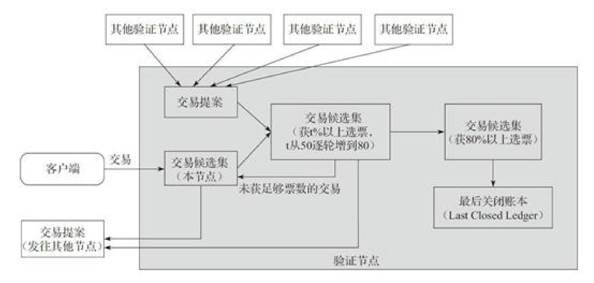

# 瑞波币共识原理

Ripple 是什么？

## 1.Ripple 的⽹络结构

Ripple （瑞波）是⼀种基于互联⽹的开源⽀付协议，可以实现去中⼼化的货币兑换、⽀付与清算功能。

在Ripple 的⽹络中，交易由客⼾端（应⽤）发起，经过追踪节点（ tracking node ）或验证节点（ validatingnode ）把交易⼴播到整个⽹络中。

- 追踪节点的主要功能是分发交易信息以及响应客⼾端的账本请求。
- 验证节点除包含追踪节点的所有功能外，还能够通过共识协议，在账本中增加新的账本实例数据。

## 2.Ripple 共识算法

Ripple 的共识达成发⽣在验证节点之间，每个验证节点都预先配置了⼀份可信任节点名单，每个验证节点都预先配置了⼀份可信任节点名单，称为UNL （ Unique Node List ）。在名单上的节点可对交易达成进⾏投票。每隔⼏秒， Ripple ⽹络将进⾏如下共识过程：

1. 每个验证节点会不断收到从⽹络发送过来的交易，**通过与本地账本数据验证后**，不合法的交易直接丢弃，合法的交易将汇总成交易候选集（ candidate set ）。交易候选集⾥⾯还包括之前共识过程⽆法确认⽽遗留下来的交易。
2. 每个验证节点把⾃⼰的交易候选集作为提案发送给其他验证节点。
3. 验证节点在收到其他节点发来的提案后，如果不是来⾃UNL 上的节点，则忽略该提案；如果是来⾃UNL 上的节点，就会对⽐提案中的交易和本地的交易候选 候选集，如果有相同的交易，该交易就获得⼀票。在⼀定时间内，当交易获得超过50% 的票数时，则该交易进⼊下⼀轮。没有超过50% 的交易，将留待下⼀次共识过程去确认。
4. 验证节点把超过50% 票数的交易作为提案发给其他节点，同时提⾼所需票数的阈值到60% ，重复步骤3步骤4，直到阈值达到80% 。
5. 验证节点把经过80% UNL 节点确认的交易正式写⼊本地的账本数据中，称为最后关闭账本（ Last Closed Ledger ），即账本最后（最新）的状态。

上图是共识算法流程，我们SCRY 的 Using Authentication in Certification agreement Based Swarm Intelligence 集群智能认证，群体认证数据签名也是基于 Ripple 变种。

在Ripple 的共识算法中，参与投票节点的⾝份是事先知道的，因此，算法的效率⽐PoW 等匿名共识算法要⾼效，交易的确认时间只需⼏秒钟。当然，这点也决定了该共识算法只适合于权限链（ Permissioned chain ）的场景。 Ripple 共识算法的拜占庭容错（ BFT ）能⼒为（ n-1 ） /5 ，即可以容忍整个⽹络中20% 的节点出现拜占庭错误⽽不影响正确的共识。